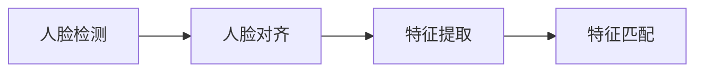

## 1.背景介绍

在当今社会，随着科技的不断发展，人脸识别技术已经广泛应用于各个领域，其中包括安全监控、人机交互、社交媒体等。在这个背景下，基于人脸识别的签到系统应运而生，它利用人脸识别技术，快速、准确地完成签到操作，提高了签到的效率和准确性。

## 2.核心概念与联系

人脸识别技术主要包括人脸检测、人脸对齐、特征提取和特征匹配四个步骤。其中，人脸检测是指从图像中检测出人脸的位置和大小；人脸对齐则是将检测出的人脸进行标准化处理，消除人脸姿态的影响；特征提取是从标准化的人脸图像中提取出区分不同人脸的特征；特征匹配则是将提取出的特征与数据库中的特征进行比对，找出最匹配的人脸。



## 3.核心算法原理具体操作步骤

### 3.1 人脸检测

人脸检测通常采用基于深度学习的方法，例如卷积神经网络（CNN）。首先，我们需要构建一个大规模的人脸和非人脸图像的数据集，用于训练CNN。在训练过程中，CNN会学习到一些能够区分人脸和非人脸的特征。在检测阶段，我们将训练好的CNN应用到输入图像上，通过滑动窗口的方式，对每一个窗口进行分类，从而得到人脸的位置和大小。

### 3.2 人脸对齐

人脸对齐通常采用基于几何变换的方法，例如仿射变换或者投影变换。首先，我们需要检测出人脸的关键点，例如眼睛、鼻子和嘴巴的位置。然后，我们根据这些关键点计算出变换矩阵。最后，我们利用这个变换矩阵将原始的人脸图像进行变换，得到标准化的人脸图像。

### 3.3 特征提取

特征提取通常采用基于深度学习的方法，例如卷积神经网络（CNN）。首先，我们需要构建一个大规模的人脸图像的数据集，用于训练CNN。在训练过程中，CNN会学习到一些能够区分不同人脸的特征。在提取阶段，我们将训练好的CNN应用到标准化的人脸图像上，得到人脸的特征。

### 3.4 特征匹配

特征匹配通常采用基于距离的方法，例如欧几里得距离或者余弦距离。我们将待匹配的人脸特征与数据库中的所有人脸特征进行比对，计算出距离。然后，我们选择距离最小的人脸作为匹配结果。

## 4.数学模型和公式详细讲解举例说明

### 4.1 人脸检测

人脸检测的数学模型通常是一个卷积神经网络（CNN）。CNN的基本组成部分是卷积层和池化层。卷积层的数学表达式为：

$ Y = f(X * W + b) $

其中，$X$是输入，$W$是卷积核，$b$是偏置，$*$是卷积操作，$f$是激活函数，例如ReLU函数，$Y$是输出。

池化层的数学表达式为：

$ Y = g(X) $

其中，$X$是输入，$g$是池化操作，例如最大池化或者平均池化，$Y$是输出。

### 4.2 人脸对齐

人脸对齐的数学模型通常是一个几何变换。对于仿射变换，其数学表达式为：

$ Y = AX + b $

其中，$X$是原始的人脸图像，$A$是变换矩阵，$b$是偏置，$Y$是标准化的人脸图像。

### 4.3 特征提取

特征提取的数学模型通常也是一个卷积神经网络（CNN）。其数学表达式与人脸检测的数学模型相同。

### 4.4 特征匹配

特征匹配的数学模型通常是一个距离度量。对于欧几里得距离，其数学表达式为：

$ D = \sqrt{\sum_{i=1}^{n} (x_i - y_i)^2} $

其中，$x_i$和$y_i$分别是待匹配的人脸特征和数据库中的人脸特征，$n$是特征的维度，$D$是距离。

## 5.项目实践：代码实例和详细解释说明

这部分我们将使用Python和OpenCV库来实现一个简单的基于人脸识别的签到系统。首先，我们需要安装Python和OpenCV库。安装Python的方法可以参考Python官网，安装OpenCV库的方法可以参考OpenCV官网。

以下是代码实例：

```python
import cv2

# 加载人脸检测器
face_cascade = cv2.CascadeClassifier('haarcascade_frontalface_default.xml')

# 打开摄像头
cap = cv2.VideoCapture(0)

while True:
    # 读取一帧图像
    ret, frame = cap.read()

    # 转换为灰度图像
    gray = cv2.cvtColor(frame, cv2.COLOR_BGR2GRAY)

    # 检测人脸
    faces = face_cascade.detectMultiScale(gray, 1.3, 5)

    # 对每一个检测到的人脸进行标记
    for (x, y, w, h) in faces:
        cv2.rectangle(frame, (x, y), (x+w, y+h), (255, 0, 0), 2)

    # 显示图像
    cv2.imshow('frame', frame)

    # 按q键退出
    if cv2.waitKey(1) & 0xFF == ord('q'):
        break

# 释放摄像头
cap.release()

# 关闭所有窗口
cv2.destroyAllWindows()
```

这段代码首先加载了一个人脸检测器，然后打开摄像头，对每一帧图像进行人脸检测，并对检测到的人脸进行标记，最后显示图像。如果按下q键，程序将退出。

## 6.实际应用场景

基于人脸识别的签到系统可以应用于各种需要签到的场景，例如学校、公司、会议等。它可以替代传统的签到方式，如手工签到或者卡片签到，提高签到的效率和准确性。此外，它还可以防止一些作弊行为，如代签。

## 7.工具和资源推荐

- Python：一种广泛用于科学计算的编程语言。
- OpenCV：一个开源的计算机视觉库，包含了各种图像处理和计算机视觉的算法。
- TensorFlow：一个开源的深度学习框架，由Google开发。
- FaceNet：一个开源的人脸识别系统，由Google开发。

## 8.总结：未来发展趋势与挑战

随着深度学习技术的发展，人脸识别技术的准确性正在不断提高。然而，人脸识别技术仍然面临一些挑战，例如对光照、表情、姿态和年龄的变化的鲁棒性。此外，如何保护用户的隐私，防止人脸识别技术的滥用，也是一个重要的问题。

## 9.附录：常见问题与解答

Q: 人脸识别技术是否可以100%准确？
A: 虽然人脸识别技术的准确性已经非常高，但是由于各种因素的影响，例如光照、表情、姿态和年龄的变化，目前还无法做到100%准确。

Q: 人脸识别技术是否会侵犯我的隐私？
A: 人脸识别技术本身并不会侵犯用户的隐私，但是如何使用人脸识别技术，如何处理和保护用户的人脸数据，是需要考虑的问题。我们应该制定相应的法规和政策，保护用户的隐私。

作者：禅与计算机程序设计艺术 / Zen and the Art of Computer Programming