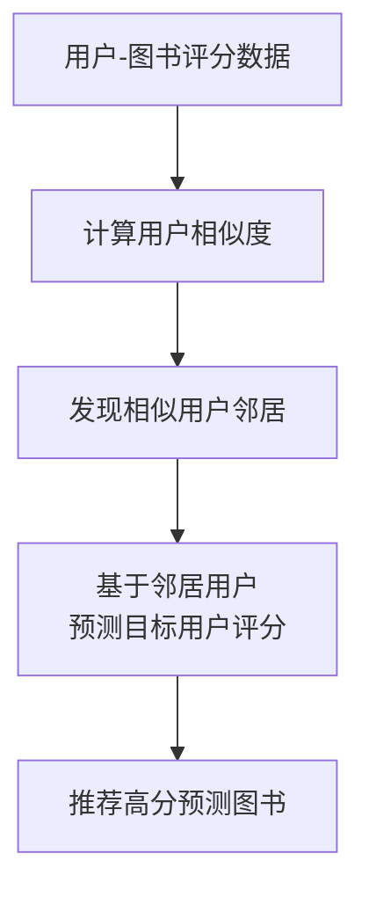

# 基于协同过滤的个性化图书推荐系统的设计与实现

## 1.背景介绍

### 1.1 推荐系统的重要性

在当今信息时代,随着互联网的快速发展,信息量呈爆炸式增长,人们面临着信息过载的问题。如何从海量信息中快速准确地获取感兴趣的内容,成为一个亟待解决的挑战。推荐系统应运而生,它能够根据用户的兴趣爱好,主动推荐个性化的内容,帮助用户高效地发现感兴趣的信息,从而提高用户体验,降低信息获取的成本。

### 1.2 图书推荐系统的应用场景

图书作为知识的载体,对于个人学习和成长至关重要。然而,由于图书种类繁多,很难从中挑选出最感兴趣的书籍。基于协同过滤的个性化图书推荐系统可以根据用户的阅读历史、评分等数据,发现具有相似兴趣爱好的用户群体,并推荐他们喜欢的图书,从而帮助用户发现高质量、感兴趣的读物,提高阅读效率。

### 1.3 协同过滤算法介绍  

协同过滤(Collaborative Filtering)是推荐系统中最常用的一种算法,其核心思想是利用群体的行为数据发现用户之间的相似性,并基于这种相似性产生推荐。根据数据来源的不同,协同过滤算法可分为基于用户(User-based)和基于项目(Item-based)两种方式。

## 2.核心概念与联系

### 2.1 用户相似度计算

用户相似度计算是协同过滤算法的核心环节,它用于发现具有相似兴趣爱好的用户群体。常用的相似度计算方法有:

1. **欧几里得距离**(Euclidean Distance)
2. **皮尔逊相关系数**(Pearson Correlation Coefficient)
3. **余弦相似度**(Cosine Similarity)

其中,皮尔逊相关系数和余弦相似度是最常用的两种方法。

#### 2.1.1 皮尔逊相关系数

皮尔逊相关系数用于测量两个变量之间的线性相关程度,取值范围为[-1,1],值越接近1表示两个变量的正相关性越强,值越接近-1表示负相关性越强,值为0表示两个变量相互独立。在用户相似度计算中,可以将两个用户对相同项目的评分看作两个变量,计算它们的皮尔逊相关系数作为相似度分数。

皮尔逊相关系数的计算公式如下:

$$r_{xy} = \frac{\sum_{i=1}^{n}(x_i - \overline{x})(y_i - \overline{y})}{\sqrt{\sum_{i=1}^{n}(x_i - \overline{x})^2}\sqrt{\sum_{i=1}^{n}(y_i - \overline{y})^2}}$$

其中:
- $r_{xy}$ 表示 x 和 y 两个变量的皮尔逊相关系数
- $n$ 表示数据对的个数
- $x_i$ 和 $y_i$ 分别表示第 i 个数据对的 x 值和 y 值
- $\overline{x}$ 和 $\overline{y}$ 分别表示 x 和 y 的均值

#### 2.1.2 余弦相似度

余弦相似度通过测量两个向量的夹角余弦值来计算它们的相似程度,取值范围为[0,1],值越接近1表示两个向量的方向越接近,相似度越高。在用户相似度计算中,可以将每个用户对不同项目的评分看作一个向量,计算两个用户评分向量的余弦相似度作为相似度分数。

余弦相似度的计算公式如下:

$$sim(u,v) = \frac{\sum_{i=1}^{n}r_{ui}r_{vi}}{\sqrt{\sum_{i=1}^{n}r_{ui}^2}\sqrt{\sum_{i=1}^{n}r_{vi}^2}}$$

其中:
- $sim(u,v)$ 表示用户 u 和用户 v 的相似度
- $n$ 表示项目的个数
- $r_{ui}$ 和 $r_{vi}$ 分别表示用户 u 和用户 v 对第 i 个项目的评分

### 2.2 相似用户发现

在计算出每对用户的相似度后,需要设置一个相似度阈值,将高于该阈值的用户对视为相似用户对。对于目标用户,可以发现与其具有较高相似度的用户群体,这些用户就是目标用户的"邻居"。

### 2.3 基于用户的协同过滤推荐

基于用户的协同过滤推荐算法的核心思路是:对于目标用户,找到与其最相似的 K 个邻居用户,然后基于这些邻居用户的历史评分,为目标用户推荐他们喜欢而目标用户尚未评分的项目。

具体步骤如下:

1. 计算目标用户与所有其他用户的相似度,选取最相似的 K 个用户作为邻居
2. 对于目标用户未评分的项目,计算该项目在 K 个邻居中的加权评分,作为对该项目的预测评分
3. 根据预测评分从高到低排序,推荐预测评分较高的项目给目标用户

预测评分的计算公式如下:

$$r_{ui} = \overline{r_u} + \frac{\sum\limits_{v \in N(u,k)}sim(u,v)(r_{vi} - \overline{r_v})}{\sum\limits_{v \in N(u,k)}sim(u,v)}$$

其中:
- $r_{ui}$ 表示对目标用户 u 对项目 i 的预测评分
- $\overline{r_u}$ 表示用户 u 的平均评分
- $N(u,k)$ 表示用户 u 的 K 个最相似邻居集合
- $sim(u,v)$ 表示用户 u 和用户 v 的相似度
- $r_{vi}$ 表示用户 v 对项目 i 的真实评分
- $\overline{r_v}$ 表示用户 v 的平均评分

### 2.4 基于项目的协同过滤推荐

与基于用户的协同过滤不同,基于项目的协同过滤算法是先计算项目之间的相似度,然后根据目标用户对部分项目的评分,预测并推荐与其已评分项目相似的其他项目。

具体步骤如下:

1. 计算所有项目之间的相似度
2. 对于目标用户已评分的项目集合,计算该集合中每个项目与其他项目的综合相似度
3. 根据综合相似度从高到低排序,推荐给目标用户未评分且综合相似度较高的项目

项目 i 与项目 j 的综合相似度计算公式如下:

$$sim_{uj} = \frac{\sum\limits_{i \in I_u}sim(i,j)r_{ui}}{\sum\limits_{i \in I_u}r_{ui}}$$

其中:
- $sim_{uj}$ 表示项目 j 与目标用户 u 的综合相似度
- $I_u$ 表示用户 u 已评分的项目集合
- $sim(i,j)$ 表示项目 i 和项目 j 的相似度
- $r_{ui}$ 表示用户 u 对项目 i 的评分

### 2.5 数据稀疏性问题

协同过滤算法的一个主要挑战是数据稀疏性问题。在实际场景中,用户只会评分一小部分项目,大部分项目都没有评分,导致用户-项目评分矩阵非常稀疏,从而影响相似度计算的准确性。

解决数据稀疏性问题的常用方法包括:

1. **降低相似度阈值**: 适当降低相似用户对的相似度阈值,增加邻居数量
2. **引入其他数据源**: 除了评分数据,还可以利用用户/项目的其他属性信息(如年龄、职业、书籍类型等)计算相似度
3. **数据填充**: 使用合适的填充方法(如均值填充、基于项目平均值填充等)为缺失评分赋予估计值

### 2.6 冷启动问题

冷启动问题是指对于新用户或新项目,由于缺乏历史评分数据,无法准确计算相似度,从而无法为其生成有效推荐。

解决冷启动问题的常用方法包括:

1. **热门推荐**: 对于新用户,可以推荐全局热门项目
2. **基于内容的推荐**: 利用项目元数据(如书籍类型、作者等)计算项目相似度,为新用户推荐与其历史兴趣相似的项目
3. **混合推荐**: 将协同过滤与基于内容的推荐相结合,综合利用评分数据和元数据进行推荐

## 3.核心算法原理具体操作步骤

基于上述概念和原理,我们可以总结出基于用户协同过滤的图书推荐系统的核心算法步骤如下:

1. **获取用户-图书评分数据**

    - 从数据源获取用户对图书的历史评分数据
    - 构建用户-图书评分矩阵

2. **计算用户相似度**

    - 选择合适的相似度计算方法(如皮尔逊相关系数、余弦相似度等)
    - 计算每对用户之间的相似度得分

3. **发现相似用户邻居**

    - 设置相似度阈值
    - 对于目标用户,将高于阈值的其他用户视为相似邻居

4. **基于邻居用户预测目标用户评分**

    - 对于目标用户未评分的图书
    - 基于相似邻居的历史评分,计算该图书的预测评分

5. **推荐高分预测图书**

    - 根据预测评分从高到低排序
    - 将预测评分较高的图书推荐给目标用户

## 4.数学模型和公式详细讲解举例说明

在上述协同过滤算法中,用户相似度计算和预测评分是两个关键环节,涉及到一些数学公式,下面将详细讲解这些公式的原理和使用方法。

### 4.1 用户相似度计算

#### 4.1.1 皮尔逊相关系数

回顾一下皮尔逊相关系数的计算公式:

$$r_{xy} = \frac{\sum_{i=1}^{n}(x_i - \overline{x})(y_i - \overline{y})}{\sqrt{\sum_{i=1}^{n}(x_i - \overline{x})^2}\sqrt{\sum_{i=1}^{n}(y_i - \overline{y})^2}}$$

这个公式用于测量两个变量 x 和 y 之间的线性相关程度。在用户相似度计算中,我们可以将两个用户对相同图书的评分看作两个变量,计算它们的皮尔逊相关系数作为相似度分数。

举例说明:

假设有两个用户 A 和 B,他们都评分过三本书,评分数据如下:

| 图书 | 用户A评分 | 用户B评分 |
|------|-----------|-----------|
| 书1  | 4         | 5         |
| 书2  | 3         | 2         |
| 书3  | 5         | 4         |

我们可以将用户A的评分序列视为变量x,用户B的评分序列视为变量y,代入公式计算皮尔逊相关系数:

$$\overline{x} = \frac{4+3+5}{3} = 4, \overline{y} = \frac{5+2+4}{3} = 3.67$$
$$r_{xy} = \frac{(4-4)(5-3.67) + (3-4)(2-3.67) + (5-4)(4-3.67)}{\sqrt{(4-4)^2 + (3-4)^2 + (5-4)^2}\sqrt{(5-3.67)^2 + (2-3.67)^2 + (4-3.67)^2}} \approx 0.98$$

计算结果显示,用户A和用户B的皮尔逊相关系数约为0.98,接近于1,说明他们的评分趋势高度相似,是一对相似用户。

#### 4.1.2 余弦相似度

回顾一下余弦相似度的计算公式: