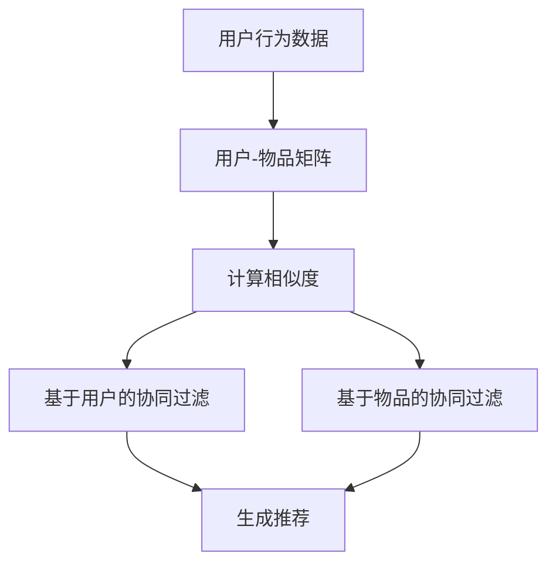

# 基于协同过滤的个性化电影推荐系统设计与实现

## 1.背景介绍

在当今信息爆炸的时代，用户面临着海量的信息和选择。如何在众多的电影中找到用户真正感兴趣的内容，成为了一个重要的研究课题。个性化推荐系统应运而生，通过分析用户的行为和偏好，提供个性化的推荐，提升用户体验。协同过滤作为推荐系统中的一种重要技术，因其简单有效而被广泛应用。

## 2.核心概念与联系

### 2.1 推荐系统

推荐系统是一种信息过滤系统，旨在根据用户的历史行为和偏好，向用户推荐可能感兴趣的内容。推荐系统的主要目标是提高用户的满意度和参与度。

### 2.2 协同过滤

协同过滤是一种基于用户行为数据的推荐方法。它通过分析用户的历史行为，找到与当前用户相似的用户或物品，从而进行推荐。协同过滤主要分为两类：基于用户的协同过滤和基于物品的协同过滤。

### 2.3 用户-物品矩阵

用户-物品矩阵是协同过滤的核心数据结构。矩阵的行表示用户，列表示物品，矩阵中的值表示用户对物品的评分。通过分析这个矩阵，可以找到用户的偏好和相似性。

## 3.核心算法原理具体操作步骤

### 3.1 基于用户的协同过滤

基于用户的协同过滤通过找到与当前用户相似的用户，推荐这些用户喜欢的物品。其主要步骤如下：

1. 计算用户相似度：常用的相似度计算方法有余弦相似度、皮尔逊相关系数等。
2. 找到相似用户：根据相似度排序，选择相似度最高的用户。
3. 生成推荐：根据相似用户的评分，推荐当前用户未评分的物品。

### 3.2 基于物品的协同过滤

基于物品的协同过滤通过找到与当前物品相似的物品，推荐这些物品。其主要步骤如下：

1. 计算物品相似度：常用的相似度计算方法有余弦相似度、皮尔逊相关系数等。
2. 找到相似物品：根据相似度排序，选择相似度最高的物品。
3. 生成推荐：根据相似物品的评分，推荐当前用户未评分的物品。

### 3.3 Mermaid 流程图



## 4.数学模型和公式详细讲解举例说明

### 4.1 余弦相似度

余弦相似度用于衡量两个向量的相似度，其公式为：

$$
\text{sim}(A, B) = \frac{A \cdot B}{\|A\| \|B\|}
$$

其中，$A$ 和 $B$ 分别表示两个用户或物品的评分向量，$\cdot$ 表示向量的点积，$\|A\|$ 和 $\|B\|$ 分别表示向量的模。

### 4.2 皮尔逊相关系数

皮尔逊相关系数用于衡量两个变量之间的线性相关性，其公式为：

$$
\text{corr}(A, B) = \frac{\sum (A_i - \bar{A})(B_i - \bar{B})}{\sqrt{\sum (A_i - \bar{A})^2} \sqrt{\sum (B_i - \bar{B})^2}}
$$

其中，$A_i$ 和 $B_i$ 分别表示用户 $A$ 和 $B$ 对物品 $i$ 的评分，$\bar{A}$ 和 $\bar{B}$ 分别表示用户 $A$ 和 $B$ 的平均评分。

### 4.3 示例说明

假设有两个用户 $A$ 和 $B$，他们对五部电影的评分如下：

| 电影 | 用户A | 用户B |
|------|-------|-------|
| 电影1 | 5     | 3     |
| 电影2 | 4     | 1     |
| 电影3 | 3     | 2     |
| 电影4 | 4     | 3     |
| 电影5 | 2     | 3     |

计算用户 $A$ 和 $B$ 的余弦相似度：

$$
\text{sim}(A, B) = \frac{5 \cdot 3 + 4 \cdot 1 + 3 \cdot 2 + 4 \cdot 3 + 2 \cdot 3}{\sqrt{5^2 + 4^2 + 3^2 + 4^2 + 2^2} \sqrt{3^2 + 1^2 + 2^2 + 3^2 + 3^2}} = \frac{47}{\sqrt{70} \sqrt{32}} \approx 0.99
```

## 5.项目实践：代码实例和详细解释说明

### 5.1 数据准备

首先，我们需要准备用户-物品评分数据。假设我们有一个包含用户对电影评分的CSV文件，格式如下：

```csv
user_id,movie_id,rating
1,1,5
1,2,4
1,3,3
2,1,3
2,2,1
2,3,2
```

### 5.2 数据加载

使用Python和Pandas库加载数据：

```python
import pandas as pd

# 加载数据
data = pd.read_csv('ratings.csv')
print(data.head())
```

### 5.3 构建用户-物品矩阵

```python
# 构建用户-物品矩阵
user_item_matrix = data.pivot(index='user_id', columns='movie_id', values='rating').fillna(0)
print(user_item_matrix)
```

### 5.4 计算相似度

使用余弦相似度计算用户相似度：

```python
from sklearn.metrics.pairwise import cosine_similarity

# 计算用户相似度
user_similarity = cosine_similarity(user_item_matrix)
print(user_similarity)
```

### 5.5 生成推荐

根据相似用户的评分生成推荐：

```python
import numpy as np

# 生成推荐
def recommend(user_id, user_item_matrix, user_similarity, top_n=5):
    user_index = user_id - 1
    similar_users = np.argsort(-user_similarity[user_index])[:top_n]
    similar_users_ratings = user_item_matrix.iloc[similar_users].mean(axis=0)
    user_ratings = user_item_matrix.iloc[user_index]
    recommendations = similar_users_ratings[user_ratings == 0].sort_values(ascending=False)
    return recommendations

# 为用户1生成推荐
recommendations = recommend(1, user_item_matrix, user_similarity)
print(recommendations)
```

## 6.实际应用场景

### 6.1 在线流媒体平台

在线流媒体平台如Netflix和Amazon Prime Video，通过推荐系统向用户推荐电影和电视剧，提升用户的观看体验和平台的用户粘性。

### 6.2 电子商务平台

电子商务平台如Amazon和淘宝，通过推荐系统向用户推荐商品，增加用户的购买率和平台的销售额。

### 6.3 社交媒体平台

社交媒体平台如Facebook和Twitter，通过推荐系统向用户推荐好友、内容和广告，提升用户的参与度和平台的广告收入。

## 7.工具和资源推荐

### 7.1 工具

- **Pandas**：用于数据处理和分析的Python库。
- **Scikit-learn**：用于机器学习和数据挖掘的Python库，提供了相似度计算和推荐算法的实现。
- **Surprise**：专门用于构建推荐系统的Python库，提供了多种推荐算法的实现。

### 7.2 资源

- **《推荐系统实践》**：一本详细介绍推荐系统原理和实现的书籍。
- **Coursera上的推荐系统课程**：提供了推荐系统的理论和实践知识。
- **Kaggle上的推荐系统竞赛**：提供了丰富的数据集和实践机会。

## 8.总结：未来发展趋势与挑战

### 8.1 发展趋势

随着数据量的增加和计算能力的提升，推荐系统将变得更加智能和精准。深度学习和图神经网络等新技术的应用，将进一步提升推荐系统的性能和效果。

### 8.2 挑战

推荐系统面临的数据稀疏性和冷启动问题仍然是重要的挑战。此外，如何保护用户隐私和数据安全，也是推荐系统需要解决的问题。

## 9.附录：常见问题与解答

### 9.1 什么是冷启动问题？

冷启动问题是指在推荐系统中，当新用户或新物品没有足够的历史数据时，难以进行有效推荐的问题。

### 9.2 如何解决数据稀疏性问题？

可以通过矩阵分解、填补缺失值和增加数据量等方法，缓解数据稀疏性问题。

### 9.3 协同过滤与内容过滤的区别是什么？

协同过滤基于用户行为数据进行推荐，而内容过滤基于物品的内容特征进行推荐。协同过滤更适合推荐相似用户喜欢的物品，而内容过滤更适合推荐相似特征的物品。

---

作者：禅与计算机程序设计艺术 / Zen and the Art of Computer Programming