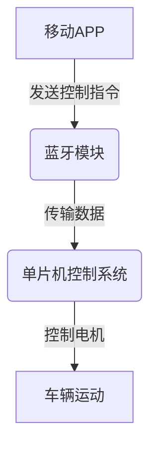
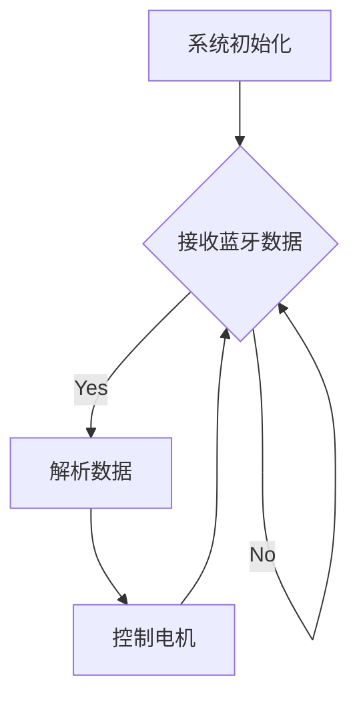

# 基于单片机app遥控车的设计与实现

## 1.背景介绍

在当今科技飞速发展的时代,物联网(IoT)技术的应用越来越广泛。远程控制设备已经成为人们生活中不可或缺的一部分。其中,基于单片机的远程控制系统因其低功耗、低成本和高可靠性而备受青睐。本文将介绍如何设计并实现一款基于单片机的app遥控车系统。

## 2.核心概念与联系

### 2.1 单片机

单片机(Single Chip Microcomputer)是一种集成了中央处理器(CPU)、存储器(内存)和输入/输出(I/O)接口等功能于一体的微型计算机系统。它具有体积小、功耗低、价格便宜等优点,广泛应用于各种嵌入式系统中。

### 2.2 蓝牙通信

蓝牙(Bluetooth)是一种无线技术通信标准,可实现设备之间的短距离数据传输。它具有低功耗、低成本和易于设置的特点,非常适合应用于移动设备和嵌入式系统中。

### 2.3 APP开发

APP(Application)是移动设备上运行的应用程序。通过开发APP,用户可以方便地与嵌入式系统进行交互和控制。

### 2.4 系统架构

该遥控车系统由三个主要部分组成:单片机控制系统、蓝牙模块和移动APP。单片机控制系统接收来自蓝牙模块的指令,并相应地控制车辆的运动。移动APP则提供了用户友好的界面,用户可以通过APP发送控制指令。



## 3.核心算法原理具体操作步骤  

### 3.1 单片机程序流程

单片机程序的核心流程如下:

1. 初始化系统,包括配置I/O口、定时器、串口通信等。
2. 等待并接收来自蓝牙模块的数据。
3. 解析接收到的数据,判断控制指令。
4. 根据控制指令,控制电机的工作状态,实现车辆的运动。
5. 返回步骤2,持续接收新的控制指令。



### 3.2 移动APP开发

移动APP的开发流程包括:

1. 设计用户界面(UI),提供控制按钮和反馈显示。
2. 实现蓝牙连接功能,搜索并连接蓝牙模块。
3. 捕获用户的控制指令,并将其封装为数据包。
4. 通过蓝牙模块发送数据包到单片机系统。
5. 接收并显示单片机系统的反馈数据(如车速、电量等)。

## 4.数学模型和公式详细讲解举例说明

在控制系统中,我们需要根据用户的输入计算电机的PWM(脉冲宽度调制)值,以精确控制车辆的速度和方向。

设电机的最大PWM值为$PWM_{max}$,速度范围为$[v_{min}, v_{max}]$,则PWM值与速度之间的关系可表示为:

$$PWM = \frac{v - v_{min}}{v_{max} - v_{min}} \times PWM_{max}$$

其中,$v$为期望速度值。

例如,假设$PWM_{max} = 255$,$v_{min} = 0,v_{max} = 100$,当期望速度$v = 60$时,可计算得到$PWM = 153$。

对于方向控制,我们可以使用差分驱动的方式,通过改变两个电机的PWM值的差异来实现转向。设左右电机的PWM值分别为$PWM_L$和$PWM_R$,转向角度$\theta$的取值范围为$[-\pi, \pi]$,则:

$$
\begin{aligned}
PWM_L &= PWM \times \cos\left(\frac{\theta}{2}\right)\\
PWM_R &= PWM \times \cos\left(-\frac{\theta}{2}\right)
\end{aligned}
$$

当$\theta = 0$时,两个电机的PWM值相等,车辆直线前进;当$\theta > 0$时,左轮PWM值大于右轮,车辆向左转;当$\theta < 0$时,右轮PWM值大于左轮,车辆向右转。

## 5.项目实践:代码实例和详细解释说明

### 5.1 单片机代码

以Arduino单片机为例,控制程序的核心代码如下:

```cpp
// 蓝牙模块串口
SoftwareSerial bluetooth(2, 3); 

// 电机驱动引脚
const int motorA1 = 5;
const int motorA2 = 6;
const int motorB1 = 9;
const int motorB2 = 10;

void setup() {
  // 初始化串口
  Serial.begin(9600);
  bluetooth.begin(9600);
  
  // 初始化电机驱动引脚
  pinMode(motorA1, OUTPUT);
  pinMode(motorA2, OUTPUT);
  pinMode(motorB1, OUTPUT);
  pinMode(motorB2, OUTPUT);
}

void loop() {
  // 接收蓝牙数据
  if (bluetooth.available()) {
    char data = bluetooth.read();
    
    // 解析数据并控制电机
    switch (data) {
      case 'F': // 前进
        forward();
        break;
      case 'B': // 后退
        backward();
        break;
      case 'L': // 左转
        turnLeft();
        break;
      case 'R': // 右转
        turnRight();
        break;
      case 'S': // 停止
        stopMotors();
        break;
    }
  }
}

// 电机控制函数
void forward() {
  // 设置电机方向和PWM值
  analogWrite(motorA1, 200);
  analogWrite(motorA2, 0);
  analogWrite(motorB1, 200); 
  analogWrite(motorB2, 0);
}

void backward() {
  // 设置电机方向和PWM值
  analogWrite(motorA1, 0);
  analogWrite(motorA2, 200);
  analogWrite(motorB1, 0);
  analogWrite(motorB2, 200);
}

void turnLeft() {
  // 设置电机方向和PWM值
  analogWrite(motorA1, 200);
  analogWrite(motorA2, 0);
  analogWrite(motorB1, 100);
  analogWrite(motorB2, 0);
}

void turnRight() {
  // 设置电机方向和PWM值  
  analogWrite(motorA1, 100);
  analogWrite(motorA2, 0); 
  analogWrite(motorB1, 200);
  analogWrite(motorB2, 0);
}

void stopMotors() {
  // 停止电机
  analogWrite(motorA1, 0);
  analogWrite(motorA2, 0);
  analogWrite(motorB1, 0);
  analogWrite(motorB2, 0);
}
```

该程序首先初始化串口通信和电机驱动引脚。在`loop()`函数中,它会持续检查是否有来自蓝牙模块的数据。一旦接收到数据,程序会解析控制指令,并调用相应的电机控制函数,如`forward()`,`backward()`,`turnLeft()`,`turnRight()`和`stopMotors()`。

这些电机控制函数通过设置电机驱动引脚的PWM值来控制电机的转向和速度。例如,在`forward()`函数中,它将电机A的PWM值设置为200(最大255),电机B的PWM值也设置为200,从而使两个电机以最大速度前进。在`turnLeft()`函数中,它将电机A的PWM值设置为200,电机B的PWM值设置为100,从而使车辆向左转。

### 5.2 移动APP代码

以Android APP为例,控制界面的主要代码如下:

```java
public class ControlActivity extends AppCompatActivity {
    private BluetoothAdapter btAdapter;
    private BluetoothSocket btSocket;
    private OutputStream outStream;

    @Override
    protected void onCreate(Bundle savedInstanceState) {
        super.onCreate(savedInstanceState);
        setContentView(R.layout.activity_control);

        // 初始化蓝牙适配器
        btAdapter = BluetoothAdapter.getDefaultAdapter();

        // 连接蓝牙设备
        connectToDevice();

        // 设置按钮点击事件
        Button btnForward = findViewById(R.id.btnForward);
        btnForward.setOnClickListener(v -> sendCommand('F'));

        Button btnBackward = findViewById(R.id.btnBackward);
        btnBackward.setOnClickListener(v -> sendCommand('B'));

        // ... 其他按钮事件
    }

    private void connectToDevice() {
        // 搜索并连接蓝牙设备
        Set<BluetoothDevice> pairedDevices = btAdapter.getBondedDevices();
        if (pairedDevices.size() > 0) {
            for (BluetoothDevice device : pairedDevices) {
                if (device.getName().equals("HC-05")) { // 蓝牙模块名称
                    try {
                        btSocket = device.createRfcommSocketToServiceRecord(UUID.fromString("00001101-0000-1000-8000-00805F9B34FB"));
                        btSocket.connect();
                        outStream = btSocket.getOutputStream();
                    } catch (IOException e) {
                        e.printStackTrace();
                    }
                    break;
                }
            }
        }
    }

    private void sendCommand(char command) {
        try {
            outStream.write(command);
        } catch (IOException e) {
            e.printStackTrace();
        }
    }
}
```

在这个Android APP中,首先需要初始化蓝牙适配器(`BluetoothAdapter`)。在`connectToDevice()`方法中,程序会搜索已配对的蓝牙设备,并尝试连接名为"HC-05"的蓝牙模块。一旦连接成功,就可以获取输出流(`OutputStream`)用于发送数据。

在`onCreate()`方法中,程序会为各个控制按钮设置点击事件监听器。当用户点击按钮时,相应的事件处理程序会被调用,并通过`sendCommand()`方法将控制指令发送到蓝牙模块。

例如,当用户点击"前进"按钮时,`sendCommand('F')`会被调用,从而向蓝牙模块发送字符'F'。单片机接收到这个指令后,就会执行相应的操作,使车辆前进。

## 6.实际应用场景

基于单片机的app遥控车系统有广泛的应用前景,包括但不限于:

1. **玩具和娱乐**: 可以制作各种遥控玩具车,为孩子们带来无穷的乐趣。

2. **教育和培训**: 可以用于编程教学、机器人竞赛等,培养学生的动手能力和创新思维。

3. **物流和运输**: 可以用于仓库、码头等场所的货物搬运,提高工作效率。

4. **安全巡检**: 可以用于管道、隧道等狭窄空间的检查和维护,减少人员风险。

5. **军事应用**: 可以用于侦查、排雷等军事任务,提高战场环境的可视化和自动化水平。

6. **探索和救援**: 可以用于地质勘探、灾难现场搜救等极端环境下的作业,保护人员安全。

## 7.工具和资源推荐

在开发基于单片机的app遥控车系统时,以下工具和资源可以为您提供帮助:

1. **单片机开发板**: 常用的单片机开发板包括Arduino、Raspberry Pi、STM32等。它们提供了硬件平台和丰富的资源库,可以加快开发进度。

2. **集成开发环境(IDE)**: 如Arduino IDE、Keil uVision、IAR Embedded Workbench等,提供代码编辑、编译和调试功能。

3. **移动应用开发工具**: 如Android Studio、Xcode等,用于开发移动APP。

4. **在线教程和社区**: 如Arduino官方网站、instructables.com、element14.com等,提供大量的教程、示例代码和用户社区支持。

5. **电子元器件供应商**: 如Digikey、Mouser、Sparkfun等,可以购买所需的电子元器件。

6. **3D打印服务**: 如Thingiverse、Cults3D等,可以下载或定制3D打印模型,用于制作车身和其他机械部件。

7. **开源硬件和软件**: 如L298N电机驱动模块、HC-05蓝牙模块、MIT App Inventor等,可以降低开发成本。

## 8.总结:未来发展趋势与挑战

基于单片机的app遥控车系统正在不断发展和完善。未来,我们可以预见以下一些发展趋势和挑战:

1. **智能化和自主化**: 通过集成传感器和人工智能算法,赋予遥