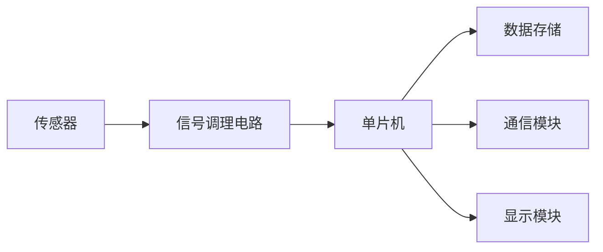

# 基于单片机车速检测的设计与实现

## 1. 背景介绍

### 1.1 车速检测的重要性
在现代交通系统中,车速检测是一项至关重要的任务。准确、实时地监测车辆速度不仅可以有效地管理交通流量,减少交通拥堵,还能够提高道路安全性,预防交通事故的发生。此外,车速检测数据也为交通管理部门制定合理的交通政策和规划提供了重要依据。

### 1.2 单片机在车速检测中的应用
单片机以其体积小、功耗低、性价比高等优点,在车速检测系统中得到了广泛应用。利用单片机强大的数据处理和实时控制能力,可以实现对车速的精确测量和分析。同时,单片机还具有良好的可扩展性,便于与其他传感器和设备进行集成,构建完整的车速检测系统。

## 2. 核心概念与联系

### 2.1 车速检测的基本原理
车速检测的基本原理是通过测量车辆通过某一固定距离所需的时间,来计算车辆的瞬时速度。设车辆通过的固定距离为 $s$,通过该距离所需的时间为 $t$,则车速 $v$ 可表示为:

$$v = \frac{s}{t}$$

### 2.2 常用的车速检测方法
目前常用的车速检测方法主要有以下几种:

1. 雷达测速法:利用雷达发射电磁波,通过多普勒效应测量车速。
2. 激光测速法:利用激光束照射车辆,通过反射光的频率变化计算车速。
3. 红外测速法:利用红外线传感器检测车辆通过的时间间隔,计算车速。
4. 地感线圈测速法:利用埋设在道路下的线圈检测车辆通过,计算车速。

### 2.3 单片机车速检测系统的组成
基于单片机的车速检测系统通常由以下几个部分组成:



- 传感器:用于检测车辆通过,常用的有红外传感器、地感线圈等。
- 信号调理电路:对传感器输出的信号进行放大、滤波等处理,以便单片机采集。
- 单片机:控制系统的核心,负责数据采集、处理和输出。
- 数据存储:用于存储车速检测数据,便于后续分析。
- 通信模块:用于与上位机或其他设备进行数据通信。
- 显示模块:实时显示车速检测结果。

## 3. 核心算法原理具体操作步骤

### 3.1 车速计算算法
单片机车速检测系统的核心是车速计算算法。以红外传感器为例,其基本步骤如下:

1. 布置两个红外传感器,相距固定距离 $s$。
2. 当车辆通过第一个传感器时,记录时刻 $t_1$。
3. 当车辆通过第二个传感器时,记录时刻 $t_2$。
4. 计算车辆通过两个传感器的时间间隔 $\Delta t = t_2 - t_1$。
5. 根据公式 $v = \frac{s}{\Delta t}$ 计算车速。

### 3.2 数据滤波算法
为了提高车速检测的精度,需要对采集到的数据进行滤波处理,去除干扰和异常值。常用的滤波算法有:

1. 中值滤波:取一组数据的中间值作为滤波结果,对脉冲干扰有很好的抑制作用。
2. 均值滤波:取一组数据的算术平均值作为滤波结果,对随机干扰有较好的抑制作用。
3. 卡尔曼滤波:利用系统的状态方程和观测方程,对系统状态进行最优估计,适用于动态系统的滤波。

### 3.3 数据存储和通信
车速检测数据需要进行存储和通信,以便后续分析和应用。常用的方法有:

1. EEPROM存储:利用单片机内置的EEPROM存储车速数据,掉电不丢失。
2. SD卡存储:利用SD卡的大容量特性,存储大量车速数据。
3. UART通信:利用单片机的UART接口,与上位机进行串口通信,实时传输车速数据。
4. 无线通信:利用WIFI、Zigbee等无线通信模块,实现车速数据的远程传输。

## 4. 数学模型和公式详细讲解举例说明

### 4.1 车速计算公式推导
设两个红外传感器之间的距离为 $s$,车辆通过两个传感器的时间间隔为 $\Delta t$,则车速 $v$ 可表示为:

$$v = \frac{s}{\Delta t}$$

推导过程如下:

1. 根据速度的定义,有 $v = \frac{\Delta s}{\Delta t}$。
2. 由于两个传感器之间的距离 $s$ 是固定的,因此 $\Delta s = s$。
3. 将 $\Delta s = s$ 代入速度公式,得到 $v = \frac{s}{\Delta t}$。

### 4.2 中值滤波算法举例
设有一组车速数据 $\{v_1, v_2, ..., v_n\}$,使用中值滤波算法对其进行滤波处理:

1. 将数据按照大小顺序排列,得到 $\{v_{(1)}, v_{(2)}, ..., v_{(n)}\}$。
2. 如果数据个数 $n$ 为奇数,则取中间值 $v_{(\frac{n+1}{2})}$ 作为滤波结果。
3. 如果数据个数 $n$ 为偶数,则取中间两个值的平均值 $\frac{v_{(\frac{n}{2})} + v_{(\frac{n}{2}+1)}}{2}$ 作为滤波结果。

例如,对于车速数据 $\{60, 62, 58, 63, 59\}$,使用中值滤波算法处理:

1. 排序后得到 $\{58, 59, 60, 62, 63\}$。
2. 数据个数 $n=5$ 为奇数,取中间值 $v_{(3)}=60$ 作为滤波结果。

### 4.3 卡尔曼滤波算法公式
卡尔曼滤波算法是一种递归的最优估计算法,其基本公式如下:

1. 状态预测方程:
$$\hat{x}_k^- = A\hat{x}_{k-1} + Bu_k$$

2. 协方差预测方程:
$$P_k^- = AP_{k-1}A^T + Q$$

3. 卡尔曼增益计算:
$$K_k = P_k^-H^T(HP_k^-H^T + R)^{-1}$$

4. 状态更新方程:
$$\hat{x}_k = \hat{x}_k^- + K_k(z_k - H\hat{x}_k^-)$$

5. 协方差更新方程:
$$P_k = (I - K_kH)P_k^-$$

其中,$\hat{x}_k^-$为 k 时刻的状态预测值,$\hat{x}_k$为 k 时刻的状态估计值,$P_k^-$为 k 时刻的协方差预测值,$P_k$为 k 时刻的协方差估计值,$A$为状态转移矩阵,$B$为控制输入矩阵,$u_k$为 k 时刻的控制输入,$Q$为过程噪声协方差矩阵,$H$为观测矩阵,$R$为观测噪声协方差矩阵,$z_k$为 k 时刻的观测值,$I$为单位矩阵。

## 5. 项目实践：代码实例和详细解释说明

### 5.1 红外传感器测速代码
以下是使用单片机和两个红外传感器实现车速检测的示例代码(以Arduino为例):

```cpp
const int SENSOR1_PIN = 2;  // 红外传感器1连接的引脚
const int SENSOR2_PIN = 3;  // 红外传感器2连接的引脚
const float SENSOR_DISTANCE = 0.1;  // 两个传感器之间的距离,单位:m

volatile unsigned long t1 = 0;  // 传感器1触发时的时间
volatile unsigned long t2 = 0;  // 传感器2触发时的时间

void setup() {
  pinMode(SENSOR1_PIN, INPUT);
  pinMode(SENSOR2_PIN, INPUT);
  attachInterrupt(digitalPinToInterrupt(SENSOR1_PIN), sensor1_ISR, FALLING);
  attachInterrupt(digitalPinToInterrupt(SENSOR2_PIN), sensor2_ISR, FALLING);
  Serial.begin(9600);
}

void loop() {
  if (t1 > 0 && t2 > 0) {
    float dt = (t2 - t1) / 1000000.0;  // 时间间隔,单位:s
    float speed = SENSOR_DISTANCE / dt;  // 车速,单位:m/s
    Serial.print("Speed: ");
    Serial.print(speed);
    Serial.println(" m/s");
    t1 = 0;
    t2 = 0;
  }
}

void sensor1_ISR() {
  t1 = micros();  // 记录传感器1触发的时间
}

void sensor2_ISR() {
  t2 = micros();  // 记录传感器2触发的时间
}
```

代码解释:

1. 定义两个红外传感器连接的引脚`SENSOR1_PIN`和`SENSOR2_PIN`,以及它们之间的距离`SENSOR_DISTANCE`。
2. 定义两个变量`t1`和`t2`,用于记录传感器触发的时间。
3. 在`setup()`函数中,设置传感器引脚为输入模式,并为它们附加中断服务函数`sensor1_ISR()`和`sensor2_ISR()`,触发方式为下降沿触发。
4. 在`loop()`函数中,当`t1`和`t2`都大于0时,表示两个传感器都被触发,计算时间间隔`dt`和车速`speed`,并通过串口打印结果。
5. 在中断服务函数`sensor1_ISR()`和`sensor2_ISR()`中,分别记录传感器触发的时间`t1`和`t2`。

### 5.2 中值滤波算法代码
以下是使用中值滤波算法对车速数据进行滤波处理的示例代码(以C语言为例):

```c
#include <stdio.h>
#include <stdlib.h>

#define N 5  // 滤波窗口大小

float median_filter(float data[], int size) {
  float sorted_data[N];
  for (int i = 0; i < size; i++) {
    sorted_data[i] = data[i];
  }
  for (int i = 0; i < size - 1; i++) {
    for (int j = 0; j < size - i - 1; j++) {
      if (sorted_data[j] > sorted_data[j + 1]) {
        float temp = sorted_data[j];
        sorted_data[j] = sorted_data[j + 1];
        sorted_data[j + 1] = temp;
      }
    }
  }
  if (size % 2 == 0) {
    return (sorted_data[size / 2 - 1] + sorted_data[size / 2]) / 2.0;
  } else {
    return sorted_data[size / 2];
  }
}

int main() {
  float speed_data[N] = {60.2, 62.5, 58.7, 63.1, 59.4};
  float filtered_speed = median_filter(speed_data, N);
  printf("Filtered speed: %.2f\n", filtered_speed);
  return 0;
}
```

代码解释:

1. 定义滤波窗口大小`N`,表示每次滤波使用的数据个数。
2. 定义中值滤波函数`median_filter()`,输入参数为待滤波的数据数组`data[]`和数据个数`size`。
3. 在`median_filter()`函数中,首先将输入数据复制到一个临时数组`sorted_data[]`中。
4. 使用冒泡排序算法对`sorted_data[]`进行排序。
5. 如果数据个数`size`为偶数,则取排序后中间两个数的平均值作为滤波结果;如果为奇数,则取中间值作为滤波结果。
6. 在`main()`函数中,定义一组车速数据`speed_data[]`,调用`median_filter()`函数对其进行滤波,并打印滤波结果。

## 6. 实际应用场景

### 6.1 高速公路车速监控
在高速公路上,车速检测系统可以实时监测车辆速度,识别超速车辆,并自动记录车牌号码和超速信息,为交通管理部门的执