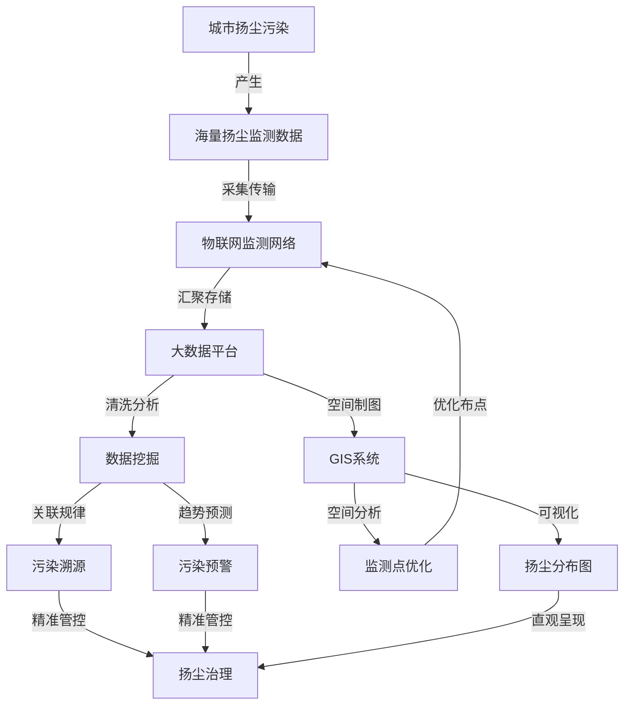

# 基于大数据的城市扬尘数字化监控系统的设计与开发

## 1. 背景介绍

### 1.1 城市扬尘污染的危害

城市扬尘污染是指在城市建设、工业生产、交通运输等人类活动中产生的灰尘、粉尘等颗粒物对大气环境造成的污染。扬尘污染不仅影响城市景观和空气质量,还会对人体健康产生严重危害,如引发呼吸系统疾病、加重心血管疾病等。因此,有效监测和控制城市扬尘污染已成为城市环境管理的重要课题。

### 1.2 大数据技术在环境监测中的应用

随着大数据、物联网、云计算等新一代信息技术的快速发展,环境监测领域也迎来了数字化转型的机遇。利用大数据技术可以实现对环境数据的全面感知、实时传输、智能分析和科学决策,极大提升环境监测和管理的效率和水平。在扬尘监测方面,通过部署大量扬尘传感器,并将海量监测数据汇聚到云平台进行大数据分析,可以实现扬尘污染的全域覆盖、动态监测和溯源分析,为精准治理扬尘提供有力支撑。

### 1.3 研究目标和意义

本文旨在研究设计一套基于大数据技术的城市扬尘数字化监控系统,实现对城市扬尘污染的全方位感知、智能分析和精准管控。该系统将充分利用大数据、物联网、GIS等先进技术,构建"天-空-地"一体化的扬尘监测网络,并通过大数据分析平台实现扬尘数据的汇聚、挖掘和可视化呈现,形成扬尘污染的全景式感知和智慧化管控。本研究对于提升城市扬尘治理水平、改善城市大气环境质量具有重要意义。

## 2. 核心概念与联系

### 2.1 扬尘污染

扬尘污染是指在城市建设、工业生产、道路交通等过程中产生的灰尘、粉尘等颗粒物对大气环境造成的污染。扬尘污染的主要来源包括建筑施工扬尘、道路扬尘、裸露地面扬尘、堆场扬尘等。扬尘颗粒的粒径一般在10-100μm之间,能够在大气中长时间悬浮并随风迁移,对城市空气质量和人体健康造成严重危害。

### 2.2 大数据技术

大数据技术是指从各类海量数据中快速获得有价值信息的新处理模式。其核心是利用分布式计算框架对海量数据进行采集、存储、清洗、分析和可视化,从而挖掘数据背后的关联规律和价值。大数据技术的典型应用包括数据挖掘、机器学习、流计算、图计算等。在环境监测领域,大数据技术可用于污染数据的全面感知、实时分析、溯源定位、预测预警等。

### 2.3 物联网技术 

物联网(Internet of Things,IoT)是指通过射频识别、红外感应器、全球定位系统、激光扫描器等信息传感设备,按约定的协议,把任何物品与互联网相连接,进行信息交换和通信,以实现智能化识别、定位、跟踪、监控和管理的一种网络。在扬尘监测中,可利用物联网技术构建由大量扬尘传感器节点组成的无线监测网络,实现对区域内扬尘浓度的全面感知和实时监测。

### 2.4 GIS技术

地理信息系统(Geographic Information System,GIS)是一种特定的十分重要的空间信息系统。它是在计算机硬、软件系统支持下,对整个或部分地球表层(包括大气层)空间中的有关地理分布数据进行采集、储存、管理、运算、分析、显示和描述的技术系统。GIS技术在扬尘监测中的作用主要体现在监测点位优化、数据空间可视化、污染溯源分析等方面。

### 核心概念关系图

## 3. 核心算法原理与具体操作步骤

### 3.1 扬尘监测数据的采集与传输

扬尘监测网络由大量分布式的扬尘传感器节点构成,每个节点集成了扬尘浓度传感器、温湿度传感器、GPS定位模块、无线通信模块等。各监测节点以一定时间间隔(如1分钟)采集扬尘浓度等监测指标,并通过NB-IoT、LoRa等低功耗广域网将数据实时回传至云端的物联网平台。

具体操作步骤如下:
1. 根据监测需求,选择合适量程和精度的扬尘传感器,如激光散射式PM10传感器。
2. 搭建扬尘监测节点硬件,包括传感器、微处理器、无线通信模块、供电电路等。
3. 编写监测节点程序,控制传感器定时采集数据并打包上传至物联网平台。
4. 将监测节点布设在关键监测点位,如施工工地、道路交通枢纽、裸土堆场等。
5. 云端物联网平台接收各监测节点上传的数据,并存入时序数据库如InfluxDB。

### 3.2 扬尘监测数据的清洗与预处理

由于扬尘监测节点分布广泛、工作环境恶劣,采集的原始监测数据往往存在噪声、异常值、重复值、缺失值等质量问题。为保证后续数据分析的准确性,需要对监测数据进行清洗和预处理。常用的数据清洗方法包括阈值过滤、中位值平滑、线性插值等。

具体操作步骤如下:
1. 从时序数据库中批量读取一定时间范围内的原始监测数据。
2. 剔除超出传感器量程的无效值,如负值或超大值。
3. 检测并去除短时间内出现的尖峰噪声值。
4. 对轻微异常值进行就地平滑,可使用滑动中位值平滑算法。
5. 对连续缺失值进行插值修复,可使用线性插值算法。
6. 去除重复的监测记录,仅保留时间最新的记录。
7. 将清洗后的监测数据回写到数据库,供后续分析使用。

### 3.3 扬尘污染的时空特征分析

利用大数据分析平台对扬尘监测数据进行多维度的挖掘分析,可以揭示扬尘污染的时间分布规律、空间分布规律、污染来源构成等特征。常用的分析方法包括时序分析、空间插值、聚类分析等。

具体操作步骤如下:
1. 按小时、日、月等时间尺度对各监测点数据进行聚合,分析扬尘浓度的时序变化趋势。
2. 利用Kriging、IDW等空间插值算法,将离散监测点数据插值为连续的浓度分布图。
3. 使用K-Means、DBSCAN等聚类算法对高值扬尘区域进行聚类识别,并分析其污染来源。
4. 计算不同污染来源(施工、道路、裸土等)的扬尘浓度占比,分析污染源构成特征。
5. 将分析结果以图表、热力图、饼图等直观形式进行可视化呈现。

### 3.4 扬尘污染的溯源与预警

通过对扬尘监测数据与气象数据、施工信息、车流信息等多源数据的关联分析,可以实现扬尘污染溯源解析和预警。常用方法包括相关分析、回归分析、随机森林等。

具体操作步骤如下:
1. 将扬尘监测数据与多源辅助数据按时空属性进行匹配融合。
2. 使用皮尔逊相关系数计算扬尘浓度与各影响因子的相关性,初步判断污染来源。  
3. 使用多元线性回归模型定量描述各因子与扬尘浓度之间的函数关系。
4. 使用随机森林等机器学习算法构建扬尘污染预测模型,结合天气预报数据和施工计划等因子,对未来1-3天的扬尘浓度进行提前预警。
5. 当预测的扬尘浓度超过管控阈值时,及时推送预警信息,并建议采取对应的污染管控措施。

## 4. 数学模型和公式详细讲解举例说明

### 4.1 扬尘污染的扩散模型

扬尘污染的空间扩散主要受风速、风向、湍流扩散等因素影响,可以用对流-扩散方程进行数学描述:

$$
\frac{\partial c}{\partial t}+u\frac{\partial c}{\partial x}+v\frac{\partial c}{\partial y}+w\frac{\partial c}{\partial z}=\frac{\partial }{\partial x}(K_x\frac{\partial c}{\partial x})+\frac{\partial }{\partial y}(K_y\frac{\partial c}{\partial y})+\frac{\partial }{\partial z}(K_z\frac{\partial c}{\partial z})+S
$$

其中,$c$为扬尘浓度,$u$、$v$、$w$分别为$x$、$y$、$z$方向的风速分量,$K_x$、$K_y$、$K_z$为各方向的湍流扩散系数,$S$为扬尘源释放强度。

该方程可以用有限差分、有限元等数值方法求解,得到扬尘浓度的时空分布。例如,可以用以下差分格式离散对流项:

$$
u\frac{\partial c}{\partial x}=u_{i,j}^n\frac{c_{i,j}^n-c_{i-1,j}^n}{\Delta x}
$$

### 4.2 扬尘污染的数据插值模型

对于分布式的扬尘监测点数据,需要使用空间插值方法将其转化为连续的浓度分布图。常用的插值方法包括反距离加权法(IDW)和普通克里金法(OK)。

IDW插值公式为:

$$
\hat{Z}(S_0)=\sum_{i=1}^N \lambda_i Z(S_i)
$$

其中,$\hat{Z}(S_0)$为待估计点的属性值,$\lambda_i$为第$i$个已知点的权重,通常取$\lambda_i=\frac{1}{d_i^p}$,$d_i$为已知点到待估计点的距离,$p$为距离幂参数。

OK插值在IDW的基础上考虑了空间自相关性,估计公式为:

$$
\hat{Z}(S_0)=\sum_{i=1}^N \lambda_i Z(S_i) \\
\sum_{i=1}^N \lambda_i=1
$$

其中,权重$\lambda_i$通过半变异函数和克里金方程求解得到。半变异函数描述了属性值之间的空间相关性,常用的理论模型有球状模型、高斯模型和指数模型等。

### 4.3 扬尘污染的预测模型

扬尘污染的预测模型一般基于统计学习或机器学习方法,通过分析历史监测数据与影响因子的关系,建立污染浓度的预测函数。以多元线性回归模型为例:

$$
y=\beta_0+\beta_1x_1+\beta_2x_2+\cdots+\beta_px_p+\epsilon
$$

其中,$y$为扬尘浓度预测值,$x_1,x_2,\cdots,x_p$为各影响因子如风速、湿度、裸土面积等,$\beta_0,\beta_1,\cdots,\beta_p$为回归系数,$\epsilon$为随机误差项。

回归系数可以用最小二乘法估计:

$$
\hat{\boldsymbol