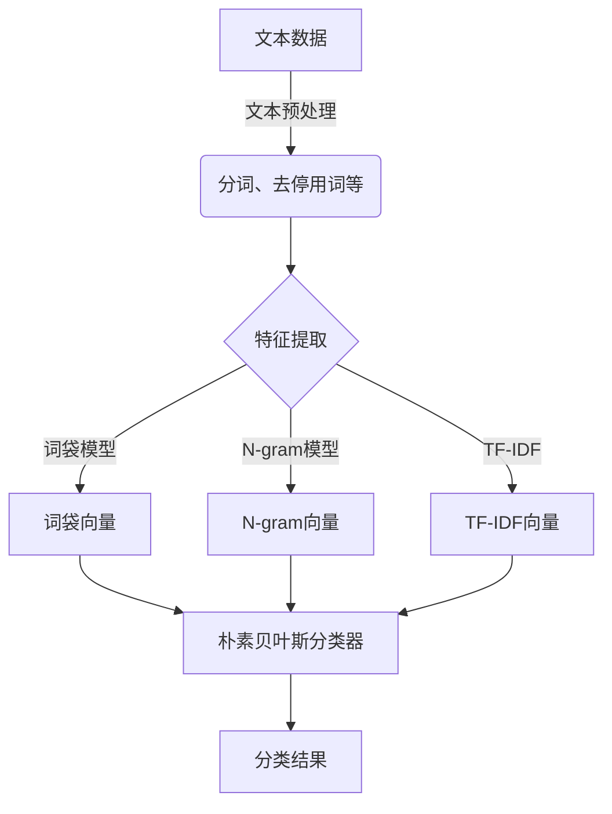

# 基于朴素贝叶斯的淘宝评论分析与应用

## 1. 背景介绍

### 1.1 电子商务的发展

随着互联网的快速发展,电子商务已经成为了人们生活中不可或缺的一部分。作为电子商务领域的巨头,淘宝网凭借其庞大的用户群体和丰富的商品种类,成为了国内最大的网上零售平台之一。

### 1.2 网络评论的重要性

在淘宝等电子商务平台上,买家在购物后往往会对商品和服务进行评价,这些评论对于潜在买家的购买决策有着重要的影响。同时,卖家也可以通过分析买家评论,了解产品的优缺点,并改进产品和服务质量。因此,对淘宝评论进行有效分析具有重要的现实意义。

### 1.3 机器学习在文本分析中的应用

传统的评论分析方法通常依赖于人工标注和规则,效率低下且容易受到主观因素的影响。而机器学习技术能够自动从大量数据中学习模式,对文本进行分类和情感分析,因此在评论分析领域有着广阔的应用前景。

## 2. 核心概念与联系

### 2.1 文本分类

文本分类是自然语言处理的一个重要任务,旨在根据文本的内容将其归类到预定义的类别中。在淘宝评论分析中,我们可以将评论分为正面评论和负面评论两类。

### 2.2 朴素贝叶斯分类器

朴素贝叶斯分类器是一种基于贝叶斯定理与特征条件独立假设的简单而有效的概率分类模型。它计算每个类别下特征出现的条件概率,并选择具有最大后验概率的类别作为预测结果。

朴素贝叶斯分类器的核心公式如下:

$$P(c|x) = \frac{P(x|c)P(c)}{P(x)}$$

其中,$P(c|x)$表示在给定特征向量$x$的条件下,样本属于类别$c$的后验概率。$P(x|c)$为在给定类别$c$的条件下,特征向量$x$出现的似然概率。$P(c)$为类别$c$的先验概率,而$P(x)$为特征向量$x$的边缘概率。

由于朴素贝叶斯分类器具有计算简单、鲁棒性强等优点,因此在文本分类任务中得到了广泛应用。

### 2.3 文本特征提取

为了将文本数据输入到分类器中,需要首先将文本转换为特征向量的形式。常用的文本特征提取方法包括:

- 词袋(Bag of Words)模型: 将文本表示为其所包含的所有词的向量。
- N-gram模型: 将文本表示为其包含的长度为N的词组序列。
- TF-IDF(Term Frequency-Inverse Document Frequency): 一种常用的词语加权方法,能够较好地反映词语的重要性。



## 3. 核心算法原理具体操作步骤

朴素贝叶斯分类器的工作原理可以概括为以下几个步骤:

### 3.1 计算先验概率

首先需要计算每个类别的先验概率$P(c)$,即在整个训练集中,该类别的样本占的比例。对于二分类问题,我们有:

$$P(c=正面) = \frac{正面评论数量}{总评论数量}$$
$$P(c=负面) = \frac{负面评论数量}{总评论数量}$$

### 3.2 计算条件概率

接下来,我们需要计算在给定类别$c$的条件下,每个特征$x_i$出现的条件概率$P(x_i|c)$。对于文本数据,我们通常采用多项式模型(Multinomial Model),将每个文本看作是从一个多项式分布中samplin所得。

对于词袋模型,我们有:

$$P(x_i|c) = \frac{count(x_i,c)+\alpha}{\\sum\_{j}count(x_j,c)+\alpha|V|}$$

其中,$count(x_i,c)$表示在类别$c$的文本中,特征$x_i$出现的次数。$\alpha$是一个平滑系数,用于避免概率为0。$|V|$表示词汇表的大小。

对于N-gram模型和TF-IDF向量,计算方式类似。

### 3.3 计算后验概率

有了先验概率和条件概率,我们就可以根据贝叶斯公式计算每个类别的后验概率:

$$P(c|x) = \frac{P(x|c)P(c)}{P(x)}$$

由于分母$P(x)$对于所有类别是相同的,因此我们可以忽略它,只需要比较分子部分的值。

对于一个给定的文本$x$,我们计算其在每个类别下的后验概率,并选择概率值最大的类别作为预测结果。

### 3.4 模型训练和预测

在实际应用中,我们需要先使用标注好的训练数据,计算每个特征在不同类别下的条件概率,以及每个类别的先验概率。得到这些概率后,就可以对新的文本进行分类了。

此外,我们还可以对模型进行调优,例如选择合适的平滑系数、特征选择等,以提高分类性能。

## 4. 数学模型和公式详细讲解举例说明

为了更好地理解朴素贝叶斯分类器的原理,我们来看一个具体的例子。

假设我们有以下4条淘宝评论:

1. 商品很好,服务态度也不错,发货速度快,好评!
2. 质量一般,有点小瑕疵,但还可以接受。
3. 商品根本就不是宣传的那样,很失望,要求退货!
4. 物流太慢了,等了好几天才收到货,广告夸大其词。

我们将这4条评论标注为正面(1,2)和负面(3,4)两类。

首先,我们计算每个类别的先验概率:

$$P(正面) = \frac{2}{4} = 0.5$$
$$P(负面) = \frac{2}{4} = 0.5$$

接下来,我们提取评论中的词语作为特征,并计算每个特征在不同类别下的条件概率。假设我们使用加法平滑($\alpha=1$),词汇表大小为10。那么对于特征"好"在正面评论中的条件概率为:

$$P(好|正面) = \frac{count(好,正面)+1}{\\sum\_{j}count(x_j,正面)+10} = \frac{2+1}{8+10} = 0.214$$

同理,我们可以计算其他特征的条件概率。最终,对于一个新的评论"物流很快,质量不错",我们有:

$$\begin{aligned}
P(正面|物流,快,质量,不错) &\propto P(物流,快,质量,不错|正面)P(正面)\\\\
&= P(物流|正面)P(快|正面)P(质量|正面)P(不错|正面)P(正面)\\\\
&= 0.071 \times 0.143 \times 0.143 \times 0.214 \times 0.5 = 0.000534
\end{aligned}$$

$$\begin{aligned}
P(负面|物流,快,质量,不错) &\propto P(物流,快,质量,不错|负面)P(负面)\\\\
&= P(物流|负面)P(快|负面)P(质量|负面)P(不错|负面)P(负面)\\\\
&= 0.25 \times 0.125 \times 0.125 \times 0.125 \times 0.5 = 0.000977
\end{aligned}$$

由于$P(负面|物流,快,质量,不错) > P(正面|物流,快,质量,不错)$,因此我们将该评论分类为负面。

通过这个例子,我们可以看到朴素贝叶斯分类器的工作原理,以及如何计算先验概率、条件概率和后验概率。需要注意的是,在实际应用中,我们通常会使用更大的训练数据集,并采用更复杂的特征提取和模型调优方法,以提高分类性能。

## 5. 项目实践:代码实例和详细解释说明

为了更好地理解朴素贝叶斯分类器的实现,我们将使用Python中的scikit-learn库,对一个淘宝评论数据集进行分类实践。

### 5.1 数据预处理

首先,我们需要导入相关的库,并加载淘宝评论数据集。

```python
import pandas as pd
from sklearn.model_selection import train_test_split
from sklearn.feature_extraction.text import CountVectorizer
from sklearn.naive_bayes import MultinomialNB

# 加载数据集
data = pd.read_csv('taobao_comments.csv')
```

接下来,我们对数据进行预处理,包括分词、去停用词等操作。这里我们使用jieba分词库。

```python
import jieba

def preprocess_text(text):
    # 分词
    words = jieba.cut(text)
    # 去停用词
    stopwords = [...] # 停用词列表
    words = [w for w in words if w not in stopwords]
    return ' '.join(words)

data['comment_processed'] = data['comment'].apply(preprocess_text)
```

### 5.2 特征提取和模型训练

我们使用CountVectorizer将评论转换为词袋向量,并将数据集划分为训练集和测试集。

```python
vectorizer = CountVectorizer()
X = vectorizer.fit_transform(data['comment_processed'])
y = data['label']

X_train, X_test, y_train, y_test = train_test_split(X, y, test_size=0.2, random_state=42)
```

接下来,我们实例化一个MultinomialNB分类器,并在训练集上进行训练。

```python
clf = MultinomialNB()
clf.fit(X_train, y_train)
```

### 5.3 模型评估

我们可以在测试集上评估模型的性能,例如计算准确率、精确率、召回率等指标。

```python
from sklearn.metrics import accuracy_score, precision_score, recall_score

y_pred = clf.predict(X_test)

accuracy = accuracy_score(y_test, y_pred)
precision = precision_score(y_test, y_pred, pos_label='positive')
recall = recall_score(y_test, y_pred, pos_label='positive')

print(f'Accuracy: {accuracy:.2f}')
print(f'Precision: {precision:.2f}')
print(f'Recall: {recall:.2f}')
```

### 5.4 新评论预测

最后,我们可以对一个新的评论进行预测。

```python
new_comment = "物流很快,质量不错"
new_comment_processed = preprocess_text(new_comment)
new_comment_vector = vectorizer.transform([new_comment_processed])

prediction = clf.predict(new_comment_vector)
print(f"预测结果: {'正面' if prediction[0] == 'positive' else '负面'}")
```

通过这个实例,我们可以看到如何使用Python和scikit-learn库实现朴素贝叶斯分类器,并应用于淘宝评论分析任务。代码中包括了数据预处理、特征提取、模型训练、评估和预测等步骤,可以作为实际项目的参考。

## 6. 实际应用场景

朴素贝叶斯分类器在淘宝评论分析领域有着广泛的应用前景,具体包括以下几个方面:

### 6.1 商品质量评估

通过对买家评论进行分析,卖家可以了解产品的优缺点,并针对性地改进产品质量。例如,如果发现大量负面评论集中在某个方面,就可以着重改进该方面。

### 6.2 服务质量评估

除了产品本身,买家评论中也包含了对卖家服务质量的评价,如发货速度、售后服务等。卖家可以通过分析这些评论,找出服务中存在的问题,并提升服务水平。

### 6.3 营销策略优化

分析买家评论还可以帮助卖家了解目标客户群体的需求和偏好,从而优化营销策略,提高产品的吸引力和销售额。

### 6.4 舆情监控

对于大型电商平台,及时发现并处理负面评论,可以有效防止舆论危机的发生,维