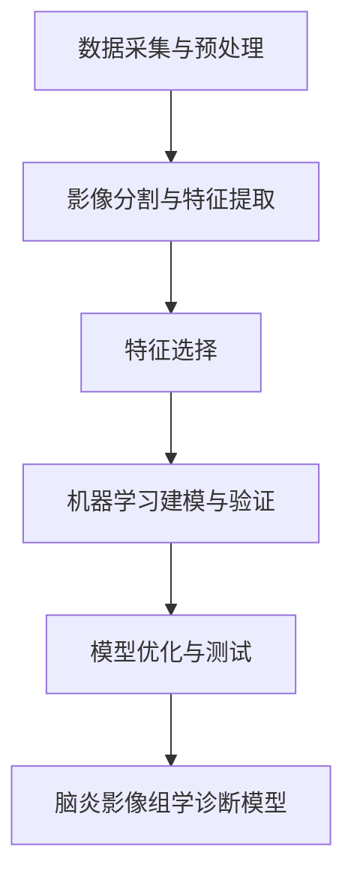

# 基于机器学习的脑炎影像组学算法研究

## 1.背景介绍

### 1.1 脑炎的危害与诊断难题

脑炎是一种严重威胁人类健康的中枢神经系统感染性疾病,可导致患者出现意识障碍、癫痫发作、局灶性神经功能缺损等症状,甚至危及生命。脑炎的早期诊断对于改善预后至关重要,然而脑炎的临床表现缺乏特异性,常规影像学检查如CT、MRI等也难以早期发现病灶,给及时诊断带来挑战。

### 1.2 影像组学与机器学习在医学影像诊断中的应用

近年来,影像组学作为一种从医学影像中提取大量定量特征进行分析的方法日益受到重视。它可以发掘人眼无法识别的隐藏在影像中的信息,为疾病诊断提供新的思路。同时,机器学习凭借其强大的数据挖掘和模式识别能力,在医学影像分析领域展现出广阔的应用前景。将影像组学与机器学习相结合,有望实现脑炎等疾病的智能辅助诊断。

### 1.3 本文研究目的与意义

本文旨在探索将影像组学与机器学习相结合,建立一种新的脑炎影像组学智能诊断算法。通过提取脑炎患者MRI影像的组学特征,并使用机器学习算法进行训练和分类,实现脑炎的自动化辅助诊断,提高诊断的准确性和效率。这对于指导脑炎的早期诊疗,改善患者预后具有重要意义。

## 2.核心概念与联系

### 2.1 脑炎的影像学表现

脑炎在MRI上主要表现为病灶区域的异常信号改变,如T2WI高信号、T1WI低信号、DWI高信号等。但早期病变可能较轻微,且缺乏特异性,容易被漏诊。因此,仅凭常规影像难以实现脑炎的早期诊断。

### 2.2 影像组学的基本原理

影像组学通过对医学影像进行定量分析,提取反映影像不同特征的大量定量参数,如形状、纹理、灰度直方图等,从而挖掘影像中蕴含的隐藏信息。这些组学特征可以敏感地反映疾病的生物学特性,为疾病诊断和预后评估提供新的依据。

### 2.3 机器学习在影像组学分析中的作用 

机器学习是一种能够从数据中自动学习规律、建立模型的方法。将其应用于影像组学分析,可以从海量的组学特征中筛选出与疾病相关的关键特征,并构建诊断或预测模型。常用的机器学习算法包括支持向量机、随机森林、神经网络等。通过机器学习,可以发现人工分析难以察觉的隐藏模式,提高影像组学分析的效率和准确性。

### 2.4 影像组学与机器学习在脑炎诊断中的应用

将影像组学与机器学习用于脑炎诊断,基本思路是:首先对脑炎患者的MRI影像进行预处理和分割,提取反映病灶区域形态、纹理等特点的组学特征;然后利用机器学习算法建立诊断模型,通过训练使模型能够从这些组学特征中学习到脑炎的影像学表现规律;最后利用训练好的模型对新的病例进行诊断预测。这种方法有望克服常规影像诊断的局限性,实现脑炎的早期智能诊断。

## 3.核心算法原理与具体操作步骤

本研究拟建立的脑炎影像组学智能诊断算法主要包括以下几个步骤:

### 3.1 数据采集与预处理

- 收集脑炎患者和健康对照者的头部MRI数据,包括T1WI、T2WI、DWI等常规序列。
- 对原始影像进行预处理,包括头动校正、去噪、标准化等,提高影像质量。

### 3.2 影像分割与特征提取  

- 使用基于深度学习的分割算法如U-Net等,对MRI影像进行脑组织和病灶区域的自动分割。
- 在分割的脑组织和病灶区域上提取丰富的组学特征,包括:
  - 形态学特征:如体积、表面积、球形度等。
  - 一阶统计特征:如灰度均值、方差、偏度等。
  - 纹理特征:如灰度共生矩阵(GLCM)、灰度游程矩阵(GLRLM)等。
- 对提取的特征进行标准化处理,消除量纲和数量级差异的影响。

### 3.3 特征选择

- 采用过滤法、包裹法或嵌入法等特征选择方法,从高维的组学特征中筛选出与脑炎诊断相关的关键特征子集。
- 常用的特征选择算法包括:
  - 过滤法:如方差选择法、相关系数法等。
  - 包裹法:如递归特征消除法(RFE)等。 
  - 嵌入法:如L1正则化(Lasso)等。

### 3.4 机器学习建模与验证

- 将筛选出的关键特征输入机器学习算法,构建脑炎诊断预测模型。
- 采用k折交叉验证的方法评估模型性能,通过混淆矩阵、ROC曲线等指标评价模型的诊断效能。
- 常用的机器学习分类算法包括:
  - 支持向量机(SVM)
  - 随机森林(RF)
  - 人工神经网络(ANN) 
  - 逻辑斯蒂回归(LR)等

### 3.5 模型优化与测试

- 通过调整机器学习算法的超参数,如SVM的C、g值,RF的树的数量、最大深度等,优化模型性能。
- 在独立的测试集上评估模型的泛化能力,进一步验证模型的诊断效能。 
- 对比不同机器学习算法的性能,筛选出最佳的脑炎影像组学诊断模型。

算法流程如下图所示:



## 4.数学模型和公式详细讲解举例说明

### 4.1 影像组学特征提取

影像组学特征提取涉及多种数学模型和公式,这里以灰度共生矩阵(GLCM)纹理特征为例进行说明。

GLCM反映了图像灰度在某一方向和距离上的共现关系。定义图像 $I$ 在距离 $d$ 、角度 $\theta$ 方向上的GLCM为 $P(i,j,d,\theta)$ ,其中 $i,j$ 表示灰度值。则GLCM纹理特征可定义为:

- 角二阶矩(ASM): $ASM=\sum_{i=1}^{N_g}\sum_{j=1}^{N_g}P(i,j)^2$
- 对比度(Contrast): $Contrast=\sum_{n=0}^{N_g-1}n^2\sum_{i=1}^{N_g}\sum_{j=1}^{N_g}P(i,j)$
- 相关性(Correlation): $Correlation=\frac{\sum_{i=1}^{N_g}\sum_{j=1}^{N_g}(ij)P(i,j)-\mu_x\mu_y}{\sigma_x\sigma_y}$
- 熵(Entropy): $Entropy=-\sum_{i=1}^{N_g}\sum_{j=1}^{N_g}P(i,j)log(P(i,j))$

其中,$N_g$为图像灰度级数,$\mu_x,\mu_y,\sigma_x,\sigma_y$分别为GLCM的均值和标准差。

这些纹理特征可以定量描述病灶区域的空间异质性,反映病变组织的生物学特性,为脑炎诊断提供有价值的影像组学信息。

### 4.2 机器学习分类模型

以支持向量机(SVM)为例,说明其数学模型。

SVM的目标是在特征空间中寻找一个最优分类超平面,使得不同类别的样本能够被超平面最大间隔地分开。对于线性可分的二分类问题,可以用如下数学模型表示:

$$
\begin{aligned}
\min_{w,b} \quad & \frac{1}{2}||w||^2 \\
s.t. \quad & y_i(w^Tx_i+b) \geq 1, \quad i=1,2,...,N
\end{aligned}
$$

其中,$x_i$为第$i$个样本的特征向量,$y_i \in {-1,+1}$为其对应的类别标签,$w$和$b$为超平面的参数。

引入拉格朗日乘子$\alpha_i$,将上述问题转化为其对偶形式:

$$
\begin{aligned}
\max_{\alpha} \quad & \sum_{i=1}^N \alpha_i - \frac{1}{2}\sum_{i,j=1}^N \alpha_i \alpha_j y_i y_j (x_i \cdot x_j) \\
s.t. \quad & \sum_{i=1}^N \alpha_i y_i = 0 \\
 & 0 \leq \alpha_i \leq C, \quad i=1,2,...,N
\end{aligned}
$$

其中,$C$为惩罚参数,用于控制模型的复杂度。

求解上述优化问题,可得到最优分类函数:

$$
f(x)=sign(\sum_{i=1}^N \alpha_i y_i (x \cdot x_i) + b)
$$

对于非线性问题,可以通过核函数$K(x,x')$将特征映射到高维空间,实现非线性分类。常用的核函数包括多项式核、高斯核(RBF)等。

利用SVM模型,可以从脑炎患者的影像组学特征中学习到最优的分类边界,实现脑炎与健康对照的自动判别诊断。

## 5.项目实践:代码实例和详细解释说明

下面以Python为例,给出基于机器学习的脑炎影像组学诊断的核心代码实现:

```python
import numpy as np
from sklearn.svm import SVC
from sklearn.ensemble import RandomForestClassifier
from sklearn.model_selection import train_test_split, GridSearchCV
from sklearn.metrics import confusion_matrix, roc_auc_score

# 读入特征数据和标签
X = np.load('radiomic_features.npy')
y = np.load('labels.npy') 

# 划分训练集和测试集
X_train, X_test, y_train, y_test = train_test_split(X, y, test_size=0.2, random_state=42)

# 构建SVM模型
svm = SVC(kernel='rbf', probability=True, random_state=42)
# 网格搜索优化超参数
params = {'C':[0.1, 1, 10], 'gamma':[0.01, 0.1, 1]}
svm_clf = GridSearchCV(svm, params, cv=5, scoring='roc_auc')
svm_clf.fit(X_train, y_train)

# 构建随机森林模型
rf = RandomForestClassifier(n_estimators=100, random_state=42) 
params = {'max_depth':[3,5,7], 'min_samples_split':[2,5,10]}
rf_clf = GridSearchCV(rf, params, cv=5, scoring='roc_auc')
rf_clf.fit(X_train, y_train)

# 在测试集上评估模型
y_pred_svm = svm_clf.predict(X_test)
y_pred_rf = rf_clf.predict(X_test)

print('SVM model confusion matrix:')
print(confusion_matrix(y_test, y_pred_svm))
print('SVM model AUC:', roc_auc_score(y_test, svm_clf.predict_proba(X_test)[:,1]))

print('RF model confusion matrix:') 
print(confusion_matrix(y_test, y_pred_rf))
print('RF model AUC:', roc_auc_score(y_test, rf_clf.predict_proba(X_test)[:,1]))
```

代码解释:

1. 导入需要的库,包括NumPy、Scikit-learn中的SVM、随机森林、模型选择、评估指标等。
2. 读入预处理后的影像组学特征和对应的标签(脑炎/健康)。
3. 使用`train_test_split`函数划分训练集和测试集,测试集比例为20%。
4. 构建SVM模型,采用RBF核,并使用