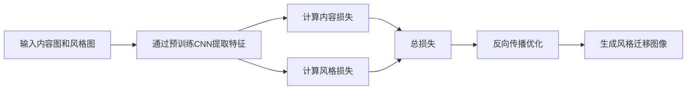

# 基于深度学习的图像风格迁移技术

## 1. 背景介绍
随着深度学习技术的飞速发展，图像处理领域迎来了革命性的变化。图像风格迁移作为其中的一项热门技术，它能够将一幅图像的风格转移到另一幅图像上，从而创造出独特的艺术作品。这项技术不仅在艺术创作领域有着广泛的应用，也在设计、娱乐、广告等行业中展现出巨大的潜力。

## 2. 核心概念与联系
### 2.1 图像风格迁移定义
图像风格迁移是指将一幅图像（风格图）的艺术风格应用到另一幅图像（内容图）上，同时保留内容图的主体结构和内容。

### 2.2 深度学习在风格迁移中的作用
深度学习通过训练神经网络学习图像的高级特征，实现对图像风格和内容的抽象和分离，进而完成风格迁移。

### 2.3 关键技术点
- 卷积神经网络（CNN）
- 特征重建
- 风格重建
- 损失函数设计

## 3. 核心算法原理具体操作步骤
### 3.1 算法流程


### 3.2 操作步骤详解
1. 准备内容图和风格图。
2. 使用预训练的卷积神经网络提取图像特征。
3. 定义内容损失函数，保证内容图的主要特征被保留。
4. 定义风格损失函数，使生成图像拥有风格图的风格特征。
5. 计算总损失函数，结合内容损失和风格损失。
6. 通过反向传播算法优化生成图像，最小化总损失。
7. 输出风格迁移后的图像。

## 4. 数学模型和公式详细讲解举例说明
### 4.1 内容损失
内容损失旨在保留内容图的主要特征。假设 $F$ 为内容图在某层网络的特征表示，$P$ 为生成图的特征表示，则内容损失 $L_{content}$ 可以表示为：

$$
L_{content}(P, F) = \frac{1}{2} \sum_{i, j} (F_{ij} - P_{ij})^2
$$

### 4.2 风格损失
风格损失用于度量风格图与生成图在风格上的差异。定义风格图的特征表示为 $A$，生成图的特征表示为 $G$，则风格损失 $L_{style}$ 为：

$$
L_{style}(A, G) = \sum_{l=1}^L w_l E_l
$$

其中，$E_l$ 是第 $l$ 层的风格损失，$w_l$ 是该层的权重。$E_l$ 计算如下：

$$
E_l = \frac{1}{4N_l^2M_l^2} \sum_{i, j} (G_{ij}^l - A_{ij}^l)^2
$$

$N_l$ 是第 $l$ 层的滤波器数量，$M_l$ 是特征图的大小。

### 4.3 总损失
总损失是内容损失和风格损失的加权和：

$$
L_{total}(P, F, A) = \alpha L_{content}(P, F) + \beta L_{style}(A, G)
$$

其中，$\alpha$ 和 $\beta$ 分别是内容损失和风格损失的权重。

## 5. 项目实践：代码实例和详细解释说明
在本节中，我们将通过一个简单的Python代码示例来展示如何实现基于深度学习的图像风格迁移。

```python
# 代码示例（简化版）
import torch
from torchvision.models import vgg19
from torchvision.transforms import functional as F

# 加载预训练的VGG19模型
model = vgg19(pretrained=True).features.eval()

# 定义内容和风格图像
content_img = F.to_tensor(Image.open("content.jpg")).unsqueeze(0)
style_img = F.to_tensor(Image.open("style.jpg")).unsqueeze(0)

# 提取特征
content_features = model(content_img)
style_features = model(style_img)

# 定义损失函数和优化器
content_loss = ContentLoss(content_features)
style_loss = StyleLoss(style_features)
total_loss = TotalLoss(content_loss, style_loss, alpha=1e3, beta=1e-2)
optimizer = torch.optim.Adam([generated_img.requires_grad_()], lr=0.01)

# 风格迁移循环
for step in range(300):
    optimizer.zero_grad()
    generated_features = model(generated_img)
    loss = total_loss(generated_features)
    loss.backward()
    optimizer.step()

# 保存和显示结果
final_img = F.to_pil_image(generated_img.squeeze())
final_img.save("output.jpg")
final_img.show()
```

在这个示例中，我们首先加载了预训练的VGG19模型，并定义了内容图和风格图。然后，我们提取了这两幅图像的特征，并定义了内容损失、风格损失和总损失函数。最后，我们使用Adam优化器进行迭代优化，生成风格迁移后的图像。

## 6. 实际应用场景
图像风格迁移技术在多个领域都有实际应用，包括但不限于：
- 艺术创作：艺术家可以使用风格迁移来创作新的艺术作品。
- 设计行业：设计师可以快速生成具有特定风格的设计草图。
- 娱乐产业：在游戏和电影中，风格迁移可以用来创造独特的视觉效果。
- 教育和研究：作为一种新兴的技术，风格迁移在教育和研究中也有广泛的应用。

## 7. 工具和资源推荐
为了更好地进行图像风格迁移的研究和实践，以下是一些推荐的工具和资源：
- TensorFlow和PyTorch：两个强大的深度学习框架，适合进行图像处理相关的研究。
- VGG、ResNet等预训练模型：这些模型在图像风格迁移中常用作特征提取器。
- DeepArt.io和Prisma：两个流行的在线风格迁移服务，可以用来快速体验风格迁移效果。

## 8. 总结：未来发展趋势与挑战
图像风格迁移技术仍在不断发展中，未来的趋势可能包括实时风格迁移、高分辨率图像处理、以及更加精细的风格控制等。同时，这一领域也面临着挑战，如保持内容图像的结构完整性、提高算法的效率和稳定性等。

## 9. 附录：常见问题与解答
Q1: 图像风格迁移是否只适用于艺术风格的图像？
A1: 不