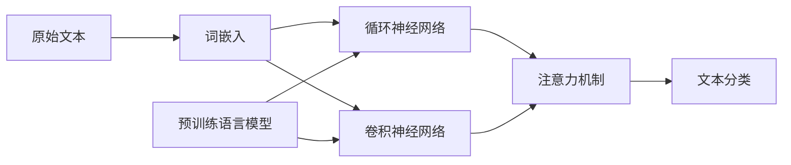

# 基于深度学习的文本分类

## 1. 背景介绍

### 1.1 文本分类的重要性

在当今信息爆炸的时代,海量的文本数据充斥着互联网。如何高效、准确地对这些文本数据进行分类,已经成为自然语言处理领域的一个重要课题。文本分类在垃圾邮件过滤、情感分析、主题识别、新闻分类等诸多领域都有着广泛的应用。

### 1.2 传统文本分类方法的局限性

传统的文本分类方法主要包括基于规则的方法和基于机器学习的方法。基于规则的方法需要人工定义大量的规则,工作量大且泛化能力差。基于机器学习的方法如朴素贝叶斯、支持向量机等,虽然一定程度上克服了规则方法的缺陷,但仍然存在特征表示单一、语义信息利用不足等问题,难以应对复杂的文本分类任务。

### 1.3 深度学习在文本分类中的优势

近年来,深度学习技术的兴起为文本分类任务带来了新的突破。相比传统方法,基于深度学习的文本分类具有以下优势:

1. 自动学习高级特征表示,无需人工特征工程。
2. 能够有效捕捉文本中的语义信息和上下文关系。 
3. 模型泛化能力强,可以应对大规模、复杂多变的文本数据。
4. 端到端的学习方式,直接从原始文本中学习分类模型。

## 2. 核心概念与联系

### 2.1 词嵌入(Word Embedding)

将词映射为稠密的实值向量表示,使得语义相似的词在向量空间中距离较近。常见的词嵌入模型有Word2Vec、GloVe等。词嵌入是深度学习文本分类的基础。

### 2.2 循环神经网络(RNN)

一种适合处理序列数据的神经网络模型。RNN能够捕捉文本中的上下文信息和长距离依赖关系。常见变体有LSTM和GRU,可以缓解梯度消失问题。

### 2.3 卷积神经网络(CNN) 

一种适合处理网格拓扑结构数据的神经网络模型。将文本看作一维的词序列,利用卷积和池化操作提取局部特征。TextCNN是典型的基于CNN的文本分类模型。

### 2.4 注意力机制(Attention Mechanism)

通过学习一个对齐函数,自动聚焦于输入文本中的关键信息。Attention机制增强了模型处理长文本和提取重要特征的能力,广泛应用于各种文本分类模型中。

### 2.5 预训练语言模型(Pre-trained Language Model) 

在大规模无标注语料上预训练得到的通用语言表示模型。代表性的模型有BERT、GPT等。将预训练语言模型Fine-tune到下游文本分类任务,可以显著提升分类性能。

以下是这些核心概念之间的关系示意图:



## 3. 核心算法原理与具体操作步骤

下面以TextCNN模型为例,详细介绍基于CNN的文本分类算法原理和操作步骤。

### 3.1 输入表示

将输入文本转化为词嵌入表示。设文本由$n$个词组成,每个词用$d$维词向量表示,则文本可表示为$n \times d$的二维矩阵。

### 3.2 卷积层

使用不同尺寸的卷积核在词向量矩阵上进行卷积操作,提取局部特征。设卷积核宽度为$h$,则卷积核的尺寸为$h \times d$。卷积操作可表示为:

$$c_i = f(w \cdot x_{i:i+h-1} + b)$$

其中$c_i$为卷积结果,$w$为卷积核权重参数,$b$为偏置项,$f$为激活函数(如ReLU),$x_{i:i+h-1}$表示第$i$到第$i+h-1$个词向量构成的矩阵。

### 3.3 池化层

对卷积结果进行最大池化操作,提取最重要的特征。设卷积结果为$c=(c_1,c_2,...,c_{n-h+1})$,最大池化的结果为:

$$\hat{c} = max(c)$$

### 3.4 全连接层与输出层

将所有卷积核的池化结果拼接成一个向量,经过全连接层映射到类别空间。设最后一个全连接层的输出为$z$,则输出层的预测概率为:

$$\hat{y} = softmax(z)$$

其中softmax函数将输出归一化为概率分布。

### 3.5 训练与优化

使用交叉熵损失函数衡量预测概率与真实标签的差异,并使用梯度下降法进行优化。设真实标签的one-hot编码为$y$,则交叉熵损失为:

$$J = -\sum_{i=1}^{N} y_i \log \hat{y}_i$$

其中$N$为类别数。使用反向传播算法计算梯度,并使用优化器(如Adam)更新模型参数,直至收敛。

## 4. 数学模型和公式详细讲解举例说明

这里以二分类问题为例,详细讲解TextCNN模型涉及的数学公式。

设输入文本经过词嵌入后得到矩阵$X \in \mathbb{R}^{n \times d}$,卷积核权重参数为$W \in \mathbb{R}^{h \times d}$,偏置项为$b \in \mathbb{R}$。则卷积操作可表示为:

$$C = ReLU(W \ast X + b)$$

其中$\ast$表示卷积操作,ReLU激活函数定义为:

$$ReLU(x) = max(0, x)$$

对卷积结果$C \in \mathbb{R}^{(n-h+1) \times 1}$进行最大池化:

$$\hat{c} = \max_{1 \leq i \leq n-h+1} C_i$$

设共有$m$个卷积核,最大池化结果拼接为向量$z \in \mathbb{R}^{m}$。经过全连接层映射得到输出层的logits:

$$o = W_f z + b_f$$

其中$W_f \in \mathbb{R}^{2 \times m}, b_f \in \mathbb{R}^2$分别为全连接层的权重和偏置。将logits输入sigmoid函数得到预测概率:

$$\hat{y} = \sigma(o) = \frac{1}{1+e^{-o}}$$

假设真实标签为$y \in \{0, 1\}$,则二分类交叉熵损失为:

$$J = -[y \log \hat{y} + (1-y) \log (1-\hat{y})]$$

使用梯度下降法最小化损失函数,参数$\theta$的更新公式为:

$$\theta := \theta - \alpha \frac{\partial J}{\partial \theta}$$

其中$\alpha$为学习率。重复这一过程直至模型收敛。

## 5. 项目实践:代码实例和详细解释说明

下面使用PyTorch实现一个简单的TextCNN文本分类模型。

```python
import torch
import torch.nn as nn
import torch.nn.functional as F

class TextCNN(nn.Module):
    def __init__(self, vocab_size, embed_dim, num_classes, filter_sizes, num_filters):
        super().__init__()
        self.embedding = nn.Embedding(vocab_size, embed_dim)
        self.convs = nn.ModuleList([
            nn.Conv2d(1, num_filters, (fs, embed_dim)) for fs in filter_sizes
        ])
        self.fc = nn.Linear(len(filter_sizes) * num_filters, num_classes)
        
    def forward(self, x):
        x = self.embedding(x)  # [batch_size, seq_len, embed_dim]
        x = x.unsqueeze(1)  # [batch_size, 1, seq_len, embed_dim]
        x = [F.relu(conv(x)).squeeze(3) for conv in self.convs]  # [batch_size, num_filters, seq_len-fs+1] * len(filter_sizes)
        x = [F.max_pool1d(i, i.size(2)).squeeze(2) for i in x]  # [batch_size, num_filters] * len(filter_sizes)
        x = torch.cat(x, 1)  # [batch_size, num_filters * len(filter_sizes)]
        logits = self.fc(x)  # [batch_size, num_classes]
        return logits
```

代码解释:

1. 定义TextCNN模型类,构造函数参数包括:
   - vocab_size:词表大小
   - embed_dim:词嵌入维度
   - num_classes:类别数
   - filter_sizes:卷积核尺寸列表
   - num_filters:每种尺寸卷积核的数量

2. 定义词嵌入层self.embedding,将词映射为稠密向量。

3. 定义卷积层self.convs,为不同尺寸的二维卷积核(宽度为filter_size,高度为embed_dim)的集合。

4. 定义全连接层self.fc,将pooling层的输出映射到类别空间。

5. 在前向传播函数forward中:
   - 将输入x通过词嵌入层得到词向量矩阵。
   - 在词向量矩阵上增加一个通道维,使其形状与卷积核匹配。
   - 对不同尺寸的卷积核分别进行卷积和ReLU激活,并去除最后一维。
   - 对卷积结果进行最大池化,去除文本长度维。
   - 将所有卷积核的pooling结果拼接成一个向量。
   - 通过全连接层得到最终的logits输出。

这个简单的TextCNN实现可以作为基于深度学习的文本分类的起点,在此基础上可以进一步优化和改进。

## 6. 实际应用场景

基于深度学习的文本分类技术在很多实际场景中都有重要应用,例如:

1. 垃圾邮件过滤:训练文本分类模型自动识别垃圾邮件,提高邮件管理效率。

2. 情感分析:对社交媒体、评论等文本进行情感倾向(积极、消极、中性)分类,了解用户对产品、服务的评价。

3. 主题识别:对新闻文章、博客等进行主题分类(如政治、经济、体育等),方便用户快速获取感兴趣的内容。

4. 问题分类:对客服系统中的用户问题进行分类(如账号、支付、退货等),自动将问题分配给对应的客服人员处理。

5. 文本审核:对用户生成的内容进行分类(如色情、暴力、政治敏感等),及时过滤不良信息。

6. 医疗文本分类:对电子病历、医疗报告等进行分类,协助医生快速查找相关病例。

总之,只要是涉及对大量文本进行分门别类的场景,都可以使用基于深度学习的文本分类技术来提高效率和准确性。

## 7. 工具和资源推荐

以下是一些进行文本分类任务常用的工具和资源:

1. 深度学习框架:
   - PyTorch (https://pytorch.org/)
   - TensorFlow (https://www.tensorflow.org/)
   - Keras (https://keras.io/)

2. 自然语言处理工具包:
   - NLTK (https://www.nltk.org/)
   - spaCy (https://spacy.io/)
   - gensim (https://radimrehurek.com/gensim/)

3. 预训练词向量:
   - Word2Vec (https://code.google.com/archive/p/word2vec/)
   - GloVe (https://nlp.stanford.edu/projects/glove/)
   - FastText (https://fasttext.cc/)

4. 预训练语言模型:
   - BERT (https://github.com/google-research/bert)
   - XLNet (https://github.com/zihangdai/xlnet)
   - GPT-2 (https://openai.com/blog/better-language-models/)

5. 文本分类数据集:
   - 20 Newsgroups (http://qwone.com/~jason/20Newsgroups/)
   - IMDb电影评论情感分类 (http://ai.stanford.edu/~amaas/data/sentiment/)
   - 斯坦福情感树库SST (https://nlp.stanford.edu/sentiment/treebank.html)

6. 中文自然语言处理资源:
   - HanLP (https://github.com/hankcs/HanLP)
   - jieba (https://github.com/fxsjy/jieba)
   - 中文预训练BERT (https://