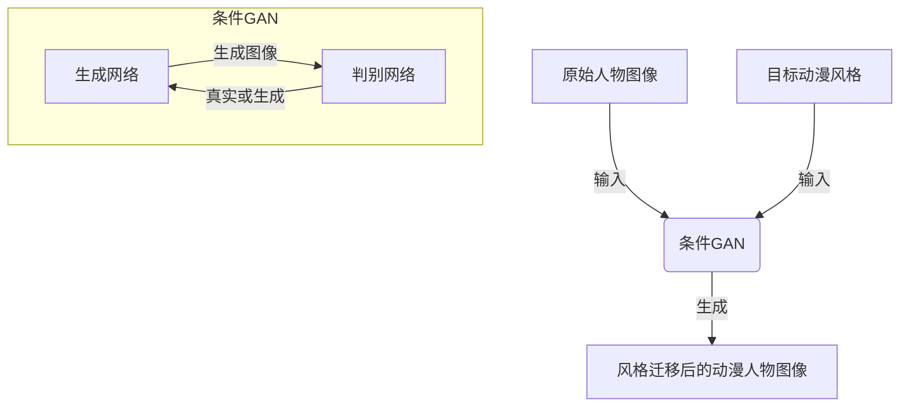

# 基于生成对抗网络的动漫人物绘画风格迁移

## 1. 背景介绍

### 1.1 动漫绘画风格迁移的重要性

动漫作品在当代文化中扮演着重要角色,吸引着大量观众。每个动漫作品都有其独特的视觉风格,体现在人物设计、背景绘制等方面。动漫绘画风格迁移技术可以将一种风格的动漫人物转换为另一种风格,为动漫制作带来新的可能性。

例如,我们可以将经典动漫人物的风格转换为最新流行风格,赋予经典作品新的生命力。或者将真人角色转换为动漫风格,为现实场景增添动漫色彩。此外,不同风格的动漫人物可以"跨界合作",创造出全新的视觉体验。

### 1.2 传统方法的局限性

传统的动漫绘画风格迁移方法主要依赖于人工操作,需要艺术家耗费大量时间和精力进行逐像素的修改。这种方法效率低下,难以满足大规模生产的需求。此外,人工操作也无法保证风格迁移的一致性和准确性。

### 1.3 生成对抗网络的优势

近年来,生成对抗网络(Generative Adversarial Networks, GANs)在图像生成和风格迁移领域取得了突破性进展。GAN是一种由生成网络和判别网络组成的深度学习架构,可以通过对抗训练实现高质量的图像生成和风格迁移。

相比传统方法,基于GAN的动漫人物绘画风格迁移技术具有以下优势:

- 高效自动化:GAN可以自动完成风格迁移过程,大大提高了效率。
- 风格保真:GAN能够精准捕捉和迁移目标风格的细节特征。
- 灵活可控:GAN允许用户调整风格迁移的程度,实现无缝过渡。
- 泛化能力强:训练好的GAN模型可以应用于不同的动漫人物和风格。

基于这些优势,GAN已成为动漫绘画风格迁移的主流技术方向,展现出广阔的应用前景。

## 2. 核心概念与联系

### 2.1 生成对抗网络(GAN)

生成对抗网络是一种由生成网络(Generator)和判别网络(Discriminator)组成的深度学习架构。生成网络的目标是从随机噪声中生成逼真的样本数据,而判别网络的目标是区分生成的样本和真实数据。

两个网络通过对抗训练相互博弈,生成网络不断努力生成更逼真的样本以欺骗判别网络,而判别网络则不断提高判别能力以区分生成样本和真实数据。这种对抗过程促使生成网络不断改进,最终达到生成高质量样本的目的。

GAN的核心思想可以用以下公式表示:

$$\min_G \max_D V(D, G) = \mathbb{E}_{x \sim p_{\text{data}}(x)}[\log D(x)] + \mathbb{E}_{z \sim p_z(z)}[\log(1 - D(G(z)))]$$

其中,$ G $是生成网络,$ D $是判别网络,$ z $是随机噪声向量,$ x $是真实数据样本。

GAN架构在图像生成、风格迁移等领域表现出色,是实现动漫人物绘画风格迁移的有力工具。

### 2.2 风格迁移

风格迁移是指将一种图像的风格迁移到另一种图像上,同时保留内容信息。在动漫人物绘画风格迁移中,我们希望将目标动漫风格迁移到原始人物图像上,生成新的具有目标风格的动漫人物图像。

风格迁移的核心思想是将图像分解为内容表示和风格表示两个部分。内容表示捕捉图像的主要结构和语义信息,而风格表示捕捉图像的纹理、颜色、笔触等风格特征。通过将原始图像的内容表示与目标风格的风格表示相结合,我们可以生成具有目标风格的新图像。

常用的风格迁移方法包括基于神经网络的优化方法和基于GAN的方法。前者通过最小化内容损失和风格损失来迭代优化图像,后者则利用GAN的生成能力直接生成风格迁移后的图像。

基于GAN的动漫人物绘画风格迁移方法通常采用条件GAN(Conditional GAN)架构,将原始图像和目标风格作为条件输入,生成网络学习生成具有目标风格的动漫人物图像。

### 2.3 Mermaid 流程图

以下是基于GAN的动漫人物绘画风格迁移的核心概念和流程:

在这个流程中,原始人物图像和目标动漫风格作为条件输入到条件GAN。生成网络学习生成具有目标风格的动漫人物图像,而判别网络则判断生成图像是真实的目标风格图像还是生成网络生成的图像。通过对抗训练,生成网络不断改进以生成更逼真的风格迁移图像。

## 3. 核心算法原理具体操作步骤

基于GAN的动漫人物绘画风格迁移算法通常包括以下几个核心步骤:

### 3.1 数据准备

首先,我们需要准备两种数据集:原始人物图像数据集和目标动漫风格图像数据集。原始人物图像可以是真人肖像或其他类型的人物图像,而目标动漫风格图像则是我们希望迁移到的动漫风格样本。

数据预处理是必要的,包括裁剪、调整大小、归一化等操作,以确保输入数据的一致性和质量。

### 3.2 网络架构设计

接下来,我们需要设计条件GAN的网络架构。常见的架构包括Pix2Pix、CycleGAN等。这些架构通常由生成网络和判别网络组成,生成网络负责生成风格迁移后的图像,而判别网络则判断生成图像是否真实。

生成网络通常采用编码器-解码器结构,将原始图像和目标风格编码为潜在表示,然后解码生成风格迁移后的图像。判别网络则输入真实目标风格图像和生成图像,学习区分它们。

### 3.3 对抗训练

对抗训练是GAN的核心,也是实现动漫人物绘画风格迁移的关键步骤。在训练过程中,生成网络和判别网络相互博弈,生成网络努力生成更逼真的风格迁移图像以欺骗判别网络,而判别网络则努力提高区分能力。

对抗训练的目标函数可以表示为:

$$\min_G \max_D V(D, G) = \mathbb{E}_{x \sim p_{\text{data}}(x)}[\log D(x)] + \mathbb{E}_{z \sim p_z(z)}[\log(1 - D(G(x, z)))]$$

其中,$ x $是原始人物图像,$ z $是目标动漫风格的潜在表示,$ G(x, z) $是生成网络生成的风格迁移图像。

通过交替优化生成网络和判别网络,我们可以达到生成高质量风格迁移图像的目的。

### 3.4 损失函数设计

除了对抗损失,我们还可以引入其他损失函数来约束生成网络,提高风格迁移的质量和一致性。常见的损失函数包括:

- 内容损失:确保生成图像保留了原始图像的内容信息。
- 风格损失:确保生成图像具有目标动漫风格的特征。
- 周期一致性损失(CycleGAN):确保风格迁移过程可逆,即从生成图像可以重构回原始图像。
- 感知损失:利用预训练的神经网络提取高层次的特征,量化生成图像与目标图像的感知差异。

通过合理设计和权衡各种损失函数,我们可以获得高质量、风格一致的动漫人物绘画风格迁移结果。

### 3.5 模型训练和优化

使用准备好的数据集和设计好的网络架构,我们可以开始训练模型。训练过程通常包括以下步骤:

1. 初始化生成网络和判别网络的参数。
2. 从数据集中采样原始人物图像和目标动漫风格图像。
3. 将原始图像和目标风格输入生成网络,生成风格迁移图像。
4. 计算对抗损失、内容损失、风格损失等损失函数。
5. 基于损失函数,更新生成网络和判别网络的参数。
6. 重复步骤2-5,直到模型收敛或达到预设的迭代次数。

在训练过程中,我们可以采用一些优化技术,如学习率调度、梯度裁剪等,以提高训练稳定性和效率。此外,还可以引入一些正则化方法,如dropout、批归一化等,以防止过拟合。

### 3.6 模型评估和调优

训练完成后,我们需要评估模型的性能,并根据需要进行调优。常见的评估指标包括:

- 定性评估:视觉检查生成图像的质量和风格一致性。
- 定量评估:计算生成图像与目标图像之间的相似度指标,如结构相似性(SSIM)、峰值信噪比(PSNR)等。
- 人工评估:邀请人工评估员对生成图像进行主观评分。

根据评估结果,我们可以调整网络架构、损失函数权重、超参数等,以改进模型性能。此外,还可以尝试不同的数据增强技术、预训练模型等策略,提高模型的泛化能力。

## 4. 数学模型和公式详细讲解举例说明

在基于GAN的动漫人物绘画风格迁移算法中,数学模型和公式扮演着重要角色,帮助我们理解和优化算法。下面,我们将详细讲解一些核心公式及其应用。

### 4.1 生成对抗网络(GAN)目标函数

GAN的目标函数描述了生成网络和判别网络之间的对抗博弈过程,可以表示为:

$$\min_G \max_D V(D, G) = \mathbb{E}_{x \sim p_{\text{data}}(x)}[\log D(x)] + \mathbb{E}_{z \sim p_z(z)}[\log(1 - D(G(z)))]$$

其中,$ G $是生成网络,$ D $是判别网络,$ x $是真实数据样本,$ z $是随机噪声向量。

这个目标函数包含两个项:

1. $ \mathbb{E}_{x \sim p_{\text{data}}(x)}[\log D(x)] $: 这项表示判别网络对真实数据样本的正确判别概率的期望。判别网络希望这一项最大化,即正确识别真实样本。

2. $ \mathbb{E}_{z \sim p_z(z)}[\log(1 - D(G(z)))] $: 这项表示判别网络对生成网络生成的样本的错误判别概率的期望。判别网络希望这一项最小化,即正确识别生成样本。

生成网络 $ G $ 的目标是最小化这个目标函数,即生成足够逼真的样本以欺骗判别网络。而判别网络 $ D $ 的目标是最大化这个目标函数,即提高区分真实样本和生成样本的能力。

通过交替优化生成网络和判别网络,我们可以达到生成高质量样本的目的。

在动漫人物绘画风格迁移中,我们将原始人物图像 $ x $ 和目标动漫风格 $ z $ 作为条件输入,生成网络学习生成具有目标风格的动漫人物图像 $ G(x, z) $。

### 4.2 内容损失

内容损失是确保生成图像保留了原始图像内容信息的关键。我们可以利用预训练的神经网络提取图像的高层次特征,并计算生成图像和原始图像之间的特征差异作为内容损失。

常见的内容损失公式为: