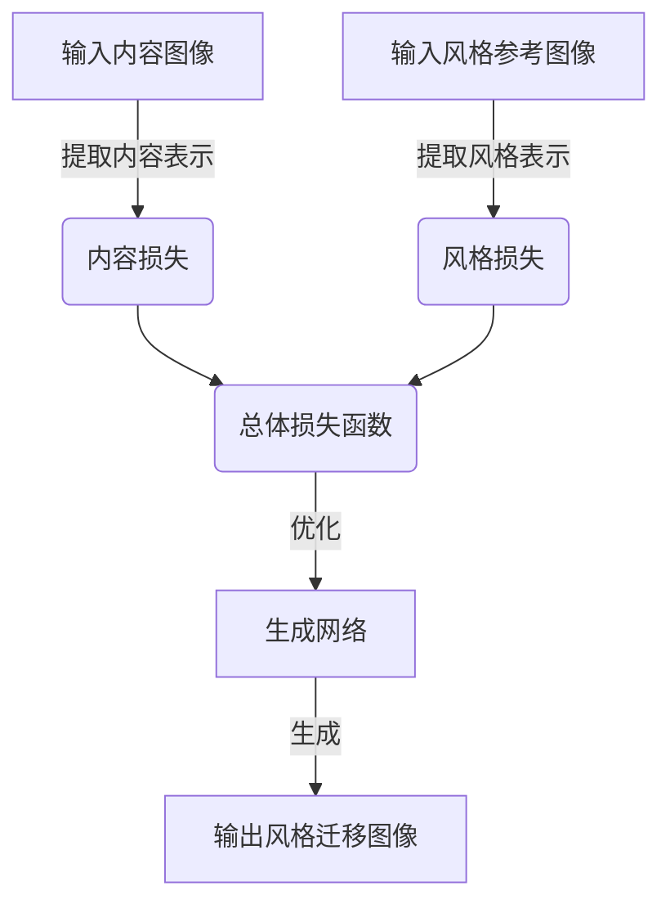
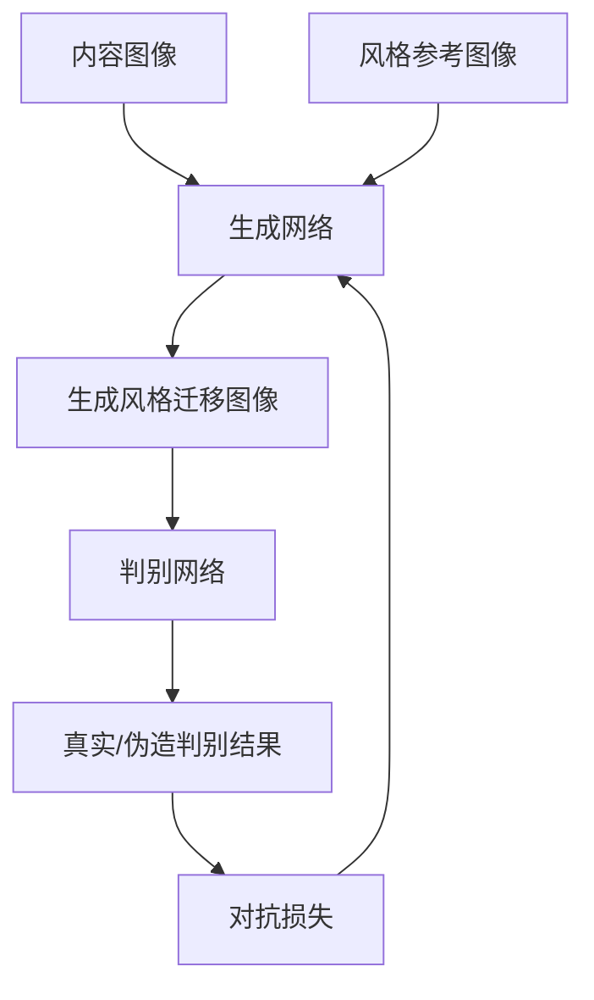

# 基于生成对抗网络的图像风格迁移在时尚设计中的应用

## 1.背景介绍

### 1.1 图像风格迁移概述

图像风格迁移是一种将一种图像风格迁移到另一种图像上的技术。它可以将一幅内容图像(如人像照片)与一种风格参考图像(如梵高的画作)相结合,生成一幅新图像,保留原内容图像的内容细节,同时采用风格参考图像的风格特征。这种技术广泛应用于数字艺术创作、图像增强、图像编辑等领域。

### 1.2 时尚设计中的应用需求

在时尚设计领域,设计师常常需要将自己的创意与不同风格的图像相结合,以创造出具有独特风格的时装设计图或服装效果图。传统的图像编辑方式通常是手工操作,费时费力且难以保证风格的一致性。基于生成对抗网络(GAN)的图像风格迁移技术为此提供了一种高效、自动化的解决方案。

### 1.3 生成对抗网络(GAN)简介

生成对抗网络是一种由两个神经网络组成的人工智能框架,包括生成网络和判别网络。生成网络从随机噪声中生成图像,而判别网络则判断生成的图像是真实的还是伪造的。两个网络相互对抗,生成网络努力生成足以欺骗判别网络的逼真图像,而判别网络则努力区分真实和伪造图像。通过这种对抗训练,生成网络最终能够生成高质量的图像。

## 2.核心概念与联系

### 2.1 内容损失与风格损失

图像风格迁移的核心思想是将内容图像的内容表示与风格参考图像的风格表示相结合。为了实现这一目标,我们需要定义内容损失(content loss)和风格损失(style loss)两个损失函数。

内容损失衡量生成图像与内容图像在内容表示上的差异,确保生成图像保留了原始内容图像的主要内容和结构。通常使用预训练的卷积神经网络(如VGG)提取图像的内容表示,并计算生成图像与内容图像的内容表示之间的均方差作为内容损失。

风格损失衡量生成图像与风格参考图像在风格表示上的差异,确保生成图像具有所需的风格特征。风格表示通常基于图像的gram矩阵,它描述了不同特征图之间的相关性。通过计算生成图像与风格参考图像的gram矩阵之间的均方差,可以获得风格损失。

总体损失函数是内容损失与风格损失的加权和,用于优化生成网络,产生同时保留内容细节和风格特征的图像。



### 2.2 生成对抗网络在图像风格迁移中的应用

传统的图像风格迁移方法通常基于优化算法,计算量大且生成速度慢。生成对抗网络(GAN)的引入为图像风格迁移提供了一种更高效的解决方案。

在基于GAN的图像风格迁移框架中,生成网络输入内容图像和风格参考图像,输出风格迁移后的图像。判别网络则判断输出图像是真实的风格参考图像,还是生成网络生成的伪造图像。生成网络和判别网络相互对抗,生成网络努力生成足以欺骗判别网络的风格迁移图像,而判别网络则努力区分真实和伪造图像。

此外,生成网络的损失函数通常包括内容损失、风格损失和对抗损失三个部分。内容损失和风格损失与传统方法类似,而对抗损失则来自于判别网络对生成图像的判别结果。通过优化这个损失函数,生成网络可以生成保留了内容细节且具有所需风格特征的高质量图像。



## 3.核心算法原理具体操作步骤

基于生成对抗网络的图像风格迁移算法可以分为以下几个主要步骤:

### 3.1 数据准备

1. 准备内容图像和风格参考图像数据集。
2. 对图像进行预处理,如调整大小、归一化等。

### 3.2 网络架构设计

1. 设计生成网络架构,通常采用编码器-解码器结构。编码器提取图像特征,解码器重建图像。
2. 设计判别网络架构,通常采用卷积神经网络结构,判断输入图像是真实的还是生成的。

### 3.3 损失函数定义

1. 定义内容损失函数,通常使用预训练的卷积神经网络(如VGG)提取图像的内容表示,计算生成图像与内容图像的内容表示之间的均方差。
2. 定义风格损失函数,基于图像的gram矩阵计算生成图像与风格参考图像的风格表示之间的均方差。
3. 定义对抗损失函数,基于判别网络对生成图像的判别结果。
4. 将内容损失、风格损失和对抗损失加权求和,得到总体损失函数。

### 3.4 网络训练

1. 初始化生成网络和判别网络的权重。
2. 迭代训练:
    - 固定生成网络,训练判别网络,使其能够区分真实和生成的图像。
    - 固定判别网络,训练生成网络,使其能够生成足以欺骗判别网络的风格迁移图像,同时最小化内容损失和风格损失。
3. 重复上述步骤,直到模型收敛。

### 3.5 风格迁移图像生成

1. 使用训练好的生成网络,输入内容图像和风格参考图像。
2. 生成网络输出风格迁移后的图像。

## 4.数学模型和公式详细讲解举例说明

### 4.1 内容损失

内容损失衡量生成图像与内容图像在内容表示上的差异。我们使用预训练的卷积神经网络(如VGG)提取图像的内容表示,并计算生成图像与内容图像的内容表示之间的均方差作为内容损失。

设$\phi_l(x)$表示图像$x$在VGG网络的第$l$层的特征图,则内容损失可以定义为:

$$L_{content}(G,C) = \frac{1}{2}\sum_{i,j}(\phi_l(G)_{i,j} - \phi_l(C)_{i,j})^2$$

其中,$G$表示生成图像,$C$表示内容图像,$i,j$表示特征图的空间位置。

通过最小化内容损失,可以确保生成图像保留了原始内容图像的主要内容和结构。

### 4.2 风格损失

风格损失衡量生成图像与风格参考图像在风格表示上的差异。风格表示通常基于图像的gram矩阵,它描述了不同特征图之间的相关性。

设$\phi_l(x)$表示图像$x$在VGG网络的第$l$层的特征图,则gram矩阵$G_l^{\phi}(x)$可以定义为:

$$G_l^{\phi}(x)_{c,c'} = \frac{1}{C_lH_lW_l}\sum_{h=1}^{H_l}\sum_{w=1}^{W_l}\phi_l(x)_{h,w,c}\phi_l(x)_{h,w,c'}$$

其中,$C_l,H_l,W_l$分别表示第$l$层特征图的通道数、高度和宽度,$c,c'$表示特征图的通道索引。

风格损失可以定义为生成图像与风格参考图像的gram矩阵之间的均方差:

$$L_{style}(G,S) = \sum_l\frac{1}{C_l^2}(\frac{1}{H_lW_l}G_l^{\phi}(G) - \frac{1}{H_lW_l}G_l^{\phi}(S))^2$$

其中,$G$表示生成图像,$S$表示风格参考图像,$l$表示VGG网络的层索引。

通过最小化风格损失,可以确保生成图像具有所需的风格特征。

### 4.3 对抗损失

对抗损失来自于判别网络对生成图像的判别结果。设$D$表示判别网络,则对抗损失可以定义为:

$$L_{adv}(G,D) = \mathbb{E}_{x\sim p_{data}(x)}[\log D(x)] + \mathbb{E}_{z\sim p_z(z)}[\log(1-D(G(z)))]$$

其中,$p_{data}(x)$表示真实图像的数据分布,$p_z(z)$表示随机噪声的分布,$G(z)$表示生成网络输出的图像。

对抗损失的目标是最大化判别网络对真实图像的判别概率,同时最小化判别网络对生成图像的判别概率。

### 4.4 总体损失函数

总体损失函数是内容损失、风格损失和对抗损失的加权和:

$$L_{total} = \alpha L_{content} + \beta L_{style} + \gamma L_{adv}$$

其中,$\alpha,\beta,\gamma$分别表示内容损失、风格损失和对抗损失的权重系数。

通过优化这个总体损失函数,生成网络可以生成同时保留了内容细节且具有所需风格特征的高质量图像。

## 5.项目实践:代码实例和详细解释说明

以下是一个基于PyTorch实现的图像风格迁移项目示例,包括数据加载、模型定义、训练过程和风格迁移图像生成等部分。

### 5.1 数据加载

```python
import torch
from torchvision import transforms, datasets

# 定义图像预处理转换
transform = transforms.Compose([
    transforms.Resize(256),
    transforms.CenterCrop(256),
    transforms.ToTensor(),
    transforms.Normalize(mean=[0.485, 0.456, 0.406], std=[0.229, 0.224, 0.225])
])

# 加载内容图像和风格参考图像
content_dataset = datasets.ImageFolder('path/to/content/images', transform=transform)
style_dataset = datasets.ImageFolder('path/to/style/images', transform=transform)

# 创建数据加载器
content_loader = torch.utils.data.DataLoader(content_dataset, batch_size=1, shuffle=False)
style_loader = torch.utils.data.DataLoader(style_dataset, batch_size=1, shuffle=False)
```

### 5.2 模型定义

```python
import torch.nn as nn

# 定义生成网络
class Generator(nn.Module):
    def __init__(self):
        super(Generator, self).__init__()
        # 编码器部分
        ...
        # 解码器部分
        ...

    def forward(self, content, style):
        # 编码内容和风格特征
        ...
        # 融合内容和风格特征
        ...
        # 解码生成风格迁移图像
        ...
        return output

# 定义判别网络
class Discriminator(nn.Module):
    def __init__(self):
        super(Discriminator, self).__init__()
        # 卷积层
        ...

    def forward(self, x):
        # 提取特征并判别
        ...
        return output
```

### 5.3 损失函数定义

```python
import torch.nn.functional as F

# 定义内容损失
def content_loss(gen_feat, target_feat):
    return F.mse_loss(gen_feat, target_feat)

# 定义风格损失
def style_loss(gen_feat, target_feat):
    gen_gram = gram_matrix(gen_feat)
    target_gram = gram_matrix(target_feat)
    return F.mse_loss(gen_gram, target_gram)

# 定义对抗损失
def adversarial_loss(discriminator, real_output, fake_output):
    real_loss = F.binary_cross_entropy_with_logits(real_output, torch.ones_like(real_output))
    fake_loss = F.binary_cross_entropy_with_logits(fake_output, torch.zeros_like(fake_output))
    return real_loss + fake_loss
```

### 5.4 训练过程

```python
import torch.optim as optim

# 初始化模型和优化器
generator = Generator().to(device)
discriminator = Discriminator().to(device)