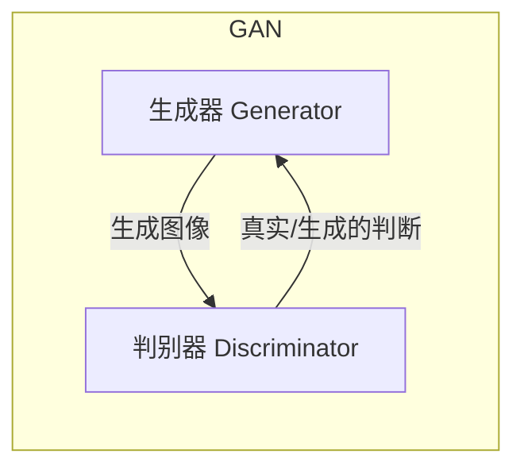
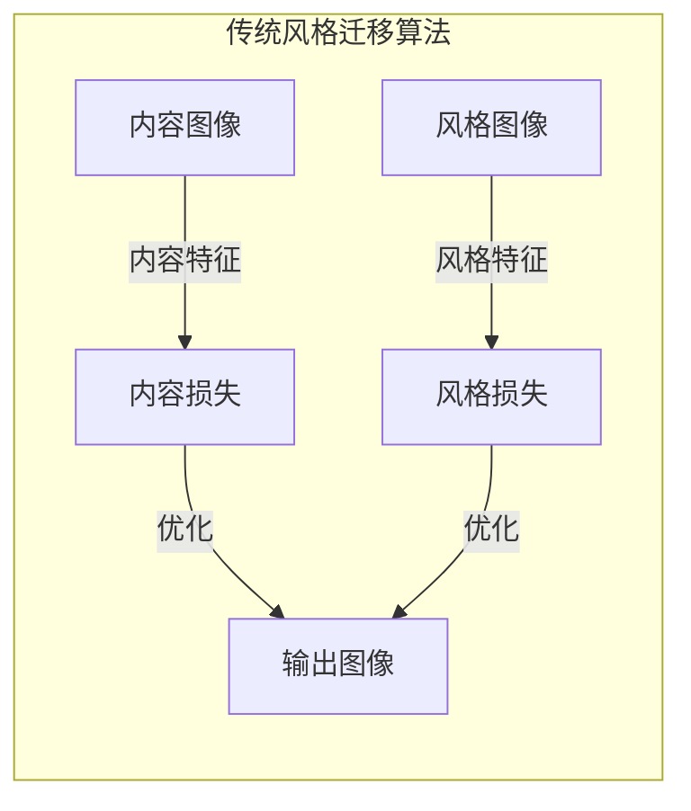
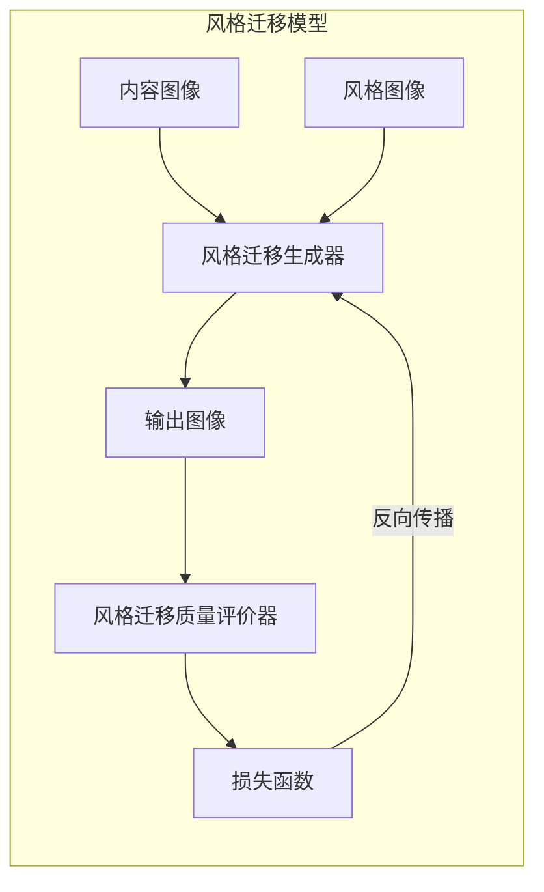

# 基于生成对抗网络的图像风格迁移质量评价模型

## 1. 背景介绍

### 1.1 图像风格迁移概述

图像风格迁移是一种将一种图像风格迁移到另一种图像上的技术。它可以将一幅内容图像(如风景照片)与一幅风格参考图像(如艺术家的绘画作品)相结合,生成一幅新的图像,保留了原始内容图像的内容细节,同时融合了风格参考图像的艺术风格。

这项技术在计算机视觉和图像处理领域有着广泛的应用,例如:

- 图像增强和美化
- 照片艺术化处理
- 视频风格化
- 图像去噪和修复
- 辅助艺术创作

### 1.2 图像风格迁移的挑战

尽管图像风格迁移技术取得了长足进展,但仍然存在一些挑战需要解决:

1. **风格迁移质量评价**:缺乏统一的客观评价标准,难以量化风格迁移结果的质量。
2. **内容保真度**:在迁移风格的同时,如何最大程度地保留原始内容图像的细节信息。
3. **计算效率**:现有算法计算复杂度高,处理时间长,难以满足实时处理需求。
4. **通用性**:大多数算法针对特定类型的图像,缺乏通用性和鲁棒性。

为了解决上述挑战,本文提出一种基于生成对抗网络(GAN)的图像风格迁移质量评价模型。

## 2. 核心概念与联系

### 2.1 生成对抗网络(GAN)

生成对抗网络(Generative Adversarial Networks, GAN)是一种由两个神经网络组成的框架,包括生成器(Generator)和判别器(Discriminator)。生成器的目标是生成逼真的数据样本(如图像),而判别器则试图区分生成器生成的样本和真实数据样本。通过生成器和判别器的对抗训练,生成器可以不断提高生成样本的质量,最终达到以假乱真的效果。

GAN在图像生成、图像翻译、图像超分辨率等领域表现出色,因此也可以应用于图像风格迁移任务。



### 2.2 风格迁移算法

传统的图像风格迁移算法主要基于卷积神经网络(CNN)的特征表示,通过优化目标函数实现内容保留和风格迁移。其中,内容损失函数用于保留内容图像的内容信息,而风格损失函数则用于迁移风格参考图像的风格特征。



然而,传统算法存在一些缺陷,如内容保真度不足、风格迁移效果一般、计算效率低下等。因此,本文提出的基于GAN的方法旨在解决这些问题,提高风格迁移质量。

## 3. 核心算法原理具体操作步骤

本节将详细介绍基于生成对抗网络的图像风格迁移质量评价模型的核心算法原理和具体操作步骤。

### 3.1 模型架构

该模型由两个主要组件组成:风格迁移生成器(Style Transfer Generator)和风格迁移质量评价器(Style Transfer Quality Evaluator)。



1. **风格迁移生成器(G)**: 基于条件GAN架构,接收内容图像和风格参考图像作为输入,生成风格迁移后的输出图像。
2. **风格迁移质量评价器(E)**: 基于判别器网络,对生成器输出的图像进行质量评价,计算风格迁移质量损失。

通过生成器和评价器的交替训练,生成器可以不断提高风格迁移质量,最终生成高质量的风格化图像。

### 3.2 算法步骤

1. **数据预处理**:准备内容图像和风格参考图像数据集,进行必要的预处理(如归一化、数据增强等)。

2. **初始化网络**:初始化风格迁移生成器G和风格迁移质量评价器E的网络权重。

3. **生成器训练**:
   a. 从数据集中采样一批内容图像和风格参考图像。
   b. 将内容图像和风格参考图像输入生成器G,获得风格迁移后的输出图像。
   c. 将输出图像输入评价器E,计算风格迁移质量损失。
   d. 根据损失函数,使用反向传播算法更新生成器G的网络权重。

4. **评价器训练**:
   a. 从数据集中采样一批真实图像和生成器G生成的风格化图像。
   b. 将真实图像和生成图像输入评价器E,计算判别损失。
   c. 根据判别损失,使用反向传播算法更新评价器E的网络权重。

5. **迭代训练**:重复步骤3和步骤4,交替训练生成器G和评价器E,直至模型收敛。

6. **风格迁移和质量评价**:使用训练好的生成器G对新的内容图像和风格参考图像进行风格迁移,并使用评价器E对输出图像的质量进行评价。

通过上述算法步骤,模型可以学习生成高质量的风格化图像,同时评价器可以对风格迁移质量进行客观评估。

## 4. 数学模型和公式详细讲解举例说明

本节将详细介绍基于生成对抗网络的图像风格迁移质量评价模型中使用的数学模型和公式,并给出具体的例子说明。

### 4.1 生成对抗网络损失函数

生成对抗网络的目标是训练生成器G生成逼真的样本,使得判别器D无法区分真实样本和生成样本。因此,生成器G和判别器D的损失函数可以表示为:

$$\min_G \max_D V(D, G) = \mathbb{E}_{x \sim p_\text{data}(x)}[\log D(x)] + \mathbb{E}_{z \sim p_z(z)}[\log(1 - D(G(z)))]$$

其中:
- $x$表示真实样本,来自于真实数据分布$p_\text{data}(x)$
- $z$表示随机噪声,来自于噪声分布$p_z(z)$
- $G(z)$表示生成器输出的生成样本
- $D(x)$和$D(G(z))$分别表示判别器对真实样本和生成样本的判别概率

在实践中,通常采用最小二乘损失或者交叉熵损失来近似上述公式。

### 4.2 风格迁移损失函数

在图像风格迁移任务中,我们需要定义内容损失和风格损失,以保留内容图像的内容信息,同时迁移风格参考图像的风格特征。

1. **内容损失**:内容损失衡量生成图像与内容图像在高层特征上的差异,通常使用均方误差(MSE)或者均方根误差(RMSE)来计算:

$$\mathcal{L}_\text{content}(G) = \frac{1}{N} \sum_{i=1}^N \left\lVert \phi_j(G(c, s)) - \phi_j(c) \right\rVert_2^2$$

其中:
- $c$表示内容图像
- $s$表示风格参考图像
- $G(c, s)$表示生成器输出的风格化图像
- $\phi_j$表示预训练卷积神经网络的第$j$层特征映射
- $N$表示特征映射的元素个数

2. **风格损失**:风格损失衡量生成图像与风格参考图像在风格特征上的差异,通常使用格拉姆矩阵(Gram Matrix)来表示风格特征:

$$\mathcal{L}_\text{style}(G) = \sum_{j=1}^J \frac{1}{N_j^2} \left\lVert G(A_j) - G(S_j) \right\rVert_F^2$$

其中:
- $A_j$和$S_j$分别表示生成图像和风格参考图像在第$j$层的特征映射
- $G(A_j)$和$G(S_j)$分别表示对应的格拉姆矩阵
- $N_j$表示第$j$层特征映射的元素个数
- $\lVert \cdot \rVert_F$表示矩阵的Frobenius范数

最终,风格迁移损失函数可以表示为内容损失和风格损失的加权和:

$$\mathcal{L}_\text{total}(G) = \alpha \mathcal{L}_\text{content}(G) + \beta \mathcal{L}_\text{style}(G)$$

其中$\alpha$和$\beta$是超参数,用于平衡内容保留和风格迁移的重要性。

### 4.3 风格迁移质量评价损失函数

为了评价风格迁移的质量,我们引入了风格迁移质量评价器E,它的目标是区分真实图像和风格化图像。因此,评价器E的损失函数可以定义为:

$$\mathcal{L}_\text{eval}(E) = \mathbb{E}_{x \sim p_\text{data}(x)}[\log E(x)] + \mathbb{E}_{x' \sim p_G(x')}[\log(1 - E(x'))]$$

其中:
- $x$表示真实图像,来自于真实数据分布$p_\text{data}(x)$
- $x'$表示生成器G输出的风格化图像,来自于生成分布$p_G(x')$
- $E(x)$和$E(x')$分别表示评价器对真实图像和风格化图像的判别概率

通过最小化评价器E的损失函数,评价器可以学习区分真实图像和风格化图像的能力。同时,生成器G的目标是最大化评价器E的损失函数,即让评价器无法区分真实图像和生成图像,从而提高风格迁移的质量。

综合考虑风格迁移损失函数和风格迁移质量评价损失函数,模型的总体损失函数可以表示为:

$$\mathcal{L}_\text{total}(G, E) = \mathcal{L}_\text{total}(G) - \lambda \mathcal{L}_\text{eval}(E)$$

其中$\lambda$是平衡两个损失函数的超参数。

通过交替优化生成器G和评价器E,模型可以同时提高风格迁移质量和评价能力。

## 5. 项目实践:代码实例和详细解释说明

为了更好地理解基于生成对抗网络的图像风格迁移质量评价模型,我们将提供一个基于PyTorch的代码实例,并对关键部分进行详细解释说明。

### 5.1 导入必要的库

```python
import torch
import torch.nn as nn
import torchvision.transforms as transforms
from torch.utils.data import DataLoader
from torchvision.datasets import ImageFolder
```

我们首先导入PyTorch及相关库,用于构建神经网络模型、加载数据集等。

### 5.2 定义网络架构

#### 5.2.1 风格迁移生成器

```python
class StyleTransferGenerator(nn.Module):
    def __init__(self, in_channels=3, out_channels=3, ngf=64):
        super(StyleTransferGenerator, self).__init__()
        # 编码器
        self.encoder = nn.Sequential(
            nn.Conv2d(in_channels, ngf, kernel_size=3, stride=2, padding=1),
            nn.InstanceNorm2d(ngf),
            nn.ReLU(True),
            # 更多编码器层...
        )
        # 残差块
        self.res_blocks = nn.Sequential(
            ResidualBlock(ngf),
            # 更多残差块...
        )
        # 解码器
        self.decoder = nn.Sequential(
            nn.ConvTranspose2d(ngf, out_channels, kernel_size=3, stride=2, padding=1, output_padding=1),
            nn.Tanh()
            # 更多解码器层...
        )

    def forward(self, content, style):
        