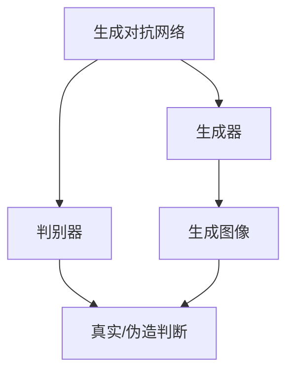
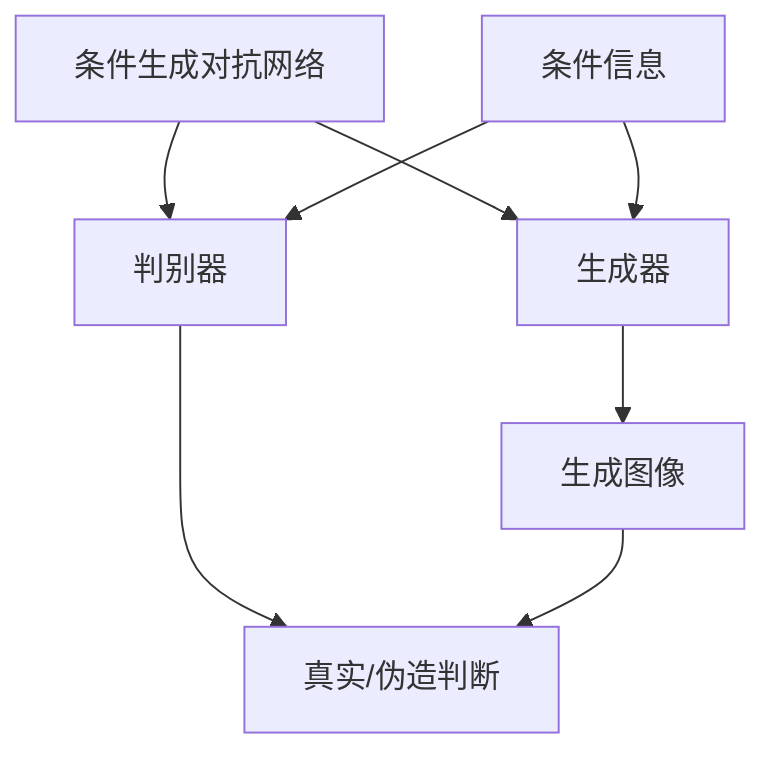
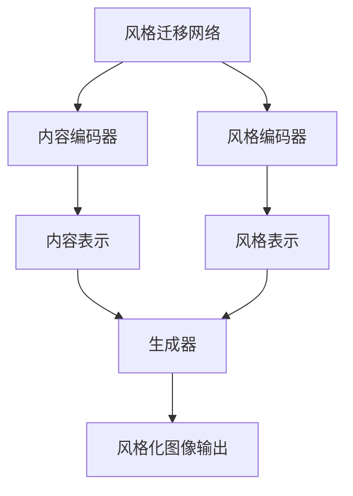

# 基于生成对抗网络的自然场景风格化图像生成研究

## 1. 背景介绍

### 1.1 图像生成任务概述

图像生成是计算机视觉和机器学习领域的一个重要研究方向,旨在根据输入的文本描述、图像风格或其他条件,生成逼真、高质量的图像输出。随着深度学习技术的飞速发展,基于生成对抗网络(Generative Adversarial Networks, GANs)的图像生成模型取得了令人瞩目的进展,展现出生成逼真图像的强大能力。

### 1.2 自然场景图像生成的重要性

自然场景图像生成任务旨在生成具有真实感的自然环境图像,如山川、森林、海洋等,这对于多个领域具有重要应用价值。例如,它可用于电影特效制作、虚拟现实环境构建、游戏场景设计等。此外,自然场景图像生成也可以促进计算机视觉模型对自然环境的理解和表示能力。

### 1.3 风格迁移在图像生成中的作用

风格迁移(Style Transfer)技术使得将一种艺术风格迁移到另一种内容上成为可能,为图像生成任务带来了新的可能性。通过将特定的艺术风格应用于自然场景图像生成过程中,我们可以创造出具有独特艺术特色的自然场景图像,丰富了生成图像的多样性。

## 2. 核心概念与联系

### 2.1 生成对抗网络(GANs)

生成对抗网络(GANs)是一种由生成器(Generator)和判别器(Discriminator)组成的深度学习架构。生成器的目标是生成逼真的数据样本(如图像),而判别器则旨在区分生成的样本和真实数据样本。通过生成器和判别器的对抗训练,GANs可以学习数据分布,并生成高质量的图像输出。



### 2.2 条件生成对抗网络(Conditional GANs)

条件生成对抗网络(Conditional GANs)是 GANs 的一种变体,它在生成过程中引入了条件信息,如文本描述、图像标签或其他辅助信息。通过条件信息的引导,生成器可以生成满足特定条件的图像输出,从而实现更好的控制和指导能力。



### 2.3 风格迁移网络

风格迁移网络旨在将一种艺术风格应用于输入图像,生成具有该风格特征的输出图像。这通常是通过将输入图像的内容表示与目标风格的风格表示相结合来实现的。风格迁移网络可以与生成对抗网络相结合,用于生成具有特定艺术风格的自然场景图像。



### 2.4 多模态融合

多模态融合是指将来自不同模态(如文本、图像、音频等)的信息融合在一起,以获得更丰富的表示和更好的任务性能。在自然场景图像生成中,我们可以将文本描述、参考图像等多模态信息融合到生成过程中,以更好地控制和指导图像生成。

## 3. 核心算法原理具体操作步骤

基于生成对抗网络的自然场景风格化图像生成通常包括以下几个关键步骤:

### 3.1 数据准备

首先,我们需要准备用于训练的数据集,包括自然场景图像和目标风格图像。自然场景图像数据集可以是现有的公开数据集,也可以是自行收集的数据。目标风格图像可以是具有特定艺术风格的画作或照片。

### 3.2 网络架构设计

设计生成对抗网络的架构,包括生成器和判别器。生成器通常采用编码器-解码器结构,将输入条件(如噪声向量、文本描述等)映射到图像空间。判别器则负责区分生成的图像和真实图像。

此外,还需要设计风格迁移网络,用于将目标风格应用于生成的自然场景图像。风格迁移网络通常包括内容编码器、风格编码器和生成器三个主要组件。

### 3.3 对抗训练过程

对抗训练过程包括以下步骤:

1. 生成器从随机噪声或条件输入(如文本描述)生成假样本图像。
2. 判别器接收真实图像和生成器生成的假样本图像,并对它们进行真实/伪造的二分类。
3. 生成器的目标是使判别器无法区分真实图像和生成图像,而判别器的目标是正确区分真实图像和生成图像。
4. 生成器和判别器通过最小化各自的损失函数进行对抗式训练,直到达到平衡状态。

在训练过程中,风格迁移网络与生成对抗网络相结合,将目标风格应用于生成的自然场景图像。

### 3.4 模型评估和优化

评估生成图像的质量,包括视觉质量、多样性和条件一致性等指标。根据评估结果,优化网络架构、损失函数和训练策略,以提高生成图像的质量和性能。

## 4. 数学模型和公式详细讲解举例说明

### 4.1 生成对抗网络的损失函数

生成对抗网络的训练过程可以被formalized为一个min-max游戏,其目标是找到生成器 $G$ 和判别器 $D$ 的Nash均衡解。具体来说,生成器 $G$ 试图最小化判别器 $D$ 将生成的假样本判别为假的概率,而判别器 $D$ 则试图最大化正确分类真实样本和生成样本的能力。这可以用以下公式表示:

$$\min_{G}\max_{D}V(D,G)=\mathbb{E}_{x\sim p_{data}(x)}[\log D(x)]+\mathbb{E}_{z\sim p_{z}(z)}[\log(1-D(G(z)))]$$

其中, $x$ 表示真实数据样本, $z$ 表示随机噪声向量, $p_{data}(x)$ 是真实数据分布, $p_{z}(z)$ 是噪声向量的分布。

### 4.2 条件生成对抗网络的损失函数

在条件生成对抗网络中,生成器和判别器都会接收额外的条件信息 $c$,如文本描述或图像标签。损失函数可以表示为:

$$\min_{G}\max_{D}V(D,G)=\mathbb{E}_{x\sim p_{data}(x)}[\log D(x|c)]+\mathbb{E}_{z\sim p_{z}(z)}[\log(1-D(G(z|c)|c))]$$

其中, $D(x|c)$ 表示判别器在给定条件 $c$ 下对真实样本 $x$ 的判别概率, $G(z|c)$ 表示生成器在给定条件 $c$ 下从噪声 $z$ 生成的假样本。

### 4.3 风格迁移损失函数

风格迁移网络通常使用两个损失项:内容损失和风格损失。内容损失确保生成图像保留了输入图像的内容信息,而风格损失则使生成图像具有目标风格的特征。

内容损失可以定义为:

$$\mathcal{L}_{content}=\frac{1}{2}\sum_{i,j}(F_{ij}^l-P_{ij}^l)^2$$

其中, $F^l$ 和 $P^l$ 分别表示生成图像和输入图像在某个卷积层 $l$ 上的特征映射。

风格损失可以定义为:

$$\mathcal{L}_{style}=\sum_{l}\frac{1}{N_l^2M_l^2}\sum_{i,j}\left(G_{ij}^l-A_{ij}^l\right)^2$$

其中, $G^l$ 和 $A^l$ 分别表示生成图像和目标风格图像在卷积层 $l$ 上的格拉姆矩阵(Gram Matrix),用于捕获风格信息。$N_l$ 和 $M_l$ 分别表示特征映射的高度和宽度。

最终的风格迁移损失函数是内容损失和风格损失的加权和:

$$\mathcal{L}_{total}=\alpha\mathcal{L}_{content}+\beta\mathcal{L}_{style}$$

其中, $\alpha$ 和 $\beta$ 是用于平衡两个损失项的权重系数。

通过最小化这个总损失函数,风格迁移网络可以生成同时保留了输入图像内容和目标风格特征的输出图像。

## 5. 项目实践:代码实例和详细解释说明

在这一部分,我们将提供一个基于 PyTorch 的代码示例,实现基于生成对抗网络的自然场景风格化图像生成。该示例包括生成对抗网络和风格迁移网络的实现,以及训练和推理过程。

### 5.1 导入必要的库

```python
import torch
import torch.nn as nn
import torchvision.transforms as transforms
import torchvision.datasets as datasets
from torch.utils.data import DataLoader
```

### 5.2 定义生成器和判别器

```python
class Generator(nn.Module):
    def __init__(self, z_dim, img_channels):
        super(Generator, self).__init__()
        # 定义生成器网络架构
        ...

    def forward(self, z):
        # 生成器前向传播
        ...
        return fake_img

class Discriminator(nn.Module):
    def __init__(self, img_channels):
        super(Discriminator, self).__init__()
        # 定义判别器网络架构
        ...

    def forward(self, img):
        # 判别器前向传播
        ...
        return validity
```

### 5.3 定义风格迁移网络

```python
class StyleTransferNet(nn.Module):
    def __init__(self, content_layers, style_layers):
        super(StyleTransferNet, self).__init__()
        # 定义内容编码器、风格编码器和生成器
        ...

    def forward(self, content_img, style_img):
        # 风格迁移网络前向传播
        ...
        return stylized_img
```

### 5.4 训练过程

```python
# 加载数据集
dataset = ...
dataloader = DataLoader(dataset, batch_size=batch_size, shuffle=True)

# 初始化生成器、判别器和风格迁移网络
generator = Generator(z_dim, img_channels)
discriminator = Discriminator(img_channels)
style_transfer_net = StyleTransferNet(content_layers, style_layers)

# 定义损失函数和优化器
adversarial_loss = nn.BCELoss()
style_loss = ...
content_loss = ...
g_optimizer = optim.Adam(generator.parameters(), lr=lr)
d_optimizer = optim.Adam(discriminator.parameters(), lr=lr)
st_optimizer = optim.Adam(style_transfer_net.parameters(), lr=lr)

# 训练循环
for epoch in range(num_epochs):
    for real_imgs, _ in dataloader:
        # 训练判别器
        ...

        # 训练生成器
        ...

        # 训练风格迁移网络
        ...

    # 保存模型权重
    ...
```

### 5.5 推理和结果可视化

```python
# 加载训练好的模型权重
generator.load_state_dict(torch.load('generator.pth'))
style_transfer_net.load_state_dict(torch.load('style_transfer_net.pth'))

# 生成样例图像
noise = torch.randn(batch_size, z_dim)
fake_imgs = generator(noise)

# 应用风格迁移
stylized_imgs = style_transfer_net(fake_imgs, style_img)

# 可视化结果
...
```

通过这个示例,您可以了解如何实现基于生成对抗网络的自然场景风格化图像生成,包括生成器、判别器和风格迁移网络的定义,以及训练和推理过程。您可以根据需要调整网络架构、超参数和训练策略,以获得更好的性能和结果。

## 6. 实际应用场景

基于生成对抗网络的自然场景风格化图像生成技术具有广泛的应用前景,包括但不限于以下几个领域:

### 