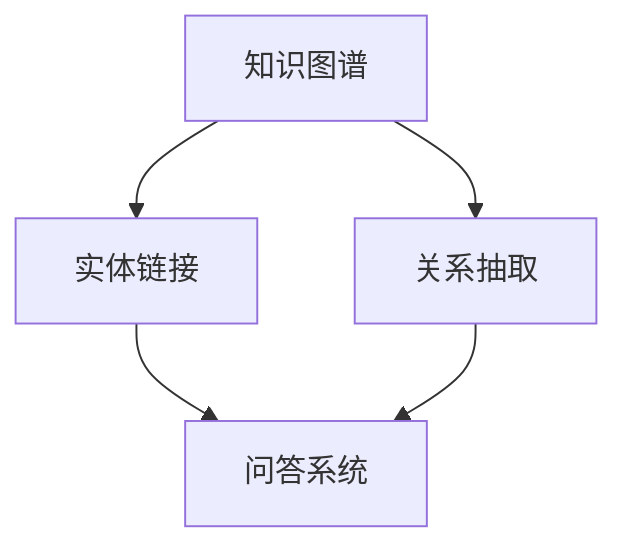

# 基于药物知识图谱的自动问答系统

## 1.背景介绍

### 1.1 医疗健康领域的挑战

在当今社会中,医疗健康领域面临着巨大的挑战。随着人口老龄化和慢性疾病的增加,医疗保健系统承受着越来越大的压力。同时,医学知识的快速增长使得医生难以及时获取最新的治疗方案和药物信息。此外,普通民众对于医疗健康知识的需求也与日俱增。

### 1.2 知识图谱在医疗领域的应用

知识图谱作为一种结构化的知识表示方式,可以有效地组织和管理海量的医疗数据。通过构建知识图谱,我们可以将分散的医疗知识整合成一个统一的知识库,方便医生、研究人员和普通民众快速查找和利用所需的信息。

### 1.3 药物知识图谱的重要性

药物知识图谱是一种专门针对药物领域构建的知识图谱。它包含了药物的化学结构、作用机理、适应症、禁忌症、不良反应等丰富的信息。通过构建药物知识图谱,我们可以更好地理解药物之间的关系,为临床诊疗和药物研发提供有力支持。

## 2.核心概念与联系

### 2.1 知识图谱

知识图谱是一种结构化的知识表示方式,它将实体(entities)、概念(concepts)和它们之间的关系(relations)以图的形式进行组织和存储。知识图谱可以有效地捕获和表示复杂的语义信息,为智能应用提供了强大的知识支持。

### 2.2 实体链接

实体链接(Entity Linking)是将自然语言文本中的实体与知识图谱中的实体进行匹配的过程。准确的实体链接是构建知识图谱和开发智能应用的关键步骤之一。

### 2.3 关系抽取

关系抽取(Relation Extraction)是从自然语言文本中识别和抽取实体之间的语义关系的过程。关系抽取技术可以帮助自动构建和丰富知识图谱。

### 2.4 问答系统

问答系统(Question Answering System)是一种智能系统,它可以理解用户提出的自然语言问题,并从知识库中检索相关信息,最终给出准确的答案。基于知识图谱的问答系统可以利用知识图谱中丰富的语义信息,提高问答的准确性和解释能力。

### 2.5 核心概念关系图



## 3.核心算法原理具体操作步骤

### 3.1 构建药物知识图谱

构建药物知识图谱的过程包括以下几个主要步骤:

1. **数据采集**: 从各种医学数据库、文献、临床指南等来源收集与药物相关的结构化和非结构化数据。

2. **数据预处理**: 对采集到的数据进行清洗、标准化和整合,确保数据的一致性和质量。

3. **实体识别与链接**: 使用命名实体识别(Named Entity Recognition, NER)和实体链接技术,从文本数据中识别出药物、疾病、症状等实体,并将它们链接到知识图谱中的相应实体。

4. **关系抽取**: 利用关系抽取算法,从文本数据中抽取出药物与其他实体之间的语义关系,如适应症、禁忌症、不良反应等。

5. **知识图谱构建**: 将识别出的实体和关系按照一定的数据模型组织成知识图谱,可以采用图数据库或其他适合的存储方式。

6. **知识融合与去重**: 将来自不同数据源的知识进行融合,解决实体和关系的冲突和重复问题。

7. **知识图谱优化**: 根据实际需求对知识图谱进行优化和扩展,如添加新的实体类型、关系类型或引入规则和约束。

### 3.2 基于知识图谱的问答系统

基于药物知识图谱构建自动问答系统的核心步骤如下:

1. **问句理解**: 对用户输入的自然语言问句进行分词、词性标注、命名实体识别等预处理,并进行语义分析,确定问句的意图和所需信息。

2. **查询构建**: 根据问句的语义信息,构建对应的查询语句,用于从知识图谱中检索相关信息。

3. **知识图谱查询**: 执行构建的查询语句,从知识图谱中检索与问题相关的实体、关系和属性信息。

4. **答案生成**: 对查询结果进行综合和推理,生成对应的自然语言答案。

5. **答案排序与优化**: 如果有多个候选答案,需要对它们进行排序和优化,选择最合适的答案输出。

6. **答案反馈与改进**: 收集用户对答案的反馈,并根据反馈对知识图谱和问答系统进行持续改进和优化。

整个过程中,还需要引入各种自然语言处理技术,如语义理解、实体链接、关系抽取、知识推理等,以提高问答系统的准确性和智能化水平。

## 4.数学模型和公式详细讲解举例说明

在构建药物知识图谱和问答系统的过程中,涉及到多种数学模型和算法,下面将对其中一些核心模型和公式进行详细讲解。

### 4.1 实体链接模型

实体链接是将自然语言文本中的实体与知识库中的实体进行匹配的过程。一种常用的实体链接模型是基于学习到排序(Learning to Rank)的模型,它将实体链接问题转化为一个排序问题。

给定一个mention $m$和一组候选实体 $E = \{e_1, e_2, \dots, e_n\}$,模型的目标是学习一个排序函数 $f(m, e)$,使得正确的实体 $e^*$ 在所有候选实体中排名最高。排序函数 $f(m, e)$ 通常是基于一些特征函数 $\phi(m, e)$ 的线性组合:

$$f(m, e) = \vec{w}^T \phi(m, e)$$

其中 $\vec{w}$ 是需要学习的权重向量。特征函数 $\phi(m, e)$ 可以包括mention和实体之间的字符串相似度、上下文相似度、知识库中的先验信息等。

在训练阶段,我们可以使用成对排序损失函数(Pairwise Ranking Loss)来学习权重向量 $\vec{w}$:

$$\mathcal{L}(\vec{w}) = \sum_{(m, e^*, e^-)} \max(0, 1 - f(m, e^*) + f(m, e^-))$$

其中 $(m, e^*, e^-)$ 表示一个训练样本,其中 $e^*$ 是正确的实体, $e^-$ 是一个错误的实体。这个损失函数的目标是最小化正确实体和错误实体的排序分数之差。

在测试阶段,对于每个mention $m$,我们计算所有候选实体的排序分数 $f(m, e)$,并选择得分最高的实体作为最终的链接结果。

### 4.2 关系抽取模型

关系抽取是从自然语言文本中识别和抽取实体之间的语义关系的过程。一种常用的关系抽取模型是基于卷积神经网络(Convolutional Neural Network, CNN)的模型。

假设我们有一个句子 $s = (w_1, w_2, \dots, w_n)$,其中包含两个实体 $e_1$ 和 $e_2$,我们的目标是预测这两个实体之间的关系类型 $r$。首先,我们将每个单词 $w_i$ 映射为一个词向量 $\vec{x}_i$,得到句子的词向量表示 $\vec{X} = (\vec{x}_1, \vec{x}_2, \dots, \vec{x}_n)$。

然后,我们使用一个卷积层来提取句子中的特征模式。卷积层包含多个卷积核 $\vec{W} \in \mathbb{R}^{k \times d}$,其中 $k$ 是卷积核的宽度, $d$ 是词向量的维度。对于句子中的每个宽度为 $k$ 的窗口 $\vec{x}_{i:i+k-1}$,我们计算卷积核与该窗口的点积:

$$c_i = \vec{W} \cdot \vec{x}_{i:i+k-1} + b$$

其中 $b$ 是一个偏置项。通过对所有窗口进行卷积运算,我们得到一个特征映射 $\vec{c} = (c_1, c_2, \dots, c_{n-k+1})$。

接下来,我们应用一个最大池化层,从特征映射 $\vec{c}$ 中选取最大值作为该卷积核的输出:

$$\hat{c} = \max(\vec{c})$$

通过使用多个卷积核和池化层,我们可以捕获句子中不同位置和不同granularity的特征模式。

最后,我们将所有卷积核的输出拼接成一个特征向量,并通过一个全连接层和softmax层预测关系类型 $r$:

$$\hat{r} = \text{softmax}(W_r \cdot [\hat{c}_1, \hat{c}_2, \dots, \hat{c}_m] + b_r)$$

其中 $W_r$ 和 $b_r$ 是全连接层的权重和偏置,  $m$ 是卷积核的数量。

在训练阶段,我们可以使用交叉熵损失函数来优化模型参数,从而学习到能够有效识别和抽取关系的模型。

## 5.项目实践:代码实例和详细解释说明

在这一部分,我们将提供一个基于药物知识图谱的自动问答系统的实现示例,并对关键代码进行详细解释。

### 5.1 知识图谱构建

我们使用 Python 中的 RDFLib 库来构建和操作知识图谱。以下是一个简单的示例,展示如何创建一个基本的药物知识图谱:

```python
from rdflib import Graph, Namespace, Literal, URIRef

# 定义命名空间
med = Namespace("http://example.org/med/")

# 创建图谱
g = Graph()

# 添加三元组
g.add((med.Aspirin, med.drugName, Literal("阿司匹林")))
g.add((med.Aspirin, med.treatsDiseases, med.Headache))
g.add((med.Aspirin, med.sideEffects, med.StomachUpset))

# 保存图谱
g.serialize(destination="med.ttl", format="turtle")
```

在这个示例中,我们首先定义了一个命名空间 `med`。然后,我们创建了一个空的图谱 `g`。接下来,我们使用 `add` 方法向图谱中添加三元组,描述阿司匹林的名称、治疗疾病和可能的副作用。最后,我们将图谱序列化为 Turtle 格式,并保存到文件 `med.ttl` 中。

### 5.2 问答系统实现

下面是一个基于 Python 和 SPARQL 的简单问答系统实现示例:

```python
from rdflib import Graph

# 加载知识图谱
g = Graph()
g.parse("med.ttl", format="turtle")

# 定义 SPARQL 查询函数
def query(question):
    if "治疗" in question:
        q = """
            PREFIX med: <http://example.org/med/>
            SELECT ?disease
            WHERE {
                med:Aspirin med:treatsDiseases ?disease .
            }
        """
    elif "副作用" in question:
        q = """
            PREFIX med: <http://example.org/med/>
            SELECT ?sideEffect
            WHERE {
                med:Aspirin med:sideEffects ?sideEffect .
            }
        """
    else:
        return "抱歉,我无法回答这个问题。"

    result = g.query(q)
    answer = "\n".join([str(row) for row in result])
    return answer

# 测试问答系统
print(query("阿司匹林治疗什么疾病?"))
print(query("阿司匹林有什么副作用?"))
print(query("阿司匹林的价格是多少?"))
```

在这个示例中,我们首先加载之前构建的药物知识图谱。然后,我们定义了一个 `query` 函数,用于根据用户的问题构建 SPARQL 查询,并在知识图谱中执行查询。

`query` 函数首先检查问题中