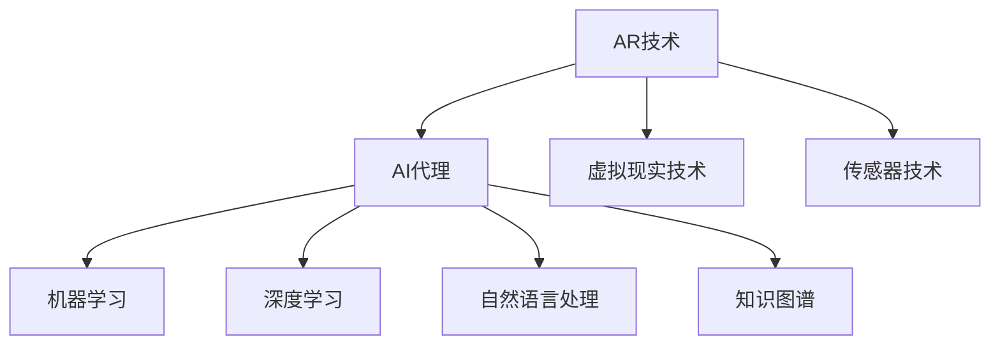

## 1. 背景介绍

随着人工智能技术的不断发展，增强现实（AR）技术也越来越受到关注。AR技术可以将虚拟世界与现实世界相结合，为用户提供更加丰富、直观的体验。在AR应用中，AI代理可以帮助用户更好地理解和处理虚拟信息，提高用户的交互体验和效率。因此，设计一种高效的AI代理工作流程对于AR应用的成功至关重要。

## 2. 核心概念与联系

在AR应用中，AI代理是指一种能够自主学习和决策的智能系统，它可以根据用户的需求和环境变化，自主地进行信息处理和决策。AI代理的核心概念包括机器学习、深度学习、自然语言处理、知识图谱等。这些技术可以帮助AI代理更好地理解和处理用户的需求和环境信息，提高其决策的准确性和效率。

在AR应用中，AI代理与其他技术密切相关，如图所示：



## 3. 核心算法原理具体操作步骤

AI代理的核心算法包括机器学习、深度学习、自然语言处理、知识图谱等。这些算法可以帮助AI代理更好地理解和处理用户的需求和环境信息，提高其决策的准确性和效率。

具体操作步骤如下：

1. 数据采集：AI代理需要从AR应用中获取用户的需求和环境信息，这些信息可以通过传感器技术和虚拟现实技术获取。

2. 数据预处理：AI代理需要对采集到的数据进行预处理，包括数据清洗、特征提取、数据转换等。

3. 模型训练：AI代理需要根据预处理后的数据，使用机器学习和深度学习算法进行模型训练，以提高其决策的准确性和效率。

4. 决策生成：AI代理根据训练好的模型，对用户的需求和环境信息进行分析和处理，生成相应的决策。

5. 决策执行：AI代理将生成的决策执行，并将执行结果反馈给用户。

## 4. 数学模型和公式详细讲解举例说明

在AI代理的模型训练过程中，常用的数学模型和公式包括线性回归、逻辑回归、支持向量机、决策树、神经网络等。这些模型和公式可以帮助AI代理更好地理解和处理用户的需求和环境信息，提高其决策的准确性和效率。

以线性回归为例，其数学模型和公式如下：

$$y = \beta_0 + \beta_1x_1 + \beta_2x_2 + ... + \beta_px_p + \epsilon$$

其中，$y$表示因变量，$x_1, x_2, ..., x_p$表示自变量，$\beta_0, \beta_1, \beta_2, ..., \beta_p$表示回归系数，$\epsilon$表示误差项。

线性回归的目标是找到一组回归系数，使得预测值与实际值之间的误差最小。这可以通过最小二乘法来实现。

## 5. 项目实践：代码实例和详细解释说明

在实际项目中，AI代理的工作流程可以通过编写代码来实现。以下是一个简单的代码实例，用于演示AI代理的工作流程：

```python
import numpy as np
from sklearn.linear_model import LinearRegression

# 数据采集
X = np.array([[1, 2], [3, 4], [5, 6]])
y = np.array([3, 7, 11])

# 模型训练
model = LinearRegression()
model.fit(X, y)

# 决策生成
X_new = np.array([[7, 8], [9, 10]])
y_new = model.predict(X_new)

# 决策执行
print(y_new)
```

以上代码实现了一个简单的线性回归模型，用于预测新的数据点的因变量值。在实际项目中，可以根据具体需求和数据特点，选择不同的算法和模型进行实现。

## 6. 实际应用场景

AI代理在AR应用中有着广泛的应用场景，如下所示：

1. 智能导航：AI代理可以根据用户的位置和目的地，自主规划最优路径，并提供导航指引。

2. 智能识别：AI代理可以根据用户的需求和环境信息，自主识别物体、场景等，并提供相应的信息和建议。

3. 智能交互：AI代理可以根据用户的语音、手势等交互方式，自主理解用户的意图，并提供相应的反馈和建议。

4. 智能辅助：AI代理可以根据用户的需求和环境信息，自主提供相应的辅助功能，如翻译、计算等。

## 7. 工具和资源推荐

在设计AI代理的工作流程时，可以使用一些工具和资源来提高效率和准确性，如下所示：

1. Python编程语言：Python是一种简单易学、功能强大的编程语言，可以用于实现AI代理的工作流程。

2. Scikit-learn库：Scikit-learn是一个开源的机器学习库，提供了丰富的机器学习算法和工具，可以用于实现AI代理的模型训练和决策生成。

3. TensorFlow库：TensorFlow是一个开源的深度学习库，提供了丰富的深度学习算法和工具，可以用于实现AI代理的模型训练和决策生成。

4. Kaggle平台：Kaggle是一个数据科学竞赛平台，提供了丰富的数据集和挑战，可以用于实践和测试AI代理的工作流程。

## 8. 总结：未来发展趋势与挑战

随着AR技术和人工智能技术的不断发展，AI代理在AR应用中的应用前景非常广阔。未来，AI代理将会更加智能化、个性化和自主化，可以更好地满足用户的需求和提高用户的交互体验。同时，AI代理在实际应用中也面临着一些挑战，如数据安全、隐私保护等问题，需要不断加强技术研究和规范制定。

## 9. 附录：常见问题与解答

Q：AI代理的工作流程中，如何保证数据的安全性和隐私性？

A：在AI代理的工作流程中，可以采用数据加密、数据脱敏等技术来保证数据的安全性和隐私性。

Q：AI代理的工作流程中，如何避免算法偏差和过拟合问题？

A：在AI代理的模型训练过程中，可以采用交叉验证、正则化等技术来避免算法偏差和过拟合问题。

Q：AI代理的工作流程中，如何提高决策的准确性和效率？

A：在AI代理的模型训练过程中，可以采用更加复杂的算法和模型，同时加强数据预处理和特征提取等环节，以提高决策的准确性和效率。

作者：禅与计算机程序设计艺术 / Zen and the Art of Computer Programming