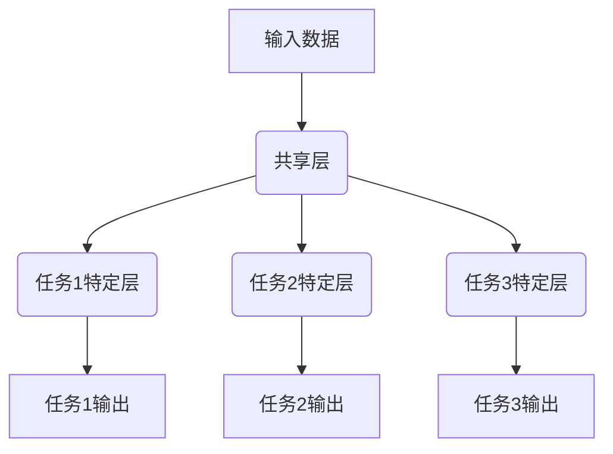

# 多任务学习Multi-Task Learning原理与代码实例讲解

## 1.背景介绍

在传统的机器学习中,通常会针对单一任务进行训练和优化模型。然而,在现实世界中,我们经常会遇到需要同时解决多个相关任务的情况。例如,在计算机视觉领域,我们可能需要同时进行图像分类、目标检测和语义分割等多个任务。在自然语言处理领域,我们可能需要同时进行文本分类、命名实体识别和关系抽取等多个任务。

多任务学习(Multi-Task Learning, MTL)就是一种旨在同时解决多个相关任务的机器学习范式。它的核心思想是通过共享部分模型参数或特征表示,利用不同任务之间的相关性,提高模型的泛化能力和学习效率。与单任务学习相比,多任务学习具有以下优势:

1. **数据效率提高**: 通过在相关任务之间共享参数或特征表示,可以更好地利用有限的训练数据,提高数据的利用效率。
2. **泛化能力增强**: 由于不同任务之间存在相关性,多任务学习可以捕捉到任务之间的共性知识,从而提高模型在各个任务上的泛化能力。
3. **转移学习效果**: 在多任务学习过程中,一个任务可以从其他相关任务中获得有益的知识迁移,提高了模型的学习效率和性能。
4. **鲁棒性增强**: 多任务学习可以防止模型过度拟合于单一任务,从而提高了模型的鲁棒性。

多任务学习已被广泛应用于计算机视觉、自然语言处理、语音识别、医学影像分析等多个领域,取得了卓越的成果。

## 2.核心概念与联系

### 2.1 任务构建

在多任务学习中,首先需要确定要解决的多个任务,并构建相应的数据集和损失函数。这些任务可以是完全不同的任务,也可以是相关但略有差异的任务。例如,在计算机视觉领域,我们可以将图像分类、目标检测和语义分割作为三个不同的任务;在自然语言处理领域,我们可以将文本分类、命名实体识别和关系抽取作为三个相关但略有差异的任务。

### 2.2 模型架构

多任务学习的模型架构通常包括两个部分:共享部分和任务特定部分。共享部分用于学习不同任务之间的共性知识,通常是一些共享的特征提取层或编码层。任务特定部分则针对每个具体任务进行专门的建模和优化。这种架构使得模型可以同时利用任务之间的相关性和每个任务的特殊性。



### 2.3 损失函数

在多任务学习中,需要定义一个综合的损失函数,将所有任务的损失进行加权求和。具体来说,对于包含 $N$ 个任务的多任务学习问题,其损失函数可以表示为:

$$\mathcal{L}_{total} = \sum_{i=1}^{N} \lambda_i \mathcal{L}_i$$

其中,$ \mathcal{L}_i$ 表示第 $i$ 个任务的损失函数,$ \lambda_i$ 是对应任务的权重系数。权重系数可以是预先设定的固定值,也可以是根据任务的重要性动态调整的值。

### 2.4 优化策略

多任务学习的优化策略需要平衡不同任务之间的权重,以及共享部分和任务特定部分之间的权重。常见的优化策略包括:

1. **等权重优化**: 所有任务的权重系数相等,即 $\lambda_1 = \lambda_2 = ... = \lambda_N = 1$。
2. **基于任务难度的加权优化**: 根据每个任务的难度程度,为更难的任务分配更大的权重。
3. **基于梯度归一化的优化**: 通过对梯度进行归一化,使得不同任务的梯度具有相同的尺度,从而避免某些任务主导整个优化过程。
4. **基于对抗训练的优化**: 引入对抗机制,使得共享部分学习到任务之间的共性知识,而任务特定部分学习到每个任务的特殊性。

## 3.核心算法原理具体操作步骤

多任务学习的核心算法原理可以概括为以下几个步骤:

1. **任务构建**: 确定要解决的多个任务,构建相应的数据集和损失函数。
2. **模型架构设计**: 设计包含共享部分和任务特定部分的模型架构。
3. **初始化模型参数**: 根据所选择的模型架构,初始化模型的参数。
4. **前向传播**: 将输入数据传递到模型中,计算每个任务的输出和损失。
5. **反向传播**: 根据每个任务的损失函数,计算梯度,并反向传播到模型的参数。
6. **参数更新**: 根据优化策略,更新模型的参数。
7. **重复训练**: 重复执行步骤4-6,直到模型收敛或达到预设的训练轮数。

以下是多任务学习算法的伪代码:

```python
# 初始化模型参数
初始化共享部分参数 θ_shared
初始化任务特定部分参数 {θ_task_1, θ_task_2, ..., θ_task_N}

# 训练循环
for epoch in range(num_epochs):
    # 遍历训练数据
    for batch_data in train_data:
        # 前向传播
        shared_output = forward_shared(batch_data, θ_shared)
        task_outputs = []
        for i in range(N):
            task_output = forward_task(shared_output, θ_task_i)
            task_outputs.append(task_output)
        
        # 计算损失
        losses = []
        for i in range(N):
            loss = task_loss(task_outputs[i], batch_labels[i])
            losses.append(loss)
        total_loss = sum(λ_i * losses[i] for i in range(N))
        
        # 反向传播
        gradients = backward(total_loss)
        
        # 参数更新
        θ_shared = update_params(θ_shared, gradients['shared'])
        for i in range(N):
            θ_task_i = update_params(θ_task_i, gradients[f'task_{i}'])
```

在实际应用中,还需要根据具体的任务和数据集进行调整和优化,例如添加正则化项、采用不同的优化器、调整超参数等。

## 4.数学模型和公式详细讲解举例说明

### 4.1 硬参数共享

在硬参数共享的多任务学习模型中,不同任务共享部分或全部的参数。这种方法的优点是可以显著减少模型的参数数量,提高训练效率。但缺点是不同任务之间的相关性可能不够紧密,共享参数可能会限制每个任务的表现。

假设我们有两个相关任务 $A$ 和 $B$,输入数据为 $\boldsymbol{x}$,任务 $A$ 的输出为 $\boldsymbol{y}_A$,任务 $B$ 的输出为 $\boldsymbol{y}_B$。我们可以定义一个共享的特征提取函数 $\boldsymbol{f}(\boldsymbol{x}; \boldsymbol{\theta}_s)$,以及两个任务特定的函数 $\boldsymbol{g}_A(\boldsymbol{f}(\boldsymbol{x}); \boldsymbol{\theta}_A)$ 和 $\boldsymbol{g}_B(\boldsymbol{f}(\boldsymbol{x}); \boldsymbol{\theta}_B)$,其中 $\boldsymbol{\theta}_s$、$\boldsymbol{\theta}_A$ 和 $\boldsymbol{\theta}_B$ 分别表示共享参数和任务特定参数。

则任务 $A$ 和 $B$ 的输出可以表示为:

$$\boldsymbol{y}_A = \boldsymbol{g}_A(\boldsymbol{f}(\boldsymbol{x}; \boldsymbol{\theta}_s); \boldsymbol{\theta}_A)$$
$$\boldsymbol{y}_B = \boldsymbol{g}_B(\boldsymbol{f}(\boldsymbol{x}; \boldsymbol{\theta}_s); \boldsymbol{\theta}_B)$$

在训练过程中,我们需要最小化两个任务的综合损失函数:

$$\mathcal{L}_{total} = \lambda_A \mathcal{L}_A(\boldsymbol{y}_A, \boldsymbol{y}_A^*) + \lambda_B \mathcal{L}_B(\boldsymbol{y}_B, \boldsymbol{y}_B^*)$$

其中,$ \mathcal{L}_A$ 和 $\mathcal{L}_B$ 分别表示任务 $A$ 和 $B$ 的损失函数,$ \boldsymbol{y}_A^*$ 和 $\boldsymbol{y}_B^*$ 表示对应任务的标签,$ \lambda_A$ 和 $\lambda_B$ 是任务权重系数。

通过反向传播算法,我们可以计算出参数 $\boldsymbol{\theta}_s$、$\boldsymbol{\theta}_A$ 和 $\boldsymbol{\theta}_B$ 的梯度,并更新参数以最小化综合损失函数。

### 4.2 软参数共享

在软参数共享的多任务学习模型中,不同任务的参数不再完全共享,而是通过正则化项来鼓励参数之间的相似性。这种方法可以在保持任务特定性的同时,仍然利用任务之间的相关性。

假设我们有两个相关任务 $A$ 和 $B$,输入数据为 $\boldsymbol{x}$,任务 $A$ 的输出为 $\boldsymbol{y}_A$,任务 $B$ 的输出为 $\boldsymbol{y}_B$。我们定义两个独立的模型 $\boldsymbol{f}_A(\boldsymbol{x}; \boldsymbol{\theta}_A)$ 和 $\boldsymbol{f}_B(\boldsymbol{x}; \boldsymbol{\theta}_B)$,分别用于任务 $A$ 和 $B$,其中 $\boldsymbol{\theta}_A$ 和 $\boldsymbol{\theta}_B$ 是对应的模型参数。

则任务 $A$ 和 $B$ 的输出可以表示为:

$$\boldsymbol{y}_A = \boldsymbol{f}_A(\boldsymbol{x}; \boldsymbol{\theta}_A)$$
$$\boldsymbol{y}_B = \boldsymbol{f}_B(\boldsymbol{x}; \boldsymbol{\theta}_B)$$

在训练过程中,我们需要最小化两个任务的综合损失函数,同时加入一个正则化项来鼓励参数之间的相似性:

$$\mathcal{L}_{total} = \lambda_A \mathcal{L}_A(\boldsymbol{y}_A, \boldsymbol{y}_A^*) + \lambda_B \mathcal{L}_B(\boldsymbol{y}_B, \boldsymbol{y}_B^*) + \gamma \Omega(\boldsymbol{\theta}_A, \boldsymbol{\theta}_B)$$

其中,$ \mathcal{L}_A$ 和 $\mathcal{L}_B$ 分别表示任务 $A$ 和 $B$ 的损失函数,$ \boldsymbol{y}_A^*$ 和 $\boldsymbol{y}_B^*$ 表示对应任务的标签,$ \lambda_A$ 和 $\lambda_B$ 是任务权重系数,$ \Omega(\boldsymbol{\theta}_A, \boldsymbol{\theta}_B)$ 是参数相似性的正则化项,$ \gamma$ 是正则化项的权重系数。

常见的参数相似性正则化项包括:

- $L_2$ 范数: $\Omega(\boldsymbol{\theta}_A, \boldsymbol{\theta}_B) = \|\boldsymbol{\theta}_A - \boldsymbol{\theta}_B\|_2^2$
- 迹范数: $\Omega(\boldsymbol{\theta}_A, \boldsymbol{\theta}_B) = \text{tr}((\boldsymbol{\theta}_A - \boldsymbol{\theta}_B)^T(\boldsymbol{\theta}_A - \boldsymbol{\theta}_B))$
- 核范数: $\Omega(\boldsymbol{\theta}_A, \boldsymbol{\theta}_B) = \sum_{i=1}^{n} \sigma_i(\boldsymbol{\theta}_A - \boldsymbol{\theta}_B)$

通过反向传播算法,我们可以计算出参数 $\boldsymbol{\theta}_A