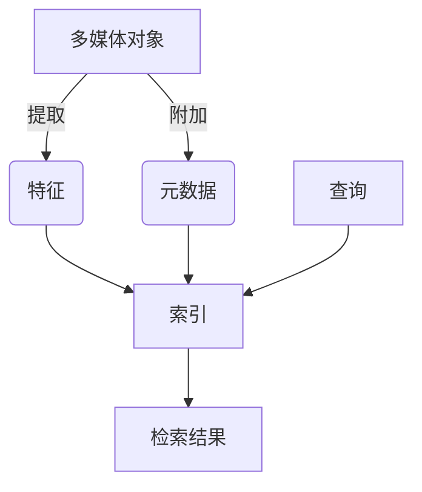

# 多媒体积件管理库的开发与应用

## 1.背景介绍

随着多媒体技术的快速发展,多媒体数据(如图像、视频、音频等)在各个领域的应用越来越广泛。然而,有效管理和利用这些海量多媒体数据一直是一个巨大的挑战。为了解决这个问题,多媒体积件管理库应运而生。

多媒体积件管理库是一种用于组织、存储和检索多媒体数据的软件系统。它提供了一种标准化的方式来描述、索引和访问各种多媒体对象,使得开发人员能够更高效地构建和维护基于多媒体的应用程序。

## 2.核心概念与联系

多媒体积件管理库的核心概念包括:

1. **多媒体对象(Multimedia Object)**: 指任何形式的多媒体数据,如图像、视频、音频等。

2. **元数据(Metadata)**: 描述多媒体对象的结构化信息,如标题、作者、创建日期等。

3. **特征(Feature)**: 从多媒体对象中提取的特征向量,用于内容相似性比较和检索。

4. **索引(Index)**: 用于加速多媒体对象检索的数据结构,通常基于特征向量构建。

5. **查询(Query)**: 用户提出的检索请求,可以基于元数据或内容相似性。

这些核心概念紧密相连,共同构建了一个完整的多媒体积件管理系统。



## 3.核心算法原理具体操作步骤

多媒体积件管理库的核心算法主要包括以下几个方面:

### 3.1 特征提取

特征提取是将原始多媒体数据转换为适合索引和比较的特征向量的过程。不同类型的多媒体数据需要采用不同的特征提取算法,例如:

- **图像**: 常用的特征提取算法包括SIFT、SURF、HOG等,用于提取图像的局部特征描述符。
- **视频**: 可以将视频分解为一系列帧,然后对每一帧应用图像特征提取算法。另外,还可以提取运动向量等时间特征。
- **音频**: 常用的特征包括MFCC(Mel频率倒谱系数)、频谱等,用于描述音频的时频特征。

特征提取算法的具体步骤因算法而异,但通常包括预处理、特征检测和特征描述三个阶段。

### 3.2 索引构建

索引是加速多媒体检索的关键。常用的索引结构包括:

- **树状索引**: 如K-D树、R树等,适用于低维特征向量。
- **哈希索引**: 如局部敏感哈希(LSH)、行列采样(PCA)等,适用于高维特征向量。
- **倒排索引**: 常用于基于文本的多媒体检索。

索引构建的具体步骤如下:

1. 对所有多媒体对象进行特征提取,得到特征向量集合。
2. 根据选择的索引结构,构建相应的索引。
3. 将多媒体对象的元数据与特征向量关联,存储在索引中。

### 3.3 相似性计算

相似性计算是多媒体检索的核心,用于量化两个多媒体对象之间的相似程度。常用的相似性度量包括:

- **欧几里得距离**: 适用于连续特征向量。
- **汉明距离**: 适用于二值特征向量。
- **余弦相似度**: 适用于高维稀疏特征向量。

相似性计算的具体步骤如下:

1. 对查询对象进行特征提取,得到查询特征向量。
2. 在索引中搜索与查询特征向量最相似的多媒体对象。
3. 根据相似性度量,计算查询对象与索引中对象的相似度分数。
4. 按相似度分数排序,返回最相似的多媒体对象集合。

## 4.数学模型和公式详细讲解举例说明

### 4.1 特征提取

以图像特征提取算法SIFT为例,它的主要步骤如下:

1. **尺度空间极值检测**

   通过构建高斯差分金字塔,在不同尺度空间中检测极值点作为候选关键点。

   高斯核函数:

   $$G(x,y,\sigma) = \frac{1}{2\pi\sigma^2}e^{-(x^2+y^2)/2\sigma^2}$$

   高斯差分:

   $$D(x,y,\sigma) = (G(x,y,k\sigma) - G(x,y,\sigma)) * I(x,y)$$

   其中$I(x,y)$是输入图像, $k$是尺度因子。

2. **关键点确定**

   对候选关键点进行细化,去除不稳定的关键点。具体方法是通过计算候选点邻域像素的二阶导数,如果其比主曲率的比值接近于1,则认为是不稳定的边缘响应,予以剔除。

3. **方向分配**

   为每个关键点分配一个或多个方向,使其具有旋转不变性。具体做法是基于关键点邻域像素的梯度方向分布,选取峰值作为关键点的主方向。

4. **关键点描述符**

   构建关键点的描述符向量,使其具有尺度不变性。描述符由邻域像素的梯度方向直方图组成,具有128维。

### 4.2 索引

以局部敏感哈希(LSH)为例,它是一种用于近似最近邻搜索的有效方法。

LSH的核心思想是将高维特征向量通过多个哈希函数映射到多个哈希桶中,相似的向量将有很高的概率落入相同的哈希桶。

具体步骤如下:

1. **哈希函数族构建**

   构建一组$k$个哈希函数$h_1, h_2, ..., h_k$,每个函数将$d$维特征向量映射到一个标量值。

   $$h_i(x) = \lfloor\frac{a_i \cdot x + b_i}{w}\rfloor$$

   其中$a_i$是$d$维随机向量,$b_i$是随机实数,$w$是一个窗口大小参数。

2. **哈希桶划分**

   对每个特征向量$x$,计算$k$个哈希值$h_1(x), h_2(x), ..., h_k(x)$,将其放入对应的$k$个哈希桶中。

3. **相似向量查找**

   对于查询向量$q$,计算其$k$个哈希值,检索落入相同哈希桶的向量作为候选集。然后在候选集中计算真实距离,返回最近邻向量。

LSH的核心思想是通过局部敏感的哈希函数,使相似向量有很高概率落入相同的哈希桶,从而大大减少了搜索空间。

### 4.3 相似性度量

以余弦相似度为例,它常用于衡量两个高维稀疏向量之间的相似程度。

对于两个向量$\vec{a}$和$\vec{b}$,它们的余弦相似度定义为:

$$\text{sim}(\vec{a}, \vec{b}) = \cos(\theta) = \frac{\vec{a} \cdot \vec{b}}{\|\vec{a}\| \|\vec{b}\|} = \frac{\sum_{i=1}^{n}a_ib_i}{\sqrt{\sum_{i=1}^{n}a_i^2}\sqrt{\sum_{i=1}^{n}b_i^2}}$$

其中$\theta$是$\vec{a}$和$\vec{b}$之间的夹角,$n$是向量维数。

余弦相似度的值域为$[-1,1]$,当两个向量完全相同时,余弦相似度为1;当两个向量完全相反时,余弦相似度为-1;当两个向量正交时,余弦相似度为0。

余弦相似度具有数量级无关性的特点,即对于任意非零常数$\alpha$和$\beta$,有:

$$\text{sim}(\alpha\vec{a}, \beta\vec{b}) = \text{sim}(\vec{a}, \vec{b})$$

这使得它特别适用于衡量高维稀疏向量之间的相似性。

## 5.项目实践:代码实例和详细解释说明

以下是一个基于Python和OpenCV库实现的简单图像检索系统的示例代码:

```python
import cv2
import numpy as np
from sklearn.cluster import KMeans

# 特征提取
def extract_features(image):
    gray = cv2.cvtColor(image, cv2.COLOR_BGR2GRAY)
    sift = cv2.SIFT_create()
    kp, des = sift.detectAndCompute(gray, None)
    return des

# 构建视觉词袋
def build_vocabulary(image_paths, vocab_size):
    descriptors = []
    for path in image_paths:
        image = cv2.imread(path)
        des = extract_features(image)
        descriptors.extend(des)
    
    descriptors = np.array(descriptors)
    kmeans = KMeans(n_clusters=vocab_size, random_state=0)
    vocab = kmeans.cluster_centers_
    return vocab

# 图像向量化
def image_to_vector(image, vocab):
    des = extract_features(image)
    histogram = np.zeros(len(vocab))
    for d in des:
        idx = np.argmin(np.linalg.norm(vocab - d, axis=1))
        histogram[idx] += 1
    return histogram / np.linalg.norm(histogram)

# 相似性计算
def similarity(vec1, vec2):
    return np.dot(vec1, vec2)

# 图像检索
def search_images(query_image, image_paths, vocab):
    query_vec = image_to_vector(query_image, vocab)
    scores = []
    for path in image_paths:
        image = cv2.imread(path)
        vec = image_to_vector(image, vocab)
        score = similarity(query_vec, vec)
        scores.append((path, score))
    
    scores.sort(key=lambda x: x[1], reverse=True)
    return scores
```

代码解释:

1. `extract_features`函数使用OpenCV的SIFT算法提取图像的特征描述符。

2. `build_vocabulary`函数基于一组图像构建视觉词袋(视觉单词的集合),使用K-Means聚类算法对所有特征描述符进行聚类,聚类中心即为视觉单词。

3. `image_to_vector`函数将图像映射到视觉词袋空间,生成一个直方图向量,表示每个视觉单词在该图像中的出现频率。

4. `similarity`函数计算两个向量之间的余弦相似度。

5. `search_images`函数对查询图像进行向量化,然后计算其与所有图像向量的相似度,按相似度降序排列并返回结果。

该示例使用了"视觉词袋"模型,将图像表示为视觉单词的直方图向量,从而简化了图像之间的相似性计算。虽然简单,但它展示了多媒体检索系统的基本流程。

在实际应用中,还需要考虑更高效的索引结构、更精确的相似性度量、大规模数据处理等问题,以提高系统的性能和可扩展性。

## 6.实际应用场景

多媒体积件管理库在许多领域都有广泛的应用,例如:

1. **内容检索**:在海量多媒体数据中快速检索相似或相关的内容,如图像搜索引擎、视频检索等。

2. **版权保护**:检测互联网上是否有盗版多媒体内容,保护版权。

3. **内容审核**:自动识别并过滤不当内容,如色情、暴力等。

4. **内容推荐**:根据用户偏好推荐相关的多媒体内容,提高用户体验。

5. **多媒体内容理解**:自动分析和理解多媒体内容的语义信息,如图像/视频标注、内容摘要等。

6. **生物识别**:利用人脸、虹膜、指纹等生物特征进行身份识别和验证。

7. **医学影像分析**:检索和分析相似的医学影像,辅助诊断和治疗。

8. **视频监控**:实时检测和跟踪运动目标,用于安防等场景。

总的来说,多媒体积件管理库为各种基于多媒体数据的应用提供了强有力的支持,是当前信息技术不可或缺的重要组成部分。

## 7.工具和资源推荐

以下是一些流行的多媒体积件管理库和相关工具:

1. **OpenCV**: 一个跨平台的计算