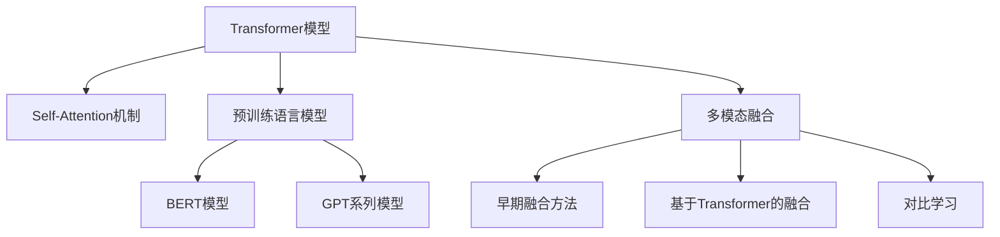

# 多模态大模型：技术原理与实战 ChatGPT的诞生

## 1. 背景介绍
### 1.1 人工智能的发展历程
#### 1.1.1 早期人工智能
#### 1.1.2 机器学习时代  
#### 1.1.3 深度学习的崛起
### 1.2 自然语言处理的演进
#### 1.2.1 基于规则的方法
#### 1.2.2 统计机器学习方法
#### 1.2.3 深度学习在NLP中的应用
### 1.3 多模态学习的兴起
#### 1.3.1 什么是多模态学习
#### 1.3.2 多模态数据的特点
#### 1.3.3 多模态学习的优势

## 2. 核心概念与联系
### 2.1 Transformer模型
#### 2.1.1 Transformer的提出
#### 2.1.2 Self-Attention机制
#### 2.1.3 Transformer的应用
### 2.2 预训练语言模型
#### 2.2.1 预训练的思想
#### 2.2.2 BERT模型
#### 2.2.3 GPT系列模型
### 2.3 多模态融合
#### 2.3.1 早期的多模态融合方法
#### 2.3.2 基于Transformer的多模态融合
#### 2.3.3 对比学习在多模态中的应用



## 3. 核心算法原理具体操作步骤
### 3.1 Transformer的核心原理
#### 3.1.1 输入表示
#### 3.1.2 Multi-Head Attention
#### 3.1.3 前馈神经网络
#### 3.1.4 残差连接与Layer Normalization
### 3.2 BERT的训练过程
#### 3.2.1 Masked Language Model
#### 3.2.2 Next Sentence Prediction
#### 3.2.3 微调与下游任务
### 3.3 GPT的生成式预训练
#### 3.3.1 语言模型预训练
#### 3.3.2 Zero-Shot学习
#### 3.3.3 Few-Shot学习
### 3.4 多模态对比学习
#### 3.4.1 对比学习的基本原理
#### 3.4.2 跨模态对比学习
#### 3.4.3 对比语言-图像预训练

## 4. 数学模型和公式详细讲解举例说明
### 4.1 Transformer的数学表示
#### 4.1.1 Self-Attention的计算
$$Attention(Q,K,V) = softmax(\frac{QK^T}{\sqrt{d_k}})V$$
其中，$Q$, $K$, $V$ 分别表示 query, key, value。
#### 4.1.2 Multi-Head Attention
$$MultiHead(Q,K,V) = Concat(head_1,...,head_h)W^O$$
$$head_i = Attention(QW_i^Q, KW_i^K, VW_i^V)$$
#### 4.1.3 前馈神经网络
$$FFN(x) = max(0, xW_1 + b_1)W_2 + b_2$$
### 4.2 对比学习的目标函数
对比学习的目标是最大化正样本对的相似度，最小化负样本对的相似度。常见的对比学习损失函数有：
- InfoNCE损失：
$$\mathcal{L}_{InfoNCE} = -\log \frac{e^{f(x,y)/\tau}}{\sum_{i=1}^N e^{f(x,y_i)/\tau}}$$
- NT-Xent损失：
$$\mathcal{L}_{NT-Xent} = -\sum_{i=1}^N \log \frac{e^{f(x_i,y_i)/\tau}}{\sum_{j=1}^N \mathbf{1}_{j\neq i}e^{f(x_i,y_j)/\tau}}$$

## 5. 项目实践：代码实例和详细解释说明
### 5.1 使用PyTorch实现Transformer
```python
import torch
import torch.nn as nn

class MultiHeadAttention(nn.Module):
    def __init__(self, d_model, num_heads):
        super().__init__()
        self.d_model = d_model
        self.num_heads = num_heads
        self.head_dim = d_model // num_heads
        
        self.qkv_linear = nn.Linear(d_model, 3*d_model)
        self.out_linear = nn.Linear(d_model, d_model)
        
    def forward(self, x, mask=None):
        batch_size, seq_len, _ = x.size()
        qkv = self.qkv_linear(x)
        q, k, v = qkv.chunk(3, dim=-1)
        q = q.view(batch_size, seq_len, self.num_heads, self.head_dim).transpose(1,2)
        k = k.view(batch_size, seq_len, self.num_heads, self.head_dim).transpose(1,2)
        v = v.view(batch_size, seq_len, self.num_heads, self.head_dim).transpose(1,2)
        
        attn_weights = torch.matmul(q, k.transpose(-2,-1)) / (self.head_dim ** 0.5)
        if mask is not None:
            attn_weights = attn_weights.masked_fill(mask==0, -1e9)
        attn_weights = nn.functional.softmax(attn_weights, dim=-1)
        
        attn_output = torch.matmul(attn_weights, v)
        attn_output = attn_output.transpose(1,2).contiguous().view(batch_size, seq_len, self.d_model)
        attn_output = self.out_linear(attn_output)
        return attn_output
```
以上代码实现了Transformer中的Multi-Head Attention模块。主要步骤如下：
1. 将输入 $x$ 通过线性变换得到 $Q$, $K$, $V$。
2. 将 $Q$, $K$, $V$ 分成多头，并转置维度。
3. 计算注意力权重，并应用 mask。
4. 将注意力权重与 $V$ 相乘得到输出。
5. 将多头的输出拼接并通过线性变换得到最终输出。

### 5.2 使用Hugging Face的Transformers库进行预训练
```python
from transformers import BertTokenizer, BertForPreTraining, DataCollatorForLanguageModeling
from datasets import load_dataset

tokenizer = BertTokenizer.from_pretrained('bert-base-uncased')
model = BertForPreTraining.from_pretrained('bert-base-uncased')

dataset = load_dataset('wikitext', 'wikitext-2-raw-v1')
tokenized_dataset = dataset.map(lambda x: tokenizer(x['text'], truncation=True, padding='max_length', max_length=512), batched=True)

data_collator = DataCollatorForLanguageModeling(tokenizer=tokenizer, mlm=True, mlm_probability=0.15)

from transformers import Trainer, TrainingArguments

training_args = TrainingArguments(
    output_dir='./results',
    num_train_epochs=3,
    per_device_train_batch_size=16,
    save_steps=1000,
    logging_steps=500,
)

trainer = Trainer(
    model=model,
    args=training_args,
    train_dataset=tokenized_dataset['train'],
    data_collator=data_collator,
)

trainer.train()
```
以上代码展示了如何使用Hugging Face的Transformers库对BERT模型进行预训练。主要步骤包括：
1. 加载预训练的BERT tokenizer和模型。
2. 加载WikiText-2数据集并进行tokenize。
3. 定义DataCollator，用于动态Mask输入。
4. 设置训练参数，如epoch数、batch size等。
5. 定义Trainer，传入模型、数据集、训练参数等。
6. 调用 `trainer.train()` 开始训练。

## 6. 实际应用场景
### 6.1 智能客服
多模态大模型可以用于构建智能客服系统。通过文本、语音、图像等多种形式的输入，智能客服可以准确理解用户需求，给出个性化的回复和服务。同时，多模态融合有助于客服系统更好地处理复杂的用户问题。

### 6.2 医疗辅助诊断
将多模态大模型应用于医疗领域，可以辅助医生进行疾病诊断。通过分析患者的病历、影像数据、基因数据等多模态信息，AI系统可以给出诊断建议，提高诊断的准确性和效率。多模态融合能够挖掘不同数据之间的关联，发现单一模态难以发现的模式。

### 6.3 智能教育
多模态大模型在智能教育中也有广泛应用。例如，通过分析学生的文本作答、语音互动、学习行为等多模态数据，AI系统可以评估学生的知识掌握程度，给出个性化的学习建议和内容推荐。多模态融合可以帮助构建更全面、更准确的学生画像。

## 7. 工具和资源推荐
- Hugging Face Transformers：包含大量预训练模型和常用NLP任务的库。
- OpenAI GPT-3 API：可以方便地调用GPT-3模型进行文本生成等任务。
- FairSeq：Facebook开源的序列建模工具包，支持多种任务如机器翻译、语言模型等。
- MMF：多模态融合的开源库，提供了多种预训练模型和融合方法。
- CLIP：OpenAI提出的对比语言-图像预训练模型，可用于零样本图像分类等任务。

## 8. 总结：未来发展趋势与挑战
多模态大模型代表了人工智能技术的新方向，它融合了不同模态的信息，能够更全面、更准确地理解和生成内容。未来，多模态大模型有望在更多领域得到应用，如智能助手、内容创作、知识图谱构建等。同时，多模态大模型也面临着一些挑战：
- 计算和存储资源的需求大。训练和推理大模型需要大量的算力和内存，对硬件提出了更高要求。
- 缺乏可解释性。大模型通常是黑盒模型，其决策过程难以解释，这可能影响用户对其输出的信任。
- 数据的质量和隐私问题。构建多模态大模型需要大量高质量的数据，而数据的获取和使用可能涉及隐私和伦理问题。
- 模型的公平性和鲁棒性。如何确保模型对不同群体是公平的，对对抗性样本和异常输入是鲁棒的，也是亟待解决的问题。

尽管存在挑战，但多模态大模型代表了人工智能的重要发展方向，有望带来更智能、更自然的人机交互体验。

## 9. 附录：常见问题与解答
### 9.1 预训练和微调的区别是什么？
预训练是在大规模无标注数据上进行的自监督学习，目的是学习通用的语言表示。微调是在特定任务的有标注数据上进行的监督学习，目的是将预训练模型适配到具体任务。通常，我们先在大规模语料上预训练模型，再在下游任务的数据集上微调模型。

### 9.2 Zero-Shot、One-Shot、Few-Shot学习分别指什么？
- Zero-Shot Learning：模型在没有见过某一类别的任何样本的情况下，仍然能够对该类别进行识别或生成。
- One-Shot Learning：模型在只给定每个类别一个样本的情况下，能够对新的样本进行分类。
- Few-Shot Learning：模型在每个类别只有很少几个样本的情况下，能够快速学习并对新样本进行分类。
Few-Shot Learning是One-Shot Learning的推广，One-Shot Learning又可以看作Zero-Shot Learning的特例。

### 9.3 Transformer模型的优点有哪些？
- 并行计算：Transformer使用Self-Attention，可以并行计算不同位置之间的依赖关系，加速训练和推理。
- 捕捉长距离依赖：Self-Attention可以直接计算任意两个位置之间的依赖，更容易捕捉长距离的语义关系。
- 可解释性：Attention权重可以用于可视化分析，解释模型的决策过程。
- 适合迁移学习：Transformer学到的语言表示是通用的，可以方便地迁移到其他任务。

### 9.4 对比学习的核心思想是什么？
对比学习的核心思想是通过构建正样本对和负样本对，学习一个编码器，使得正样本对的表示相似，负样本对的表示不同。通过这种方式，编码器可以学习到数据的内在结构和不变性，从而得到更好的特征表示。对比学习可以在无监督或自监督的情况下进行，适合应用于标注数据缺乏的场景。

### 9.5 如何理解ChatGPT的Few-Shot