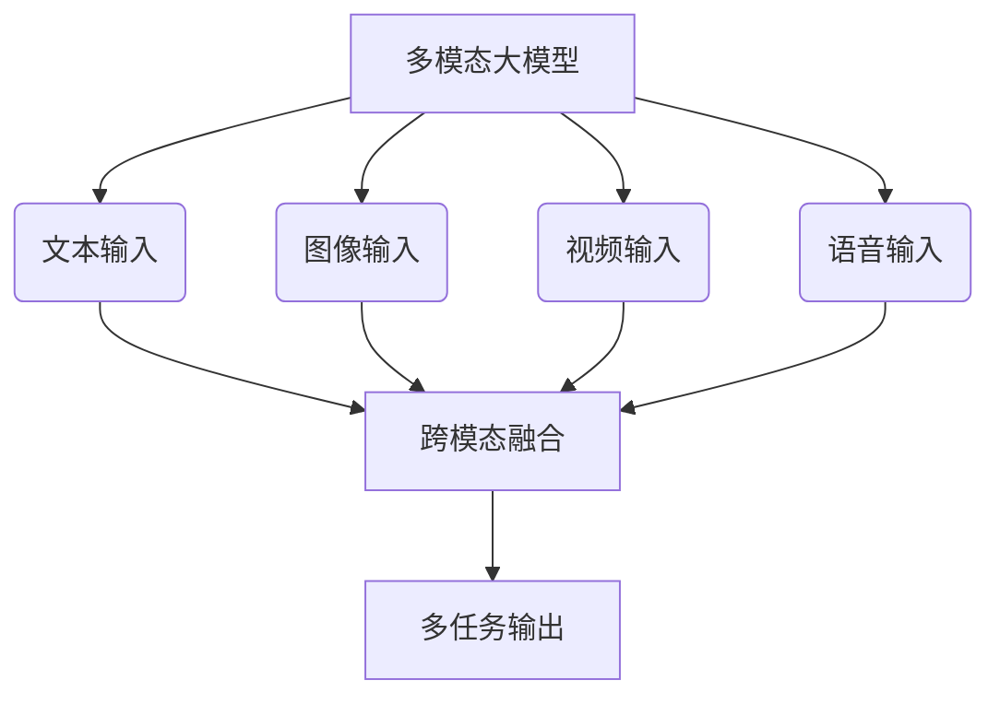
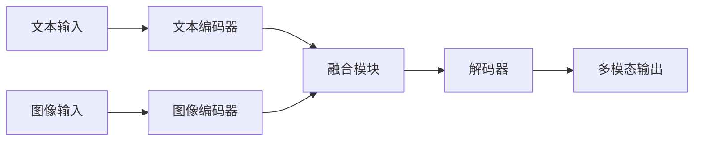
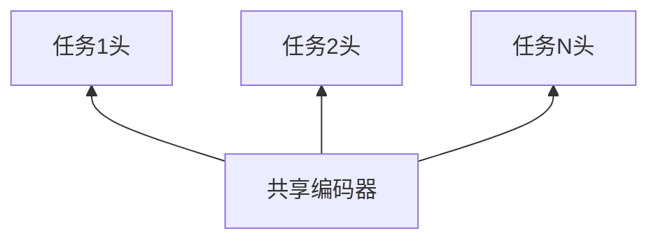

# 多模态大模型：技术原理与实战 OpenAI一鸣惊人带来的启示

## 1. 背景介绍

### 1.1 人工智能的发展历程

人工智能(Artificial Intelligence, AI)是当代科技发展的核心领域之一。自上世纪50年代AI概念被正式提出以来,经历了几个重要的发展阶段。

- **早期阶段(1950s-1960s)**: 专家系统和符号主义占主导地位,主要关注逻辑推理和知识表示。
- **知识革命(1980s-1990s)**: 涌现出机器学习、神经网络等新兴技术,为数据驱动的AI奠定基础。
- **深度学习时代(2010s-)**: 算力飞速提升,大数据时代到来,深度学习在计算机视觉、自然语言处理等领域取得突破性进展。

### 1.2 大模型的兴起

近年来,AI模型规模和能力不断扩大,催生了"大模型"(Large Model)的概念。大模型通过增加模型参数和训练数据规模,在多个任务上展现出惊人的表现。其中,自然语言处理(NLP)领域的大模型尤为引人注目,如GPT-3、BERT等。

### 1.3 多模态AI的挑战

尽管大模型取得了长足进步,但仍然面临重大挑战。现实世界是多模态的,人类不仅依赖文本,还需要图像、视频、语音等多种信息源。如何让AI系统能够像人类一样,融合多模态信息进行推理和决策,成为AI发展的新趋势和难题。

## 2. 核心概念与联系

### 2.1 什么是多模态大模型?

多模态大模型(Multimodal Large Model)是指能够同时处理多种模态输入(如文本、图像、视频等),并在多个任务上表现出色的大规模AI模型。它们通过统一的架构,将不同模态的信息融合,实现跨模态的理解和生成能力。



### 2.2 多模态大模型的优势

相较于单一模态模型,多模态大模型具有以下优势:

1. **信息融合**: 能够整合多源异构信息,提高理解和决策能力。
2. **泛化能力**: 在多个任务上表现出色,具有更强的泛化能力。
3. **数据高效利用**: 通过模态间的知识迁移,提高数据利用效率。
4. **多场景应用**: 适用于需要融合多模态信息的复杂场景。

### 2.3 多模态大模型的挑战

尽管前景广阔,多模态大模型也面临着诸多挑战:

1. **模态差异性**: 不同模态数据的表示形式和统计特性存在差异,增加了融合难度。
2. **计算复杂度**: 同时处理多模态输入,模型规模和计算量呈指数级增长。
3. **数据稀缺性**: 高质量的大规模多模态数据集仍然匮乏。
4. **可解释性**: 模型复杂化导致决策过程缺乏透明度和可解释性。
5. **鲁棒性**: 模型对噪声和对抗样本的鲁棒性有待提高。

## 3. 核心算法原理具体操作步骤

### 3.1 多模态表示学习

多模态表示学习是多模态大模型的核心,旨在学习一种统一的表示空间,将不同模态的输入映射到同一语义空间中。常见的方法包括:

1. **早融合**: 在输入层级将不同模态的特征拼接,然后送入后续模型。
2. **晚融合**: 分别对每种模态进行编码,在高层对编码特征进行融合。
3. **编码-解码**: 使用编码器对各模态进行编码,解码器从融合后的语义空间生成目标输出。



### 3.2 注意力机制

注意力机制是多模态大模型的关键技术,能够自适应地分配不同模态和位置的权重,捕捉输入间的长程依赖关系。

1. **自注意力**: 在单一模态内计算元素间的注意力权重。
2. **跨注意力**: 计算不同模态元素间的注意力权重,实现模态间的信息交互。
3. **层级注意力**: 在不同层级(如词级、句级等)计算注意力,获取全局和局部信息。

$$
\mathrm{Attention}(Q, K, V) = \mathrm{softmax}(\frac{QK^T}{\sqrt{d_k}})V
$$

其中 $Q$ 为查询(Query)、$K$ 为键(Key)、$V$ 为值(Value),$d_k$ 为缩放因子。

### 3.3 多任务学习

多任务学习是多模态大模型的常用范式,通过在多个相关任务上同时学习,提高模型的泛化能力和数据利用效率。

1. **硬参数共享**: 在底层网络中共享大部分参数,高层特定于每个任务。
2. **软参数共享**: 通过正则化约束参数,使不同任务的参数值相近但不完全相同。
3. **进化策略**: 根据任务关系动态调整参数共享策略。



### 3.4 对比学习

对比学习是一种有监督和无监督相结合的学习范式,通过最大化正例对的相似度,最小化负例对的相似度,学习出有区分能力的表示。在多模态大模型中,对比学习可以增强模态间的相关性建模。

1. **示例级对比**: 将整个输入对作为正/负例对进行对比。
2. **元素级对比**: 在输入元素(如词、像素块等)级别进行对比。
3. **层级对比**: 在不同网络层级对中间表示进行对比。

## 4. 数学模型和公式详细讲解举例说明

### 4.1 Vision Transformer

Vision Transformer(ViT)是将Transformer直接应用于计算机视觉任务的开创性工作。它将图像分割为若干patches(图像块),将每个patch线性映射为一个向量,作为Transformer的输入。

$$
z_0 = [x_{class}; x_p^1 \mathbf{E}; x_p^2 \mathbf{E}; ...; x_p^N \mathbf{E}] + \mathbf{E}_{pos}
$$

其中 $x_{class}$ 为学习的图像表示, $x_p^i$ 为第 $i$ 个patch的线性映射, $\mathbf{E}$ 为可学习的映射矩阵, $\mathbf{E}_{pos}$ 为位置嵌入。

ViT的出色表现证明了,Self-Attention有能力直接从原始数据中学习出有意义的表示,为视觉任务开辟了新的模型范式。

### 4.2 BERT

BERT(Bidirectional Encoder Representations from Transformers)是一种基于Transformer的预训练语言模型,通过Masked Language Model和Next Sentence Prediction两个预训练任务,学习双向的上下文表示。

在微调阶段,BERT可以轻松地转移到各种自然语言处理任务上,大幅提升了性能。BERT的出现标志着NLP进入了"大模型"时代。

### 4.3 Multimodal Transformer

Multimodal Transformer将Transformer推广到了多模态场景,能够同时处理文本、图像等多种模态输入。其核心思想是:

1. 使用独立的编码器分别对每种模态进行编码。
2. 通过跨模态注意力机制,在编码器之间实现信息交互。
3. 解码器从融合后的语义空间生成目标输出。

Multimodal Transformer为多模态大模型提供了基础架构,并在众多任务上取得了优异表现。

## 5. 项目实践:代码实例和详细解释说明

以下是一个简化的PyTorch实现,展示了Multimodal Transformer的核心思想:

```python
import torch
import torch.nn as nn

# 文本编码器
class TextEncoder(nn.Module):
    def __init__(self, vocab_size, d_model, n_heads, n_layers):
        super().__init__()
        self.embedding = nn.Embedding(vocab_size, d_model)
        self.encoder = nn.TransformerEncoder(nn.TransformerEncoderLayer(d_model, n_heads), n_layers)
        
    def forward(self, text):
        x = self.embedding(text)
        x = self.encoder(x)
        return x

# 图像编码器
class ImageEncoder(nn.Module):
    def __init__(self, d_model, n_heads, n_layers):
        super().__init__()
        self.encoder = nn.TransformerEncoder(nn.TransformerEncoderLayer(d_model, n_heads), n_layers)
        
    def forward(self, image):
        x = image # 假设图像已经被预处理为向量序列
        x = self.encoder(x)
        return x
        
# 多模态Transformer
class MultimodalTransformer(nn.Module):
    def __init__(self, text_encoder, image_encoder, d_model, n_heads, n_layers):
        super().__init__()
        self.text_encoder = text_encoder
        self.image_encoder = image_encoder
        self.decoder = nn.TransformerDecoder(nn.TransformerDecoderLayer(d_model, n_heads), n_layers)
        
    def forward(self, text, image):
        text_encoding = self.text_encoder(text)
        image_encoding = self.image_encoder(image)
        
        # 跨模态注意力
        x = torch.cat([text_encoding, image_encoding], dim=1)
        output = self.decoder(x, x)
        
        return output
```

在这个示例中:

1. `TextEncoder`和`ImageEncoder`分别对文本和图像进行编码。
2. `MultimodalTransformer`将两个编码器的输出拼接,通过`TransformerDecoder`进行跨模态融合和解码。
3. 注意,这只是一个简化的示例,实际应用中需要进一步处理和优化。

## 6. 实际应用场景

多模态大模型在诸多领域展现出巨大的应用潜力:

1. **视觉问答**: 根据图像和问题,生成自然语言回答。
2. **图文生成**: 根据文本描述生成相应的图像,或根据图像生成文本描述。
3. **多模态检索**: 跨模态检索相关的文本、图像等信息。
4. **智能助手**: 融合视觉、语音、文本等多模态信息,提供智能化交互服务。
5. **机器人控制**: 机器人需要同时处理视觉、语音、动作等多模态信息。
6. **多媒体分析**: 对视频、图文等多媒体内容进行语义理解和分析。

## 7. 工具和资源推荐

以下是一些与多模态大模型相关的工具和资源:

1. **PyTorch**和**TensorFlow**: 两大主流深度学习框架,支持多模态模型的构建。
2. **Hugging Face Transformers**: 提供了多种预训练Transformer模型,包括BERT、ViT等。
3. **MultiBench**: 一个多模态大模型的评测基准,涵盖多个数据集和任务。
4. **LAION**: 一个包含超过50亿张图像-文本对的大规模多模态数据集。
5. **OpenAI CLIP**: 一个基于对比学习的多模态视觉语言模型。
6. **Multimodal Neurons**: 一个开源的多模态神经网络库。

## 8. 总结:未来发展趋势与挑战

多模态大模型正在推动人工智能向更加通用化和人性化的方向发展。未来,我们可以期待:

1. **模型规模继续扩大**: 参数规模和训练数据量将进一步增长,模型能力不断提升。
2. **新型架构和学习范式**: 探索更高效、可解释、鲁棒的模型架构和学习范式。
3. **多模态融合的深度融合**: 实现模态间的深度交互和知识迁移。
4. **模态扩展**: 除了视觉和语言,将更多模态(如触觉、嗅觉等)融入模型中。
5. **应用落地**: 多模态