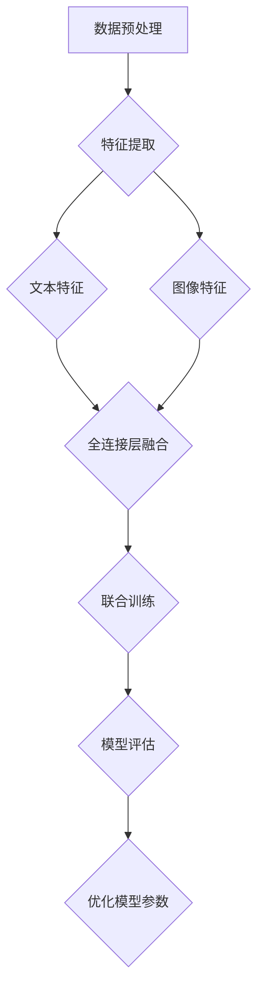

## 背景介绍

随着大数据时代的到来，数据处理和分析能力成为了衡量企业竞争力的关键因素之一。其中，多模态数据处理能力尤为关键，它涵盖了文本、图像、音频、视频等多种形式的数据。多模态大模型作为这一领域的前沿技术，正逐渐成为研究热点。本文旨在探讨多模态大模型的核心概念、算法原理、数学模型、实际应用以及未来发展趋势，同时提供实战指南，帮助读者深入了解并掌握多模态大模型的理论与实践。

## 核心概念与联系

多模态大模型主要指的是能够同时处理多种类型数据的大规模机器学习模型。这些模型融合了自然语言处理（NLP）、计算机视觉（CV）等不同领域的知识，旨在解决跨模态信息融合的问题。多模态大模型通过构建端到端的联合表示学习框架，使得模型能够有效地捕捉不同模态之间的语义关联，从而提高综合决策能力和预测精度。

### 联系与融合

多模态大模型通常通过以下几种方式实现模态间的联系与融合：

- **特征融合**：将不同模态的数据转换为统一的表示空间，通过加权或融合操作将其结合在一起。
- **注意力机制**：引入模态间注意力机制，动态调整不同模态信息的权重，增强模型对关键信息的敏感度。
- **联合训练**：采用多模态数据共同训练模型，优化模态间的交互和信息传递。

## 核心算法原理具体操作步骤

### 自然语言处理与计算机视觉融合

多模态大模型中的核心算法通常包括以下步骤：

1. **数据预处理**：对多模态数据进行清洗、标注和归一化，确保数据质量。
2. **模态特征提取**：利用特定的模型（如BERT、ResNet等）提取文本和图像的特征向量。
3. **特征融合**：通过全连接层、注意力机制或特定融合函数将文本和图像特征进行融合。
4. **联合训练**：将融合后的特征输入到一个统一的深度学习模型中，进行联合训练，优化模型参数以适应多模态数据的学习需求。
5. **模型评估与优化**：通过交叉验证、AUC、F1分数等指标评估模型性能，并进行调优。

### 示例流程图：



## 数学模型和公式详细讲解举例说明

多模态大模型的数学模型通常基于深度学习框架，以下是一个简单的多模态融合模型的数学描述：

设 $X$ 表示文本特征矩阵，$Y$ 表示图像特征矩阵，则融合后的特征矩阵 $Z$ 可以通过以下方式得到：

$$
Z = \\text{Concat}(X, Y)
$$

其中，$\\text{Concat}$ 表示特征拼接操作。对于文本和图像特征的融合，我们引入注意力机制来加权融合：

$$
\\text{Attention}(X, Y) = \\text{Softmax}\\left(\\frac{\\text{Attention\\_Score}(X, Y)}{\\sqrt{d}}\\right) \\cdot X + \\text{Softmax}\\left(\\frac{\\text{Attention\\_Score}(X, Y)}{\\sqrt{d}}\\right) \\cdot Y
$$

其中，$\\text{Attention\\_Score}(X, Y)$ 是用于计算文本和图像特征之间注意力权重的得分函数，$d$ 是特征向量的维度。

## 项目实践：代码实例和详细解释说明

为了更好地理解多模态大模型的实际操作，这里提供一个基于PyTorch的简单示例：

```python
import torch
from torchvision.models import resnet50
from transformers import BertModel

# 加载预训练模型
text_model = BertModel.from_pretrained('bert-base-uncased')
image_model = resnet50(pretrained=True)

def multimodal_model(text_input, image_input):
    text_output = text_model(text_input)[0]
    image_output = image_model(image_input)
    
    # 进行特征融合
    combined_features = torch.cat([text_output, image_output], dim=1)
    
    # 添加额外的处理逻辑，如添加全连接层、应用注意力机制等
    
    return combined_features

# 示例输入数据
text_input = torch.randn(1, 128)  # 假设文本输入为 [batch_size, sequence_length]
image_input = torch.randn(1, 2048)  # 假设图像输入为 [batch_size, feature_dim]

# 调用模型
output = multimodal_model(text_input, image_input)
print(output.shape)
```

## 实际应用场景

多模态大模型广泛应用于以下领域：

- **智能推荐系统**：结合用户行为、商品图片和文字描述，提供个性化推荐。
- **医疗影像诊断**：结合病理报告和医学影像，提高诊断准确率。
- **自动驾驶**：融合雷达、摄像头和地图信息，提升决策安全性。
- **情感分析**：结合文本和语音信息，提供更全面的情感理解。

## 工具和资源推荐

- **深度学习框架**：TensorFlow、PyTorch、PaddlePaddle等。
- **预训练模型库**：Hugging Face、Microsoft Azure AI、Google TensorFlow Hub等。
- **在线教程和文档**：Kaggle、GitHub、官方文档等。

## 总结：未来发展趋势与挑战

多模态大模型的发展趋势包括更深层次的融合、更加精细的模态间关系建模以及针对特定领域定制化的模型开发。同时，面临的主要挑战包括：

- **数据集不平衡**：多模态数据集往往难以获取且存在不平衡问题。
- **计算资源限制**：处理大量多模态数据需要强大的计算能力。
- **解释性问题**：如何解释模型决策过程中的模态融合逻辑是亟待解决的问题。

## 附录：常见问题与解答

Q: 如何选择合适的模态融合策略？
A: 选择模态融合策略应基于数据特性、任务需求和模型性能。常用的策略包括特征拼接、加权融合和注意力机制，具体选择需通过实验比较来确定。

Q: 多模态大模型是否适用于所有场景？
A: 不一定。多模态大模型在特定领域和任务上表现优秀，但在数据稀疏、模态间关系不明确的情况下可能效果不佳。场景选择需根据具体需求和数据特性来判断。

Q: 如何平衡模型复杂性和计算效率？
A: 通过模型剪枝、量化、并行计算和硬件加速技术来优化模型，同时利用迁移学习和预训练模型减少从头训练的时间和资源消耗。

---

作者：禅与计算机程序设计艺术 / Zen and the Art of Computer Programming