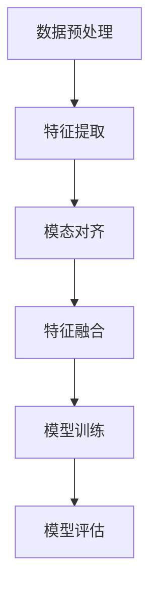

# 多模态大模型：技术原理与实战 方法论介绍

## 1.背景介绍

在人工智能领域，多模态大模型（Multimodal Large Models, MLMs）正逐渐成为研究和应用的热点。多模态大模型是指能够处理和理解多种类型数据（如文本、图像、音频等）的模型。这些模型通过融合不同模态的数据，能够实现更为复杂和智能的任务，如图像描述生成、视频理解、跨模态检索等。

随着深度学习技术的发展，单一模态的模型已经在许多任务中取得了显著的成果。然而，现实世界中的信息往往是多模态的，单一模态的模型难以充分理解和利用这些信息。因此，多模态大模型应运而生，通过融合多种模态的数据，提升模型的理解和生成能力。

## 2.核心概念与联系

### 2.1 多模态数据

多模态数据是指来自不同来源或具有不同特征的数据类型。常见的模态包括：

- **文本**：自然语言文本，如新闻文章、社交媒体帖子等。
- **图像**：静态图片，如照片、绘画等。
- **音频**：声音数据，如语音、音乐等。
- **视频**：动态影像数据，包含图像和音频。

### 2.2 多模态学习

多模态学习是指通过融合多种模态的数据来训练模型，以提升模型的性能和泛化能力。多模态学习的核心在于如何有效地表示和融合不同模态的数据。

### 2.3 多模态大模型

多模态大模型是指具有大规模参数和复杂结构的多模态模型。这些模型通常基于深度学习技术，能够处理和理解大规模的多模态数据。多模态大模型的训练通常需要大量的计算资源和数据。

### 2.4 模态间联系

多模态大模型的一个关键挑战是如何建立和利用不同模态之间的联系。常见的方法包括：

- **对齐**：将不同模态的数据对齐到同一时间或空间维度。
- **融合**：将不同模态的数据融合到同一表示空间。
- **转换**：将一种模态的数据转换为另一种模态的数据。

## 3.核心算法原理具体操作步骤

### 3.1 数据预处理

数据预处理是多模态大模型训练的第一步。不同模态的数据需要进行不同的预处理操作，如文本的分词和编码，图像的归一化和增强，音频的特征提取等。

### 3.2 特征提取

特征提取是指从原始数据中提取出有用的特征表示。常见的方法包括卷积神经网络（CNN）用于图像特征提取，循环神经网络（RNN）或变换器（Transformer）用于文本和音频特征提取。

### 3.3 模态对齐

模态对齐是指将不同模态的数据对齐到同一时间或空间维度。常见的方法包括基于时间戳的对齐、基于空间位置的对齐等。

### 3.4 特征融合

特征融合是指将不同模态的特征表示融合到同一表示空间。常见的方法包括：

- **拼接**：将不同模态的特征向量拼接在一起。
- **加权平均**：对不同模态的特征向量进行加权平均。
- **注意力机制**：通过注意力机制对不同模态的特征进行加权融合。

### 3.5 模型训练

模型训练是指通过优化算法对多模态大模型的参数进行调整，以最小化损失函数。常见的优化算法包括随机梯度下降（SGD）、Adam等。

### 3.6 模型评估

模型评估是指通过评估指标对多模态大模型的性能进行评估。常见的评估指标包括准确率、精确率、召回率、F1值等。



## 4.数学模型和公式详细讲解举例说明

### 4.1 特征提取

假设我们有一个图像 $I$ 和一个文本 $T$，我们可以使用卷积神经网络（CNN）提取图像特征 $f_I$，使用变换器（Transformer）提取文本特征 $f_T$。具体公式如下：

$$
f_I = CNN(I)
$$

$$
f_T = Transformer(T)
$$

### 4.2 特征融合

我们可以将图像特征 $f_I$ 和文本特征 $f_T$ 进行拼接，得到融合特征 $f_{fusion}$：

$$
f_{fusion} = [f_I; f_T]
$$

其中，$[;]$ 表示向量拼接操作。

### 4.3 模型训练

假设我们有一个多模态大模型 $M$，其输入为融合特征 $f_{fusion}$，输出为预测结果 $\hat{y}$。我们可以通过最小化损失函数 $L$ 来训练模型 $M$：

$$
\hat{y} = M(f_{fusion})
$$

$$
L = \frac{1}{N} \sum_{i=1}^{N} \ell(\hat{y}_i, y_i)
$$

其中，$N$ 为样本数量，$\ell$ 为损失函数，$y_i$ 为真实标签。

## 5.项目实践：代码实例和详细解释说明

### 5.1 数据预处理

```python
import torch
from transformers import BertTokenizer, BertModel
from torchvision import transforms
from PIL import Image

# 文本预处理
tokenizer = BertTokenizer.from_pretrained('bert-base-uncased')
text = "This is a sample text."
inputs = tokenizer(text, return_tensors='pt')

# 图像预处理
image = Image.open('sample.jpg')
transform = transforms.Compose([
    transforms.Resize((224, 224)),
    transforms.ToTensor(),
    transforms.Normalize(mean=[0.485, 0.456, 0.406], std=[0.229, 0.224, 0.225]),
])
image = transform(image).unsqueeze(0)
```

### 5.2 特征提取

```python
# 文本特征提取
model = BertModel.from_pretrained('bert-base-uncased')
text_features = model(**inputs).last_hidden_state

# 图像特征提取
import torchvision.models as models
resnet = models.resnet50(pretrained=True)
image_features = resnet(image)
```

### 5.3 特征融合

```python
# 特征拼接
fusion_features = torch.cat((text_features, image_features), dim=1)
```

### 5.4 模型训练

```python
import torch.nn as nn
import torch.optim as optim

# 定义多模态模型
class MultimodalModel(nn.Module):
    def __init__(self):
        super(MultimodalModel, self).__init__()
        self.fc = nn.Linear(fusion_features.size(1), 1)
    
    def forward(self, x):
        return self.fc(x)

model = MultimodalModel()
criterion = nn.BCEWithLogitsLoss()
optimizer = optim.Adam(model.parameters(), lr=0.001)

# 训练模型
for epoch in range(10):
    optimizer.zero_grad()
    outputs = model(fusion_features)
    loss = criterion(outputs, labels)
    loss.backward()
    optimizer.step()
```

### 5.5 模型评估

```python
# 评估模型
model.eval()
with torch.no_grad():
    outputs = model(fusion_features)
    predictions = torch.sigmoid(outputs).round()
    accuracy = (predictions == labels).float().mean()
    print(f'Accuracy: {accuracy.item()}')
```

## 6.实际应用场景

### 6.1 图像描述生成

多模态大模型可以用于图像描述生成，即根据图像生成相应的文本描述。这在自动驾驶、智能监控等领域有广泛的应用。

### 6.2 视频理解

多模态大模型可以用于视频理解，即根据视频内容进行分类、检索等操作。这在视频推荐、视频监控等领域有广泛的应用。

### 6.3 跨模态检索

多模态大模型可以用于跨模态检索，即根据一种模态的数据检索另一种模态的数据。这在图像搜索、视频搜索等领域有广泛的应用。

### 6.4 多模态情感分析

多模态大模型可以用于多模态情感分析，即根据文本、图像、音频等多种模态的数据进行情感分析。这在社交媒体分析、客户反馈分析等领域有广泛的应用。

## 7.工具和资源推荐

### 7.1 工具

- **PyTorch**：一个流行的深度学习框架，支持多模态大模型的开发和训练。
- **Transformers**：一个用于自然语言处理的库，提供了多种预训练的变换器模型。
- **OpenCV**：一个用于计算机视觉的库，提供了丰富的图像处理功能。

### 7.2 资源

- **ImageNet**：一个大规模的图像数据集，常用于图像特征提取模型的训练。
- **COCO**：一个大规模的图像数据集，包含图像和相应的文本描述，常用于图像描述生成任务。
- **LibriSpeech**：一个大规模的语音数据集，常用于语音特征提取模型的训练。

## 8.总结：未来发展趋势与挑战

### 8.1 未来发展趋势

- **更大规模的模型**：随着计算资源的增加和数据量的增长，多模态大模型的规模将继续扩大，性能也将不断提升。
- **更高效的训练方法**：研究人员将继续探索更高效的训练方法，以减少训练时间和资源消耗。
- **更广泛的应用场景**：多模态大模型将在更多的应用场景中发挥作用，如医疗诊断、智能家居等。

### 8.2 挑战

- **数据标注**：多模态数据的标注成本高，如何高效地获取和标注多模态数据是一个重要挑战。
- **模型解释性**：多模态大模型的结构复杂，如何提高模型的解释性和可解释性是一个重要挑战。
- **计算资源**：多模态大模型的训练需要大量的计算资源，如何高效地利用计算资源是一个重要挑战。

## 9.附录：常见问题与解答

### 9.1 什么是多模态大模型？

多模态大模型是指能够处理和理解多种类型数据（如文本、图像、音频等）的模型。通过融合不同模态的数据，多模态大模型能够实现更为复杂和智能的任务。

### 9.2 多模态大模型的应用场景有哪些？

多模态大模型的应用场景包括图像描述生成、视频理解、跨模态检索、多模态情感分析等。

### 9.3 如何训练多模态大模型？

训练多模态大模型的步骤包括数据预处理、特征提取、模态对齐、特征融合、模型训练和模型评估。

### 9.4 多模态大模型的未来发展趋势是什么？

多模态大模型的未来发展趋势包括更大规模的模型、更高效的训练方法和更广泛的应用场景。

### 9.5 多模态大模型面临哪些挑战？

多模态大模型面临的挑战包括数据标注、模型解释性和计算资源等。

---

作者：禅与计算机程序设计艺术 / Zen and the Art of Computer Programming