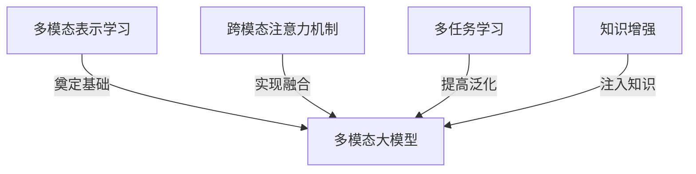

# 多模态大模型：技术原理与实战 智能客服

## 1.背景介绍

### 1.1 人工智能的发展历程

人工智能(Artificial Intelligence, AI)是当代科技发展的重要领域,旨在使机器具备类似于人类的认知能力,如学习、推理、规划、语言交互等。AI的发展经历了几个重要阶段:

- 1950年代:AI的概念正式提出,专家系统和机器学习理论奠基。
- 1980年代:神经网络和机器学习算法取得突破。
- 2010年后:深度学习技术兴起,推动AI进入新的发展时期。

### 1.2 大模型的兴起

随着算力和数据量的不断增长,大规模预训练语言模型(Large Pre-trained Language Models)开始崭露头角。这些模型通过在海量无标注数据上预训练,获得了强大的语义理解和生成能力,在自然语言处理等领域取得了突破性进展。

代表性模型包括GPT-3、BERT、T5等,其中GPT-3具有惊人的1750亿参数规模,展现出通用的语言理解和生成能力。然而,这些单模态模型仍然局限于文本数据,无法直接处理图像、视频等多模态数据。

### 1.3 多模态大模型的兴起

为了解决单模态局限性,多模态大模型(Multimodal Large Models)应运而生。这些模型能够同时处理文本、图像、视频、音频等多种模态数据,实现跨模态的理解、推理和生成,被视为AI发展的新前沿。

代表性多模态模型包括DALL-E、Flamingo、Gato等,其中Gato更是集成了视觉、语言、对话、强化学习等多种能力,展现出通用人工智能(Artificial General Intelligence, AGI)的潜力。多模态大模型在智能客服等领域具有广阔的应用前景。

## 2.核心概念与联系

多模态大模型涉及多个核心概念,这些概念相互关联、环环相扣。

### 2.1 多模态表示学习

多模态表示学习(Multimodal Representation Learning)旨在从多种模态数据中学习统一的表示空间,使不同模态的数据可以在同一语义空间中进行计算和推理。这是多模态模型的核心基础。

常用的多模态表示学习方法包括:

- 对齐模型(Alignment Models):通过对齐不同模态的特征,学习跨模态的对应关系。
- 融合模型(Fusion Models):将不同模态的特征融合到统一的表示空间中。
- 编码器-解码器模型(Encoder-Decoder Models):使用共享编码器对多模态数据编码,解码器根据任务生成相应模态输出。

### 2.2 跨模态注意力机制

注意力机制(Attention Mechanism)是深度学习中的关键技术,能够自适应地捕获输入数据中的重要信息。在多模态领域,跨模态注意力机制(Cross-Modal Attention)则允许模型在不同模态之间建立关联,实现有效的跨模态融合和推理。

常见的跨模态注意力机制包括:

- 共享注意力(Shared Attention):不同模态共享同一注意力机制。
- 模态特定注意力(Modality-Specific Attention):每个模态使用独立的注意力机制。
- 交互式注意力(Interactive Attention):不同模态之间的注意力机制相互作用。

### 2.3 多任务学习

多任务学习(Multi-Task Learning)是指在同一模型中同时学习多个相关任务,以提高模型的泛化能力和效率。在多模态大模型中,通过在不同模态和任务之间共享知识,可以提高模型的性能和鲁棒性。

常见的多任务学习策略包括:

- 硬参数共享(Hard Parameter Sharing):不同任务共享部分或全部模型参数。
- 软参数共享(Soft Parameter Sharing):通过正则化约束,使不同任务的参数保持相似性。
- 多头注意力(Multi-Head Attention):不同任务使用独立的注意力头,实现软参数共享。

### 2.4 知识增强

由于预训练数据的局限性,大模型可能缺乏某些领域的知识。知识增强(Knowledge Enhancement)技术旨在通过外部知识库或结构化数据,为大模型注入额外的知识,提高其在特定领域的表现。

常见的知识增强方法包括:

- 知识蒸馏(Knowledge Distillation):从专家模型中蒸馏知识,传递给大模型。
- 知识注入(Knowledge Injection):直接将结构化知识注入大模型的参数或表示空间。
- 知识检索(Knowledge Retrieval):在推理时,从外部知识库中检索相关知识,辅助大模型的决策。

### 2.5 核心概念关联

上述核心概念相互关联、环环相扣,共同构建了多模态大模型的技术框架:

- 多模态表示学习为多模态融合奠定基础;
- 跨模态注意力机制实现了有效的多模态融合;
- 多任务学习提高了模型的泛化能力和效率;
- 知识增强技术为大模型注入了额外的知识,弥补了预训练数据的不足。

这些概念和技术的有机结合,使得多模态大模型能够展现出强大的多模态理解、推理和生成能力,为智能客服等应用场景提供了有力支撑。

## 3.核心算法原理具体操作步骤

### 3.1 多模态表示学习算法

多模态表示学习算法旨在从多种模态数据中学习统一的表示空间,使不同模态的数据可以在同一语义空间中进行计算和推理。常见的算法包括:

1. **对齐模型(Alignment Models)**

对齐模型通过对齐不同模态的特征,学习跨模态的对应关系。典型的对齐模型包括:

- **双编码器模型(Dual Encoder Model)**:使用两个独立的编码器分别对视觉和文本数据编码,然后通过对比损失函数(Contrastive Loss)最小化正例对的距离,最大化负例对的距离,实现跨模态对齐。

2. **融合模型(Fusion Models)**

融合模型将不同模态的特征融合到统一的表示空间中。常见的融合模型包括:

- **早期融合(Early Fusion)**:在输入层将不同模态的特征拼接,然后送入单一编码器进行融合。
- **晚期融合(Late Fusion)**:使用独立的编码器分别对每个模态编码,然后在高层将不同模态的表示进行融合。
- **层次融合(Hierarchical Fusion)**:在不同层次上进行多阶段的融合,实现渐进式的多模态融合。

3. **编码器-解码器模型(Encoder-Decoder Models)**

编码器-解码器模型使用共享编码器对多模态数据编码,解码器根据任务生成相应模态输出。典型的模型包括:

- **Transformer模型**:使用自注意力机制捕获输入序列中的长程依赖关系,实现高效的序列到序列建模。
- **Vision Transformer**:将Transformer应用于计算机视觉任务,通过自注意力机制对图像进行编码。

### 3.2 跨模态注意力机制算法

跨模态注意力机制允许模型在不同模态之间建立关联,实现有效的跨模态融合和推理。常见的算法包括:

1. **共享注意力(Shared Attention)**

不同模态共享同一注意力机制,通过对所有模态的特征进行自注意力计算,实现跨模态融合。这种方式计算简单,但可能无法充分捕获各模态的独特特征。

2. **模态特定注意力(Modality-Specific Attention)**

每个模态使用独立的注意力机制,分别对各模态的特征进行自注意力计算,然后通过跨模态融合机制(如门控融合、加权求和等)将不同模态的表示进行融合。这种方式可以更好地捕获各模态的独特特征,但计算开销较大。

3. **交互式注意力(Interactive Attention)**

不同模态之间的注意力机制相互作用,实现更深层次的跨模态融合。典型的交互式注意力机制包括:

- **共现注意力(Co-Attention)**:视觉和文本模态的注意力机制相互引导,实现双向交互。
- **导向注意力(Guided Attention)**:使用一个模态的注意力权重引导另一模态的注意力计算。

### 3.3 多任务学习算法

多任务学习算法旨在在同一模型中同时学习多个相关任务,以提高模型的泛化能力和效率。常见的算法包括:

1. **硬参数共享(Hard Parameter Sharing)**

不同任务共享部分或全部模型参数,通过联合训练实现知识共享和迁移。典型的硬参数共享方法包括:

- **共享编码器(Shared Encoder)**:不同任务共享底层编码器,但使用独立的解码器和输出层。
- **共享主干网络(Shared Trunk Network)**:不同任务共享主干网络的参数,但在高层使用独立的分支进行特征提取和预测。

2. **软参数共享(Soft Parameter Sharing)**

通过正则化约束,使不同任务的参数保持相似性,实现软参数共享。常见的软参数共享方法包括:

- **多任务关系学习(Multi-Task Relationship Learning)**:通过建模任务之间的关系,学习任务相关性,并将其作为正则化项加入损失函数。
- **分层贝叶斯(Hierarchical Bayesian)**:将不同任务的参数视为由共享先验分布生成,通过贝叶斯推断实现软参数共享。

3. **多头注意力(Multi-Head Attention)**

不同任务使用独立的注意力头,实现软参数共享。多头注意力机制允许模型从不同的表示子空间中捕获不同的特征,提高了模型的表示能力和泛化性。

### 3.4 知识增强算法

知识增强算法旨在通过外部知识库或结构化数据,为大模型注入额外的知识,提高其在特定领域的表现。常见的算法包括:

1. **知识蒸馏(Knowledge Distillation)**

从专家模型中蒸馏知识,传递给大模型。典型的知识蒸馏方法包括:

- **响应蒸馏(Response Distillation)**:使用专家模型的输出作为软标签,指导大模型的训练。
- **特征蒸馏(Feature Distillation)**:将专家模型的中间层特征作为知识,传递给大模型的对应层。

2. **知识注入(Knowledge Injection)**

直接将结构化知识注入大模型的参数或表示空间。常见的知识注入方法包括:

- **实体表示注入(Entity Representation Injection)**:将实体的结构化知识表示注入模型的embeddings或参数中。
- **知识图谱注入(Knowledge Graph Injection)**:将知识图谱的结构化信息注入模型的参数或表示空间。

3. **知识检索(Knowledge Retrieval)**

在推理时,从外部知识库中检索相关知识,辅助大模型的决策。典型的知识检索方法包括:

- **基于检索的方法(Retrieval-Based Methods)**:通过检索相关的文本片段或知识三元组,作为辅助信息输入模型。
- **记忆增强方法(Memory-Augmented Methods)**:使用外部记忆模块存储知识,模型可以读写该记忆模块以获取和更新知识。

通过上述算法,多模态大模型可以有效地学习多模态表示、融合不同模态信息、共享知识和任务,并从外部知识源获取补充知识,从而展现出强大的多模态理解、推理和生成能力。

## 4.数学模型和公式详细讲解举例说明

### 4.1 多模态表示学习

#### 4.1.1 对齐模型

对齐模型通过对比损失函数(Contrastive Loss)最小化正例对的距离,最大化负例对的距离,实现跨模态对齐。

对于一个视觉-文本对 $(v, t)$,其对比损失函数可表示为:

$$\mathcal{L}_{contrast}(v, t) = -\log\frac{e^{s(v,