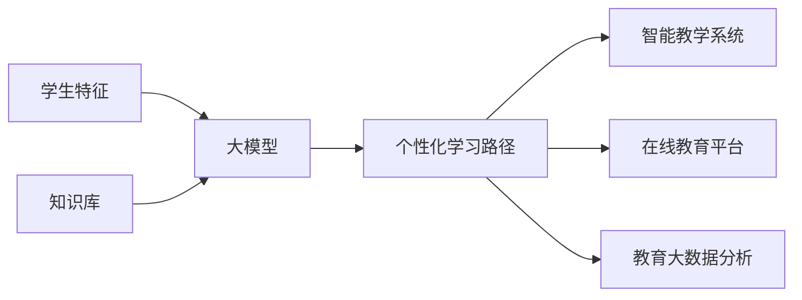

# 大模型在教育中的应用：个性化学习路径

## 1. 背景介绍
### 1.1 教育领域的挑战
#### 1.1.1 传统教学模式的局限性
#### 1.1.2 学生个体差异的忽视
#### 1.1.3 教育资源分配不均衡

### 1.2 人工智能在教育中的应用现状
#### 1.2.1 智能教学系统的发展
#### 1.2.2 自适应学习平台的兴起
#### 1.2.3 大数据分析在教育中的应用

### 1.3 大模型技术的崛起
#### 1.3.1 大模型的定义和特点
#### 1.3.2 大模型在各领域的应用现状
#### 1.3.3 大模型在教育领域的潜力

## 2. 核心概念与联系
### 2.1 大模型的核心概念
#### 2.1.1 预训练模型
#### 2.1.2 迁移学习
#### 2.1.3 零样本学习

### 2.2 个性化学习的核心概念
#### 2.2.1 学习风格理论
#### 2.2.2 知识图谱
#### 2.2.3 学习路径优化

### 2.3 大模型与个性化学习的联系
#### 2.3.1 大模型在学生建模中的应用
#### 2.3.2 大模型在知识表示中的应用
#### 2.3.3 大模型在学习路径生成中的应用

## 3. 核心算法原理具体操作步骤
### 3.1 学生建模算法
#### 3.1.1 基于大模型的学生特征提取
#### 3.1.2 学生知识状态估计
#### 3.1.3 学习风格识别

### 3.2 知识表示算法
#### 3.2.1 知识图谱构建
#### 3.2.2 知识嵌入
#### 3.2.3 知识关联挖掘

### 3.3 学习路径生成算法
#### 3.3.1 基于强化学习的路径优化
#### 3.3.2 基于图神经网络的路径推荐
#### 3.3.3 多目标优化的学习路径生成

## 4. 数学模型和公式详细讲解举例说明
### 4.1 学生建模的数学模型
#### 4.1.1 知识追踪模型
$P(L_i=1|\mathbf{x}) = \sigma(\mathbf{w}^T\mathbf{x}+b)$

其中，$L_i$表示学生是否掌握了第$i$个知识点，$\mathbf{x}$为学生特征向量，$\mathbf{w}$和$b$为模型参数。

#### 4.1.2 学习风格分类模型
$$y = \arg\max_{k} P(C_k|\mathbf{x}) = \arg\max_{k} \frac{\exp(\mathbf{w}_k^T\mathbf{x}+b_k)}{\sum_{j=1}^K \exp(\mathbf{w}_j^T\mathbf{x}+b_j)}$$

其中，$C_k$表示第$k$种学习风格，$\mathbf{x}$为学生特征向量，$\mathbf{w}_k$和$b_k$为第$k$个分类器的参数。

### 4.2 知识表示的数学模型
#### 4.2.1 TransE模型
$$f_r(h,t) = \|\mathbf{h}+\mathbf{r}-\mathbf{t}\|_2^2$$

其中，$\mathbf{h}$、$\mathbf{r}$、$\mathbf{t}$分别表示头实体、关系和尾实体的嵌入向量。

#### 4.2.2 BERT模型
$$\mathbf{h}_i = \text{BERT}(\mathbf{x}_i)$$

其中，$\mathbf{x}_i$为第$i$个知识点的文本描述，$\mathbf{h}_i$为BERT模型输出的知识点嵌入向量。

### 4.3 学习路径生成的数学模型
#### 4.3.1 马尔可夫决策过程
$$V^{\pi}(s) = \mathbb{E}\left[\sum_{t=0}^{\infty} \gamma^t r_t | s_0=s, \pi\right]$$

其中，$V^{\pi}(s)$表示在状态$s$下执行策略$\pi$的期望累积奖励，$\gamma$为折扣因子，$r_t$为第$t$步获得的奖励。

#### 4.3.2 图神经网络
$$\mathbf{h}_i^{(l)} = \sigma\left(\sum_{j\in\mathcal{N}(i)} \alpha_{ij} \mathbf{W}^{(l)} \mathbf{h}_j^{(l-1)}\right)$$

其中，$\mathbf{h}_i^{(l)}$表示第$l$层第$i$个节点的特征向量，$\mathcal{N}(i)$为节点$i$的邻居节点集合，$\alpha_{ij}$为节点$i$和$j$之间的注意力权重，$\mathbf{W}^{(l)}$为第$l$层的权重矩阵。

## 5. 项目实践：代码实例和详细解释说明
### 5.1 学生建模模块
```python
import torch
import torch.nn as nn

class StudentModel(nn.Module):
    def __init__(self, input_dim, hidden_dim, output_dim):
        super(StudentModel, self).__init__()
        self.fc1 = nn.Linear(input_dim, hidden_dim)
        self.fc2 = nn.Linear(hidden_dim, output_dim)
        self.sigmoid = nn.Sigmoid()

    def forward(self, x):
        h = torch.relu(self.fc1(x))
        y = self.sigmoid(self.fc2(h))
        return y
```

上述代码定义了一个简单的学生建模神经网络，包含两个全连接层和一个Sigmoid激活函数。输入为学生特征向量，输出为知识点掌握概率。

### 5.2 知识表示模块
```python
import torch
import torch.nn as nn

class TransE(nn.Module):
    def __init__(self, num_entities, num_relations, embed_dim):
        super(TransE, self).__init__()
        self.entity_embed = nn.Embedding(num_entities, embed_dim)
        self.relation_embed = nn.Embedding(num_relations, embed_dim)

    def forward(self, triplets):
        h = self.entity_embed(triplets[:, 0])
        r = self.relation_embed(triplets[:, 1])
        t = self.entity_embed(triplets[:, 2])
        score = torch.norm(h + r - t, p=2, dim=1)
        return score
```

上述代码实现了TransE知识表示模型，包含实体嵌入和关系嵌入两个部分。输入为三元组(头实体,关系,尾实体)，输出为三元组的得分，得分越低表示三元组越合理。

### 5.3 学习路径生成模块
```python
import numpy as np

def value_iteration(env, gamma=0.9, theta=1e-8):
    V = np.zeros(env.nS)
    while True:
        delta = 0
        for s in range(env.nS):
            v = V[s]
            V[s] = max(q_from_v(env, V, s, gamma))
            delta = max(delta, abs(v - V[s]))
        if delta < theta:
            break
    policy = np.zeros([env.nS, env.nA])
    for s in range(env.nS):
        q_values = q_from_v(env, V, s, gamma)
        best_action = np.argmax(q_values)
        policy[s, best_action] = 1.0
    return policy, V
```

上述代码实现了值迭代算法，用于在马尔可夫决策过程中寻找最优策略。其中，`env`为环境对象，`gamma`为折扣因子，`theta`为收敛阈值。算法不断迭代更新状态价值函数`V`，直到收敛，然后根据`V`得到最优策略。

## 6. 实际应用场景
### 6.1 智能教学系统
#### 6.1.1 个性化课程推荐
#### 6.1.2 自适应练习生成
#### 6.1.3 实时反馈和指导

### 6.2 在线教育平台
#### 6.2.1 个性化学习路径规划
#### 6.2.2 智能学习助手
#### 6.2.3 学习效果评估与预测

### 6.3 教育大数据分析
#### 6.3.1 学生画像构建
#### 6.3.2 教学质量评估
#### 6.3.3 教育政策制定辅助

## 7. 工具和资源推荐
### 7.1 开源大模型
- BERT: https://github.com/google-research/bert
- GPT-3: https://github.com/openai/gpt-3
- T5: https://github.com/google-research/text-to-text-transfer-transformer

### 7.2 教育数据集
- ASSISTments: https://sites.google.com/site/assistmentsdata/
- Junyi Academy: https://www.junyiacademy.org/
- EdNet: https://github.com/riiid/ednet

### 7.3 相关开源项目
- Cognitive Tutor: https://github.com/CMUCTAT/CTAT
- Oppia: https://github.com/oppia/oppia
- RiPPLE: https://github.com/khangich/RiPPLE

## 8. 总结：未来发展趋势与挑战
### 8.1 个性化学习的发展趋势
#### 8.1.1 多模态学习数据融合
#### 8.1.2 跨领域知识迁移
#### 8.1.3 终身学习与持续优化

### 8.2 大模型应用的挑战
#### 8.2.1 数据隐私与安全
#### 8.2.2 模型解释性与可信度
#### 8.2.3 计算资源与部署成本

### 8.3 未来研究方向
#### 8.3.1 教育专用大模型的开发
#### 8.3.2 大模型与其他AI技术的结合
#### 8.3.3 个性化学习的评估标准与测试方法

## 9. 附录：常见问题与解答
### 9.1 大模型需要多少教育数据才能训练出好的效果？
大模型的训练需要大量高质量的教育数据，具体数量取决于模型的规模和任务的复杂度。一般来说，数据量越大，模型的性能就越好。但是也需要注意数据的质量和多样性，避免过拟合和偏差。

### 9.2 个性化学习路径生成需要考虑哪些因素？
个性化学习路径生成需要综合考虑学生的知识状态、学习风格、学习目标、认知水平等因素。同时还要考虑知识点之间的依赖关系、难度梯度、学习资源的多样性等。最终目标是为每个学生生成最优的学习路径，提高学习效率和学习体验。

### 9.3 如何评估个性化学习路径的效果？
评估个性化学习路径的效果需要设计科学的实验和评估指标。可以从学习效果、学习效率、学习体验等维度进行评估。常见的评估指标包括知识掌握度、学习时间、学习进度、学习满意度等。同时还可以与传统的教学方式进行对比，验证个性化学习的优越性。

### 9.4 大模型生成的个性化学习路径是否具有可解释性？
大模型生成的个性化学习路径可能缺乏可解释性，这是目前大模型面临的共同挑战。为了提高可解释性，可以考虑引入知识图谱、因果推理等技术，让模型生成的路径更加符合人类的直觉和逻辑。同时还可以设计人机交互机制，让教师和学生参与到路径生成和优化的过程中，提高路径的可解释性和可信度。

### 9.5 个性化学习路径能否适应学生的动态变化？
个性化学习路径需要能够适应学生的动态变化，包括知识状态的变化、学习风格的变化、学习目标的变化等。这需要模型能够持续学习和优化，根据学生的反馈和表现动态调整学习路径。同时还需要设计灵活的学习路径表示方式，能够快速响应学生的变化需求。



以上是利用大模型生成个性化学习路径的基本流程图。首先需要收集学生的特征信息和知识库数据，然后输入到大模型中进行训练和推理，生成个性化的学习路径。学习路径可以应用于智能教学系统、在线教育平台、教育大数据分析等场景，提供个性化的教学服务和决策支持。

未来，大模型在教育领域的应用还有