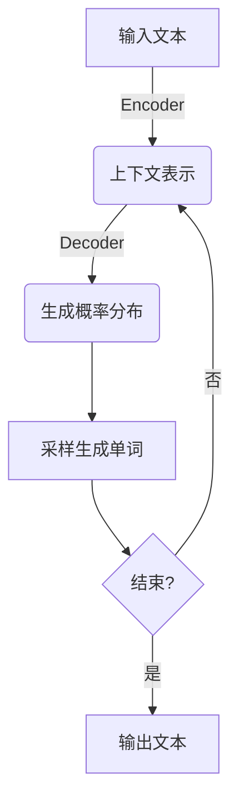
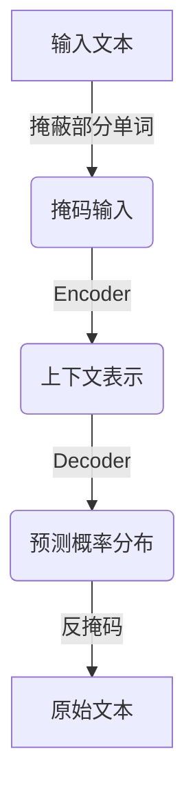
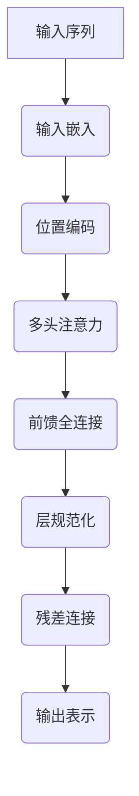
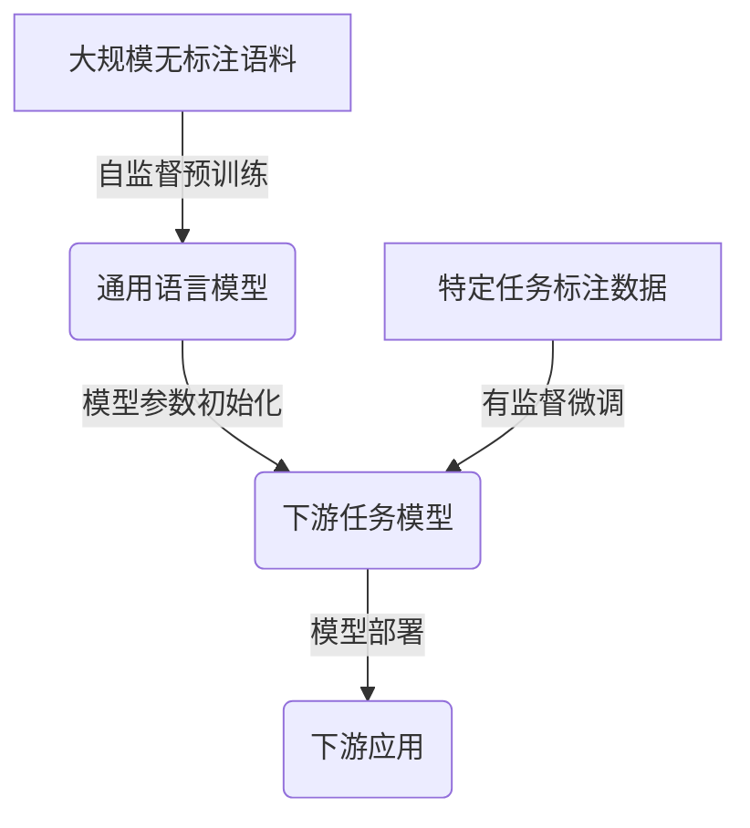
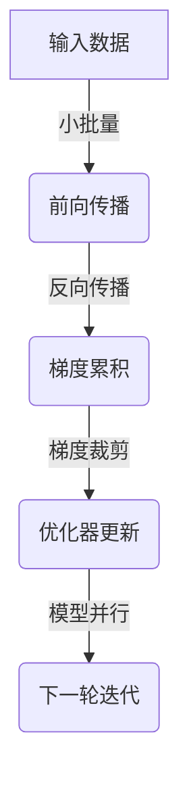

# 大规模语言模型从理论到实践: 大语言模型的发展历程

## 1. 背景介绍

### 1.1 自然语言处理的重要性

在当今信息时代,自然语言处理(Natural Language Processing, NLP)已经成为了一个不可或缺的技术领域。它使计算机能够理解、解释和生成人类语言,为人机交互、信息检索、机器翻译、问答系统等应用奠定了基础。随着大数据和人工智能技术的飞速发展,NLP也取得了长足的进步,其中大规模语言模型就是一个代表性的研究热点和应用前沿。

### 1.2 语言模型的作用

语言模型(Language Model, LM)是NLP中的核心技术之一,它通过学习大量文本数据,捕捉语言的统计规律,从而能够评估一个句子的自然程度,并用于多种NLP任务,如机器翻译、文本生成、语音识别等。传统的语言模型通常是基于n-gram统计模型,只能捕捉局部的语言规律。而随着深度学习的兴起,基于神经网络的语言模型能够更好地学习语言的深层次特征,显著提高了模型的性能。

### 1.3 大规模语言模型的兴起

近年来,benefiting from the rapid development of large-scale pretraining and transfer learning techniques, as well as the availability of massive text data and powerful computing resources, large-scale language models have emerged as a new paradigm in NLP. These models, such as GPT, BERT, and their variants, are pretrained on vast amounts of text data using self-supervised learning objectives, capturing rich linguistic knowledge and world knowledge. They can then be fine-tuned on specific downstream tasks, achieving state-of-the-art performance across a wide range of NLP applications.

## 2. 核心概念与联系

### 2.1 自回归语言模型

自回归语言模型(Autoregressive Language Model, ALM)是一种基于transformer的序列生成模型,它通过学习大量文本数据,捕捉语言的统计规律,从而能够生成连贯、自然的文本。ALM的核心思想是基于已生成的文本片段,预测下一个单词(或子词)的概率分布,然后从中采样得到新的单词,不断迭代直至生成完整的文本序列。

$$P(x_1, x_2, ..., x_n) = \prod_{t=1}^{n}P(x_t|x_1, x_2, ..., x_{t-1})$$

其中,$ P(x_t|x_1, x_2, ..., x_{t-1}) $表示在给定前 t-1 个单词的情况下,第 t 个单词的条件概率。GPT(Generative Pre-trained Transformer)就是一种典型的ALM,通过自监督预训练和微调两阶段,在多种文本生成任务上取得了卓越的表现。

### 2.2 掩码语言模型

掩码语言模型(Masked Language Model, MLM)是一种用于学习双向语境表示的自编码器模型。它的基本思想是在输入序列中随机掩蔽部分单词,然后通过上下文预测这些被掩蔽单词的标识。这种方式使模型能够同时利用左右上下文信息,学习到更加丰富的语义表示。

$$\mathcal{L}_{MLM} = -\mathbb{E}_{x \sim X}\left[\sum_{t \in mask} \log P(x_t|x_{\backslash mask})\right]$$

其中,$ x_{\backslash mask} $表示输入序列中除了被掩蔽位置之外的其他单词。BERT(Bidirectional Encoder Representations from Transformers)就是一种典型的MLM,通过预训练和微调两阶段,在多种NLP任务上取得了state-of-the-art的表现。

### 2.3 生成式与判别式模型

根据模型的用途和训练目标,大规模语言模型可以分为生成式模型和判别式模型。

生成式模型(Generative Model)旨在学习数据的联合概率分布$P(X, Y)$,通过最大化生成数据的概率来训练模型参数。生成模型可以用于生成新的样本,如文本生成、机器翻译等。典型的生成式语言模型包括GPT、CTRL等。

判别式模型(Discriminative Model)则是学习条件概率分布$P(Y|X)$,通过最大化正确预测目标$Y$的概率来训练模型。判别模型适用于分类、序列标注等任务。典型的判别式语言模型包括BERT、RoBERTa等。

虽然生成式和判别式模型在目标函数上有所不同,但它们都是基于transformer的序列模型,都需要通过自监督预训练来学习通用的语言表示,再进行任务特定的微调。一些新型的语言模型(如ELECTRA、BART等)也试图结合两种范式的优点。

## 3. 核心算法原理具体操作步骤

### 3.1 Transformer 模型

Transformer是大规模语言模型的核心模块,它完全基于注意力机制,摒弃了传统的RNN和CNN结构。Transformer的主要组成部分包括:

1. **输入嵌入层**: 将输入单词映射为向量表示。
2. **位置编码**: 因为Transformer没有递归和卷积结构,无法直接获取序列的位置信息,因此需要添加位置编码。
3. **多头注意力层**: 计算Query、Key、Value之间的注意力权重,并进行加权求和,获得注意力表示。
4. **前馈全连接层**: 对注意力表示进行非线性变换,提取更高层次的特征。
5. **规范化层**: 对输入进行标准化,加速收敛。
6. **残差连接**: 将输入和输出相加,防止信息丢失。

Transformer的核心是自注意力机制,它允许每个单词直接关注整个输入序列中的其他单词,捕捉长距离依赖关系。此外,多头注意力可以从不同的子空间关注不同的位置,提高了模型的表达能力。

### 3.2 预训练和微调

大规模语言模型通常采用预训练和微调的两阶段训练策略:

1. **预训练(Pretraining)**: 在大规模无标注文本数据上,使用自监督学习目标(如ALM、MLM等)对模型进行预训练,学习通用的语言表示。预训练可以利用大量文本数据,捕捉丰富的语言知识。

2. **微调(Finetuning)**: 将预训练好的模型参数作为初始化,在特定的有标注数据集上进行进一步的微调,使模型适应特定的下游任务。微调阶段的数据量通常较小,但可以提高模型在该任务上的性能。

预训练和微调的思想源于迁移学习,它使模型能够从大量无标注数据中习得通用知识,再将其转移到特定任务上。这种范式大大减少了有标注数据的需求,提高了数据利用效率。

### 3.3 优化策略

训练大规模语言模型面临一些挑战,需要采取特殊的优化策略:

1. **梯度裁剪(Gradient Clipping)**: 由于模型参数巨大,梯度容易出现爆炸或消失。梯度裁剪可以限制梯度范围,提高训练稳定性。

2. **层归一化(Layer Normalization)**: 对输入进行标准化处理,加速收敛。

3. **残差连接(Residual Connection)**: 将输入和输出相加,缓解了信息丢失和梯度消失问题。

4. **学习率warmup**: 在训练初期使用较小的学习率,防止梯度爆炸。随着训练进行逐渐增大学习率。

5. **混合精度训练(Mixed Precision)**: 利用低精度(如FP16)计算加速训练,同时保留FP32精度用于权重更新,在不损失精度的情况下提高训练效率。

6. **梯度累积(Gradient Accumulation)**: 由于显存有限,每次只能使用小批量进行训练。梯度累积可以将多个小批量的梯度累加,模拟使用大批量的效果。

7. **数据并行(Data Parallelism)**: 在多个GPU卡上并行训练,加速计算。

8. **模型并行(Model Parallelism)**: 将模型切分到多个设备上并行计算,突破单GPU显存限制训练大模型。

## 4. 数学模型和公式详细讲解举例说明

### 4.1 自注意力机制

自注意力机制是Transformer的核心,它允许每个单词直接关注整个输入序列中的其他单词,捕捉长距离依赖关系。给定一个长度为n的序列$X = (x_1, x_2, ..., x_n)$,我们将其映射为三个向量序列:Query $Q$、Key $K$和Value $V$,通过计算Q和K的点积,获得注意力权重:

$$\text{Attention}(Q, K, V) = \text{softmax}\left(\frac{QK^T}{\sqrt{d_k}}\right)V$$

其中,$ d_k $是缩放因子,用于防止内积值过大导致softmax饱和。注意力权重 $\alpha_{ij}$ 表示第i个单词对第j个单词的注意力程度。然后将注意力权重与Value向量 $V$ 相乘,得到加权和作为注意力表示。

$$\alpha_{ij} = \frac{\exp(q_i^Tk_j)}{\sum_{l=1}^n\exp(q_i^Tk_l)}$$

为了提高模型的表达能力,Transformer采用了多头注意力机制。它将Query、Key和Value分别线性投影到不同的子空间,分别计算注意力,再将所有头的注意力表示拼接起来。

$$\text{MultiHead}(Q, K, V) = \text{Concat}(\text{head}_1, ..., \text{head}_h)W^O$$
$$\text{where } \text{head}_i = \text{Attention}(QW_i^Q, KW_i^K, VW_i^V)$$

多头注意力允许模型关注输入序列的不同位置和不同子空间表示,提高了模型的表达能力。

### 4.2 掩码语言模型目标

掩码语言模型(MLM)的目标是在输入序列中随机掩蔽部分单词,然后基于上下文预测这些被掩蔽单词的标识。设输入序列为 $X = (x_1, x_2, ..., x_n)$,其中 $X_{mask}$ 是被掩蔽的单词位置集合。MLM的损失函数定义为:

$$\mathcal{L}_{MLM} = -\mathbb{E}_{x \sim X}\left[\sum_{t \in mask} \log P(x_t|x_{\backslash mask})\right]$$

其中,$ x_{\backslash mask} $表示输入序列中除了被掩蔽位置之外的其他单词。$ P(x_t|x_{\backslash mask}) $是基于上下文预测第 t 个被掩蔽单词的条件概率。

为了提高模型的鲁棒性,BERT等模型在实现MLM时采用了一些技巧:

1. **静止掩码(Static Masking)**: 在预训练阶段,对每个序列只掩蔽一次,避免每个batch都重新掩蔽。
2. **掩码策略**: 80%的时候用特殊的[MASK]标记替换单词,10%的时候用