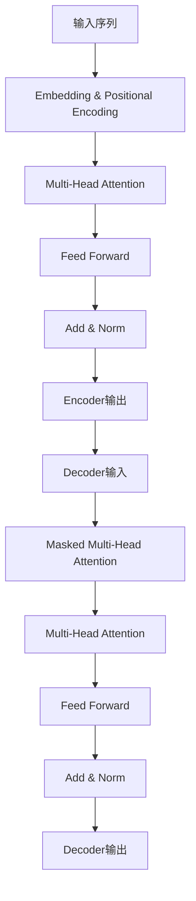

# 大规模语言模型从理论到实践 实践思考

## 1.背景介绍

### 1.1 语言模型的重要性

语言模型在自然语言处理领域扮演着至关重要的角色。它们旨在捕捉语言的统计规律,并为下游任务(如机器翻译、文本生成、问答系统等)提供基础支持。随着深度学习技术的快速发展,大规模语言模型(Large Language Models,LLMs)已经成为自然语言处理的主导范式。

### 1.2 大规模语言模型的兴起

近年来,benefiting from海量数据、强大的计算能力和创新的模型架构,大规模语言模型取得了令人瞩目的成就。代表性模型包括GPT、BERT、XLNet、T5等,它们展现出惊人的泛化能力,在广泛的自然语言处理任务中取得了state-of-the-art的性能。

### 1.3 从理论到实践的重要性

尽管大规模语言模型在学术界取得了巨大成功,但将其应用于实际场景仍面临诸多挑战。这些挑战包括模型部署、在线服务、隐私与安全、效率与可解释性等。因此,探索大规模语言模型从理论到实践的实践思考至关重要。

## 2.核心概念与联系  

### 2.1 语言模型基础

语言模型旨在估计一个序列的概率,即$P(x_1, x_2, ..., x_n)$,其中$x_i$表示序列中的第i个token(如单词或子词)。根据链式法则,该概率可分解为:

$$P(x_1, x_2, ..., x_n) = \prod_{i=1}^{n}P(x_i|x_1, ..., x_{i-1})$$

传统的n-gram语言模型通过计数统计近似上述条件概率。而神经网络语言模型则利用神经网络直接对条件概率建模。

### 2.2 自回归语言模型

自回归语言模型是一种常见的神经网络语言模型,它将序列按顺序生成,每个时间步的输出都依赖于之前的输出。形式化地,自回归语言模型定义为:

$$P(x_1, ..., x_n) = \prod_{i=1}^{n}P(x_i|x_1, ..., x_{i-1}; \theta)$$

其中$\theta$表示模型参数。常见的自回归模型包括RNN、LSTM、GRU等。

### 2.3 Transformer和自注意力机制

Transformer是一种全新的序列建模架构,它完全基于自注意力机制,避免了RNN的递归计算。自注意力机制允许模型直接关注输入序列的不同部分,捕捉长距离依赖关系。这种并行计算的特性使Transformer在大规模语料上训练变得可行。

### 2.4 预训练与微调

大规模语言模型通常采用预训练与微调的范式。在预训练阶段,模型在大规模无监督语料上进行自监督训练,学习通用的语言表示。在微调阶段,预训练模型被转移到下游任务,通过有监督的微调来适应特定任务。这种范式大大提高了模型的泛化能力和数据利用效率。

### 2.5 核心概念联系

上述核心概念相互关联、环环相扣。语言模型是自然语言处理的基础;自回归模型和Transformer分别提供了有力的序列建模方法;预训练与微调范式则使大规模语言模型的训练变得可行,并提升了模型的泛化能力。这些概念的融合催生了大规模语言模型的兴起和发展。

## 3.核心算法原理具体操作步骤

### 3.1 Transformer模型架构

Transformer是当前大规模语言模型的核心架构,它包括编码器(Encoder)和解码器(Decoder)两个主要部分。

编码器将输入序列映射为连续的表示,通过多头自注意力层(Multi-Head Attention)和前馈网络(Feed Forward)交替进行计算,并使用残差连接(Residual Connection)和层归一化(Layer Normalization)来促进训练。

解码器的结构与编码器类似,但增加了掩码多头自注意力层(Masked Multi-Head Attention),用于防止注意力机制关注到未来的位置。同时,解码器还包含一个多头注意力层,用于关注编码器的输出。

### 3.2 自注意力机制

自注意力机制是Transformer的核心,它允许模型直接捕捉输入序列中任意两个位置之间的依赖关系。

对于给定的查询(Query)向量$q$、键(Key)向量$k$和值(Value)向量$v$,自注意力机制的计算过程如下:

1. 计算注意力分数: $\text{Attention}(q, k, v) = \text{softmax}(\frac{qk^T}{\sqrt{d_k}})v$
2. 多头注意力机制将注意力分数从不同的表示子空间进行计算,然后进行拼接:
   $\text{MultiHead}(Q, K, V) = \text{Concat}(head_1, ..., head_h)W^O$
   其中 $head_i = \text{Attention}(QW_i^Q, KW_i^K, VW_i^V)$

通过自注意力机制,Transformer能够有效地建模长距离依赖关系,同时保持并行计算的优势。

### 3.3 位置编码

由于Transformer不再使用递归结构,因此需要一种机制来注入序列的位置信息。常用的方法是在输入嵌入上添加位置编码,使不同位置的表示不同。

常见的位置编码方式包括:

- 绝对位置编码: 为每个位置赋予一个固定的编码向量。
- 相对位置编码: 编码向量取决于当前位置与其他位置之间的相对距离。

### 3.4 预训练目标

大规模语言模型通常采用自监督的预训练目标,以学习通用的语言表示。常见的预训练目标包括:

- 掩码语言模型(Masked Language Modeling, MLM): 随机掩码部分输入token,模型需要预测被掩码的token。
- 下一句预测(Next Sentence Prediction, NSP): 判断两个句子是否相邻。
- 因果语言模型(Causal Language Modeling, CLM): 基于前缀预测下一个token。
- 序列到序列预训练(Sequence-to-Sequence Pretraining): 学习将输入序列转换为目标序列的能力。

不同的预训练目标侧重于捕捉不同的语言信息,可以根据下游任务的需求进行选择。

### 3.5 微调过程

在完成预训练后,大规模语言模型需要针对特定的下游任务进行微调。微调过程包括以下步骤:

1. 准备下游任务的训练数据。
2. 将预训练模型的参数作为初始化参数。
3. 在下游任务的训练数据上进行有监督的微调,更新模型参数。
4. 在验证集上评估模型性能,选择最优模型。
5. 在测试集上测试模型的泛化能力。

微调过程通常只需要少量的标注数据和较少的训练步骤,就能快速将大规模语言模型迁移到新任务上,充分发挥了预训练模型的潜力。

## 4.数学模型和公式详细讲解举例说明

### 4.1 自注意力分数计算

自注意力机制是Transformer的核心组件,它允许模型直接关注输入序列的不同部分,捕捉长距离依赖关系。自注意力分数的计算过程如下:

给定查询向量$\boldsymbol{q} \in \mathbb{R}^{d_q}$、键向量$\boldsymbol{k} \in \mathbb{R}^{d_k}$和值向量$\boldsymbol{v} \in \mathbb{R}^{d_v}$,自注意力分数计算公式为:

$$\text{Attention}(\boldsymbol{q}, \boldsymbol{k}, \boldsymbol{v}) = \text{softmax}\left(\frac{\boldsymbol{q}\boldsymbol{k}^\top}{\sqrt{d_k}}\right)\boldsymbol{v}$$

其中$d_k$是键向量的维度,用于缩放点积,以防止过大的值导致softmax函数的梯度消失。

让我们用一个具体的例子来说明自注意力分数的计算过程。假设我们有一个长度为4的输入序列,嵌入维度为3,查询向量为$\boldsymbol{q} = [0.1, 0.2, 0.3]$,键向量为$\boldsymbol{K} = \begin{bmatrix}0.4 & 0.5 & 0.6\\0.7 & 0.8 & 0.9\\1.0 & 1.1 & 1.2\\1.3 & 1.4 & 1.5\end{bmatrix}$,值向量为$\boldsymbol{V} = \begin{bmatrix}2.0 & 2.1 & 2.2\\2.3 & 2.4 & 2.5\\2.6 & 2.7 & 2.8\\2.9 & 3.0 & 3.1\end{bmatrix}$。

首先,我们计算查询向量与每个键向量的点积,并除以$\sqrt{d_k}$:

$$\begin{bmatrix}
\frac{\boldsymbol{q}\boldsymbol{k}_1^\top}{\sqrt{3}} & \frac{\boldsymbol{q}\boldsymbol{k}_2^\top}{\sqrt{3}} & \frac{\boldsymbol{q}\boldsymbol{k}_3^\top}{\sqrt{3}} & \frac{\boldsymbol{q}\boldsymbol{k}_4^\top}{\sqrt{3}}
\end{bmatrix} = \begin{bmatrix}
0.82 & 1.23 & 1.64 & 2.05
\end{bmatrix}$$

接下来,我们对上述分数应用softmax函数,得到注意力权重:

$$\text{softmax}\left(\begin{bmatrix}
0.82 & 1.23 & 1.64 & 2.05
\end{bmatrix}\right) = \begin{bmatrix}
0.07 & 0.12 & 0.22 & 0.59
\end{bmatrix}$$

最后,我们将注意力权重与值向量相乘,得到自注意力的输出:

$$\begin{bmatrix}
0.07 & 0.12 & 0.22 & 0.59
\end{bmatrix}\begin{bmatrix}
2.0 & 2.1 & 2.2\\
2.3 & 2.4 & 2.5\\
2.6 & 2.7 & 2.8\\
2.9 & 3.0 & 3.1
\end{bmatrix} = \begin{bmatrix}
2.74 & 2.83 & 2.92
\end{bmatrix}$$

通过这个例子,我们可以清楚地看到自注意力机制如何根据查询向量和键向量计算注意力分数,并将注意力分数与值向量相乘以获得最终的输出。这种机制允许模型直接关注输入序列的不同部分,捕捉长距离依赖关系。

### 4.2 多头自注意力机制

尽管单头自注意力机制已经足够强大,但多头自注意力机制可以从不同的表示子空间捕捉不同的信息,进一步提高模型的表示能力。

多头自注意力机制的计算过程如下:

1. 将查询向量$\boldsymbol{Q}$、键向量$\boldsymbol{K}$和值向量$\boldsymbol{V}$分别线性映射到$h$个头的子空间:
   $$\begin{aligned}
   \boldsymbol{Q}_i &= \boldsymbol{Q}\boldsymbol{W}_i^Q & \boldsymbol{K}_i &= \boldsymbol{K}\boldsymbol{W}_i^K & \boldsymbol{V}_i &= \boldsymbol{V}\boldsymbol{W}_i^V
   \end{aligned}$$
   其中$\boldsymbol{W}_i^Q \in \mathbb{R}^{d_\text{model} \times d_q}$、$\boldsymbol{W}_i^K \in \mathbb{R}^{d_\text{model} \times d_k}$和$\boldsymbol{W}_i^V \in \mathbb{R}^{d_\text{model} \times d_v}$是可学习的线性映射矩