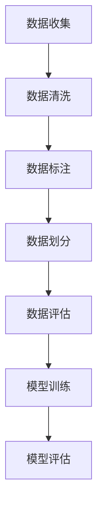

# 大规模语言模型从理论到实践：指令数据的构建

## 1.背景介绍

### 1.1 语言模型的发展历程

语言模型是自然语言处理领域的核心技术之一,它通过学习大量的文本数据,捕捉语言的统计规律,为下游任务提供语言知识支持。早期的统计语言模型主要基于 N-gram 模型,通过计算词序列的联合概率来预测下一个词。随着深度学习技术的兴起,神经网络语言模型(Neural Network Language Model, NNLM)凭借其强大的表示能力,逐渐取代了传统的统计语言模型。

近年来,受益于大规模预训练模型(如 BERT、GPT 等)的出现,语言模型的性能得到了飞跃式的提升。这些预训练模型通过在海量无标注文本数据上进行自监督学习,获得了丰富的语言知识,为下游任务提供了强大的语义表示能力。然而,这些模型在训练时仍存在一些局限性,比如缺乏明确的任务目标、无法很好地利用人类反馈等。

### 1.2 指令数据的重要性

为了解决上述问题,指令数据(Instruction Data)应运而生。指令数据是一种特殊的数据格式,它将任务目标以自然语言的形式表达,并将其与相应的输入输出数据对联系起来。通过学习指令数据,语言模型可以更好地理解任务目标,并根据指令生成符合要求的输出。

指令数据的引入为语言模型带来了以下几个主要优势:

1. **任务导向**:指令数据明确定义了任务目标,使语言模型能够更好地理解和完成特定任务。
2. **人类反馈**:指令数据可以包含人类的反馈和评价,帮助语言模型纠正错误,提高输出质量。
3. **多任务学习**:通过构建包含多种任务的指令数据集,语言模型可以同时学习多个任务,提高泛化能力。
4. **可解释性**:指令数据明确定义了输入和期望输出,有助于提高语言模型的可解释性。

因此,构建高质量的指令数据对于训练出优秀的语言模型至关重要。本文将重点介绍指令数据的构建方法,包括数据收集、数据清洗、数据标注等关键步骤,并探讨指令数据在实践中的应用。

## 2.核心概念与联系

### 2.1 指令数据的定义

指令数据(Instruction Data)是一种特殊的数据格式,它将任务目标以自然语言的形式表达,并将其与相应的输入输出数据对联系起来。一个典型的指令数据实例由以下三个部分组成:

1. **指令(Instruction)**: 以自然语言形式描述的任务目标,明确定义了期望的输出。
2. **输入(Input)**: 用于完成任务的原始数据,可以是文本、图像、音频等多种形式。
3. **输出(Output)**: 根据指令和输入生成的期望结果。

指令数据的核心思想是将任务目标明确地表达出来,而不是像传统的数据集那样隐含在数据对中。这种显式的任务描述有助于语言模型更好地理解和完成特定任务。

### 2.2 指令数据与其他数据类型的关系

指令数据与其他常见的数据类型存在一些联系和区别,如下所示:

1. **监督学习数据**:传统的监督学习数据通常由输入和标签组成,而指令数据则由指令、输入和输出组成。指令数据可以看作是一种特殊的监督学习数据,其中指令充当了任务描述的角色。

2. **自然语言推理数据**:自然语言推理数据集(如 SNLI、MultiNLI 等)通常包含一个前提(premise)和一个假设(hypothesis),需要判断两者之间的关系。指令数据可以看作是一种扩展的自然语言推理数据,其中指令相当于前提,输出则是根据指令和输入生成的假设。

3. **问答数据**:问答数据集(如 SQuAD、CoQA 等)通常包含一个问题和一段上下文文本,需要从上下文中找到答案。指令数据可以看作是一种扩展的问答数据,其中指令相当于问题,输入则是上下文信息。

4. **对话数据**:对话数据集(如 MultiWOZ、PersonaChat 等)通常包含一系列的utterance,需要根据上下文生成合适的回复。指令数据可以看作是一种特殊的对话数据,其中指令相当于一个utterance,输出则是根据指令和输入生成的回复。

总的来说,指令数据融合了多种数据类型的特点,是一种更加通用和灵活的数据格式。它不仅可以用于训练语言模型,还可以应用于各种下游任务,如文本生成、问答系统、对话系统等。

## 3.核心算法原理具体操作步骤

构建高质量的指令数据集是一个复杂的过程,需要经过多个关键步骤。下面将详细介绍指令数据构建的核心算法原理和具体操作步骤。

### 3.1 数据收集

数据收集是构建指令数据集的第一步,目标是收集足够多样化的数据样本,以确保模型能够学习到丰富的语言知识。常见的数据来源包括:

1. **网络数据爬取**:从互联网上爬取相关的文本数据,如新闻、社交媒体、论坛等。
2. **现有数据集**:利用已有的文本数据集,如书籍、维基百科等。
3. **人工创作**:聘请专业人员根据需求创作指令数据。
4. **众包平台**:利用众包平台(如 Amazon Mechanical Turk)收集数据。

在收集数据时,需要注意以下几点:

1. **多样性**:收集多种类型的数据,包括不同主题、风格和语言等,以增加数据的多样性。
2. **质量控制**:设置一定的质量标准,过滤掉低质量的数据样本。
3. **隐私保护**:遵守相关法律法规,保护个人隐私信息。
4. **版权问题**:避免侵犯他人的知识产权。

### 3.2 数据清洗

收集到的原始数据通常存在各种噪声和错误,因此需要进行数据清洗,以提高数据质量。常见的数据清洗操作包括:

1. **去重**:去除重复的数据样本。
2. **纠错**:纠正拼写、语法等错误。
3. **标准化**:将数据统一转换为标准格式。
4. **过滤**:过滤掉低质量或不相关的数据样本。
5. **规范化**:将数据转换为规范的形式,如统一大小写、删除特殊字符等。

数据清洗可以通过自动化工具和人工审核相结合的方式进行。自动化工具可以快速处理大量数据,而人工审核则可以确保数据质量。

### 3.3 数据标注

对于指令数据,需要对每个数据样本进行标注,即为每个输入数据指定一个合适的指令和期望输出。数据标注可以采用以下几种方式:

1. **人工标注**:由专业人员手动为每个数据样本标注指令和输出。这种方式质量较高,但成本较高。
2. **众包标注**:利用众包平台(如 Amazon Mechanical Turk)进行大规模的人工标注。这种方式成本较低,但质量控制较为困难。
3. **自动标注**:通过自动化算法生成指令和输出。这种方式成本低且高效,但质量有待提高。
4. **半监督标注**:结合自动标注和人工校正,利用人工校正的结果不断优化自动标注模型。

无论采用何种标注方式,都需要制定明确的标注指南,以确保标注的一致性和质量。此外,还需要进行人工抽样审核,以发现和纠正标注错误。

### 3.4 数据划分

在完成数据标注后,需要将数据集划分为训练集、验证集和测试集,以便于模型训练和评估。常见的划分比例是:

- 训练集:60% - 80%
- 验证集:10% - 20%
- 测试集:10% - 20%

数据划分时需要注意以下几点:

1. **随机划分**:确保每个子集的数据分布与原始数据集保持一致。
2. **stratified sampling**:对于包含多个类别的数据集,需要确保每个子集中各类别的比例与原始数据集保持一致。
3. **固定随机种子**:为了实验的可重复性,需要固定随机种子。

### 3.5 数据评估

在将数据集用于模型训练之前,需要对其进行评估,以确保数据质量。常见的评估方法包括:

1. **人工审核**:由专业人员抽样审核数据质量,发现和纠正错误。
2. **自动评估**:利用自动化工具对数据进行评估,如检查格式、完整性等。
3. **基线模型评估**:在基线模型上评估数据集的性能,作为数据质量的参考。

数据评估不仅可以发现和纠正数据中的错误,还可以帮助识别数据集的偏差和不足,为后续的数据收集和标注提供指导。

### 3.6 模型训练

在完成数据准备后,即可将指令数据集用于语言模型的训练。常见的训练方法包括:

1. **监督微调**:在预训练语言模型的基础上,利用指令数据集进行监督微调,使模型学习特定任务的知识。
2. **从头训练**:从头开始训练一个新的语言模型,将指令数据作为训练数据。
3. **多任务学习**:将多个指令数据集合并,同时训练模型完成多个任务。

在训练过程中,需要注意以下几点:

1. **超参数调优**:调整学习率、批大小等超参数,以获得最佳性能。
2. **正则化**:采用正则化技术(如dropout、权重衰减等)来防止过拟合。
3. **早停策略**:监控验证集上的性能,在性能不再提升时提前停止训练。

### 3.7 模型评估

在完成模型训练后,需要对模型进行评估,以衡量其在指令数据集上的性能表现。常见的评估方法包括:

1. **自动评估**:利用常见的评估指标(如BLEU、ROUGE等)对模型输出进行自动评估。
2. **人工评估**:由专业人员对模型输出进行人工评估,考虑语义、语法、流畅度等多个维度。
3. **在线评估**:将模型部署到实际应用中,收集用户反馈并进行评估。

评估结果不仅可以反映模型的性能水平,还可以发现模型的不足之处,为后续的模型优化和数据改进提供依据。

## 4.数学模型和公式详细讲解举例说明

在指令数据的构建和应用过程中,涉及到一些重要的数学模型和公式。本节将详细介绍这些模型和公式,并通过实例说明其具体应用。

### 4.1 语言模型基础

语言模型的核心目标是估计一个句子或词序列的概率。形式化地,给定一个长度为 $n$ 的词序列 $\boldsymbol{x} = (x_1, x_2, \dots, x_n)$,语言模型需要计算该序列的概率 $P(\boldsymbol{x})$。根据链式法则,我们可以将该概率分解为:

$$P(\boldsymbol{x}) = \prod_{t=1}^{n} P(x_t | x_1, \dots, x_{t-1})$$

其中 $P(x_t | x_1, \dots, x_{t-1})$ 表示在给定前 $t-1$ 个词的情况下,第 $t$ 个词出现的条件概率。

在 N-gram 语言模型中,由于计算复杂度的原因,通常会做马尔可夫假设,即只考虑有限个历史词对当前词的影响。例如,在三元语言模型(Trigram