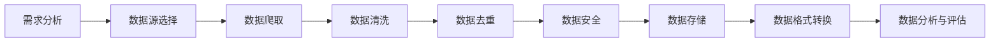

# 大规模语言模型从理论到实践 数据收集

## 1. 背景介绍
### 1.1 大规模语言模型的兴起
近年来,随着深度学习技术的快速发展,大规模语言模型(Large Language Models, LLMs)在自然语言处理(Natural Language Processing, NLP)领域取得了重大突破。从 GPT-3 到 PaLM 再到最新的 GPT-4,LLMs 展现出了惊人的语言理解和生成能力,引发了学术界和工业界的广泛关注。

### 1.2 数据是关键
LLMs 之所以能取得如此卓越的性能,很大程度上归功于海量的训练数据。正如 AI 三定律所言:"没有数据,就没有 AI"。高质量、大规模的文本数据是训练 LLMs 的核心要素之一。本文将重点探讨 LLMs 训练数据收集的理论基础和实践经验,为从业者提供借鉴。

## 2. 核心概念与联系
### 2.1 大规模语言模型
LLMs 是基于 Transformer 架构,利用海量无标注文本数据进行自监督学习得到的语言模型。与传统的 RNN、LSTM 等模型相比,LLMs 具有更大的模型参数量和更强大的特征提取能力,能更好地捕捉语言的长程依赖关系。

### 2.2 预训练与微调
LLMs 的训练通常分为两个阶段:预训练(Pre-training)和微调(Fine-tuning)。预训练阶段使用海量无标注语料进行自监督学习,学习通用的语言表示。微调阶段在特定任务的标注数据上进一步训练模型,使其适应具体应用场景。高质量的预训练数据是 LLMs 性能的基石。

### 2.3 数据质量与数量
数据质量和数量是影响 LLMs 性能的两大因素。数据质量涉及语料的相关性、覆盖面、噪声等,需要进行细致的清洗和筛选。数据量的增加可显著提升模型性能,但也带来了存储和计算成本的挑战。二者需要权衡取舍。

## 3. 数据收集流程与步骤
数据收集大致可分为以下步骤:



### 3.1 需求分析
明确数据收集的目标任务和需求,如语种、体裁、主题、时间跨度、数据格式等,为后续步骤提供指引。

### 3.2 数据源选择
根据需求选择合适的数据源,如网页、文档、数据库等。需考虑数据源的权威性、时效性、丰富度、可获取性等因素。常见的文本数据源有:
- 网络百科,如维基百科
- 新闻网站 
- 图书文档
- 社交媒体
- 开放数据集

### 3.3 数据爬取
利用爬虫技术从选定的数据源抓取原始文本数据。需遵守数据源的 robots 协议,控制爬取频率,避免对服务器造成过大压力。常用的爬虫工具有:
- Scrapy
- BeautifulSoup
- Selenium
- Puppeteer

### 3.4 数据清洗
对原始文本数据进行预处理和清洗,提升数据质量。主要任务包括:
- 去除 HTML 标签、特殊字符等噪声
- 文本断句、分词
- 拼写纠错
- 大小写归一化
- 同义词替换
- 语法纠错

### 3.5 数据去重
剔除重复和近似重复的文本,减少冗余,节约存储和计算资源。常见的文本去重方法有:
- 基于 MD5、SimHash 等签名的精确去重
- 基于 MinHash、LSH 等的近似去重
- 基于词袋模型、TF-IDF 等的文本相似度去重

### 3.6 数据隐私与安全
对隐私敏感数据进行脱敏处理,如姓名、电话、地址等。同时采取数据加密、访问控制等措施,防止数据泄露和非授权访问。

### 3.7 数据存储
将清洗后的文本数据以结构化的形式存储,便于管理和使用。常用的存储方式有:
- 关系型数据库,如 MySQL、PostgreSQL  
- NoSQL 数据库,如 MongoDB、Elasticsearch
- 分布式文件系统,如 HDFS、Ceph
- 对象存储,如 Amazon S3、Google Cloud Storage

### 3.8 数据格式转换
根据下游任务的需要,将文本数据转换为合适的格式,如 TXT、JSON、CSV 等。需注意字符编码、换行符等细节。

### 3.9 数据分析与评估
对收集到的文本数据进行统计分析和质量评估,如计算语料规模、词汇量、平均句长、主题分布等,及时发现和解决潜在的数据质量问题。

## 4. 数据处理技术与算法
### 4.1 文本预处理
文本预处理是数据清洗的核心环节,涉及多种字符串操作。以下是一些常用的正则表达式:

| 用途 | 正则表达式 |
| --- | --- | 
| 去除HTML标签 | `<[^>]+>` |
| 去除特殊字符 | `[^a-zA-Z0-9\u4e00-\u9fa5]` |  
| 匹配中文 | `[\u4e00-\u9fa5]` |
| 匹配英文单词 | `[a-zA-Z]+` |
| 匹配数字 | `[0-9]+` |

### 4.2 文本分词
中文分词常用的算法有:
- 基于字典的正向/逆向最大匹配
- 基于统计的 N-最短路径
- 基于隐马尔可夫模型的分词
- 基于条件随机场的分词
- 基于深度学习的端到端分词

以下是基于字典的正向最大匹配(FMM)分词的示例代码:

```python
class FMMTokenizer:
    def __init__(self, dict_path):
        self.dictionary = set()
        with open(dict_path, 'r', encoding='utf-8') as f:
            for line in f:
                self.dictionary.add(line.strip())
        self.max_len = max(map(len, self.dictionary))

    def cut(self, text):
        tokens = []
        start, end = 0, min(self.max_len, len(text))
        while start < len(text):
            if text[start:end] in self.dictionary or start + 1 == end:
                tokens.append(text[start:end])
                start = end
                end = min(start + self.max_len, len(text))
            else:
                end -= 1
        return tokens
```

### 4.3 文本相似度
常用的文本相似度计算方法有:
- 编辑距离,如 Levenshtein 距离
- 基于词集/词袋模型的 Jaccard 相似度
- 基于 TF-IDF 的余弦相似度
- 基于 Word2Vec、GloVe 等词嵌入的余弦相似度
- 基于预训练语言模型的句嵌入相似度

以下是基于 TF-IDF 的余弦相似度的核心代码:

```python
def cosine_similarity(vec1, vec2):
    """
    计算两个向量的余弦相似度
    """
    dot_product = sum(a * b for a, b in zip(vec1, vec2))
    norm_a = sum(a * a for a in vec1) ** 0.5
    norm_b = sum(b * b for b in vec2) ** 0.5
    return dot_product / (norm_a * norm_b)

def tfidf_similarity(text1, text2):
    """
    基于 TF-IDF 的文本相似度
    """
    vectorizer = TfidfVectorizer()
    tfidf = vectorizer.fit_transform([text1, text2])
    return cosine_similarity(tfidf[0].toarray()[0], tfidf[1].toarray()[0])
```

## 5. 大规模数据收集实践
### 5.1 维基百科数据收集
以中文维基百科为例,介绍一种基于数据转储的全量数据收集方法:
1. 下载中文维基百科的数据转储文件(`zhwiki-latest-pages-articles.xml.bz2`)
2. 使用 `WikiExtractor` 工具提取纯文本内容
3. 进行分词、去重等数据清洗操作
4. 将清洗后的文本数据存储到 MongoDB 等数据库中

### 5.2 新闻数据收集
以新浪新闻为例,介绍一种增量式新闻数据收集方法:
1. 编写爬虫定期抓取新浪新闻首页上的新闻链接
2. 根据链接爬取新闻正文内容,提取标题、作者、发布时间、正文等字段
3. 对正文进行分词、实体识别、关键词提取等语义分析
4. 将结构化的新闻数据存入 MySQL 等关系型数据库
5. 定期对新闻数据进行去重、更新和扩充

### 5.3 社交媒体数据收集
以 Twitter 为例,介绍一种基于流式 API 的实时数据收集方法:
1. 注册 Twitter 开发者账号,创建应用,获取访问令牌
2. 使用 Tweepy 等 Python 库连接 Twitter 流式 API
3. 设置关键词、地理位置、语言等筛选条件,实时获取推文数据
4. 对推文内容进行情感分析、主题建模等文本挖掘
5. 将处理后的推文数据传输到 Kafka 等消息队列,供下游任务消费

## 6. 应用场景
### 6.1 智能问答
利用 LLMs 构建知识库,实现基于海量文本数据的智能问答系统,如微软小冰、苹果 Siri 等。

### 6.2 机器翻译
利用 LLMs 进行端到端的神经机器翻译,显著提升翻译质量,如谷歌翻译、DeepL 等。

### 6.3 文本摘要
利用 LLMs 自动生成文本摘要,提取文章核心内容,如 GPT-3 的文本摘要功能。

### 6.4 文本生成
利用 LLMs 进行开放域的文本生成,如写作助手、对话生成、故事创作等,如 AI Dungeon、NovelAI 等。

## 7. 工具与资源
### 数据收集工具
- Scrapy: Python 爬虫框架
- Goose: 文章提取器
- Readability: 网页正文提取工具
- Newspaper3k: 新闻数据提取库
- Tweepy: Twitter 数据采集库
- NLTK: 自然语言处理工具包

### 文本处理工具
- Gensim: 主题建模工具包 
- HanLP: 中文自然语言处理库
- Jieba: 中文分词工具
- SpaCy: 工业级自然语言处理库
- FastText: 快速文本分类库

### 开源数据集
- Wikipedia: 多语言百科全书语料
- Common Crawl: 网络爬取数据集
- WMT: 机器翻译数据集
- SQuAD: 阅读理解数据集
- GLUE: 自然语言理解评测基准

## 8. 总结与展望
### 8.1 总结
数据收集是 LLMs 训练的基础,涉及需求分析、数据源选择、数据爬取、数据清洗、数据去重、数据安全、数据存储、数据格式转换、数据分析与评估等一系列步骤。其中,数据质量和数量是关键因素,需要权衡效率和成本。同时,要重视数据的隐私安全,防止敏感信息泄露。

### 8.2 挑战与未来方向
- 低资源语言的数据稀缺问题
- 训练数据与应用场景的领域适配问题
- 数据收集的版权与合规风险 
- 训练数据与模型的可解释性问题
- 知识更新与数据实时性问题

未来,随着 AI 技术的不断进步,数据收集也将向自动化、智能化的方向发展。知识图谱、增量学习、人机协作等技术有望进一步提升数据收集的效率和质量,为 LLMs 的发展注入新的动力。

## 9. 常见问题
### Q1: 为什么要对数据进行去重?
A1: 数据去重可以减少冗余,节约存储和计算资源,提高训练效率。此外,重