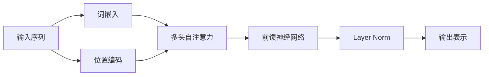

# 大规模语言模型从理论到实践 无监督预训练

## 1. 背景介绍

### 1.1 大规模语言模型的兴起
近年来,随着深度学习技术的快速发展,大规模语言模型(Large Language Models, LLMs)在自然语言处理(Natural Language Processing, NLP)领域取得了令人瞩目的成就。从2018年Google发布的BERT(Bidirectional Encoder Representations from Transformers)模型,到2019年OpenAI推出的GPT-2(Generative Pre-trained Transformer 2)模型,再到2020年OpenAI发布的GPT-3模型,LLMs的性能不断刷新着NLP任务的记录。

### 1.2 无监督预训练的重要性
LLMs的成功很大程度上归功于无监督预训练(Unsupervised Pre-training)技术。传统的NLP模型通常采用有监督学习的方式,需要大量标注数据进行训练。而无监督预训练利用海量未标注的文本数据,通过自监督学习(Self-supervised Learning)的方式,让模型自主学习语言的内在规律和表示,从而获得更加通用和鲁棒的语言理解能力。这种预训练范式极大地减少了对标注数据的依赖,提高了模型的泛化能力。

### 1.3 本文的主要内容
本文将深入探讨大规模语言模型无监督预训练的理论基础和实践经验。我们将首先介绍LLMs的核心概念和关键技术,然后详细阐述无监督预训练的算法原理和数学模型。接着,我们将通过代码实例演示如何实现一个基于Transformer的语言模型,并讨论在实际应用中需要注意的问题。最后,我们将展望LLMs的未来发展趋势和面临的挑战。

## 2. 核心概念与联系

### 2.1 Transformer架构
Transformer是当前大规模语言模型的核心架构。它由Vaswani等人在2017年提出,最初用于机器翻译任务。Transformer抛弃了传统的循环神经网络(RNN)和卷积神经网络(CNN)结构,完全基于注意力机制(Attention Mechanism)来建模序列数据。

Transformer主要由编码器(Encoder)和解码器(Decoder)两部分组成。编码器用于将输入序列映射为隐藏表示,解码器根据隐藏表示生成输出序列。编码器和解码器都由若干个相同的层(Layer)堆叠而成,每一层包含两个子层:多头自注意力(Multi-head Self-attention)机制和前馈神经网络(Feed-forward Neural Network)。

### 2.2 自注意力机制
自注意力机制是Transformer的核心组件。与传统的注意力机制不同,自注意力允许序列中的每个位置attend to序列中的所有位置,捕捉词与词之间的长距离依赖关系。具体来说,自注意力将输入序列的每个位置映射为一个query向量、一个key向量和一个value向量。然后通过query向量与所有key向量的点积计算注意力权重,再对value向量进行加权求和得到该位置的输出表示。

多头自注意力进一步增强了模型的表达能力。它将输入线性投影到多个不同的子空间,并行执行多个独立的自注意力函数,然后将结果拼接起来。这种机制使得模型能够在不同的表示子空间中学习到不同的语义信息。

### 2.3 位置编码
由于Transformer不包含任何循环或卷积结构,因此需要显式地为序列中的每个位置引入位置信息。位置编码(Positional Encoding)通过将位置嵌入与词嵌入相加的方式实现。位置嵌入可以是固定的三角函数(如正弦和余弦函数),也可以和词嵌入一样作为可学习的参数。

### 2.4 预训练和微调
预训练和微调(Fine-tuning)是当前大规模语言模型的主要训练范式。预训练阶段在大规模无标注语料上以自监督的方式训练模型,学习通用的语言表示。微调阶段在特定任务的标注数据上Fine-tune预训练模型,使其适应具体的下游任务。这种两阶段训练方法能够显著提升模型在小样本场景下的性能,实现更好的迁移学习效果。

下图展示了Transformer架构中各个核心概念之间的联系:

## 3. 核心算法原理具体操作步骤

### 3.1 Masked Language Model (MLM)
MLM是BERT等双向语言模型常用的无监督预训练任务。其基本思想是随机Mask掉输入序列中的一部分Token,然后让模型根据上下文预测被Mask掉的Token。具体步骤如下:

1. 随机选择输入序列中15%的Token进行Mask。
2. 对于每个被Mask的Token,有80%的概率替换为特殊的[MASK]符号,10%的概率替换为一个随机的词,10%的概率保持不变。
3. 将Mask后的序列输入Transformer编码器,得到每个位置的隐藏表示。
4. 在Mask位置接一个分类器,预测原始的Token。
5. 使用交叉熵损失函数优化模型参数。

通过MLM预训练,模型能够学习到词与词之间的双向关系,从而获得更加丰富的语义表示。

### 3.2 Next Sentence Prediction (NSP)
NSP是BERT引入的另一个预训练任务,旨在让模型学习句子级别的连贯性。具体步骤如下:

1. 从语料库中抽取两个句子A和B,其中50%的概率B是A的下一句,50%的概率B是语料库中的一个随机句子。
2. 将两个句子拼接成一个序列[CLS] A [SEP] B [SEP],其中[CLS]和[SEP]是特殊的分隔符号。
3. 将序列输入Transformer编码器,取[CLS]位置的隐藏状态作为整个序列的表示。
4. 在[CLS]位置接一个二分类器,预测B是否为A的下一句。
5. 使用二元交叉熵损失函数优化模型参数。

通过NSP预训练,模型能够学习到不同句子之间的逻辑关系,提高对长文本的理解能力。

### 3.3 Permutation Language Model (PLM)
PLM是XLNet提出的一种自回归语言模型预训练方法。与MLM不同,PLM通过排列语言模型(Permutation Language Model)来捕捉双向上下文信息。具体步骤如下:

1. 生成输入序列的所有可能排列。
2. 对每个排列,按照自回归的方式计算条件概率P(x_i|x_{<i})。
3. 最大化所有排列的条件概率乘积。
4. 使用梯度下降法优化模型参数。

通过PLM预训练,模型能够显式地建模双向上下文,同时保持自回归语言模型的优点。

### 3.4 Replaced Token Detection (RTD)
RTD是ELECTRA提出的一种更高效的预训练任务。不同于MLM中的生成式预训练,RTD采用判别式预训练的思路。具体步骤如下:

1. 使用一个小的Generator模型(如MLM)来预测被Mask的Token。
2. 将Generator预测的Token替换到原始序列中。
3. 训练一个Discriminator模型来判断每个Token是否被替换。
4. 使用二元交叉熵损失函数优化Discriminator的参数。

通过RTD预训练,Discriminator能够学习到更加细粒度的语言表示,同时显著减少了预训练的计算开销。

## 4. 数学模型和公式详细讲解举例说明

### 4.1 Transformer的数学表示
Transformer的编码器和解码器都由N个相同的层堆叠而成。对于编码器的第l层,设其输入为$H^{(l-1)}=\left(h_1^{(l-1)}, \ldots, h_n^{(l-1)}\right)$,其中$h_i^{(l-1)} \in \mathbb{R}^{d}$表示第i个位置的隐藏状态,$n$为序列长度,$d$为隐藏状态维度。

首先,通过自注意力机制更新隐藏状态:

$$
\begin{aligned}
Q^{(l)} &=H^{(l-1)} W_Q^{(l)} \\
K^{(l)} &=H^{(l-1)} W_K^{(l)} \\
V^{(l)} &=H^{(l-1)} W_V^{(l)} \\
\text{head}_i &= \text{Attention}\left(Q^{(l)}, K^{(l)}, V^{(l)}\right) \\
\text{MultiHead}\left(Q^{(l)}, K^{(l)}, V^{(l)}\right) &= \text{Concat}\left(\text{head}_1, \ldots, \text{head}_h\right) W_O^{(l)}
\end{aligned}
$$

其中,$W_Q^{(l)}, W_K^{(l)}, W_V^{(l)} \in \mathbb{R}^{d \times d_k}$和$W_O^{(l)} \in \mathbb{R}^{hd_k \times d}$为可学习的参数矩阵,$h$为注意力头的数量。$\text{Attention}$函数定义为:

$$
\text{Attention}(Q, K, V)=\operatorname{softmax}\left(\frac{Q K^T}{\sqrt{d_k}}\right) V
$$

然后,通过前馈神经网络进一步更新隐藏状态:

$$
\begin{aligned}
\text{FFN}(x) &= \max \left(0, x W_1^{(l)} + b_1^{(l)}\right) W_2^{(l)} + b_2^{(l)} \\
H^{(l)} &= \text{LayerNorm}\left(\text{FFN}\left(\text{MultiHead}\left(Q^{(l)}, K^{(l)}, V^{(l)}\right)\right)\right)
\end{aligned}
$$

其中,$W_1^{(l)} \in \mathbb{R}^{d \times d_{ff}}, b_1^{(l)} \in \mathbb{R}^{d_{ff}}$,$W_2^{(l)} \in \mathbb{R}^{d_{ff} \times d}, b_2^{(l)} \in \mathbb{R}^d$为前馈网络的参数,$d_{ff}$为前馈网络的隐藏层维度。$\text{LayerNorm}$表示层归一化操作,用于稳定训练。

解码器的计算过程与编码器类似,但在自注意力机制中引入了Masked Multi-head Attention,防止解码器看到未来的信息。此外,解码器还会attend to编码器的输出序列,实现信息的传递。

### 4.2 MLM的目标函数
MLM的训练目标是最大化被Mask位置的条件概率。设$\mathbf{x}=\left(x_1, \ldots, x_n\right)$为输入序列,$\mathbf{m}=\left(m_1, \ldots, m_n\right)$为Mask向量,其中$m_i=1$表示$x_i$被Mask,$m_i=0$表示$x_i$未被Mask。设$\theta$为模型参数,MLM的目标函数可以表示为:

$$
\mathcal{L}_{\text{MLM}}(\theta)=-\sum_{i=1}^n m_i \log P\left(x_i \mid \mathbf{x}_{\backslash m_i} ; \theta\right)
$$

其中,$\mathbf{x}_{\backslash m_i}$表示去掉第i个位置的输入序列。$P\left(x_i \mid \mathbf{x}_{\backslash m_i} ; \theta\right)$表示在给定上下文$\mathbf{x}_{\backslash m_i}$的条件下,第i个位置为$x_i$的概率,可以通过Softmax层计算:

$$
P\left(x_i \mid \mathbf{x}_{\backslash m_i} ; \theta\right)=\frac{\exp \left(e\left(x_i\right)^T h_i\right)}{\sum_{x^{\prime} \in \mathcal{V}} \exp \left(e\left(x^{\prime}\right)^T h_i\right)}
$$

其中,$e\left(x_i\right)$表示$x_i$的词嵌入向量,$h_i$表示第i个位置的隐藏状态,$\mathcal{V}$表示词表。

### 4.3 NSP的目标函数
NSP的训练目标是最大化正确判断两个句子是否相邻的概率。设$\mathbf{x}_A=\left(x