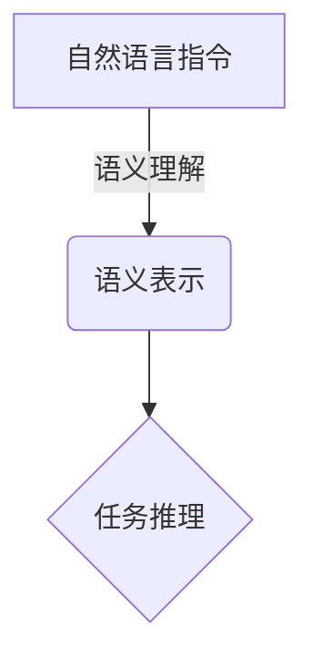
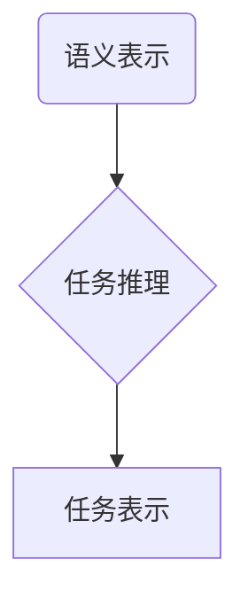
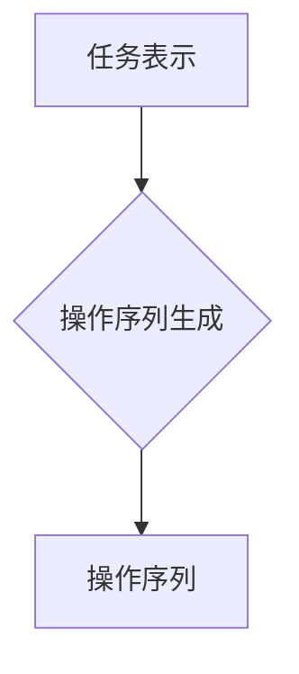
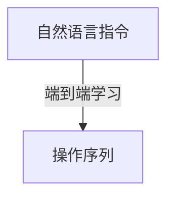

# 大规模语言模型从理论到实践 自动构建指令

## 1.背景介绍

### 1.1 人工智能的飞速发展

人工智能(AI)技术在过去几年里取得了令人难以置信的进步,尤其是在自然语言处理(NLP)领域。大规模语言模型的出现,使得机器能够理解和生成看似人类水平的自然语言,这为人机交互开辟了全新的可能性。

### 1.2 大规模语言模型的兴起

传统的NLP系统通常依赖于手工设计的规则和特征,难以捕捉语言的丰富性和复杂性。而大规模语言模型则是通过在海量文本数据上进行自监督学习,自动捕捉语言的统计规律,从而实现更加准确和通用的语言理解和生成能力。

代表性的大规模语言模型包括GPT(Generative Pre-trained Transformer)、BERT(Bidirectional Encoder Representations from Transformers)等,它们在自然语言理解、文本生成、机器翻译等多个任务上取得了卓越的表现。

### 1.3 自动构建指令的需求

尽管大规模语言模型展现出了强大的语言能力,但它们往往缺乏明确的目标导向性,难以直接应用于特定的任务场景。因此,如何基于大规模语言模型构建可控且高效的指令系统,成为了一个重要的研究课题。

自动构建指令的目标是让语言模型能够根据用户的自然语言指令,生成对应的结构化操作序列,从而实现特定的任务。这不仅能够提升人机交互的效率和友好性,也为语言模型在实际应用中发挥更大的作用奠定了基础。

## 2.核心概念与联系  

### 2.1 指令语义理解

要实现自动构建指令,首先需要准确理解用户输入的自然语言指令。这涉及到指令语义理解的问题,需要将自然语言映射到结构化的语义表示。

常见的语义理解方法包括基于规则的方法、基于统计的方法和基于深度学习的方法。其中,基于大规模语言模型的方法具有更好的泛化能力,能够捕捉复杂的语义信息。



### 2.2 任务推理

获得指令的语义表示后,下一步是根据语义信息推理出需要执行的具体任务及其参数。这个过程需要将语义映射到一个结构化的任务表示,并确定任务的类型、参数等细节信息。

任务推理可以看作是一个结构预测问题,可以采用序列到序列(Seq2Seq)模型、图神经网络等方法来解决。同时,也可以利用大规模语言模型的知识,通过提示学习(Prompting)等方式来完成任务推理。



### 2.3 操作序列生成

确定了任务表示后,最后一步是将其转化为可执行的操作序列。这个过程需要将结构化的任务表示映射到一系列低级别的操作指令,以实现特定的功能。

操作序列生成也可以看作是一个序列生成问题,可以采用自回归(Autoregressive)模型、编码器-解码器(Encoder-Decoder)模型等方法来解决。同样,也可以利用大规模语言模型的生成能力,通过提示学习等方式来生成操作序列。



### 2.4 端到端学习

虽然将自动构建指令分解为语义理解、任务推理和操作序列生成三个子任务有助于模块化设计,但也存在着错误传播和信息丢失的问题。因此,一种更加直接的方法是采用端到端的学习范式,直接从自然语言指令生成操作序列。

端到端学习可以利用序列到序列模型、retrieval-augmented generation等方法,在大规模指令-操作序列对的监督下直接学习映射关系。这种方式虽然简单直接,但也对训练数据的质量和数量有较高的要求。



上述不同的方法各有优缺点,在实际应用中需要根据具体场景和要求进行权衡选择。无论采用哪种方式,准确理解指令语义、合理推理任务并生成正确的操作序列,都是自动构建指令系统的核心挑战。

## 3.核心算法原理具体操作步骤

自动构建指令系统通常包括以下几个核心步骤:

### 3.1 指令语义理解

1. **输入处理**:对原始自然语言指令进行标准化处理,包括分词、词性标注、命名实体识别等。
2. **语义表示**:将处理后的指令映射到结构化的语义表示,通常采用序列标注、语义解析树等方法。
3. **上下文融合**:利用对话历史、领域知识等上下文信息,丰富和完善语义表示。

### 3.2 任务推理

1. **任务分类**:根据语义表示,对指令所对应的任务类型进行分类,如查询、更新、控制等。
2. **槽位填充**:识别任务所需的参数(槽位),并从语义表示中提取相应的值。
3. **约束处理**:处理任务中的各种约束条件,如时间、地点、数量等。
4. **任务构建**:将任务类型、参数和约束条件组合,构建出结构化的任务表示。

### 3.3 操作序列生成

1. **操作空间定义**:根据应用场景,定义一组原子操作及其组合规则,作为操作序列的搜索空间。
2. **序列解码**:基于任务表示,通过搜索或生成的方式,产生一系列满足约束的操作序列。
3. **约束规划**:在生成过程中,考虑操作序列的合理性、一致性等约束,进行优化和修正。
4. **执行监控**:将生成的操作序列交给下游执行模块,并监控执行过程,处理异常情况。

### 3.4 端到端学习(可选)

1. **数据准备**:收集大量的自然语言指令与对应操作序列的示例对,构建监督学习数据集。
2. **模型训练**:在数据集上训练端到端的序列到序列模型,直接学习指令到操作序列的映射。
3. **模型微调**:根据具体应用场景,在预训练模型的基础上进行进一步的微调,提高性能。

上述步骤并非完全独立,在实际系统中往往会相互交织、迭代优化。同时,也可以根据具体需求采用不同的模块组合,构建定制化的自动构建指令系统。

## 4.数学模型和公式详细讲解举例说明

在自动构建指令系统中,常常需要利用数学模型来表示和解决各个子问题。下面将详细介绍一些核心的数学模型和公式。

### 4.1 序列标注模型

序列标注模型常用于指令语义理解的任务,将自然语言指令映射为结构化的语义表示序列。

假设输入的自然语言指令为 $X = (x_1, x_2, \dots, x_n)$,目标是预测其对应的语义标签序列 $Y = (y_1, y_2, \dots, y_n)$。常用的序列标注模型包括隐马尔可夫模型(HMM)、条件随机场(CRF)等。

对于线性链条件随机场模型,其条件概率可以表示为:

$$P(Y|X) = \frac{1}{Z(X)}\exp\left(\sum_{i=1}^n\sum_{j}\lambda_jt_j(y_{i-1},y_i,X,i) + \sum_{i=1}^n\sum_k\mu_ks_k(y_i,X,i)\right)$$

其中:
- $Z(X)$ 是归一化因子
- $t_j$ 是转移特征函数,捕获相邻标签之间的转移概率
- $s_k$ 是状态特征函数,捕获输入序列对当前标签的影响
- $\lambda_j$和$\mu_k$是对应特征函数的权重

通过对给定的训练数据最大化对数似然,可以学习模型参数$\lambda$和$\mu$。在预测时,可以使用维特比算法或近似算法求解最优路径,得到最可能的语义标签序列。

### 4.2 序列到序列模型

序列到序列(Seq2Seq)模型常用于任务推理和操作序列生成等序列转换问题。它将输入序列映射为中间表示,再将中间表示解码生成输出序列。

假设输入序列为 $X = (x_1, x_2, \dots, x_n)$,目标是生成输出序列 $Y = (y_1, y_2, \dots, y_m)$。Seq2Seq模型通常包括一个编码器(Encoder)和一个解码器(Decoder)两个部分。

编码器将输入序列 $X$ 映射为中间表示 $C$,通常使用递归神经网络(RNN)或transformer等模型:

$$C = f_\text{enc}(X; \theta_\text{enc})$$

解码器根据中间表示 $C$ 生成输出序列 $Y$,通常使用条件语言模型:

$$P(Y|X) = \prod_{t=1}^mP(y_t|y_{<t}, C; \theta_\text{dec})$$

其中,解码器的参数 $\theta_\text{dec}$ 和编码器的参数 $\theta_\text{enc}$ 通过最大化训练数据的条件对数似然进行学习:

$$\max_{\theta_\text{enc}, \theta_\text{dec}} \sum_{(X,Y)\in\mathcal{D}}\log P(Y|X; \theta_\text{enc}, \theta_\text{dec})$$

在预测时,可以使用贪心搜索或beam search等方法生成最可能的输出序列。

### 4.3 提示学习模型

提示学习(Prompting)是一种利用大规模语言模型进行任务推理和操作序列生成的新型方法。它通过设计合适的提示(Prompt),将任务转化为语言模型的文本生成问题。

假设我们有一个预训练的大规模语言模型 $M$,其概率分布为 $P(Y|X; \theta)$,其中 $X$ 是输入文本, $Y$ 是生成的文本。对于一个特定的任务 $\mathcal{T}$,我们可以构造一个提示模板 $P(X; \mathcal{T})$,将任务信息编码到输入 $X$ 中。

然后,语言模型将根据条件概率 $P(Y|P(X; \mathcal{T}); \theta)$ 生成与任务相关的输出文本 $Y$。通过设计合适的提示模板和后处理规则,我们可以从生成的文本中提取出所需的任务表示或操作序列。

提示学习的关键在于提示模板的设计。一个好的提示模板应该能够清晰地传达任务信息,并引导语言模型生成所需的输出。同时,也需要注意提示模板的通用性和可扩展性,以支持不同类型的任务。

虽然提示学习方法简单直观,但其性能很大程度上依赖于语言模型的泛化能力。如何设计高质量的提示模板,并评估和提升提示学习的效果,是当前研究的一个重点方向。

以上介绍了自动构建指令系统中常用的几种数学模型和公式。在实际应用中,往往需要结合多种模型和技术,才能构建出高效、可靠的自动构建指令系统。

## 5.项目实践:代码实例和详细解释说明

为了更好地理解自动构建指令系统的实现细节,下面将提供一个基于Python和Hugging Face Transformers库的代码示例,并对关键部分进行详细解释。

### 5.1 数据准备

首先,我们需要准备一个包含自然语言指令和对应操作序列的数据集。这里我们使用一个简单的天气查询任务作为示例,数据格式如下:

```
指令: 查询下周三旧金山的天气情况
操作序列: 获取位置(旧金山) -> 获取日期(下周三) -> 查询天气
```

我们