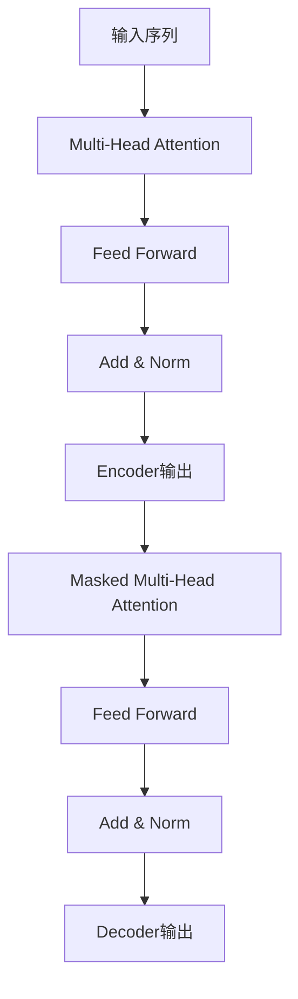
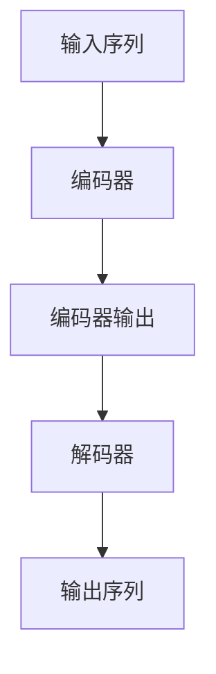

# 大语言模型原理与工程实践：MassiveText

## 1.背景介绍

### 1.1 人工智能的发展历程

人工智能(Artificial Intelligence, AI)是当代科技发展的重要领域,旨在使机器具备类似于人类的认知能力,如学习、推理、规划和解决问题等。自20世纪50年代AI概念被正式提出以来,经历了几个重要的发展阶段。

- 早期阶段(1950s-1960s):专家系统、博弈树搜索等基础理论和算法被提出。
- 知识驱动阶段(1970s-1980s):发展知识库、逻辑推理等技术,但遇到了困难。
- 统计学习阶段(1990s-2000s):机器学习、神经网络等数据驱动方法兴起。
- 深度学习时代(2010s-今):受益于大数据、算力提升,深度学习取得突破性进展。

### 1.2 大语言模型的兴起

在深度学习时代,自然语言处理(Natural Language Processing, NLP)成为AI的核心应用领域之一。传统的NLP方法主要基于规则和特征工程,需要大量人工设计。而随着深度学习的发展,基于大规模语料训练的语言模型(Language Model)成为主流方法。

大型语言模型(Large Language Model, LLM)通过在海量文本语料上训练,学习文本的统计规律,从而获得对自然语言的理解和生成能力。2018年,谷歌发布Transformer模型,展现了卓越的语言建模能力。2020年,OpenAI发布GPT-3大型语言模型,其庞大的参数规模(1750亿个参数)引起了极大关注。

## 2.核心概念与联系

### 2.1 语言模型的基本概念

语言模型是自然语言处理的基础,旨在学习文本序列的概率分布,即给定前面的词,预测下一个词的概率。形式化地,语言模型需要最大化训练语料库中所有句子的概率:

$$P(w_1, w_2, ..., w_n) = \prod_{i=1}^{n}P(w_i|w_1, ..., w_{i-1})$$

其中$w_i$表示第i个词。

基于上下文预测词的能力,语言模型可以用于多种NLP任务,如机器翻译、文本生成、问答系统等。

### 2.2 Transformer与自注意力机制

Transformer是一种全新的基于注意力机制的序列模型,不同于传统的循环神经网络(RNN)和卷积神经网络(CNN)。它完全基于注意力机制来捕捉输入和输出之间的依赖关系。

Transformer的关键是**自注意力(Self-Attention)**机制,它允许输入的每个单词都直接关注到其他单词,捕捉长距离依赖关系。这种全局关注机制大大提高了模型的表现能力。

### 2.3 预训练与微调策略

大型语言模型通常采用两阶段训练策略:

1. **预训练(Pre-training)**: 在海量无标注文本数据上训练模型,学习通用的语言知识。
2. **微调(Fine-tuning)**: 在特定任务的少量标注数据上进一步训练,使模型适应特定任务。

预训练可以看作是模型获取先验知识的过程,而微调则是将这些知识迁移到特定任务中。这种策略大大提高了数据利用效率,缓解了标注数据稀缺的问题。

### 2.4 提示学习与少样本学习

除了传统的微调方法,近年来提示学习(Prompt Learning)和少样本学习(Few-Shot Learning)等新范式也被广泛研究和应用。

- **提示学习**: 通过设计合适的提示(Prompt),将任务描述嵌入到输入中,从而让预训练模型直接生成所需输出,无需进行微调。
- **少样本学习**: 利用大型语言模型在少量样本上的泛化能力,以少量标注数据完成特定任务,避免了大规模微调。

这些新范式进一步提高了大型语言模型的应用灵活性和数据效率。

## 3.核心算法原理具体操作步骤

### 3.1 Transformer模型架构

Transformer由编码器(Encoder)和解码器(Decoder)两部分组成。编码器将输入序列映射为连续的表示,解码器则基于编码器的输出生成目标序列。

1. **编码器(Encoder)**:
   - 输入嵌入(Input Embedding):将输入词元(token)映射为向量表示。
   - 位置编码(Positional Encoding):引入位置信息,因为自注意力机制没有位置信息。
   - 多头自注意力(Multi-Head Self-Attention):捕捉输入序列中词元之间的依赖关系。
   - 前馈神经网络(Feed-Forward Neural Network):对每个词元的表示进行非线性变换。
   - 残差连接(Residual Connection)和层归一化(Layer Normalization):提高训练稳定性。

2. **解码器(Decoder)**:
   - 输出嵌入(Output Embedding):将上一时间步的输出词元映射为向量表示。
   - 掩码多头自注意力(Masked Multi-Head Self-Attention):只关注当前位置之前的输出。
   - 多头编码器-解码器注意力(Multi-Head Encoder-Decoder Attention):将解码器状态与编码器输出对齐。
   - 前馈神经网络、残差连接和层归一化:与编码器类似。

### 3.2 自注意力机制细节

自注意力机制是Transformer的核心,它通过计算查询(Query)与键(Key)的相似性,获得值(Value)的加权和作为输出。

对于序列中的每个词元$x_i$,计算步骤如下:

1. 线性投影:将$x_i$分别映射为查询$q_i$、键$k_i$和值$v_i$。
   
   $$q_i = x_iW^Q, k_i = x_iW^K, v_i = x_iW^V$$

2. 计算注意力分数:查询$q_i$与所有键$k_j$计算相似性(点积)得到未缩放的注意力分数。
   
   $$e_{ij} = q_i^Tk_j$$

3. 缩放和软化:对注意力分数进行缩放和softmax操作,得到注意力权重。
   
   $$a_{ij} = \mathrm{softmax}(e_{ij}/\sqrt{d_k})$$

   其中$d_k$是键的维度,缩放是为了避免过大的点积导致梯度饱和。

4. 加权求和:使用注意力权重$a_{ij}$对值$v_j$进行加权求和,得到$x_i$的注意力输出。
   
   $$\mathrm{Attention}(x_i) = \sum_{j=1}^n a_{ij}v_j$$

多头注意力机制(Multi-Head Attention)是将多个注意力头的输出进行拼接,捕捉不同的依赖关系模式。

### 3.3 模型预训练

大型语言模型通常采用自监督的方式在大规模无标注语料上进行预训练,学习通用的语言表示。常见的预训练目标包括:

- **掩码语言模型(Masked Language Modeling, MLM)**: 随机掩码部分输入词元,模型需要预测被掩码的词元。
- **下一句预测(Next Sentence Prediction, NSP)**: 判断两个句子是否为连续句子。
- **因果语言模型(Causal Language Modeling, CLM)**: 基于前文预测下一个词元。
- **序列到序列预训练(Sequence-to-Sequence Pre-training)**: 在成对句子上预训练序列到序列的生成模型。

通过预训练,模型可以学习到丰富的语义和语法知识,为后续的微调或提示学习等任务奠定基础。

### 3.4 模型微调和提示学习

在完成预训练后,可以将大型语言模型应用到下游任务中。常见的方法包括:

1. **微调(Fine-tuning)**: 在特定任务的标注数据上继续训练模型,通过调整全部或部分参数使模型适应该任务。

2. **提示学习(Prompt Learning)**: 设计合适的提示模板,将任务描述嵌入到输入中,让预训练模型直接生成所需输出,无需微调。提示可以是离散的文本提示或连续的前缀提示。

3. **少样本学习(Few-Shot Learning)**: 利用大型语言模型在少量标注样本上的泛化能力,通过构造合适的提示和示例,让模型快速适应新任务。

不同的方法在效果、计算开销和数据需求上各有特点,需要根据具体场景进行权衡选择。

## 4.数学模型和公式详细讲解举例说明

### 4.1 自注意力机制数学模型

自注意力机制是Transformer的核心,它通过计算查询(Query)与键(Key)的相似性,获得值(Value)的加权和作为输出。具体计算过程如下:

1. 线性投影:将输入$x$分别映射为查询$q$、键$k$和值$v$。
   
   $$q = xW^Q, k = xW^K, v = xW^V$$

   其中$W^Q, W^K, W^V$是可学习的投影矩阵。

2. 计算注意力分数:查询$q$与所有键$k_j$计算相似性(点积)得到未缩放的注意力分数$e_{ij}$。
   
   $$e_{ij} = q^Tk_j$$

3. 缩放和软化:对注意力分数进行缩放和softmax操作,得到注意力权重$a_{ij}$。
   
   $$a_{ij} = \mathrm{softmax}(e_{ij}/\sqrt{d_k})$$

   其中$d_k$是键的维度,缩放是为了避免过大的点积导致梯度饱和。

4. 加权求和:使用注意力权重$a_{ij}$对值$v_j$进行加权求和,得到输出$z$。
   
   $$z = \mathrm{Attention}(x) = \sum_{j=1}^n a_{ij}v_j$$

多头注意力机制(Multi-Head Attention)是将多个注意力头的输出进行拼接,捕捉不同的依赖关系模式。对于$h$个注意力头,计算过程为:

$$\mathrm{MultiHead}(x) = \mathrm{Concat}(z_1, z_2, ..., z_h)W^O$$

其中$z_i$是第$i$个注意力头的输出,最后通过一个可学习的线性变换$W^O$将它们拼接。

以上是自注意力机制的核心数学模型,它使Transformer能够直接捕捉输入序列中任意两个位置之间的依赖关系,是实现长期依赖建模的关键。

### 4.2 掩码语言模型目标函数

掩码语言模型(Masked Language Modeling, MLM)是大型语言模型预训练的一种常用目标,它要求模型预测被随机掩码的词元。

假设输入序列为$\mathbf{x} = (x_1, x_2, ..., x_n)$,其中$x_i$是第$i$个词元。我们随机选择一些位置进行掩码,得到掩码后的序列$\mathbf{\hat{x}}$。模型的目标是最大化掩码位置的条件概率:

$$\mathcal{L}_\mathrm{MLM} = \mathbb{E}_{\mathbf{\hat{x}}} \left[ -\log P(\mathbf{x}_\mathrm{masked} | \mathbf{\hat{x}}) \right]$$

其中$\mathbf{x}_\mathrm{masked}$表示被掩码的词元。

对于每个掩码位置$i$,我们需要最大化其条件概率:

$$\log P(x_i | \mathbf{\hat{x}}) = \mathbf{e}_i^\top \mathbf{h}_i$$

其中$\mathbf{e}_i$是词元$x_i$的词嵌入向量,$\mathbf{h}_i$是模型在位置$i$的输出向量。

通过最小化掩码语言模型的损失函数,模型可以学习到捕捉上下文信息、预测