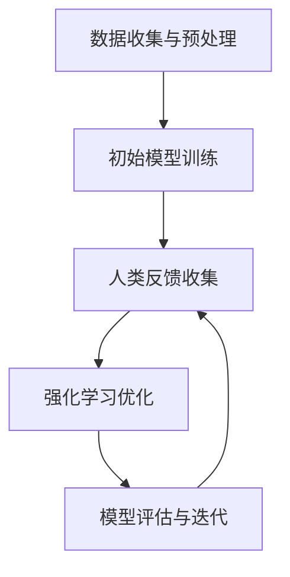

# 大语言模型原理与工程实践：RLHF 实战框架

## 1.背景介绍

近年来，人工智能领域的进展突飞猛进，特别是在自然语言处理（NLP）方面。大语言模型（Large Language Models, LLMs）如GPT-3、BERT等，已经在多个应用场景中展现了其强大的能力。然而，这些模型的训练和优化过程复杂且资源密集。强化学习与人类反馈（Reinforcement Learning with Human Feedback, RLHF）作为一种新兴的优化方法，正在逐渐成为提升大语言模型性能的重要手段。

## 2.核心概念与联系

### 2.1 大语言模型（LLMs）

大语言模型是基于深度学习的自然语言处理模型，通常包含数十亿甚至上千亿个参数。它们通过大量的文本数据进行训练，能够生成高质量的自然语言文本。

### 2.2 强化学习（Reinforcement Learning, RL）

强化学习是一种机器学习方法，通过与环境的交互来学习策略，以最大化累积奖励。RL在游戏、机器人控制等领域有广泛应用。

### 2.3 人类反馈（Human Feedback）

人类反馈是指在模型训练过程中，利用人类的评价和建议来指导模型的优化。通过结合人类反馈，模型可以更好地理解和生成符合人类期望的文本。

### 2.4 RLHF 的联系

RLHF 将强化学习与人类反馈结合，通过人类的评价来指导模型的优化过程，从而提升模型的性能和生成文本的质量。

## 3.核心算法原理具体操作步骤

### 3.1 数据收集与预处理

首先，需要收集大量的文本数据，并进行预处理，包括去除噪声、分词、标注等。

### 3.2 初始模型训练

使用预处理后的数据训练初始大语言模型，通常采用自监督学习方法，如掩码语言模型（Masked Language Model, MLM）或自回归模型（Autoregressive Model）。

### 3.3 人类反馈收集

在初始模型的基础上，生成一系列文本，并通过人类评价这些文本的质量。评价标准可以包括流畅性、相关性、准确性等。

### 3.4 强化学习优化

利用人类反馈的评价结果，构建奖励函数，并通过强化学习算法（如策略梯度、Q-learning）优化模型参数。

### 3.5 模型评估与迭代

对优化后的模型进行评估，评估指标可以包括BLEU、ROUGE等。根据评估结果，进一步收集人类反馈，迭代优化模型。



## 4.数学模型和公式详细讲解举例说明

### 4.1 强化学习基本公式

强化学习的目标是找到一个策略 $\pi$，使得在给定状态 $s$ 下，采取动作 $a$ 的期望回报最大化。其数学表达式为：

$$
J(\pi) = \mathbb{E}_{\pi} \left[ \sum_{t=0}^{\infty} \gamma^t R_t \right]
$$

其中，$R_t$ 是时间步 $t$ 的奖励，$\gamma$ 是折扣因子。

### 4.2 奖励函数构建

在 RLHF 中，奖励函数 $R$ 由人类反馈决定。假设有 $N$ 个反馈样本，每个样本的反馈值为 $r_i$，则奖励函数可以表示为：

$$
R = \frac{1}{N} \sum_{i=1}^{N} r_i
$$

### 4.3 策略梯度优化

策略梯度方法通过优化策略 $\pi$ 的参数 $\theta$ 来最大化期望回报。其梯度计算公式为：

$$
\nabla_{\theta} J(\pi_{\theta}) = \mathbb{E}_{\pi_{\theta}} \left[ \nabla_{\theta} \log \pi_{\theta}(a|s) Q^{\pi_{\theta}}(s, a) \right]
$$

其中，$Q^{\pi_{\theta}}(s, a)$ 是状态-动作值函数。

## 5.项目实践：代码实例和详细解释说明

### 5.1 数据预处理

```python
import pandas as pd
from sklearn.model_selection import train_test_split

# 加载数据
data = pd.read_csv('text_data.csv')

# 数据预处理
data['cleaned_text'] = data['text'].apply(lambda x: preprocess_text(x))

# 划分训练集和测试集
train_data, test_data = train_test_split(data, test_size=0.2, random_state=42)
```

### 5.2 初始模型训练

```python
from transformers import GPT2LMHeadModel, GPT2Tokenizer, Trainer, TrainingArguments

# 加载模型和分词器
model = GPT2LMHeadModel.from_pretrained('gpt2')
tokenizer = GPT2Tokenizer.from_pretrained('gpt2')

# 数据集准备
train_encodings = tokenizer(train_data['cleaned_text'].tolist(), truncation=True, padding=True)
test_encodings = tokenizer(test_data['cleaned_text'].tolist(), truncation=True, padding=True)

# 训练参数设置
training_args = TrainingArguments(
    output_dir='./results',
    num_train_epochs=3,
    per_device_train_batch_size=4,
    per_device_eval_batch_size=4,
    warmup_steps=500,
    weight_decay=0.01,
    logging_dir='./logs',
)

# 训练模型
trainer = Trainer(
    model=model,
    args=training_args,
    train_dataset=train_encodings,
    eval_dataset=test_encodings,
)

trainer.train()
```

### 5.3 人类反馈收集

```python
# 假设我们有一个函数 collect_human_feedback 用于收集人类反馈
feedback_data = collect_human_feedback(model, test_data)

# 将反馈数据转换为奖励值
rewards = feedback_data['feedback'].apply(lambda x: convert_feedback_to_reward(x))
```

### 5.4 强化学习优化

```python
import torch
from torch.optim import Adam

# 定义奖励函数
def reward_function(output, feedback):
    return torch.mean(feedback)

# 强化学习优化
optimizer = Adam(model.parameters(), lr=1e-5)

for epoch in range(10):
    for batch in train_encodings:
        outputs = model(**batch)
        rewards = reward_function(outputs, feedback_data)
        loss = -torch.mean(rewards)
        
        optimizer.zero_grad()
        loss.backward()
        optimizer.step()
```

### 5.5 模型评估与迭代

```python
from sklearn.metrics import accuracy_score

# 模型评估
predictions = model.generate(test_encodings['input_ids'])
accuracy = accuracy_score(test_data['labels'], predictions)

print(f'模型准确率: {accuracy}')
```

## 6.实际应用场景

### 6.1 对话系统

RLHF 可以用于优化对话系统，使其生成的回复更加符合用户期望，提高用户满意度。

### 6.2 内容生成

在内容生成领域，如新闻写作、广告文案等，RLHF 可以帮助生成更具创意和吸引力的文本。

### 6.3 机器翻译

通过结合人类反馈，RLHF 可以提升机器翻译的准确性和流畅性，生成更符合目标语言习惯的译文。

## 7.工具和资源推荐

### 7.1 工具

- **Transformers**：Hugging Face 提供的开源库，支持多种预训练语言模型。
- **TensorFlow** 和 **PyTorch**：两大主流深度学习框架，支持自定义模型训练和优化。
- **OpenAI Gym**：强化学习环境库，提供多种模拟环境。

### 7.2 资源

- **论文**：阅读相关领域的最新研究论文，如《Fine-Tuning Language Models from Human Preferences》。
- **教程**：在线教程和课程，如 Coursera、Udacity 提供的强化学习和自然语言处理课程。
- **社区**：加入相关技术社区，如 GitHub、Stack Overflow，与其他开发者交流经验。

## 8.总结：未来发展趋势与挑战

### 8.1 未来发展趋势

- **多模态学习**：结合图像、音频等多种模态的数据，提升模型的综合理解能力。
- **自监督学习**：进一步探索自监督学习方法，减少对标注数据的依赖。
- **模型压缩与优化**：研究模型压缩和优化技术，提升大语言模型的运行效率。

### 8.2 挑战

- **数据隐私与安全**：在收集和使用人类反馈时，需注意数据隐私和安全问题。
- **计算资源**：大语言模型的训练和优化需要大量计算资源，如何高效利用资源是一个重要挑战。
- **伦理问题**：确保模型生成的内容符合伦理规范，避免产生有害或偏见的文本。

## 9.附录：常见问题与解答

### 9.1 RLHF 的优势是什么？

RLHF 结合了强化学习和人类反馈的优势，能够更好地优化模型，使其生成的文本更符合人类期望。

### 9.2 如何收集高质量的人类反馈？

可以通过众包平台、专家评审等方式收集高质量的人类反馈，确保反馈的准确性和可靠性。

### 9.3 RLHF 的应用场景有哪些？

RLHF 可以应用于对话系统、内容生成、机器翻译等多个领域，提升模型的性能和生成文本的质量。

### 9.4 如何评估 RLHF 模型的性能？

可以使用 BLEU、ROUGE 等评估指标，以及用户满意度调查等方法，综合评估 RLHF 模型的性能。

### 9.5 RLHF 的未来发展方向是什么？

未来，RLHF 将在多模态学习、自监督学习、模型压缩与优化等方面取得更多进展，进一步提升大语言模型的性能和应用范围。

---

作者：禅与计算机程序设计艺术 / Zen and the Art of Computer Programming