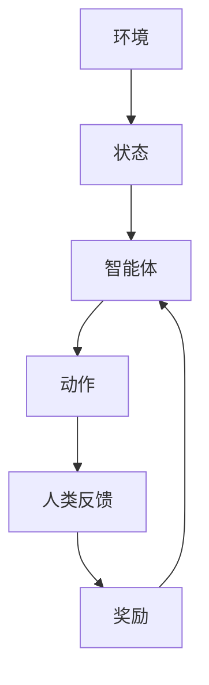

# 大语言模型原理与工程实践：RLHF 算法

## 1.背景介绍

近年来，人工智能领域的进展突飞猛进，尤其是在自然语言处理（NLP）方面。大语言模型（Large Language Models, LLMs）如GPT-3、BERT等，已经在多个应用场景中展现了其强大的能力。然而，这些模型的训练和优化过程依然充满挑战。强化学习（Reinforcement Learning, RL）与人类反馈（Human Feedback, HF）的结合，即RLHF（Reinforcement Learning with Human Feedback），为大语言模型的优化提供了一种新颖且有效的方法。

RLHF的核心思想是通过人类反馈来指导强化学习的训练过程，从而使模型更符合人类的期望和需求。这种方法不仅可以提高模型的性能，还能在一定程度上解决模型偏见和伦理问题。本文将深入探讨RLHF的原理、算法、数学模型、实际应用以及未来发展趋势。

## 2.核心概念与联系

### 2.1 强化学习（Reinforcement Learning）

强化学习是一种机器学习方法，通过与环境的交互来学习策略，以最大化累积奖励。RL的基本组成部分包括：

- **状态（State, S）**：环境的当前情况。
- **动作（Action, A）**：智能体在特定状态下可以采取的行为。
- **奖励（Reward, R）**：智能体采取某个动作后获得的反馈。
- **策略（Policy, π）**：智能体在各个状态下选择动作的规则。

### 2.2 人类反馈（Human Feedback）

人类反馈是指通过人类的评价或指导来调整模型的行为。常见的人类反馈形式包括：

- **直接反馈**：人类直接对模型的输出进行评价。
- **间接反馈**：通过用户行为（如点击、停留时间等）间接反映对模型输出的满意度。

### 2.3 RLHF的联系

RLHF将强化学习与人类反馈结合，通过人类反馈来调整强化学习的奖励函数，使得模型的行为更符合人类的期望。其基本流程如下：



## 3.核心算法原理具体操作步骤

### 3.1 数据收集

首先，需要收集大量的训练数据，包括模型的输入、输出以及人类对输出的反馈。这些数据可以通过问卷调查、用户行为分析等方式获得。

### 3.2 奖励函数设计

根据人类反馈设计奖励函数。奖励函数的设计需要考虑多方面因素，如准确性、流畅性、伦理性等。常见的奖励函数形式包括：

$$
R(s, a) = \sum_{i=1}^{n} w_i \cdot f_i(s, a)
$$

其中，$w_i$ 是权重，$f_i(s, a)$ 是不同维度的反馈函数。

### 3.3 策略优化

使用强化学习算法（如Q-learning、Policy Gradient等）对策略进行优化。具体步骤如下：

1. **初始化策略**：随机初始化策略 $\pi$。
2. **采样数据**：根据当前策略 $\pi$ 采样状态-动作对 $(s, a)$。
3. **计算奖励**：根据人类反馈计算奖励 $R(s, a)$。
4. **更新策略**：使用RL算法更新策略 $\pi$。

### 3.4 模型训练

将优化后的策略应用于大语言模型的训练过程中，不断迭代，直到模型性能达到预期。

## 4.数学模型和公式详细讲解举例说明

### 4.1 马尔可夫决策过程（MDP）

RLHF的数学基础是马尔可夫决策过程（Markov Decision Process, MDP），其定义为一个五元组 $(S, A, P, R, \gamma)$：

- $S$：状态空间
- $A$：动作空间
- $P$：状态转移概率
- $R$：奖励函数
- $\gamma$：折扣因子

### 4.2 奖励函数设计

假设我们有一个简单的对话系统，其状态 $s$ 是当前对话的上下文，动作 $a$ 是系统的回复。人类反馈 $f$ 可以是对回复的评分（如1到5分）。奖励函数可以设计为：

$$
R(s, a) = \alpha \cdot f(s, a) + \beta \cdot g(s, a)
$$

其中，$g(s, a)$ 是对话的流畅性评分，$\alpha$ 和 $\beta$ 是权重。

### 4.3 策略优化

使用策略梯度方法优化策略 $\pi$。策略梯度的更新公式为：

$$
\nabla J(\pi) = \mathbb{E}_{\pi} \left[ \nabla \log \pi(a|s) Q^{\pi}(s, a) \right]
$$

其中，$Q^{\pi}(s, a)$ 是状态-动作值函数，表示在状态 $s$ 采取动作 $a$ 后的期望累积奖励。

### 4.4 实例说明

假设我们有以下对话数据：

- 状态 $s_1$：用户问候
- 动作 $a_1$：系统回复“你好”
- 人类反馈 $f_1$：4分

奖励函数为：

$$
R(s_1, a_1) = 0.8 \cdot 4 + 0.2 \cdot 3 = 3.8
$$

使用策略梯度方法更新策略：

$$
\nabla J(\pi) = \mathbb{E}_{\pi} \left[ \nabla \log \pi(a_1|s_1) \cdot 3.8 \right]
$$

## 5.项目实践：代码实例和详细解释说明

### 5.1 环境设置

首先，确保安装了必要的Python库：

```bash
pip install numpy pandas tensorflow
```

### 5.2 数据准备

假设我们有一个对话数据集，包含状态、动作和人类反馈：

```python
import pandas as pd

data = {
    'state': ['greeting', 'question', 'farewell'],
    'action': ['hello', 'answer', 'goodbye'],
    'feedback': [4, 3, 5]
}

df = pd.DataFrame(data)
```

### 5.3 奖励函数设计

定义奖励函数：

```python
def reward_function(feedback, fluency):
    alpha = 0.8
    beta = 0.2
    return alpha * feedback + beta * fluency
```

### 5.4 策略优化

使用TensorFlow实现策略梯度方法：

```python
import tensorflow as tf

class PolicyGradient:
    def __init__(self, state_size, action_size):
        self.state_size = state_size
        self.action_size = action_size
        self.model = self.build_model()

    def build_model(self):
        model = tf.keras.Sequential([
            tf.keras.layers.Dense(24, input_dim=self.state_size, activation='relu'),
            tf.keras.layers.Dense(24, activation='relu'),
            tf.keras.layers.Dense(self.action_size, activation='softmax')
        ])
        model.compile(optimizer='adam', loss='categorical_crossentropy')
        return model

    def train(self, states, actions, rewards):
        discounted_rewards = self.discount_rewards(rewards)
        self.model.fit(states, actions, sample_weight=discounted_rewards, verbose=0)

    def discount_rewards(self, rewards, gamma=0.95):
        discounted_rewards = np.zeros_like(rewards)
        cumulative = 0
        for i in reversed(range(len(rewards))):
            cumulative = cumulative * gamma + rewards[i]
            discounted_rewards[i] = cumulative
        return discounted_rewards
```

### 5.5 模型训练

训练模型：

```python
states = np.array([[1, 0, 0], [0, 1, 0], [0, 0, 1]])
actions = np.array([[1, 0, 0], [0, 1, 0], [0, 0, 1]])
feedbacks = np.array([4, 3, 5])
fluency_scores = np.array([3, 4, 5])

rewards = reward_function(feedbacks, fluency_scores)

pg = PolicyGradient(state_size=3, action_size=3)
pg.train(states, actions, rewards)
```

## 6.实际应用场景

### 6.1 对话系统

RLHF可以用于优化对话系统，使其回复更符合用户期望。例如，通过用户对回复的评分来调整系统的策略，使得系统能够生成更自然、更有用的回复。

### 6.2 内容生成

在内容生成领域，如新闻生成、文章写作等，RLHF可以通过用户反馈来优化生成的内容，使其更符合读者的需求和偏好。

### 6.3 推荐系统

推荐系统可以通过用户的点击、停留时间等行为数据作为反馈，使用RLHF来优化推荐策略，提高推荐的准确性和用户满意度。

## 7.工具和资源推荐

### 7.1 开源库

- **TensorFlow**：一个开源的机器学习框架，支持RL和深度学习。
- **PyTorch**：另一个流行的深度学习框架，具有强大的RL支持。
- **OpenAI Gym**：一个用于开发和比较RL算法的工具包。

### 7.2 在线课程

- **Coursera**：提供多门关于RL和NLP的在线课程。
- **Udacity**：提供强化学习纳米学位课程。

### 7.3 书籍推荐

- **《强化学习：原理与实践》**：详细介绍了RL的基本原理和应用。
- **《深度学习》**：涵盖了深度学习的基础知识和前沿进展。

## 8.总结：未来发展趋势与挑战

### 8.1 未来发展趋势

随着大语言模型和RLHF技术的不断发展，未来可能会出现以下趋势：

- **更高效的训练方法**：通过优化算法和硬件，加速模型的训练过程。
- **更智能的反馈机制**：利用更多维度的反馈数据，提高模型的性能。
- **跨领域应用**：RLHF技术将不仅限于NLP，还将应用于图像处理、机器人控制等领域。

### 8.2 挑战

尽管RLHF技术前景广阔，但仍面临一些挑战：

- **数据质量**：高质量的人类反馈数据难以获取，数据噪声可能影响模型性能。
- **计算资源**：大语言模型的训练需要大量计算资源，成本高昂。
- **伦理问题**：如何确保模型的行为符合伦理规范，避免偏见和歧视。

## 9.附录：常见问题与解答

### 9.1 RLHF与传统RL有何不同？

RLHF结合了人类反馈，使得模型的奖励函数更符合人类的期望，而传统RL通常依赖于预定义的奖励函数。

### 9.2 如何获取高质量的人类反馈数据？

可以通过问卷调查、用户行为分析等方式获取高质量的人类反馈数据。此外，设计合理的反馈机制，确保反馈的准确性和代表性也非常重要。

### 9.3 RLHF的计算成本如何控制？

可以通过优化算法、使用高效的硬件设备以及分布式计算等方式来控制RLHF的计算成本。

### 9.4 RLHF在实际应用中有哪些成功案例？

RLHF已经在对话系统、内容生成、推荐系统等领域取得了一些成功案例。例如，OpenAI的GPT-3在对话生成中的表现得到了广泛认可。

---

作者：禅与计算机程序设计艺术 / Zen and the Art of Computer Programming