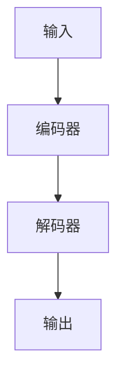

# 大语言模型原理与工程实践：大语言模型为什么需要提示工程

## 1.背景介绍

大语言模型（Large Language Models, LLMs）近年来在自然语言处理（NLP）领域取得了显著的进展。诸如GPT-3、BERT等模型在各种任务中表现出色，从文本生成到翻译，再到问答系统。然而，尽管这些模型具备强大的能力，它们的实际应用仍然面临许多挑战。提示工程（Prompt Engineering）作为一种新兴的技术手段，正在逐渐成为解决这些挑战的关键。

### 1.1 大语言模型的崛起

大语言模型的崛起源于深度学习和大数据的结合。通过训练海量的文本数据，这些模型能够捕捉语言的复杂结构和语义关系。以下是大语言模型发展的几个重要里程碑：

- **2018年**：BERT（Bidirectional Encoder Representations from Transformers）发布，首次引入双向Transformer架构，显著提升了NLP任务的性能。
- **2020年**：GPT-3（Generative Pre-trained Transformer 3）发布，拥有1750亿参数，展示了强大的文本生成能力。

### 1.2 提示工程的定义

提示工程是指通过设计和优化输入提示（Prompts），以引导大语言模型生成期望输出的技术。提示可以是一个问题、一段文本或其他形式的输入，目的是激发模型的潜在能力，使其在特定任务中表现更佳。

### 1.3 提示工程的重要性

提示工程的重要性体现在以下几个方面：

- **提高模型性能**：通过优化提示，可以显著提高模型在特定任务中的表现。
- **降低训练成本**：相比于重新训练模型，优化提示是一种更为经济高效的方法。
- **增强模型可解释性**：通过分析提示与输出的关系，可以更好地理解模型的内部机制。

## 2.核心概念与联系

在深入探讨提示工程之前，我们需要了解一些核心概念及其相互关系。这些概念包括大语言模型的基本结构、提示的类型和设计原则等。

### 2.1 大语言模型的基本结构

大语言模型通常基于Transformer架构，其核心组件包括编码器（Encoder）和解码器（Decoder）。以下是一个简化的Transformer架构图：



### 2.2 提示的类型

提示可以分为以下几种类型：

- **直接提示**：直接给出问题或任务描述，例如“翻译这句话：Hello, world!”。
- **上下文提示**：提供相关的上下文信息，以帮助模型理解任务，例如“在以下段落中找到主要观点：...”。

### 2.3 提示设计原则

设计有效提示的原则包括：

- **明确性**：提示应当清晰明确，避免歧义。
- **简洁性**：提示应尽量简洁，避免冗长。
- **相关性**：提示应与任务高度相关，提供必要的信息。

## 3.核心算法原理具体操作步骤

提示工程的核心算法涉及提示的生成、优化和评估。以下是具体的操作步骤：

### 3.1 提示生成

提示生成是提示工程的第一步，通常包括以下几个步骤：

1. **任务分析**：明确任务目标和要求。
2. **提示设计**：根据任务设计初步提示。
3. **提示优化**：通过实验和反馈不断优化提示。

### 3.2 提示优化

提示优化是提示工程的关键步骤，通常包括以下几种方法：

- **实验法**：通过多次实验，比较不同提示的效果。
- **反馈法**：根据模型输出的反馈，调整提示内容。
- **自动化方法**：利用算法自动生成和优化提示。

### 3.3 提示评估

提示评估是提示工程的最后一步，通常包括以下几种方法：

- **定量评估**：通过准确率、召回率等指标评估提示效果。
- **定性评估**：通过人工评估模型输出的质量。

## 4.数学模型和公式详细讲解举例说明

提示工程不仅仅是一个经验性的过程，还涉及到一些数学模型和公式。以下是一些关键的数学概念和公式。

### 4.1 语言模型的概率分布

大语言模型的核心是概率分布 $P(w_1, w_2, ..., w_n)$，表示给定前面单词序列时下一个单词的概率。这个概率分布可以通过以下公式表示：

$$
P(w_1, w_2, ..., w_n) = \prod_{i=1}^{n} P(w_i | w_1, w_2, ..., w_{i-1})
$$

### 4.2 提示的影响

提示工程的目标是通过设计提示 $T$，最大化模型在特定任务中的表现。假设任务的目标是生成特定输出 $O$，则提示 $T$ 的影响可以表示为：

$$
P(O | T) = \sum_{w_1, w_2, ..., w_n} P(O | w_1, w_2, ..., w_n) P(w_1, w_2, ..., w_n | T)
$$

### 4.3 提示优化的数学模型

提示优化可以看作是一个优化问题，目标是找到最优提示 $T^*$，使得目标函数 $f(T)$ 最大化：

$$
T^* = \arg\max_{T} f(T)
$$

其中，$f(T)$ 可以是模型在特定任务中的表现指标，例如准确率或召回率。

## 5.项目实践：代码实例和详细解释说明

为了更好地理解提示工程的实际应用，我们将通过一个具体的项目实例来展示如何设计和优化提示。

### 5.1 项目背景

假设我们要构建一个问答系统，用户输入一个问题，系统返回一个答案。我们将使用GPT-3作为大语言模型，并通过提示工程来优化系统的表现。

### 5.2 代码实例

以下是一个简单的代码实例，展示如何使用提示工程优化问答系统：

```python
import openai

# 设置API密钥
openai.api_key = 'your-api-key'

# 定义初步提示
prompt = "Q: 什么是人工智能？\nA:"

# 调用GPT-3模型
response = openai.Completion.create(
    engine="davinci",
    prompt=prompt,
    max_tokens=50
)

# 输出答案
print(response.choices[0].text.strip())
```

### 5.3 详细解释

1. **设置API密钥**：首先，我们需要设置OpenAI的API密钥，以便调用GPT-3模型。
2. **定义初步提示**：我们定义了一个初步提示，包含一个问题“什么是人工智能？”。
3. **调用GPT-3模型**：通过调用OpenAI的Completion接口，我们可以生成答案。
4. **输出答案**：最后，我们输出模型生成的答案。

### 5.4 提示优化

为了优化提示，我们可以尝试不同的提示设计，并比较其效果。例如，我们可以添加更多的上下文信息，或调整提示的格式：

```python
# 优化提示
prompt = "在以下段落中找到主要观点：\n\n人工智能是计算机科学的一个分支，旨在创建能够执行通常需要人类智能的任务的系统。\n\nQ: 什么是人工智能？\nA:"

# 调用GPT-3模型
response = openai.Completion.create(
    engine="davinci",
    prompt=prompt,
    max_tokens=50
)

# 输出答案
print(response.choices[0].text.strip())
```

## 6.实际应用场景

提示工程在实际应用中有广泛的应用场景，以下是几个典型的例子。

### 6.1 文本生成

在文本生成任务中，提示工程可以帮助模型生成更符合预期的文本。例如，在新闻生成、故事创作等任务中，通过设计合适的提示，可以引导模型生成更具创意和连贯性的文本。

### 6.2 机器翻译

在机器翻译任务中，提示工程可以帮助模型更准确地翻译复杂句子。例如，通过提供上下文信息或特定的翻译风格提示，可以提高翻译的准确性和流畅性。

### 6.3 问答系统

在问答系统中，提示工程可以帮助模型更准确地回答用户问题。例如，通过设计合适的提示，可以引导模型生成更相关和准确的答案。

### 6.4 情感分析

在情感分析任务中，提示工程可以帮助模型更准确地识别文本的情感倾向。例如，通过提供情感词汇或上下文信息提示，可以提高情感分析的准确性。

## 7.工具和资源推荐

为了更好地进行提示工程，以下是一些推荐的工具和资源。

### 7.1 工具

- **OpenAI GPT-3**：强大的大语言模型，支持多种NLP任务。
- **Hugging Face Transformers**：开源的Transformer模型库，支持多种大语言模型。
- **Google Colab**：免费的在线代码编辑和运行环境，支持Python和深度学习框架。

### 7.2 资源

- **OpenAI API文档**：详细的API使用指南和示例代码。
- **Hugging Face文档**：详细的模型使用指南和示例代码。
- **NLP课程和教程**：Coursera、edX等平台提供的NLP课程和教程。

## 8.总结：未来发展趋势与挑战

提示工程作为一种新兴的技术手段，正在逐渐成为大语言模型应用中的关键。然而，提示工程也面临一些挑战和未来的发展趋势。

### 8.1 未来发展趋势

- **自动化提示生成**：未来，自动化提示生成技术将进一步发展，利用机器学习算法自动生成和优化提示。
- **多模态提示**：未来的提示工程将不仅限于文本提示，还将包括图像、音频等多模态提示。
- **个性化提示**：未来的提示工程将更加注重个性化，根据用户的需求和偏好设计提示。

### 8.2 挑战

- **提示设计的复杂性**：设计有效的提示需要深入理解任务和模型，具有一定的复杂性。
- **提示优化的成本**：提示优化需要大量的实验和反馈，可能会增加时间和资源成本。
- **提示效果的评估**：提示效果的评估需要综合考虑多种因素，具有一定的难度。

## 9.附录：常见问题与解答

### 9.1 什么是提示工程？

提示工程是指通过设计和优化输入提示，以引导大语言模型生成期望输出的技术。

### 9.2 提示工程的主要步骤是什么？

提示工程的主要步骤包括提示生成、提示优化和提示评估。

### 9.3 提示工程的应用场景有哪些？

提示工程的应用场景包括文本生成、机器翻译、问答系统和情感分析等。

### 9.4 提示工程面临哪些挑战？

提示工程面临的挑战包括提示设计的复杂性、提示优化的成本和提示效果的评估等。

### 9.5 如何开始学习提示工程？

可以通过阅读相关文献、参加NLP课程和教程、使用大语言模型API等方式开始学习提示工程。

---

作者：禅与计算机程序设计艺术 / Zen and the Art of Computer Programming