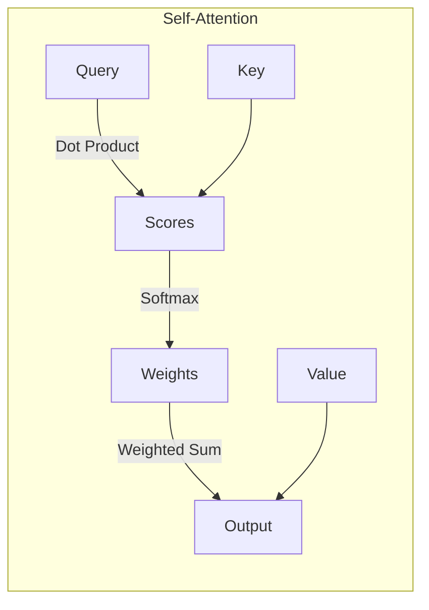

# 大语言模型原理与工程实践：局限和发展

## 1. 背景介绍

### 1.1 大语言模型的兴起

近年来,大型语言模型(Large Language Models, LLMs)在自然语言处理(NLP)领域掀起了一股热潮。这些模型通过在海量文本数据上进行预训练,学习语言的统计规律和语义关联,从而获得了强大的语言理解和生成能力。

代表性的大语言模型包括:

- GPT系列(Generative Pre-trained Transformer)
- BERT(Bidirectional Encoder Representations from Transformers)
- XLNet
- RoBERTa
- ALBERT
- T5(Text-to-Text Transfer Transformer)

这些模型展现出了令人惊叹的性能,在多项NLP任务上超越了人类水平,引发了学术界和工业界的广泛关注。

### 1.2 大语言模型的应用

大语言模型的强大能力为众多应用场景带来了新的可能性:

- 自然语言理解:文本分类、情感分析、问答系统等
- 自然语言生成:文本摘要、创作写作、对话系统等
- 多模态:图像描述、视频字幕、多模态问答等

大语言模型正在推动着人工智能在自然语言处理领域的飞速发展,为人机交互带来了全新的体验。

## 2. 核心概念与联系

### 2.1 自注意力机制(Self-Attention)

自注意力机制是大语言模型的核心组成部分,它允许模型捕捉输入序列中任意两个位置之间的关系。这种长程依赖建模能力是传统序列模型(如RNN)所缺乏的。

自注意力机制可以形式化表示为:

$$
\mathrm{Attention}(Q, K, V) = \mathrm{softmax}(\frac{QK^T}{\sqrt{d_k}})V
$$

其中 $Q$ 表示查询(Query)、$K$ 表示键(Key)、$V$ 表示值(Value),$d_k$ 是缩放因子。

### 2.2 transformer架构

Transformer是第一个完全基于自注意力机制的序列模型,它抛弃了RNN的递归结构,使用多头自注意力和前馈神经网络构建了一种全新的架构。

Transformer架构通过堆叠编码器(Encoder)和解码器(Decoder)层,实现了高效的序列到序列(Seq2Seq)建模。

### 2.3 预训练与微调(Pre-training & Fine-tuning)

大语言模型通常采用两阶段训练策略:

1. **预训练(Pre-training)**: 在大规模无监督文本数据上进行通用表示学习,捕捉语言的统计规律和语义信息。
2. **微调(Fine-tuning)**: 在特定的有监督数据集上进行任务适配,将预训练模型的知识迁移到下游任务。

预训练策略包括:

- **遮蔽语言模型(Masked Language Modeling, MLM)**: 随机遮蔽部分输入词,模型需要预测被遮蔽的词。
- **下一句预测(Next Sentence Prediction, NSP)**: 判断两个句子是否相邻。
- **因果语言模型(Causal Language Modeling, CLM)**: 给定前文,预测下一个词。
- **序列到序列预训练(Sequence-to-Sequence Pre-training)**: 在源序列和目标序列之间建模,用于序列生成任务。

微调过程通过在下游任务数据上进行梯度更新,将预训练模型的知识迁移到特定任务,从而获得出色的性能表现。

## 3. 核心算法原理具体操作步骤

### 3.1 Transformer编码器(Encoder)

Transformer编码器的核心操作步骤如下:

1. **输入嵌入(Input Embeddings)**: 将输入词元(token)映射到连续的向量空间。
2. **位置编码(Positional Encoding)**: 引入位置信息,因为自注意力机制没有位置信息。
3. **多头自注意力(Multi-Head Attention)**: 计算输入序列中每个位置与其他位置的注意力权重,捕捉长程依赖关系。
4. **残差连接(Residual Connection)**: 将注意力输出与输入相加,以保留原始信息。
5. **层归一化(Layer Normalization)**: 对残差连接的输出进行归一化,加速收敛。
6. **前馈神经网络(Feed-Forward Network)**: 对归一化后的输出应用两层全连接网络,进行非线性变换。
7. **残差连接和层归一化**: 与步骤4和5类似,将前馈网络的输出与输入相加,并进行归一化。
8. **堆叠编码器层(Stacked Encoder Layers)**: 重复步骤3-7,构建深层编码器。

编码器的输出表示将作为解码器的输入,用于生成目标序列。

### 3.2 Transformer解码器(Decoder)

Transformer解码器的核心操作步骤如下:

1. **遮蔽自注意力(Masked Self-Attention)**: 在自注意力计算中,遮蔽掉当前位置之后的信息,以保证自回归属性。
2. **编码器-解码器注意力(Encoder-Decoder Attention)**: 计算解码器输入与编码器输出之间的注意力权重,捕捉源序列和目标序列之间的关系。
3. **残差连接和层归一化**: 与编码器类似,对注意力输出进行残差连接和归一化。
4. **前馈神经网络(Feed-Forward Network)**: 对归一化后的输出应用两层全连接网络,进行非线性变换。
5. **残差连接和层归一化**: 与步骤3类似,对前馈网络的输出进行残差连接和归一化。
6. **线性层和softmax(Linear & Softmax)**: 将解码器输出映射到词元概率分布,用于生成目标序列的下一个词元。
7. **堆叠解码器层(Stacked Decoder Layers)**: 重复步骤1-6,构建深层解码器。

解码器通过与编码器的交互,生成目标序列的概率分布,实现序列到序列的建模。

## 4. 数学模型和公式详细讲解举例说明

### 4.1 自注意力(Self-Attention)

自注意力机制是Transformer的核心组成部分,它允许模型捕捉输入序列中任意两个位置之间的关系。自注意力的计算过程可以形式化表示为:

$$
\mathrm{Attention}(Q, K, V) = \mathrm{softmax}(\frac{QK^T}{\sqrt{d_k}})V
$$

其中:

- $Q$ 表示查询(Query)矩阵,用于计算当前位置与其他位置的相关性。
- $K$ 表示键(Key)矩阵,用于计算其他位置与当前位置的相关性。
- $V$ 表示值(Value)矩阵,包含了要关注的信息。
- $d_k$ 是缩放因子,用于防止点积过大导致的梯度饱和问题。

具体来说,自注意力的计算步骤如下:

1. 计算查询(Query)与所有键(Key)的点积,得到注意力分数矩阵。
2. 对注意力分数矩阵进行缩放,除以 $\sqrt{d_k}$。
3. 对缩放后的注意力分数矩阵应用softmax函数,得到注意力权重矩阵。
4. 将注意力权重矩阵与值(Value)矩阵相乘,得到加权和表示。

通过这种方式,自注意力机制可以自适应地捕捉输入序列中任意两个位置之间的关系,从而建模长程依赖。

### 4.2 多头自注意力(Multi-Head Attention)

多头自注意力是对单头自注意力的扩展,它可以从不同的子空间捕捉不同的关注模式,提高了模型的表示能力。多头自注意力的计算过程如下:

$$
\begin{aligned}
\mathrm{MultiHead}(Q, K, V) &= \mathrm{Concat}(\mathrm{head}_1, \dots, \mathrm{head}_h)W^O\\
\mathrm{where\ head}_i &= \mathrm{Attention}(QW_i^Q, KW_i^K, VW_i^V)
\end{aligned}
$$

其中:

- $h$ 表示头(Head)的数量。
- $W_i^Q \in \mathbb{R}^{d_\text{model} \times d_k}$、$W_i^K \in \mathbb{R}^{d_\text{model} \times d_k}$、$W_i^V \in \mathbb{R}^{d_\text{model} \times d_v}$ 分别是线性投影矩阵,用于将查询(Query)、键(Key)和值(Value)映射到不同的子空间。
- $W^O \in \mathbb{R}^{hd_v \times d_\text{model}}$ 是另一个线性投影矩阵,用于将多个头的输出拼接并映射回模型维度空间。

多头自注意力的计算步骤如下:

1. 将查询(Query)、键(Key)和值(Value)分别通过线性投影映射到不同的子空间。
2. 对于每个头,计算单头自注意力。
3. 将所有头的输出拼接在一起。
4. 将拼接后的输出通过线性投影映射回模型维度空间。

通过多头自注意力,模型可以从不同的子空间捕捉不同的关注模式,提高了表示能力和建模效果。

### 4.3 位置编码(Positional Encoding)

由于自注意力机制没有捕捉位置信息的能力,因此需要引入位置编码来赋予序列元素位置信息。位置编码的计算公式如下:

$$
\begin{aligned}
\mathrm{PE}_{(pos, 2i)} &= \sin\left(\frac{pos}{10000^{2i/d_\text{model}}}\right)\\
\mathrm{PE}_{(pos, 2i+1)} &= \cos\left(\frac{pos}{10000^{2i/d_\text{model}}}\right)
\end{aligned}
$$

其中:

- $pos$ 表示序列位置索引。
- $i$ 表示维度索引。
- $d_\text{model}$ 是模型的embedding维度。

位置编码是一个与位置有关的向量,它将被加到输入embedding上,赋予序列元素位置信息。通过使用不同的正弦和余弦函数,位置编码可以编码不同位置的信息,并且由于正弦和余弦函数的周期性,它可以很好地处理较长的序列。

### 4.4 层归一化(Layer Normalization)

层归一化是一种常用的归一化技术,它可以加速模型的收敛并提高训练稳定性。层归一化的计算公式如下:

$$
\mathrm{LN}(x) = \gamma \left(\frac{x - \mu}{\sigma}\right) + \beta
$$

其中:

- $x$ 表示输入向量。
- $\mu$ 和 $\sigma$ 分别是输入向量的均值和标准差,计算方式如下:

$$
\begin{aligned}
\mu &= \frac{1}{H}\sum_{i=1}^{H}x_i\\
\sigma &= \sqrt{\frac{1}{H}\sum_{i=1}^{H}(x_i - \mu)^2}
\end{aligned}
$$

- $\gamma$ 和 $\beta$ 是可学习的缩放和偏移参数,用于保留表示能力。

层归一化的计算过程如下:

1. 计算输入向量的均值 $\mu$ 和标准差 $\sigma$。
2. 对输入向量进行归一