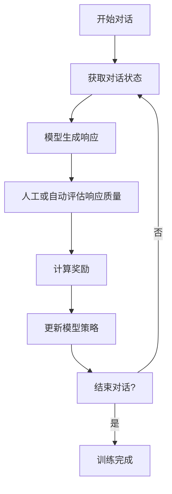

# 大语言模型原理与工程实践：强化学习工程实践 DeepSpeed-Chat 训练调优实践

## 1. 背景介绍

### 1.1 大语言模型的兴起

近年来,大型语言模型(Large Language Models, LLMs)在自然语言处理(NLP)领域取得了令人瞩目的成就。这些模型通过在大规模语料库上进行预训练,学习了丰富的语言知识和上下文信息,从而在下游任务中展现出了强大的泛化能力。

代表性的大语言模型包括 GPT-3、BERT、XLNet 等,它们在机器翻译、问答系统、文本生成等任务中表现出色。然而,训练如此庞大的模型需要耗费大量的计算资源,这对于大多数研究机构和企业来说是一个巨大的挑战。

### 1.2 DeepSpeed 和 DeepSpeed-Chat 的出现

为了解决上述挑战,微软推出了 DeepSpeed 库,旨在通过优化训练过程和利用多种加速技术来提高大型模型的训练效率。DeepSpeed 支持数据并行、模型并行、3D 并行等并行策略,以及ZeRO 优化器、激活重计算等优化技术,大幅降低了训练所需的内存占用。

基于 DeepSpeed,微软进一步开发了 DeepSpeed-Chat,这是一个专门用于训练大型对话模型的工具库。DeepSpeed-Chat 采用强化学习(Reinforcement Learning, RL)的方法,通过与人类对话互动来优化模型,使其能够生成更加自然、流畅的对话响应。

本文将深入探讨 DeepSpeed-Chat 的原理和实践,为读者提供一个全面的视角,了解如何利用强化学习和工程优化技术来训练高质量的大型对话模型。

## 2. 核心概念与联系

### 2.1 强化学习在对话系统中的应用

强化学习是一种基于环境交互的机器学习范式,其目标是通过试错和奖惩机制,学习一种策略,使得在给定环境下能够获得最大的累积奖励。在对话系统中,我们可以将对话过程视为一个马尔可夫决策过程(Markov Decision Process, MDP),其中:

- 状态(State)表示当前对话的上下文信息;
- 动作(Action)表示模型生成的响应;
- 奖励(Reward)反映了响应的质量,可以由人工标注或自动评估得到;
- 环境(Environment)指与用户的交互过程。

通过与用户进行大量对话互动,模型可以不断尝试不同的响应,根据获得的奖励来调整自身的策略,最终达到生成高质量对话的目标。

### 2.2 DeepSpeed-Chat 架构概览

DeepSpeed-Chat 是一个基于 PyTorch 的开源库,它集成了 DeepSpeed 的优化技术,并提供了强化学习训练框架。其核心组件包括:

1. **环境(Environment)**: 用于管理与人类的对话交互,包括接收用户输入、发送模型响应等。
2. **奖励模型(Reward Model)**: 用于评估模型生成的响应质量,可以是基于规则的自动评估器,也可以是由人工标注训练得到的机器学习模型。
3. **策略模型(Policy Model)**: 即待训练的大型对话模型,它根据当前对话状态生成响应。
4. **强化学习算法(RL Algorithm)**: 实现具体的强化学习算法,如 PPO、A2C 等,用于根据奖励信号更新策略模型的参数。
5. **DeepSpeed 优化器(DeepSpeed Optimizer)**: 利用 DeepSpeed 提供的各种优化技术,如 ZeRO、3D 并行等,加速策略模型的训练过程。

在训练过程中,DeepSpeed-Chat 将策略模型的响应发送给环境,环境与人类用户进行交互,并将用户反馈传递给奖励模型。奖励模型评估响应质量,生成奖励信号,强化学习算法根据这些信号更新策略模型的参数。同时,DeepSpeed 优化器负责优化训练过程,提高计算效率。

## 3. 核心算法原理具体操作步骤

### 3.1 PPO 算法

DeepSpeed-Chat 中常用的强化学习算法是 PPO(Proximal Policy Optimization),它是一种在策略梯度方法基础上改进的算法,具有更好的数据效率和稳定性。PPO 算法的核心思想是在每次策略更新时,限制新策略与旧策略之间的差异,以避免出现过大的策略变化导致训练不稳定。

PPO 算法的具体操作步骤如下:

1. 收集数据: 使用当前策略模型与环境进行交互,收集一批状态-动作-奖励的数据。
2. 计算优势函数(Advantage Function): 对于每个状态-动作对,计算其优势函数值,即该动作相对于当前策略的优势程度。
3. 计算策略比率(Policy Ratio): 计算新策略和旧策略在每个状态-动作对上的概率比值。
4. 计算目标函数(Objective Function): 将策略比率与优势函数值相乘,得到每个状态-动作对的目标函数值。
5. 裁剪目标函数(Clipped Objective): 为了限制策略更新的幅度,对目标函数进行裁剪,确保其在一定范围内。
6. 更新策略参数: 使用梯度上升法,最大化裁剪后的目标函数,从而更新策略模型的参数。

PPO 算法的数学表达式如下:

$$J^{CLIP}(\theta) = \mathbb{E}_t \left[ \min \left( r_t(\theta) \hat{A}_t, \text{clip}(r_t(\theta), 1-\epsilon, 1+\epsilon) \hat{A}_t \right) \right]$$

其中:

- $r_t(\theta) = \frac{\pi_\theta(a_t|s_t)}{\pi_{\theta_{old}}(a_t|s_t)}$ 是策略比率;
- $\hat{A}_t$ 是估计的优势函数值;
- $\epsilon$ 是一个超参数,用于控制裁剪范围。

通过不断迭代上述步骤,PPO 算法可以逐步优化策略模型,使其生成更加自然、合理的对话响应。

### 3.2 DeepSpeed 优化技术

为了加速大型模型的训练过程,DeepSpeed-Chat 集成了 DeepSpeed 提供的多种优化技术,包括:

1. **ZeRO 优化器(ZeRO Optimizer)**: 通过分片和重构计算图,有效减少模型参数和激活值的内存占用,支持训练超大规模模型。
2. **3D 并行(3D Parallelism)**: 将模型分布在多个 GPU 上,实现数据并行、模型并行和流水线并行的组合,进一步提高训练效率。
3. **激活重计算(Activation Recomputation)**: 在反向传播过程中,重新计算激活值而不是存储,从而节省内存。
4. **优化的数据加载(Optimized Data Loading)**: 使用高效的数据预取和缓存机制,减少数据加载的延迟。

通过这些优化技术的协同作用,DeepSpeed-Chat 可以在有限的硬件资源下高效地训练大型对话模型。

## 4. 数学模型和公式详细讲解举例说明

### 4.1 马尔可夫决策过程(MDP)

对话系统可以建模为一个马尔可夫决策过程(MDP),它是一个由五元组 $(S, A, P, R, \gamma)$ 组成的离散时间随机控制过程:

- $S$ 是状态集合,表示对话的上下文信息;
- $A$ 是动作集合,表示模型可以生成的响应;
- $P(s'|s,a)$ 是状态转移概率,表示在状态 $s$ 下执行动作 $a$ 后,转移到状态 $s'$ 的概率;
- $R(s,a)$ 是奖励函数,表示在状态 $s$ 下执行动作 $a$ 所获得的即时奖励;
- $\gamma \in [0,1)$ 是折现因子,用于权衡即时奖励和长期累积奖励的重要性。

在对话系统中,我们的目标是找到一个策略 $\pi: S \rightarrow A$,使得在给定的 MDP 下,能够最大化期望的累积折现奖励:

$$J(\pi) = \mathbb{E}_\pi \left[ \sum_{t=0}^\infty \gamma^t R(s_t, a_t) \right]$$

其中 $a_t \sim \pi(\cdot|s_t)$ 是根据策略 $\pi$ 在状态 $s_t$ 下采样的动作。

### 4.2 策略梯度算法

策略梯度算法是一种常用的强化学习算法,它直接对策略函数进行优化,以最大化期望的累积折现奖励。对于基于神经网络的策略 $\pi_\theta(a|s)$,其目标函数可以表示为:

$$J(\theta) = \mathbb{E}_{\pi_\theta} \left[ \sum_{t=0}^\infty \gamma^t R(s_t, a_t) \right]$$

通过应用链式法则,我们可以得到策略梯度:

$$\nabla_\theta J(\theta) = \mathbb{E}_{\pi_\theta} \left[ \sum_{t=0}^\infty \nabla_\theta \log \pi_\theta(a_t|s_t) Q^{\pi_\theta}(s_t, a_t) \right]$$

其中 $Q^{\pi_\theta}(s_t, a_t)$ 是在策略 $\pi_\theta$ 下,从状态 $s_t$ 执行动作 $a_t$ 开始的期望累积折现奖励,也称为状态-动作值函数。

在实践中,我们通常使用一些技巧来估计 $Q^{\pi_\theta}(s_t, a_t)$,如蒙特卡罗估计或时间差分学习。然后,根据估计的梯度值,使用优化算法(如 SGD、Adam 等)更新策略模型的参数。

### 4.3 PPO 算法的数学推导

PPO 算法的核心思想是在每次策略更新时,限制新策略与旧策略之间的差异,以确保训练的稳定性。具体来说,PPO 算法通过最大化以下目标函数来更新策略参数:

$$J^{CLIP}(\theta) = \mathbb{E}_t \left[ \min \left( r_t(\theta) \hat{A}_t, \text{clip}(r_t(\theta), 1-\epsilon, 1+\epsilon) \hat{A}_t \right) \right]$$

其中:

- $r_t(\theta) = \frac{\pi_\theta(a_t|s_t)}{\pi_{\theta_{old}}(a_t|s_t)}$ 是策略比率,表示新策略和旧策略在状态 $s_t$ 下执行动作 $a_t$ 的概率比值;
- $\hat{A}_t$ 是估计的优势函数值,表示在状态 $s_t$ 下执行动作 $a_t$ 相对于当前策略的优势程度;
- $\epsilon$ 是一个超参数,用于控制裁剪范围。

通过将策略比率 $r_t(\theta)$ 与优势函数值 $\hat{A}_t$ 相乘,我们可以获得每个状态-动作对的目标函数值。然后,对目标函数进行裁剪,确保新策略与旧策略之间的差异不会过大,从而保证训练的稳定性。

最后,使用梯度上升法,最大化裁剪后的目标函数,从而更新策略模型的参数:

$$\theta_{new} = \theta_{old} + \alpha \nabla_\theta J^{CLIP}(\theta)$$

其中 $\alpha$ 是学习率。

通过不断迭代上述过程,PPO 算法可以逐步优化策略模型,使其生成更加自然、合理的对话响应。

## 5. 项目实践: 代码实例和详细解释说明

在本节中,我们将提供一个基于 DeepSpeed-Chat 的示例项目,展示如何使用强化学习和 DeepSpeed 优化技术来训练一个大型对话模型。

### 5.1 项目设置

首先,我们需要安装所需的依赖库,包括 PyTorch、DeepSpeed 