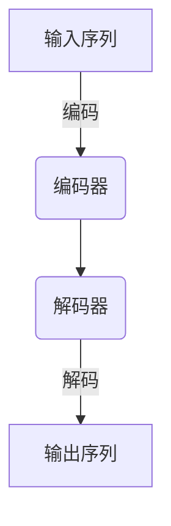
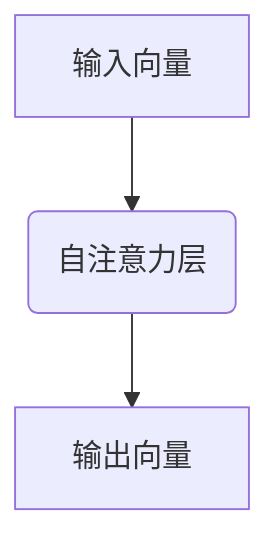
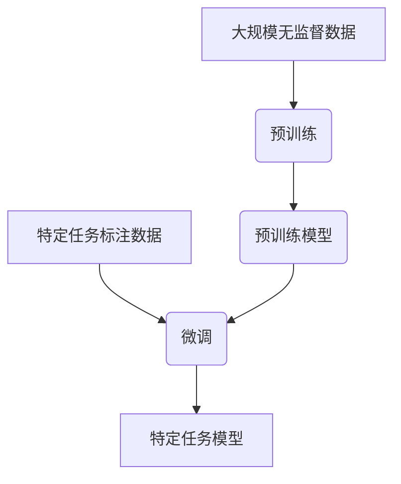
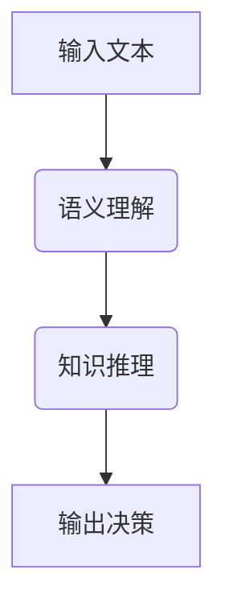
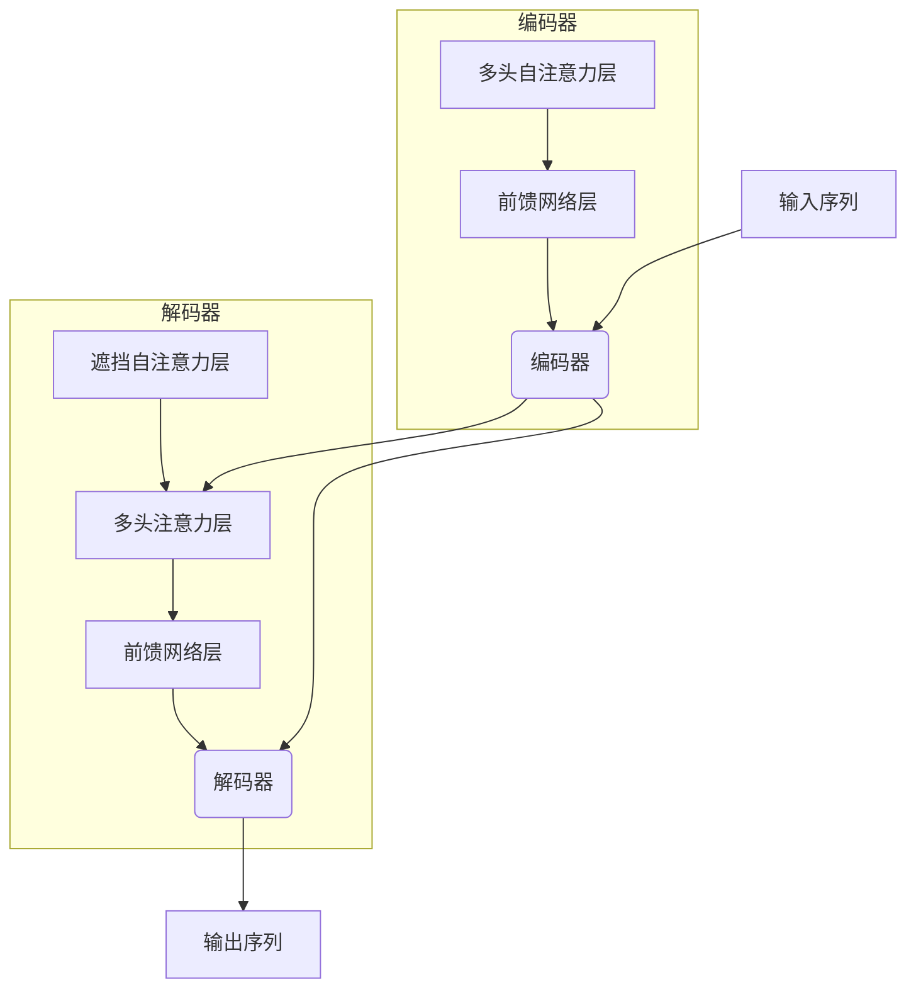

# 大语言模型原理与工程实践：推理和行动协同技术

## 1. 背景介绍

### 1.1 人工智能的发展历程

人工智能(Artificial Intelligence, AI)是一个旨在使机器具备类似于人类智能的能力的广泛领域。自20世纪50年代AI概念被正式提出以来,这一领域经历了几个重要的发展阶段。

#### 1.1.1 早期规则系统

最初,人工智能主要依赖于基于规则的系统,这些系统使用预定义的规则和逻辑来解决特定的问题。这种方法在一些特定领域取得了成功,但在处理复杂和不确定的情况时存在局限性。

#### 1.1.2 机器学习的兴起

20世纪80年代,机器学习(Machine Learning, ML)的概念开始兴起,它使用算法从数据中学习模式和规律,而不是依赖于手动编写的规则。这一范式的转变极大地推动了人工智能的发展,使其能够处理更复杂和更不确定的问题。

#### 1.1.3 深度学习的突破

21世纪初,深度学习(Deep Learning, DL)技术的出现引发了人工智能领域的又一次重大突破。深度学习算法能够从大量数据中自动学习多层次的抽象特征表示,并在诸如计算机视觉、自然语言处理等领域取得了令人瞩目的成就。

### 1.2 大语言模型的兴起

随着计算能力和数据量的不断增长,大型神经网络模型在自然语言处理(Natural Language Processing, NLP)领域取得了突破性进展。这些被称为"大语言模型"(Large Language Models, LLMs)的模型能够从海量文本数据中学习语言的复杂模式和语义关系,并在各种自然语言任务中表现出色。

大语言模型的出现引发了人工智能领域的一场革命,它们不仅在语言理解和生成方面表现出色,而且还展现出了强大的推理和决策能力,可以应用于各种领域,如问答系统、内容创作、代码生成等。

## 2. 核心概念与联系

### 2.1 大语言模型的架构

大语言模型通常采用基于Transformer的编码器-解码器架构,其中编码器将输入序列(如文本)编码为向量表示,解码器则根据编码器的输出生成目标序列(如翻译、摘要等)。



### 2.2 自注意力机制

自注意力机制是大语言模型中的关键组件,它允许模型捕捉输入序列中任意两个位置之间的依赖关系,从而更好地建模长距离依赖。



### 2.3 预训练与微调

大语言模型通常采用预训练和微调的范式。在预训练阶段,模型在大规模无监督文本数据上进行自监督学习,捕捉通用的语言模式。在微调阶段,预训练模型在特定任务的标注数据上进行进一步训练,以适应特定的下游任务。



### 2.4 语义理解与推理

除了语言生成能力,大语言模型还展现出了强大的语义理解和推理能力。它们能够捕捉语言中的隐含含义、建立概念之间的关联,并基于已有知识进行逻辑推理和决策。



## 3. 核心算法原理具体操作步骤

### 3.1 Transformer架构

Transformer是大语言模型中广泛采用的核心架构,它完全基于注意力机制,避免了传统序列模型中的递归计算,从而提高了并行化能力和计算效率。

#### 3.1.1 编码器

Transformer编码器由多个相同的层组成,每层包含两个子层:多头自注意力层和前馈神经网络层。

1. **多头自注意力层**

$$\begin{aligned}
\text{MultiHead}(Q, K, V) &= \text{Concat}(\text{head}_1, \ldots, \text{head}_h)W^O\\
\text{where}\ \text{head}_i &= \text{Attention}(QW_i^Q, KW_i^K, VW_i^V)
\end{aligned}$$

其中$Q$、$K$、$V$分别表示查询(Query)、键(Key)和值(Value)。注意力机制通过计算查询和键之间的相似性,对值进行加权求和,从而捕捉输入序列中任意两个位置之间的依赖关系。

2. **前馈神经网络层**

$$\text{FFN}(x) = \max(0, xW_1 + b_1)W_2 + b_2$$

前馈神经网络层由两个线性变换和一个ReLU激活函数组成,用于对每个位置的表示进行独立的非线性变换。

#### 3.1.2 解码器

Transformer解码器与编码器类似,但增加了一个遮挡的自注意力子层,以确保在生成每个位置的输出时,只依赖于该位置之前的输入。此外,解码器还包含一个编码器-解码器注意力子层,用于将编码器的输出与解码器的输出相结合。



### 3.2 预训练任务

大语言模型通常在大规模无监督文本数据上进行预训练,以捕捉通用的语言模式。常见的预训练任务包括:

#### 3.2.1 掩码语言模型(Masked Language Modeling, MLM)

在输入序列中随机掩码一些词元,模型需要基于上下文预测被掩码的词元。这有助于模型学习语义和上下文理解能力。

#### 3.2.2 下一句预测(Next Sentence Prediction, NSP)

给定两个句子,模型需要预测它们是否连续出现在原始文本中。这有助于模型捕捉更长范围的语义和逻辑关系。

#### 3.2.3 序列到序列预训练(Sequence-to-Sequence Pretraining)

模型需要根据输入序列生成相关的目标序列,如翻译、摘要等。这种预训练方式更加通用,可用于各种序列到序列任务。

### 3.3 微调与生成

在预训练后,大语言模型可以通过微调的方式适应特定的下游任务。微调过程通常包括以下步骤:

1. **准备任务数据**:为特定任务准备标注数据集,如问答对、文本分类样本等。

2. **数据预处理**:将任务数据转换为模型可接受的格式,如词元化、填充等。

3. **微调训练**:在任务数据上对预训练模型进行进一步训练,调整模型参数以适应特定任务。

4. **生成和评估**:使用微调后的模型进行推理和生成,并根据任务指标评估模型性能。

对于生成任务,可以采用贪婪搜索、束搜索等解码策略,从模型输出的概率分布中选择最优序列。

## 4. 数学模型和公式详细讲解举例说明

### 4.1 自注意力机制

自注意力机制是大语言模型中的核心组件,它允许模型捕捉输入序列中任意两个位置之间的依赖关系。给定一个长度为$n$的输入序列$X = (x_1, x_2, \ldots, x_n)$,自注意力机制的计算过程如下:

1. **查询、键、值投影**

$$\begin{aligned}
Q &= XW^Q\\
K &= XW^K\\
V &= XW^V
\end{aligned}$$

其中$W^Q$、$W^K$、$W^V$分别是查询、键和值的线性投影矩阵。

2. **计算注意力分数**

$$\text{Attention}(Q, K, V) = \text{softmax}\left(\frac{QK^\top}{\sqrt{d_k}}\right)V$$

其中$d_k$是缩放因子,用于防止点积过大导致的梯度饱和问题。

3. **多头注意力**

为了捕捉不同的子空间表示,多头注意力机制将查询、键和值进行多个线性投影,并对每个投影的注意力输出进行拼接。

$$\begin{aligned}
\text{MultiHead}(Q, K, V) &= \text{Concat}(\text{head}_1, \ldots, \text{head}_h)W^O\\
\text{where}\ \text{head}_i &= \text{Attention}(QW_i^Q, KW_i^K, VW_i^V)
\end{aligned}$$

其中$h$是头数,每个头$\text{head}_i$都是一个独立的注意力机制。

通过自注意力机制,模型可以捕捉输入序列中任意两个位置之间的依赖关系,从而更好地建模长距离依赖。

### 4.2 掩码语言模型

掩码语言模型(Masked Language Modeling, MLM)是大语言模型预训练的一种常见任务。给定一个长度为$n$的输入序列$X = (x_1, x_2, \ldots, x_n)$,我们随机选择一些位置$\mathcal{M}$进行掩码,得到掩码后的序列$\hat{X}$。模型的目标是预测被掩码的词元$\{x_i\}_{i \in \mathcal{M}}$。

对于每个被掩码的位置$i \in \mathcal{M}$,模型计算其在词表$\mathcal{V}$上的条件概率分布:

$$P(x_i | \hat{X}) = \text{softmax}(h_i^\top W_\text{vocab})$$

其中$h_i$是位置$i$的隐藏状态表示,由编码器输出得到;$W_\text{vocab}$是词表嵌入矩阵。

模型的目标是最大化被掩码词元的对数似然:

$$\mathcal{L}_\text{MLM} = \sum_{i \in \mathcal{M}} \log P(x_i | \hat{X})$$

通过掩码语言模型预训练,模型可以学习到丰富的语义和上下文理解能力。

### 4.3 生成任务

对于生成任务,如机器翻译、文本摘要等,大语言模型采用编码器-解码器架构。给定一个源序列$X = (x_1, x_2, \ldots, x_n)$和目标序列$Y = (y_1, y_2, \ldots, y_m)$,模型的目标是最大化目标序列的条件概率:

$$P(Y | X) = \prod_{t=1}^m P(y_t | y_{<t}, X)$$

其中$y_{<t}$表示目标序列的前$t-1$个词元。

在每个时间步$t$,解码器根据编码器的输出$h_\text{enc}$和前一时间步的输出$y_{t-1}$,计算当前时间步的条件概率分布:

$$P(y_t | y_{<t}, X) = \text{softmax}(h_t^\top W_\text{vocab})$$

其中$h_t$是解码器在时间步$t$的隐藏状态表示。

模型的目标是最大化目标序列的对数似然:

$$\mathcal{L}_\text{gen} = \sum_{t=1}^m \log P(y_t | y_{<t}, X)$$

通过最大化目标序列的条件概率,模型可以学习到生成高质量序列的能力。

## 5. 项目实践:代码实例和详细解释说明

在本节中,我们将使用Python和Hugging Face Transformers库,实现一个简单的掩码语言模型预训练和微调任务。

### 5.1 导入必要的库

```python
import torch
from transformers import BertTokenizer, BertForMaskedLM

# 初始化tokenizer和模型
tokenizer = BertTokenizer.from_pret