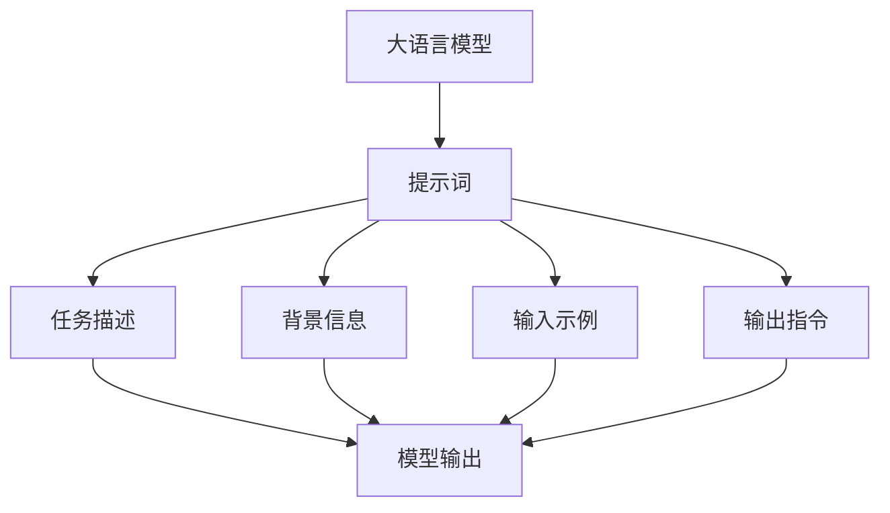

# 大语言模型原理与工程实践：提示词的基础要素

## 1. 背景介绍

### 1.1 大语言模型的兴起

近年来,大型语言模型(Large Language Models, LLMs)在自然语言处理(NLP)领域掀起了一股革命浪潮。这些模型通过在海量文本数据上进行预训练,学习了丰富的语言知识和上下文关联,展现出令人惊叹的生成能力。

代表性模型包括 GPT-3、PaLM、ChatGPT 等,它们能够生成看似人类水平的文本输出,在诸多领域展现出广阔的应用前景,如问答系统、文本生成、代码生成等。

### 1.2 提示词在大语言模型中的作用

然而,要充分发挥大语言模型的潜力,需要合理的输入提示(Prompt)来引导模型产生所需的输出。提示词在此过程中扮演着关键角色,它为模型提供了任务的语境和指令,决定了模型输出的质量和准确性。

精心设计的提示词能够有效利用模型的知识,生成高质量、符合预期的输出,而糟糕的提示词则可能导致模型产生无关、低质或有偏差的结果。因此,掌握提示词的基础要素,对于充分发挥大语言模型的能力至关重要。

## 2. 核心概念与联系

### 2.1 提示词的定义

提示词(Prompt)是指提供给大语言模型的一段文本输入,用于指导模型生成所需的输出。它通常包含以下几个要素:

- **任务描述**:明确阐述需要模型执行的任务,如问答、文本续写、代码生成等。
- **背景信息**:为模型提供所需的背景知识,使其能够更好地理解和执行任务。
- **输入示例**:给出一些输入示例,帮助模型捕捉任务的模式和语境。
- **输出指令**:指导模型应该如何生成输出,如输出格式、长度等要求。

### 2.2 提示词与模型的关系

大语言模型是通过自监督学习在大规模语料库上进行预训练而得到的。在预训练过程中,模型学习到了丰富的语言知识、上下文关联和生成模式。然而,预训练的目标是通用的语言建模,并未针对特定的下游任务进行优化。

提示词的作用就是将特定的下游任务"注入"到大语言模型中,利用模型在预训练阶段学习到的知识和能力,引导模型生成所需的输出。通过精心设计的提示词,我们能够有效地"提示"模型执行特定任务,从而发挥其在该任务上的最大潜力。

提示词与模型的关系可以用以下流程图来概括:



该流程图阐释了提示词如何将特定任务的要求传递给大语言模型,并引导模型根据提示词生成所需的输出。

## 3. 核心算法原理具体操作步骤

### 3.1 提示词设计的一般原则

设计高质量的提示词是一个艺术和科学的结合。以下是一些通用的原则和最佳实践:

1. **清晰明确**:提示词应该清晰地描述任务目标和要求,避免模糊或含糊的语言。
2. **简洁精炼**:尽量使用简洁精炼的语言,避免冗长和啰嗦。
3. **结构合理**:提示词应该有合理的结构和逻辑流程,帮助模型更好地理解和执行任务。
4. **示例说明**:提供一些高质量的输入示例,帮助模型捕捉任务模式和语境。
5. **多样性**:在示例中体现多样性,涵盖不同的场景和边缘情况,提高模型的泛化能力。
6. **反馈迭代**:根据模型的输出,不断优化和调整提示词,直到达到满意的结果。

### 3.2 提示词设计的具体步骤

以下是设计高质量提示词的具体步骤:

1. **明确任务目标**:首先明确需要模型执行的具体任务,如问答、文本生成、代码生成等。
2. **收集相关信息**:收集与任务相关的背景知识、数据示例、约束条件等信息。
3. **构建任务描述**:根据任务目标和相关信息,构建清晰的任务描述。
4. **选择示例输入**:从收集的数据中,选择代表性的输入示例,体现任务的多样性和边缘情况。
5. **指定输出要求**:明确指定模型输出的格式、长度、约束条件等要求。
6. **组织提示词**:将上述元素组织成一个完整的提示词,注意结构和逻辑流程的合理性。
7. **测试和优化**:使用提示词与模型交互,观察输出结果,并根据反馈不断优化和调整提示词。
8. **多轮迭代**:重复步骤 6 和 7,直到获得满意的输出质量。

需要注意的是,提示词设计是一个反复迭代的过程,需要不断地测试、调整和优化,以获得最佳的结果。

## 4. 数学模型和公式详细讲解举例说明

虽然提示词设计主要是一个启发式的过程,但也有一些基于数学模型的方法可以为其提供理论支持和指导。本节将介绍两种常见的数学模型,并通过具体例子说明它们在提示词设计中的应用。

### 4.1 信息论模型

信息论模型视提示词设计为一个信息传递的过程,旨在最大化模型输出与期望输出之间的互信息(Mutual Information)。互信息衡量了两个随机变量之间的相关性,可以用以下公式表示:

$$I(X;Y) = H(X) - H(X|Y)$$

其中,$ H(X) $是随机变量 $ X $的熵(Entropy),表示其不确定性;$ H(X|Y) $是 $ X $在已知 $ Y $的条件下的条件熵,表示剩余的不确定性。

在提示词设计中,我们希望最大化模型输出 $ Y $与期望输出 $ X $之间的互信息 $ I(X;Y) $,从而提高输出的质量和准确性。这可以通过优化提示词中的任务描述、背景信息和示例输入来实现,减少模型输出的不确定性。

例如,对于一个文本续写任务,如果提示词只给出了"继续这个故事"的简单指令,模型输出的不确定性将非常高,互信息较低。但如果提示词提供了更多背景信息和高质量的示例输入,模型就能更好地捕捉任务的语境和模式,从而产生更准确、更符合预期的输出,互信息也就更高。

### 4.2 序列到序列模型

序列到序列(Sequence-to-Sequence, Seq2Seq)模型是一种广泛应用于自然语言处理任务的模型框架,它将提示词设计视为一个序列转换问题。

在这种模型中,提示词被视为输入序列 $ X $,模型的输出 $ Y $则是期望的目标序列。模型的目标是学习一个条件概率分布 $ P(Y|X) $,使得给定输入序列 $ X $时,能够生成最可能的目标序列 $ Y $。

具体来说,Seq2Seq模型由两部分组成:编码器(Encoder)和解码器(Decoder)。编码器将输入序列 $ X $编码为一个上下文向量 $ C $,解码器则根据 $ C $生成目标序列 $ Y $。

在提示词设计中,我们可以将提示词视为输入序列 $ X $,期望的模型输出视为目标序列 $ Y $。通过优化编码器和解码器的参数,我们可以提高模型对提示词的理解能力,从而生成更准确、更符合预期的输出序列。

例如,在代码生成任务中,提示词可以包含任务描述、示例输入输出对等信息,作为输入序列 $ X $;期望的代码则是目标序列 $ Y $。通过训练 Seq2Seq 模型,我们可以学习将提示词 $ X $映射到目标代码 $ Y $的条件概率分布,从而指导模型根据提示词生成所需的代码。

需要注意的是,虽然上述数学模型为提示词设计提供了理论支持,但实际操作中,我们仍需要结合具体任务和领域知识,通过反复试验和优化来获得最佳的提示词。

## 5. 项目实践: 代码实例和详细解释说明

为了更好地理解提示词在实践中的应用,本节将提供一个具体的代码示例,并详细解释每一步骤的含义和作用。

假设我们需要使用 GPT-3 大语言模型来生成一篇关于"机器学习在医疗领域的应用"的技术博客文章。我们将使用 Python 编程语言和 OpenAI 的 GPT-3 API 来实现这个任务。

### 5.1 导入必要的库

```python
import openai
import os
```

我们首先导入 `openai` 库,用于与 OpenAI 的 API 进行交互。同时,我们还导入了 `os` 库,用于读取环境变量中的 API 密钥。

### 5.2 设置 API 密钥

```python
openai.api_key = os.environ.get("OPENAI_API_KEY")
```

我们从环境变量中获取 OpenAI API 密钥,并将其设置为 `openai` 库的 `api_key`。这一步是必需的,以确保我们能够成功调用 GPT-3 API。

### 5.3 构建提示词

```python
prompt = """
你是一位机器学习和医疗领域的专家作家。请以"机器学习在医疗领域的应用"为题,写一篇详细的技术博客文章。

文章需要包括以下几个部分:

1. 介绍机器学习在医疗领域的重要性和潜在应用场景。
2. 详细解释几种常见的机器学习算法及其在医疗领域的应用,如深度学习、决策树、支持向量机等。
3. 分析机器学习在医疗领域面临的挑战和限制,如数据隐私、算法偏差等。
4. 介绍一些成功的机器学习医疗应用案例,如癌症诊断、药物发现等。
5. 展望机器学习在医疗领域的未来发展趋势和前景。

请确保文章内容全面、深入、专业,并提供相关的代码示例和数据可视化图表以加深读者的理解。文章字数在 3000 到 5000 字之间。
"""
```

这个提示词包含了以下几个关键元素:

1. **任务描述**:明确指出需要生成一篇关于"机器学习在医疗领域的应用"的技术博客文章。
2. **背景信息**:假设模型是一位机器学习和医疗领域的专家作家,为模型提供了相关的背景知识。
3. **输出要求**:详细列出了文章需要包含的几个主要部分,以及字数、内容深度等具体要求。

通过这个提示词,我们为模型清晰地描述了任务目标和预期输出,同时也提供了必要的背景信息和指导,以帮助模型生成高质量的输出。

### 5.4 调用 GPT-3 API 生成文章

```python
response = openai.Completion.create(
    engine="text-davinci-003",
    prompt=prompt,
    max_tokens=3500,
    n=1,
    stop=None,
    temperature=0.7,
)

article = response.choices[0].text
print(article)
```

在这一步,我们调用 OpenAI 的 `Completion.create` 方法,将构建好的提示词传递给 GPT-3 模型,并设置一些参数:

- `engine="text-davinci-003"`: 指定使用 OpenAI 的 `text-davinci-003` 模型,这是一个强大的语言模型,适合生成长文本。
- `prompt=prompt`: 将我们构建的提示词作为输入。
- `max_tokens=3500`: 设置模型输出的最大token数为 3500,确保生成的文章长度在合理范围内。
- `n=1`: 只生成一个输出