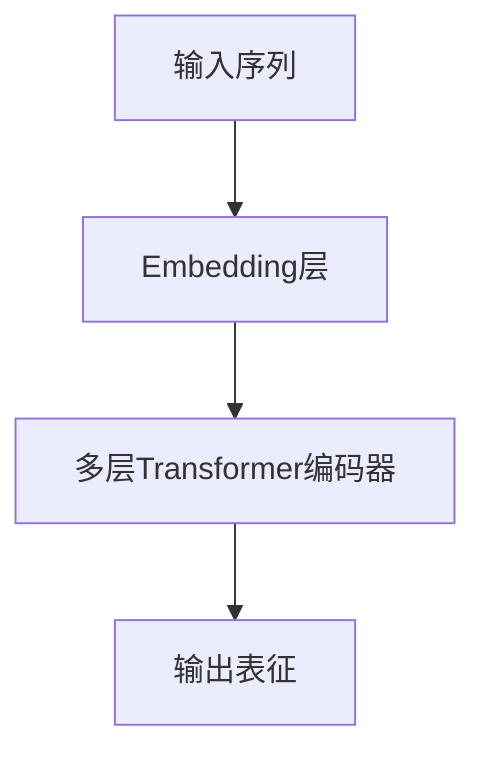

# 大语言模型原理与工程实践：数据瓶颈

## 1.背景介绍

### 1.1 大语言模型的兴起

近年来,大规模预训练语言模型(Large Pre-trained Language Models, PLMs)在自然语言处理(NLP)领域掀起了一场革命。从GPT、BERT到GPT-3、PaLM等,这些庞大的神经网络模型通过在海量文本数据上进行自监督预训练,学习到了丰富的语言知识,展现出了惊人的泛化能力。

它们不仅在众多NLP任务上取得了state-of-the-art的性能,还展现出了一定程度上的"通用智能(General Intelligence)"。比如GPT-3可以执行包括问答、文本生成、代码生成、数学推理等多种不同的任务,仅依赖少量示例数据就可以快速适应新任务,这种"少样本学习(Few-shot Learning)"能力令人印象深刻。

### 1.2 数据瓶颈的挑战

然而,尽管大语言模型取得了巨大的成功,但它们的训练过程中也暴露出了一个关键的瓶颈 —— 数据瓶颈。训练这些庞大的神经网络需要消耗大量的计算资源,但更大的挑战来自于对海量高质量训练数据的需求。

以GPT-3为例,它使用了约5700亿个token的文本数据进行预训练,这相当于1750多本《权力的游戏》小说的篇幅。收集、清洗和管理如此庞大的语料库本身就是一个艰巨的工程挑战。而且,原始数据中难免存在噪音、偏差和不当内容,这需要更多的人力和算力投入来进行数据过滤和去噪。

更重要的是,高质量的标注数据对于模型的监督微调至关重要。但是,为大规模语料库人工标注数据的成本是天文数字级别的。这使得大语言模型在特定领域和任务上的性能受到了严重制约。

因此,如何高效地获取和利用高质量的训练数据,成为了制约大语言模型发展的主要瓶颈之一。解决这一挑战,需要创新性的数据工程和算法创新。

## 2.核心概念与联系

### 2.1 大语言模型的核心架构

为了更好地理解数据瓶颈的挑战,我们首先需要了解大语言模型的核心架构。尽管不同的模型在细节上有所区别,但它们都遵循了自注意力机制(Self-Attention)和Transformer的基本架构。

如上图所示,大语言模型的核心架构包括以下几个关键组件:

1. **Embedding层**: 将输入的文本序列(如单词或子词)转换为对应的向量表示。
2. **Transformer编码器**: 由多层Self-Attention和前馈神经网络组成,用于捕获输入序列中的长程依赖关系,生成深层次的上下文表征。
3. **输出表征**: 模型最终输出的上下文化向量表示,可用于下游任务如文本分类、问答等。

### 2.2 自监督预训练

大语言模型之所以能够学习到丰富的语言知识,关键在于它们采用了自监督预训练(Self-Supervised Pretraining)的策略。与传统的有监督学习不同,自监督预训练不需要人工标注的数据,而是基于原始文本数据本身,通过设计合理的预训练目标来学习通用的语言表征。

最常见的预训练目标是"Masked Language Modeling(MLM)"和"Next Sentence Prediction(NSP)"。前者要求模型预测被掩蔽(masked)的单词,后者则需要判断两个句子是否相邻。通过这种方式,模型可以从大规模文本数据中学习到丰富的语义和语法知识。

### 2.3 微调与迁移学习

预训练只是第一步。为了将大语言模型应用到特定的下游任务上,需要进行"微调(Fine-tuning)"的过程。微调指的是在预训练模型的基础上,利用有标注的数据对模型进行进一步训练,使其适应特定任务。

微调的过程实际上是一种迁移学习(Transfer Learning)。大语言模型在预训练阶段学习到的通用语言知识,可以很好地迁移到下游任务上,从而减少了对大量标注数据的需求,提高了数据利用效率。

## 3.核心算法原理具体操作步骤

### 3.1 Self-Attention机制

自注意力(Self-Attention)是Transformer模型的核心,也是大语言模型取得巨大成功的关键所在。传统的RNN和LSTM结构由于存在递归计算的瓶颈,难以有效捕捉长程依赖关系。而Self-Attention则通过计算输入序列中每个元素与其他元素的相似性,直接建模它们之间的关联,从而更好地捕获长程依赖。

Self-Attention的计算过程可以概括为以下三个步骤:

1. **计算注意力分数(Attention Scores)**: 对于序列中的每个元素,计算它与其他元素的相似性分数。
2. **执行注意力加权(Attention Weighting)**: 使用注意力分数对其他元素的值进行加权求和,得到该元素的注意力表征。
3. **多头注意力(Multi-Head Attention)**: 重复执行多个注意力计算,并将结果拼接在一起,捕获不同子空间的关系。

数学表示如下:

$$\begin{aligned}
\text{Attention}(Q, K, V) &= \text{softmax}\left(\frac{QK^T}{\sqrt{d_k}}\right)V \\
\text{MultiHead}(Q, K, V) &= \text{Concat}(head_1, \ldots, head_h)W^O\\
\text{where } head_i &= \text{Attention}(QW_i^Q, KW_i^K, VW_i^V)
\end{aligned}$$

其中 $Q$、$K$、$V$ 分别表示查询(Query)、键(Key)和值(Value)向量。通过计算查询与键的相似性,得到注意力分数,并与值向量相结合,生成注意力表征。多头注意力机制则是将多个注意力头的结果拼接起来,捕获不同子空间的信息。

### 3.2 Transformer编码器

单层Transformer编码器的计算过程如下:

1. 输入序列首先通过Embedding层得到对应的向量表示。
2. 输入向量被送入Multi-Head Self-Attention子层,捕获序列内元素之间的长程依赖关系。
3. Self-Attention的输出与输入相加,并执行层归一化(Layer Normalization),得到归一化的注意力表征。
4. 归一化的注意力表征作为前馈神经网络(Feed-Forward Network)的输入,进行非线性变换。
5. 前馈网络的输出再次与输入相加并归一化,得到该层的最终输出。

通过堆叠多层这种编码器结构,模型可以学习到越来越抽象的表征,捕获输入序列中更加复杂的结构信息。

### 3.3 BERT的Masked语言模型

BERT(Bidirectional Encoder Representations from Transformers)是一种广为人知的大语言模型,它采用了Masked语言模型(Masked Language Modeling, MLM)作为预训练目标之一。MLM的目标是预测输入序列中被掩蔽(masked)的单词。

具体来说,在预训练阶段,BERT会随机选择输入序列中的15%的词元(token),并执行以下操作:

1. 80%的词元被实际替换为特殊的`[MASK]`标记。
2. 10%的词元被随机替换为其他词元。
3. 剩余10%的词元保持不变。

然后,BERT需要基于上下文信息来预测被掩蔽或替换的词元。通过这种方式,BERT可以有效地学习到双向的上下文表征,捕获单词在上下文中的语义信息。

MLM的损失函数可以表示为:

$$\mathcal{L}_\text{MLM} = -\log P(w_t | w_{\backslash t})$$

其中 $w_t$ 表示被掩蔽或替换的词元, $w_{\backslash t}$ 表示其上下文。模型的目标是最大化预测正确词元的概率。

通过在大规模语料库上最小化MLM损失,BERT可以学习到通用的语言表征,为下游任务做好准备。

## 4.数学模型和公式详细讲解举例说明

### 4.1 注意力机制的数学原理

注意力机制(Attention Mechanism)是Transformer及大语言模型的核心,它赋予了模型直接捕捉长程依赖关系的能力。我们来详细解析一下注意力机制背后的数学原理。

假设我们有一个输入序列 $X = (x_1, x_2, \ldots, x_n)$,其中每个 $x_i$ 是一个向量。我们的目标是为每个输入元素 $x_i$ 计算一个注意力表征 $z_i$,使之不仅包含 $x_i$ 自身的信息,还融合了其他相关元素的信息。

对于输入元素 $x_i$,我们首先计算它与所有其他元素的相似性分数(注意力分数):

$$e_{ij} = f(x_i, x_j)$$

其中 $f$ 是一个相似性函数,通常采用点积或加性注意力函数:

- 点积注意力: $e_{ij} = x_i^T x_j$
- 加性注意力: $e_{ij} = v^T \tanh(W_1 x_i + W_2 x_j)$

接下来,我们对注意力分数执行softmax操作,得到归一化的注意力权重:

$$\alpha_{ij} = \frac{\exp(e_{ij})}{\sum_k \exp(e_{ik})}$$

最后,我们使用注意力权重对输入元素进行加权求和,得到注意力表征 $z_i$:

$$z_i = \sum_{j=1}^n \alpha_{ij} x_j$$

注意力表征 $z_i$ 不仅包含了 $x_i$ 自身的信息,还融合了其他相关元素的信息,其中相关性由注意力权重 $\alpha_{ij}$ 决定。通过这种方式,注意力机制赋予了模型直接建模长程依赖关系的能力。

### 4.2 多头注意力机制

在实践中,我们通常会使用多头注意力机制(Multi-Head Attention),它可以从不同的子空间捕捉不同的注意力模式,进一步提高模型的表现力。

多头注意力的计算过程如下:

1. 将查询(Query)、键(Key)和值(Value)通过线性变换投影到不同的子空间: $Q^i=QW_Q^i$, $K^i=KW_K^i$, $V^i=VW_V^i$,其中 $i=1,2,\ldots,h$ 表示第 $i$ 个注意力头。
2. 对于每个注意力头 $i$,计算注意力表征 $\text{head}_i$:

$$\begin{aligned}
e_{ij}^i &= (Q^i)^T (K^i)^T \\
\alpha_{ij}^i &= \text{softmax}(e_{ij}^i) \\
\text{head}_i &= \sum_j \alpha_{ij}^i V_j^i
\end{aligned}$$

3. 将所有注意力头的输出拼接在一起,并执行线性变换得到最终的多头注意力表征:

$$\text{MultiHead}(Q, K, V) = \text{Concat}(\text{head}_1, \ldots, \text{head}_h)W^O$$

通过多头注意力机制,模型可以从不同的子空间捕捉不同的依赖关系模式,提高了模型的表现力和泛化能力。

### 4.3 自回归语言模型

除了Masked语言模型,自回归语言模型(Autoregressive Language Model)也是预训练大语言模型的一种常见方式,例如GPT系列模型就采用了这种策略。

自回归语言模型的目标是最大化下一个词元(token)的条件概率:

$$P(w_t | w_1, w_2, \ldots, w_{t-1})$$

也就是说,模型需要基于之前的上下文 