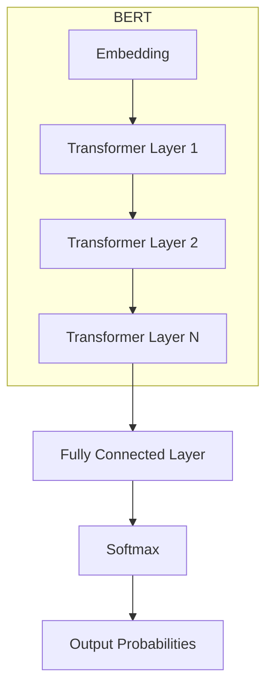

# 大语言模型原理与工程实践：正文提取

## 1. 背景介绍

### 1.1 大语言模型的兴起
近年来,随着深度学习技术的快速发展,大语言模型(Large Language Model,LLM)在自然语言处理(Natural Language Processing,NLP)领域取得了巨大的成功。LLM 通过在海量文本数据上进行无监督预训练,学习到了丰富的语言知识和常识,在许多 NLP 任务上取得了远超传统方法的性能。代表性的 LLM 包括 GPT 系列、BERT、XLNet 等。

### 1.2 正文提取的重要性
在实际应用中,我们经常需要从一个长文档中提取出最关键、最重要的部分,即正文。例如新闻网页正文提取、电子邮件正文提取等。传统的基于规则或机器学习的方法难以适应不同领域、不同风格的文档。而利用大语言模型强大的语义理解和生成能力,有望构建出更加智能、鲁棒的正文提取系统。

### 1.3 本文的主要内容
本文将系统介绍如何利用大语言模型来进行正文提取。主要内容包括:

- 大语言模型的核心概念与原理
- 基于大语言模型的正文提取算法步骤 
- 正文提取的数学建模与公式推导
- 代码实现与案例分析
- 实际应用场景探讨
- 相关工具与资源推荐
- 未来趋势展望与挑战讨论

通过本文的学习,读者将全面掌握大语言模型在正文提取任务中的理论基础与工程实践。

## 2. 核心概念与联系

### 2.1 大语言模型概述

大语言模型本质上是一个基于深度神经网络的语言模型。传统的 n-gram 语言模型受限于 n 的大小,无法考虑长距离的上下文信息。而大语言模型通过引入注意力机制(Attention)、Transformer 结构等,建模任意长度的上下文,从而大大提升了对语言的建模和理解能力。 

### 2.2 预训练与微调

大语言模型的训练分为两个阶段:无监督预训练和有监督微调。

- 无监督预训练:在大规模无标注文本语料上,以自回归、自编码、对比学习等方式进行预训练,让模型学习通用的语言知识。代表性的预训练任务有语言模型、去噪自编码、句子连续性判别等。

- 有监督微调:在下游任务的标注数据上,通过微调预训练模型的参数,使其适应具体任务。微调一般只需少量标注数据和较少的训练时间。

### 2.3 正文提取任务定义

正文提取可以定义为一个序列标注问题。给定一个由 $n$ 个句子组成的文档 $D=[s_1,s_2,...,s_n]$,正文提取的目标是预测一个相同长度的标签序列 $Y=[y_1,y_2,...,y_n]$,其中 $y_i \in \{0,1\}$ 表示第 $i$ 个句子 $s_i$ 是否属于正文。

因此,基于大语言模型的正文提取可以采用如下的总体思路:
1. 在大规模文本语料上预训练一个大语言模型
2. 在带正文标注的文档数据集上微调模型
3. 使用微调后的模型对新文档进行正文提取

下面,我们将详细介绍算法原理和实现细节。

## 3. 核心算法原理具体操作步骤

### 3.1 基于 BERT 的序列标注

我们采用当前非常成功的大语言模型 BERT 作为基础模型。BERT 是一个基于 Transformer 结构的双向语言表示模型,通过 Masked Language Model 和 Next Sentence Prediction 两个任务进行预训练。

对于正文提取任务,我们在 BERT 的最后一层输出上接一个全连接层和 Softmax 层,对每个句子进行二分类,判断其是否为正文。整体模型结构如下图所示:

### 3.2 训练过程

1. 输入:将文档 $D$ 中的句子 $[s_1,s_2,...,s_n]$ 通过 BERT 的 tokenizer 转换为 token 序列,并加入特殊的 [CLS] 和 [SEP] 标记。

2. BERT 编码:将 token 序列输入 BERT 模型,经过多层 Transformer 编码,得到每个 token 的隐层表示。

3. 句子表示:取每个句子的第一个 token ([CLS])的隐层表示作为整个句子的表示,记为 $\mathbf{h}_i \in \mathbb{R}^d$。

4. 分类:将句子表示 $\mathbf{h}_i$ 通过全连接层和 Softmax 层,得到其为正文的概率:

$$
\begin{aligned}
\mathbf{o}_i &= \mathbf{W}\mathbf{h}_i + \mathbf{b} \\
p(y_i|\mathbf{h}_i) &= \text{softmax}(\mathbf{o}_i)
\end{aligned}
$$

其中 $\mathbf{W} \in \mathbb{R}^{2 \times d}$, $\mathbf{b} \in \mathbb{R}^2$ 为待学习的参数。

5. 损失函数:使用交叉熵损失函数,最小化预测概率与真实标签的差异:

$$
\mathcal{L} = -\sum_{i=1}^n \sum_{c=0}^1 y_{ic} \log p(y_{ic}|\mathbf{h}_i)
$$

其中 $y_{ic}$ 为第 $i$ 个句子的真实标签(0 或 1)。

6. 优化:使用 Adam 优化器最小化损失函数,更新模型参数。

### 3.3 推理过程

对于新的文档,我们只需将其转换为 token 序列,输入到微调后的 BERT 模型中,取每个句子的正文概率。将概率大于 0.5 的句子预测为正文。

## 4. 数学模型和公式详细讲解举例说明

这里我们详细解释一下 BERT 中的关键数学模型和公式。

### 4.1 Transformer 结构

BERT 的核心是 Transformer 结构,它由多个相同的 Transformer Layer 堆叠而成。每个 Layer 主要由两部分组成:Multi-Head Self-Attention 和 Position-wise Feed-Forward Network。

#### Multi-Head Self-Attention

Self-Attention 可以捕捉句子中任意两个 token 之间的依赖关系。对于第 $l$ 层第 $i$ 个 token 的隐层表示 $\mathbf{h}_i^{(l)}$,Self-Attention 的计算过程如下:

$$
\begin{aligned}
\mathbf{q}_i^{(l)} &= \mathbf{W}_q^{(l)} \mathbf{h}_i^{(l-1)} \\
\mathbf{k}_i^{(l)} &= \mathbf{W}_k^{(l)} \mathbf{h}_i^{(l-1)} \\ 
\mathbf{v}_i^{(l)} &= \mathbf{W}_v^{(l)} \mathbf{h}_i^{(l-1)} \\
\alpha_{ij}^{(l)} &= \frac{\exp(\mathbf{q}_i^{(l)} \cdot \mathbf{k}_j^{(l)} / \sqrt{d_k})}{\sum_{j'=1}^n \exp(\mathbf{q}_i^{(l)} \cdot \mathbf{k}_{j'}^{(l)} / \sqrt{d_k})} \\
\mathbf{z}_i^{(l)} &= \sum_{j=1}^n \alpha_{ij}^{(l)} \mathbf{v}_j^{(l)}
\end{aligned}
$$

其中 $\mathbf{W}_q^{(l)}, \mathbf{W}_k^{(l)}, \mathbf{W}_v^{(l)} \in \mathbb{R}^{d_k \times d}$ 为可学习的投影矩阵,$\alpha_{ij}^{(l)}$ 为第 $i$ 个 token 对第 $j$ 个 token 的注意力权重。

Multi-Head Attention 是将 Self-Attention 计算多次,然后拼接:

$$
\begin{aligned}
\mathbf{z}_i^{(l,m)} &= \text{SelfAttention}^{(m)}(\mathbf{h}_i^{(l-1)}) \\
\mathbf{\hat{z}}_i^{(l)} &= \text{Concat}(\mathbf{z}_i^{(l,1)},...,\mathbf{z}_i^{(l,M)})
\end{aligned}
$$

其中 $M$ 为注意力头的数量。

#### Position-wise Feed-Forward Network

Feed-Forward Network 对每个位置的 token 表示进行非线性变换:

$$
\begin{aligned}
\mathbf{u}_i^{(l)} &= \text{ReLU}(\mathbf{W}_1^{(l)} \mathbf{\hat{z}}_i^{(l)} + \mathbf{b}_1^{(l)}) \\  
\mathbf{h}_i^{(l)} &= \mathbf{W}_2^{(l)} \mathbf{u}_i^{(l)} + \mathbf{b}_2^{(l)}
\end{aligned}
$$

其中 $\mathbf{W}_1^{(l)} \in \mathbb{R}^{d_{ff} \times d}, \mathbf{W}_2^{(l)} \in \mathbb{R}^{d \times d_{ff}}$ 为可学习的权重矩阵,$\mathbf{b}_1^{(l)} \in \mathbb{R}^{d_{ff}}, \mathbf{b}_2^{(l)} \in \mathbb{R}^d$ 为偏置项。

### 4.2 预训练任务

BERT 使用了两个预训练任务:Masked Language Model 和 Next Sentence Prediction。

#### Masked Language Model

MLM 随机 mask 掉句子中的一些 token,然后让模型根据上下文预测这些 token。具体来说,对于输入序列 $\mathbf{x} = [x_1, ..., x_n]$,以 0.15 的概率随机选择一些位置进行以下替换:

- 80% 的概率替换为特殊的 [MASK] 符号
- 10% 的概率替换为一个随机 token  
- 10% 的概率保持不变

记被 mask 的位置集合为 $\mathcal{M}$,则 MLM 的损失函数为:

$$
\mathcal{L}_{MLM} = -\sum_{i \in \mathcal{M}} \log p(x_i | \mathbf{x}_{\backslash \mathcal{M}})
$$

其中 $\mathbf{x}_{\backslash \mathcal{M}}$ 表示被 mask 后的输入序列。

#### Next Sentence Prediction

NSP 是一个二分类任务,判断两个句子在原文中是否相邻。训练数据通过以下方式构造:对于一个句子对 (A,B),50% 的概率 B 是 A 的下一句,50% 的概率从语料中随机采样一个句子作为 B。

记句子对的表示为 $\mathbf{h}_{AB} \in \mathbb{R}^d$ (取 [CLS] 位置的隐层表示),NSP 的损失函数为:

$$
\begin{aligned}
p(y_{AB} = 1 | \mathbf{h}_{AB}) &= \sigma(\mathbf{w}^T\mathbf{h}_{AB} + b) \\
\mathcal{L}_{NSP} &= -y_{AB} \log p(y_{AB} = 1| \mathbf{h}_{AB}) - (1 - y_{AB}) \log (1 - p(y_{AB} = 1| \mathbf{h}_{AB}))
\end{aligned}
$$

其中 $y_{AB} \in \{0,1\}$ 为句子对的标签,$\mathbf{w} \in \mathbb{R}^d, b \in \mathbb{R}$ 为可学习的参数。

预训练的总损失为两个任务损失的加权和:

$$
\mathcal{L}_{pretrain} = \mathcal{L}_{MLM} + \lambda \mathcal{L}_{NSP}
$$

其中 $\lambda$ 为 NSP 任务的权重(BERT 中设为 1)。

## 5. 项目实践：代码实例和详细解释说明

下面我们使用 PyTorch 和 Hugging Face 的 Transformers 库来实现基于 BERT 的正文提取模型。

### 5.1 环境准备

首先安装需要的库: