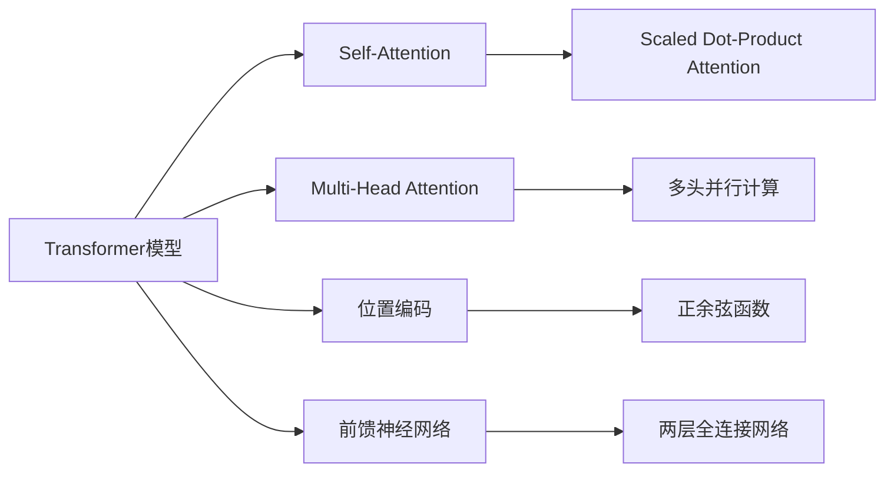

# 大语言模型原理与工程实践：目前的局限

## 1. 背景介绍
### 1.1 大语言模型的发展历程
### 1.2 大语言模型的应用现状
### 1.3 大语言模型面临的挑战与局限

## 2. 核心概念与联系
### 2.1 自然语言处理(NLP)基础
### 2.2 深度学习在NLP中的应用
#### 2.2.1 循环神经网络(RNN)
#### 2.2.2 长短期记忆网络(LSTM)
#### 2.2.3 Transformer模型
### 2.3 预训练语言模型
#### 2.3.1 BERT模型
#### 2.3.2 GPT模型
#### 2.3.3 XLNet模型
### 2.4 大语言模型的特点与优势

## 3. 核心算法原理具体操作步骤
### 3.1 Transformer模型详解
#### 3.1.1 Self-Attention机制
#### 3.1.2 Multi-Head Attention
#### 3.1.3 位置编码
#### 3.1.4 前馈神经网络
### 3.2 BERT模型训练过程
#### 3.2.1 预训练阶段
#### 3.2.2 微调阶段
### 3.3 GPT模型生成过程
#### 3.3.1 因果语言建模
#### 3.3.2 Top-k采样
#### 3.3.3 Nucleus采样

## 4. 数学模型和公式详细讲解举例说明
### 4.1 Transformer中的数学公式
#### 4.1.1 Scaled Dot-Product Attention
$Attention(Q,K,V) = softmax(\frac{QK^T}{\sqrt{d_k}})V$
#### 4.1.2 Multi-Head Attention
$MultiHead(Q,K,V) = Concat(head_1, ..., head_h)W^O$
其中$head_i = Attention(QW_i^Q, KW_i^K, VW_i^V)$
#### 4.1.3 位置编码
$PE_{(pos,2i)} = sin(pos/10000^{2i/d_{model}})$
$PE_{(pos,2i+1)} = cos(pos/10000^{2i/d_{model}})$
### 4.2 语言模型评估指标
#### 4.2.1 困惑度(Perplexity)
$PP(W)=P(w_1w_2...w_N)^{-\frac{1}{N}}$
#### 4.2.2 BLEU得分
$BLEU = BP \cdot exp(\sum_{n=1}^N w_n \log p_n)$

## 5. 项目实践：代码实例和详细解释说明
### 5.1 使用PyTorch实现Transformer模型
```python
class Transformer(nn.Module):
    def __init__(self, ...):
        super().__init__()
        self.encoder = TransformerEncoder(...)
        self.decoder = TransformerDecoder(...)
    def forward(self, src, tgt):
        ...
```
### 5.2 使用Hugging Face的Transformers库进行预训练模型微调
```python
from transformers import BertForSequenceClassification, AdamW

model = BertForSequenceClassification.from_pretrained('bert-base-uncased') 
optimizer = AdamW(model.parameters(), lr=2e-5)

for epoch in range(3):
    for batch in train_dataloader:
        outputs = model(**batch)
        loss = outputs.loss
        loss.backward()
        optimizer.step()
        optimizer.zero_grad()
```
### 5.3 使用GPT-2模型生成文本
```python
from transformers import GPT2LMHeadModel, GPT2Tokenizer

model = GPT2LMHeadModel.from_pretrained('gpt2')
tokenizer = GPT2Tokenizer.from_pretrained('gpt2')

prompt = "In a shocking finding, scientist discovered a herd of unicorns living in a remote, " 
input_ids = tokenizer.encode(prompt, return_tensors='pt')

output = model.generate(input_ids, max_length=100, num_return_sequences=5, no_repeat_ngram_size=2, early_stopping=True)
for i in range(5):
    print(f"Sample {i+1}: {tokenizer.decode(output[i], skip_special_tokens=True)}")
```

## 6. 实际应用场景
### 6.1 智能问答系统
### 6.2 机器翻译
### 6.3 文本摘要
### 6.4 情感分析
### 6.5 知识图谱构建

## 7. 工具和资源推荐
### 7.1 开源NLP工具包
#### 7.1.1 NLTK
#### 7.1.2 SpaCy 
#### 7.1.3 Gensim
#### 7.1.4 Hugging Face Transformers
### 7.2 预训练模型资源
#### 7.2.1 BERT
#### 7.2.2 GPT-2/GPT-3
#### 7.2.3 XLNet
#### 7.2.4 RoBERTa
#### 7.2.5 ALBERT
### 7.3 NLP数据集
#### 7.3.1 GLUE基准测试
#### 7.3.2 SQuAD问答数据集
#### 7.3.3 CoNLL命名实体识别
#### 7.3.4 Penn Treebank句法分析

## 8. 总结：未来发展趋势与挑战
### 8.1 大语言模型的发展趋势 
#### 8.1.1 模型参数量级持续增长
#### 8.1.2 训练数据规模不断扩大
#### 8.1.3 多模态语言模型兴起
#### 8.1.4 低资源语言的建模
### 8.2 大语言模型面临的挑战
#### 8.2.1 偏见和公平性问题
#### 8.2.2 可解释性和可控性
#### 8.2.3 计算和存储资源瓶颈
#### 8.2.4 缺乏常识推理能力
#### 8.2.5 隐私和安全风险

## 9. 附录：常见问题与解答
### 9.1 如何选择合适的预训练模型？
### 9.2 预训练模型微调需要注意哪些问题？
### 9.3 如何处理低资源语言的建模？
### 9.4 大语言模型会取代传统的自然语言处理方法吗？
### 9.5 如何平衡大语言模型的性能和效率？



大语言模型是近年来自然语言处理领域最引人注目的突破之一。从ELMo、BERT到GPT-3，预训练语言模型的参数规模和性能不断刷新记录，给NLP带来了革命性的变化。这些模型在机器翻译、问答系统、文本生成等任务上取得了显著的进步，展现出强大的语言理解和生成能力。

然而，大语言模型的发展也面临着诸多挑战和局限。首先，训练这些模型需要大量的计算和存储资源，对硬件提出了很高的要求。其次，模型容易学习到数据中的偏见，产生不公平和歧视性的结果。再者，大语言模型还缺乏常识推理能力，难以真正理解语言的深层含义。此外，模型的可解释性和可控性有待提高，存在隐私泄露和恶意利用的风险。

未来大语言模型的发展趋势可能包括：进一步增大模型规模、扩充训练数据、融合多模态信息、改进低资源语言建模等。同时，研究者们也在积极探索解决上述挑战的方法，如减少偏见、增强可解释性、提高推理能力等。可以预见，大语言模型将在自然语言处理的各个领域继续发挥重要作用，推动人机交互的智能化发展。

作者：禅与计算机程序设计艺术 / Zen and the Art of Computer Programming