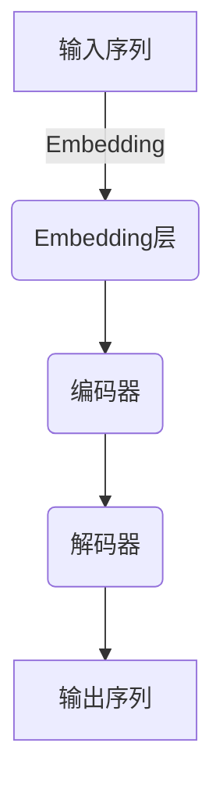
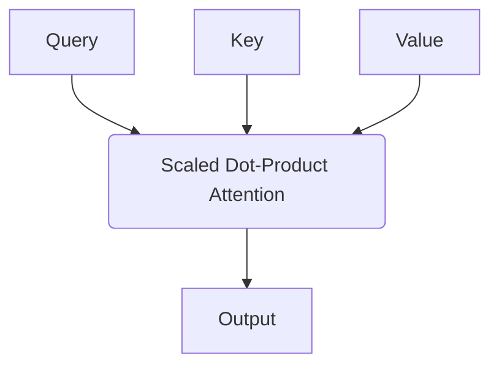

# 大语言模型原理与工程实践：硬件瓶颈

## 1.背景介绍

### 1.1 大语言模型的崛起

近年来,大型语言模型(Large Language Models, LLMs)在自然语言处理(NLP)领域取得了令人瞩目的成就。这些模型通过在海量文本数据上进行预训练,学习到了丰富的语言知识和上下文信息,从而能够生成高质量、连贯的文本输出。

GPT-3、PanGu-Alpha、BLOOM等大型语言模型凭借其强大的生成能力,在机器翻译、文本摘要、问答系统、内容创作等多个领域展现出了卓越的表现。LLMs已经成为推动NLP技术发展的核心动力之一。

### 1.2 硬件需求与瓶颈挑战

然而,训练和部署这些庞大的语言模型对计算资源的需求也是巨大的。以GPT-3为例,它拥有1750亿个参数,在训练过程中需要消耗大量的计算能力、存储空间和能源。这对硬件系统提出了极高的要求,特别是在处理器、内存、存储和网络等方面。

目前,硬件的发展速度正在落后于模型规模的增长,这已经成为制约大语言模型进一步发展的主要瓶颈之一。如何提高硬件的计算效率、存储能力和能源利用率,已经成为亟待解决的关键问题。

## 2.核心概念与联系

### 2.1 大语言模型的架构

大型语言模型通常采用基于Transformer的编码器-解码器架构,其中编码器用于捕获输入序列的上下文信息,解码器则根据编码器的输出生成目标序列。

编码器和解码器都由多个Transformer块组成,每个块包含多头注意力机制(Multi-Head Attention)和前馈神经网络(Feed-Forward Neural Network)等核心组件。

### 2.2 注意力机制

注意力机制是Transformer架构的核心,它允许模型在生成每个输出token时,动态地关注输入序列中的不同部分。这种灵活的上下文捕获能力是大语言模型取得出色表现的关键所在。

### 2.3 并行计算

为了加速大语言模型的训练和推理过程,并行计算策略至关重要。常见的并行方式包括:

1. **数据并行(Data Parallelism)**: 将训练数据划分到多个GPU/TPU上并行处理。
2. **模型并行(Model Parallelism)**: 将模型参数划分到多个设备上,并行执行计算。
3. **张量并行(Tensor Parallelism)**: 将单个张量划分到多个设备上,并行执行张量运算。

合理利用并行计算可以有效提高硬件资源的利用率,但同时也会带来通信开销和内存压力等新的挑战。

### 2.4 硬件加速

为了满足大语言模型对计算能力和内存带宽的巨大需求,硬件加速已经成为必然选择。常见的硬件加速器包括:

1. **GPU(图形处理器)**: 具有大量并行计算核心,适合加速矩阵运算和张量运算。
2. **TPU(张量处理器)**: 专门为机器学习任务设计的专用芯片,在计算效率和能耗方面表现出色。
3. **FPGA(现场可编程门阵列)**: 可重构的硬件架构,能够实现高度定制化的加速器。
4. **专用AI芯片**: 针对特定AI任务进行硬件和软件协同优化,例如Cerebras的WSE-2芯片。

不同硬件加速器在性能、功耗、灵活性等方面存在差异,需要根据具体需求进行选择和优化。

## 3.核心算法原理具体操作步骤

### 3.1 自注意力机制

自注意力机制是Transformer架构中的核心组件,它允许模型在生成每个输出token时,动态地关注输入序列中的不同部分。具体操作步骤如下:

1. **计算Query、Key和Value矩阵**

   对于每个输入token,计算其对应的Query(Q)、Key(K)和Value(V)矩阵,通过线性变换得到:

   $$Q = XW_Q, K = XW_K, V = XW_V$$

   其中$X$是输入token的嵌入向量,而$W_Q$、$W_K$和$W_V$是可学习的权重矩阵。

2. **计算注意力分数**

   计算Query与所有Key之间的点积,并对结果进行缩放和Softmax操作,得到注意力分数矩阵:

   $$\text{Attention}(Q, K, V) = \text{softmax}(\frac{QK^T}{\sqrt{d_k}})V$$

   其中$d_k$是Key向量的维度,用于防止内积值过大导致梯度饱和。

3. **多头注意力**

   为了捕获不同子空间的信息,Transformer采用了多头注意力机制。将Query、Key和Value矩阵分别线性投影到多个子空间,并在每个子空间中计算注意力,最后将所有子空间的结果拼接起来。

4. **残差连接和层归一化**

   注意力输出会与输入进行残差连接,并经过层归一化操作,以保持梯度的稳定性。

自注意力机制的核心思想是让模型动态地关注输入序列中的不同部分,从而捕获有效的上下文信息,这是大语言模型取得出色表现的关键所在。

### 3.2 前馈神经网络

除了自注意力子层,Transformer块还包含一个前馈神经网络子层,用于对每个位置的表示进行非线性变换。具体操作步骤如下:

1. **线性变换**

   对输入向量$x$进行线性变换:

   $$\text{FFN}(x) = \max(0, xW_1 + b_1)W_2 + b_2$$

   其中$W_1$和$W_2$是可学习的权重矩阵,$b_1$和$b_2$是偏置向量。

2. **非线性激活函数**

   通常使用ReLU作为非线性激活函数,以引入非线性特征。

3. **残差连接和层归一化**

   与自注意力子层类似,前馈神经网络的输出也会与输入进行残差连接,并经过层归一化操作。

前馈神经网络的作用是对每个位置的表示进行非线性变换,以捕获更复杂的特征信息。它与自注意力机制相结合,使Transformer能够同时捕获长程依赖和局部特征。

### 3.3 位置编码

由于Transformer缺乏递归或卷积结构,无法直接捕获序列的位置信息。因此,需要引入位置编码,将位置信息注入到输入嵌入中。常见的位置编码方式包括:

1. **正弦位置编码**

   使用正弦函数对位置进行编码,将位置信息编码到不同的频率上。具体公式如下:

   $$PE_{(pos, 2i)} = \sin(pos / 10000^{2i/d_{model}})$$
   $$PE_{(pos, 2i+1)} = \cos(pos / 10000^{2i/d_{model}})$$

   其中$pos$是token的位置,$i$是维度索引,$d_{model}$是嵌入维度。

2. **学习位置编码**

   将位置编码视为可学习的参数,在训练过程中直接学习最优的位置表示。

3. **相对位置编码**

   在自注意力机制中,直接编码相对位置而非绝对位置,以捕获相对位置信息。

位置编码的引入使得Transformer能够有效地捕获序列的位置信息,从而更好地建模序列数据。

## 4.数学模型和公式详细讲解举例说明

### 4.1 自注意力机制数学模型

自注意力机制是Transformer架构中的核心组件,它允许模型在生成每个输出token时,动态地关注输入序列中的不同部分。数学上,自注意力机制可以表示为:

$$\text{Attention}(Q, K, V) = \text{softmax}(\frac{QK^T}{\sqrt{d_k}})V$$

其中:

- $Q$是Query矩阵,表示当前位置需要关注的信息。
- $K$是Key矩阵,表示输入序列中每个位置的关键信息。
- $V$是Value矩阵,表示输入序列中每个位置的值向量。
- $d_k$是Key向量的维度,用于防止内积值过大导致梯度饱和。

具体计算过程如下:

1. 计算Query与所有Key之间的点积相似度:$QK^T$。
2. 对点积结果进行缩放:$\frac{QK^T}{\sqrt{d_k}}$,以保持梯度的稳定性。
3. 对缩放后的点积结果应用Softmax函数,得到注意力分数矩阵。
4. 将注意力分数矩阵与Value矩阵相乘,得到加权后的Value向量。

这种计算方式允许模型动态地为每个输出位置分配不同的注意力权重,从而捕获有效的上下文信息。

### 4.2 多头注意力机制

为了捕获不同子空间的信息,Transformer采用了多头注意力机制。具体来说,将Query、Key和Value矩阵分别线性投影到多个子空间,并在每个子空间中计算注意力,最后将所有子空间的结果拼接起来。数学表示如下:

$$\text{MultiHead}(Q, K, V) = \text{Concat}(head_1, \dots, head_h)W^O$$
$$\text{where } head_i = \text{Attention}(QW_i^Q, KW_i^K, VW_i^V)$$

其中:

- $h$是头数,表示将Query、Key和Value分别投影到$h$个子空间。
- $W_i^Q$、$W_i^K$和$W_i^V$是可学习的线性投影矩阵,用于将Query、Key和Value投影到第$i$个子空间。
- $\text{Attention}(\cdot)$是单头自注意力函数,在每个子空间中计算注意力。
- $W^O$是可学习的线性变换矩阵,用于将所有子空间的结果拼接并投影回原始空间。

多头注意力机制的优点在于,它允许模型从不同的表示子空间捕获不同的信息,从而提高模型的表示能力和泛化性能。

### 4.3 前馈神经网络

除了自注意力子层,Transformer块还包含一个前馈神经网络子层,用于对每个位置的表示进行非线性变换。数学上,前馈神经网络可以表示为:

$$\text{FFN}(x) = \max(0, xW_1 + b_1)W_2 + b_2$$

其中:

- $x$是输入向量。
- $W_1$和$W_2$是可学习的权重矩阵。
- $b_1$和$b_2$是偏置向量。
- $\max(0, \cdot)$是ReLU激活函数,引入非线性特征。

前馈神经网络的作用是对每个位置的表示进行非线性变换,以捕获更复杂的特征信息。它与自注意力机制相结合,使Transformer能够同时捕获长程依赖和局部特征。

### 4.4 位置编码

由于Transformer缺乏递归或卷积结构,无法直接捕获序列的位置信息。因此,需要引入位置编码,将位置信息注入到输入嵌入中。常见的位置编码方式包括正弦位置编码和学习位置编码。

**正弦位置编码**使用正弦函数对位置进行编码,将位置信息编码到不同的频率上。数学公式如下:

$$PE_{(pos, 2i)} = \sin(pos / 10000^{2i/d_{model}})$$
$$PE_{(pos, 2i+1)} = \cos(pos / 10000^{2i/d_{model}})$$

其中$pos$是token的位置,$i$是维度索引,$d_{model}$是嵌入维度。

**学习位置编码**则将位置编码视为可学习的参数,在训练过程中直接学习最优的位置表示。

位置编码的引入使得Transformer能够有效地捕获序列的位置信息