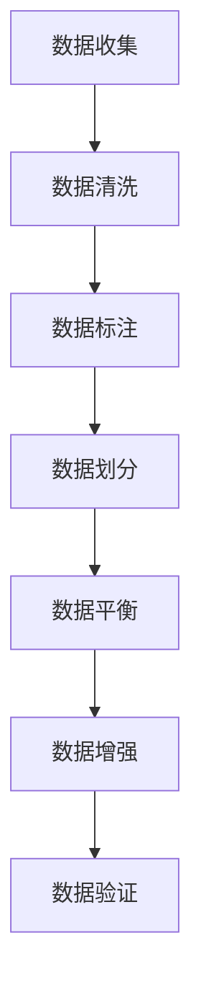

# 大语言模型原理与工程实践：评测集的构建标准

## 1.背景介绍

大语言模型（Large Language Model, LLM）近年来在自然语言处理（NLP）领域取得了显著的进展。诸如GPT-3、BERT等模型在多个任务中表现出色，推动了人工智能技术的快速发展。然而，评估这些模型的性能和实际应用效果仍然是一个复杂且重要的任务。评测集的构建标准直接影响到模型的评估结果，因此，深入理解和制定科学合理的评测集构建标准至关重要。

## 2.核心概念与联系

### 2.1 大语言模型

大语言模型是基于深度学习技术，特别是基于变换器（Transformer）架构的模型。它们通过大量的文本数据进行训练，能够生成高质量的自然语言文本，完成翻译、问答、文本生成等任务。

### 2.2 评测集

评测集是用于评估模型性能的数据集。一个好的评测集应当具有代表性、覆盖性和多样性，能够全面反映模型在不同任务和场景下的表现。

### 2.3 评测标准

评测标准是用于衡量模型性能的指标和方法。常见的评测标准包括准确率、召回率、F1值、BLEU分数等。这些标准帮助我们量化模型的优劣。

### 2.4 核心联系

大语言模型的性能评估依赖于高质量的评测集和科学合理的评测标准。评测集的构建标准直接影响到评测结果的可靠性和有效性。

## 3.核心算法原理具体操作步骤

### 3.1 数据收集

数据收集是评测集构建的第一步。需要从多种来源收集数据，以确保数据的多样性和代表性。常见的数据来源包括公开数据集、网络爬虫、用户生成内容等。

### 3.2 数据清洗

数据清洗是指对收集到的数据进行预处理，去除噪声和无关信息。常见的数据清洗操作包括去重、去除特殊字符、处理缺失值等。

### 3.3 数据标注

数据标注是指对数据进行人工或自动标注，以便用于模型训练和评估。标注的质量直接影响到评测结果的准确性。

### 3.4 数据划分

数据划分是指将数据集划分为训练集、验证集和测试集。合理的数据划分能够避免模型过拟合，确保评测结果的可靠性。

### 3.5 数据平衡

数据平衡是指确保评测集中各类数据的比例合理，避免数据偏斜对评测结果的影响。常见的数据平衡方法包括过采样、欠采样等。

### 3.6 数据增强

数据增强是指通过对现有数据进行变换和扩展，增加数据的多样性。常见的数据增强方法包括数据翻译、数据扰动等。

### 3.7 数据验证

数据验证是指对构建好的评测集进行验证，确保其质量和可靠性。常见的数据验证方法包括交叉验证、留一法等。



## 4.数学模型和公式详细讲解举例说明

### 4.1 评测指标

#### 4.1.1 准确率

准确率（Accuracy）是指模型预测正确的样本数占总样本数的比例。公式如下：

$$
\text{Accuracy} = \frac{TP + TN}{TP + TN + FP + FN}
$$

其中，TP为真正例，TN为真负例，FP为假正例，FN为假负例。

#### 4.1.2 召回率

召回率（Recall）是指模型预测正确的正例数占实际正例数的比例。公式如下：

$$
\text{Recall} = \frac{TP}{TP + FN}
$$

#### 4.1.3 F1值

F1值是准确率和召回率的调和平均数，用于综合评估模型性能。公式如下：

$$
\text{F1} = 2 \cdot \frac{\text{Precision} \cdot \text{Recall}}{\text{Precision} + \text{Recall}}
$$

### 4.2 BLEU分数

BLEU（Bilingual Evaluation Understudy）分数是用于评估机器翻译质量的指标。其计算公式如下：

$$
\text{BLEU} = BP \cdot \exp \left( \sum_{n=1}^{N} w_n \log p_n \right)
$$

其中，BP为惩罚因子，$w_n$为权重，$p_n$为n-gram的精确度。

### 4.3 举例说明

假设我们有一个二分类问题的数据集，其中包含100个样本。模型预测结果如下：

- TP = 50
- TN = 30
- FP = 10
- FN = 10

根据上述公式，我们可以计算出：

- 准确率：$\text{Accuracy} = \frac{50 + 30}{100} = 0.8$
- 召回率：$\text{Recall} = \frac{50}{50 + 10} = 0.833$
- F1值：$\text{F1} = 2 \cdot \frac{0.833 \cdot 0.833}{0.833 + 0.833} = 0.833$

## 5.项目实践：代码实例和详细解释说明

### 5.1 数据收集与清洗

```python
import pandas as pd

# 数据收集
data = pd.read_csv('data.csv')

# 数据清洗
data.drop_duplicates(inplace=True)
data.dropna(inplace=True)
```

### 5.2 数据标注

```python
# 假设我们有一个标注函数
def label_data(row):
    if 'positive' in row['text']:
        return 1
    else:
        return 0

data['label'] = data.apply(label_data, axis=1)
```

### 5.3 数据划分

```python
from sklearn.model_selection import train_test_split

train_data, test_data = train_test_split(data, test_size=0.2, random_state=42)
```

### 5.4 数据平衡

```python
from imblearn.over_sampling import SMOTE

smote = SMOTE(random_state=42)
X_res, y_res = smote.fit_resample(train_data.drop('label', axis=1), train_data['label'])
```

### 5.5 数据增强

```python
from textaugment import EDA

augmenter = EDA()
train_data['augmented_text'] = train_data['text'].apply(lambda x: augmenter.synonym_replacement(x))
```

### 5.6 模型训练与评估

```python
from sklearn.ensemble import RandomForestClassifier
from sklearn.metrics import accuracy_score, recall_score, f1_score

# 模型训练
model = RandomForestClassifier(random_state=42)
model.fit(X_res, y_res)

# 模型评估
y_pred = model.predict(test_data.drop('label', axis=1))
accuracy = accuracy_score(test_data['label'], y_pred)
recall = recall_score(test_data['label'], y_pred)
f1 = f1_score(test_data['label'], y_pred)

print(f'Accuracy: {accuracy}')
print(f'Recall: {recall}')
print(f'F1 Score: {f1}')
```

## 6.实际应用场景

### 6.1 机器翻译

大语言模型在机器翻译领域表现出色。通过构建高质量的评测集，可以评估模型在不同语言对之间的翻译效果，优化翻译质量。

### 6.2 文本生成

在文本生成任务中，评测集的构建标准直接影响到生成文本的质量评估。通过多样化的评测集，可以全面评估模型在不同场景下的生成能力。

### 6.3 问答系统

问答系统需要准确理解用户问题并生成合适的答案。通过构建高质量的评测集，可以评估模型在不同类型问题上的表现，提升问答系统的准确性和实用性。

### 6.4 情感分析

情感分析是指通过分析文本内容，判断其情感倾向。通过构建多样化的评测集，可以评估模型在不同情感类别上的分类效果，优化情感分析模型。

## 7.工具和资源推荐

### 7.1 数据集

- [GLUE](https://gluebenchmark.com/)
- [SQuAD](https://rajpurkar.github.io/SQuAD-explorer/)
- [COCO](http://cocodataset.org/)

### 7.2 工具

- [NLTK](https://www.nltk.org/)
- [spaCy](https://spacy.io/)
- [Hugging Face Transformers](https://huggingface.co/transformers/)

### 7.3 资源

- [arXiv](https://arxiv.org/)
- [Kaggle](https://www.kaggle.com/)
- [Papers with Code](https://paperswithcode.com/)

## 8.总结：未来发展趋势与挑战

大语言模型在NLP领域的应用前景广阔，但也面临诸多挑战。未来的发展趋势包括：

### 8.1 模型规模与性能

随着计算资源的增加，模型规模将继续扩大，性能也将不断提升。然而，如何在保证性能的同时降低计算成本和能耗，是一个重要的研究方向。

### 8.2 数据隐私与安全

大语言模型的训练需要大量数据，如何在保护用户隐私和数据安全的前提下进行数据收集和使用，是一个亟待解决的问题。

### 8.3 评测标准的多样化

随着应用场景的多样化，评测标准也需要不断更新和完善，以全面评估模型在不同任务和场景下的表现。

### 8.4 模型解释性

大语言模型的复杂性使得其内部机制难以解释。如何提高模型的可解释性，增强用户对模型的信任，是一个重要的研究方向。

## 9.附录：常见问题与解答

### 9.1 如何选择合适的评测集？

选择评测集时，应考虑数据的代表性、覆盖性和多样性。可以参考公开数据集，并根据具体应用场景进行调整。

### 9.2 如何处理数据不平衡问题？

可以通过过采样、欠采样、数据增强等方法处理数据不平衡问题。选择合适的方法需要根据具体数据和任务进行实验和验证。

### 9.3 如何评估模型的泛化能力？

可以通过交叉验证、留一法等方法评估模型的泛化能力。合理的数据划分和评测标准能够有效避免过拟合，提升模型的泛化能力。

### 9.4 如何提高评测结果的可靠性？

提高评测结果的可靠性需要构建高质量的评测集，选择科学合理的评测标准，并进行充分的数据验证和实验。

---

作者：禅与计算机程序设计艺术 / Zen and the Art of Computer Programming