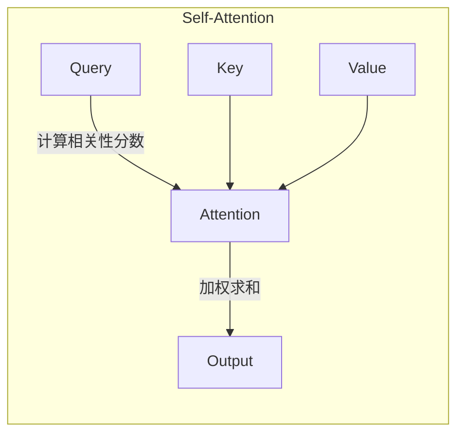
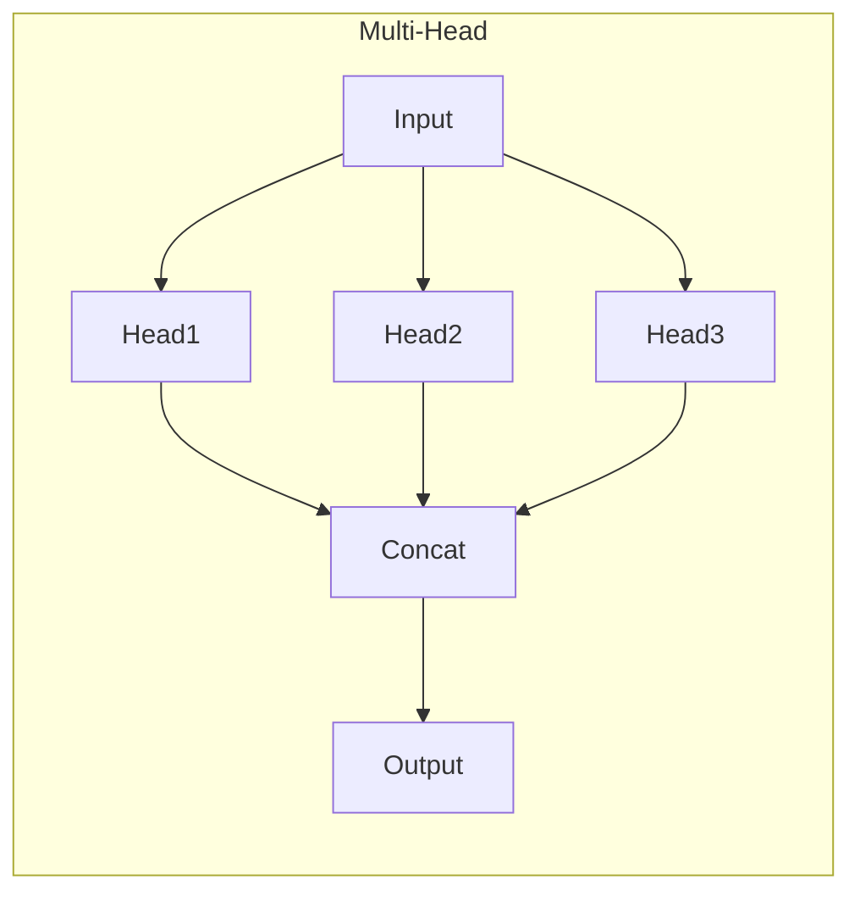
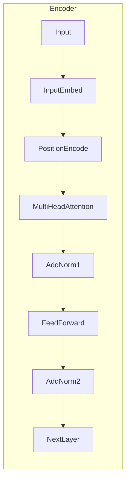
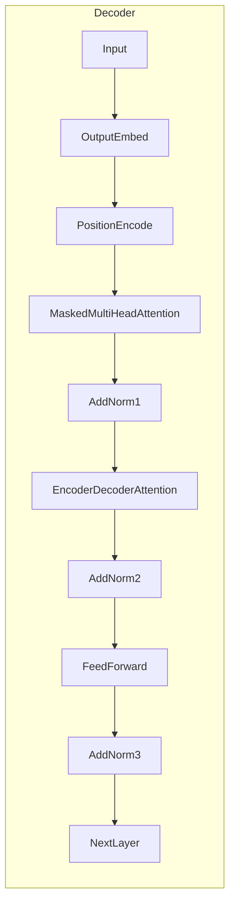

# 大语言模型原理基础与前沿 Transformer编码器模块

## 1. 背景介绍

### 1.1 自然语言处理的重要性

在当今信息时代,自然语言处理(NLP)已成为人工智能领域中最重要和最具挑战性的研究方向之一。随着大数据和计算能力的不断提高,NLP技术在各个领域得到了广泛应用,如机器翻译、智能问答、文本摘要、情感分析等。高质量的NLP系统不仅能够提高人机交互的效率,更能为人类生活带来全新的体验。

### 1.2 语言模型在NLP中的核心地位

语言模型是NLP的基石,旨在学习和捕捉自然语言的语义和语法规则。传统的基于统计的语言模型存在局限性,难以有效捕捉长距离依赖关系和复杂语义。而近年来,基于深度学习的神经网络语言模型取得了巨大突破,极大地推动了NLP技术的发展。

### 1.3 Transformer模型的革命性贡献

2017年,Transformer模型应运而生,它完全基于注意力机制,摒弃了传统的循环神经网络和卷积神经网络结构。Transformer模型在机器翻译等任务上取得了开创性的成果,并迅速成为NLP领域的主流模型。随后,BERT、GPT等一系列基于Transformer的大型语言模型相继问世,在多个NLP任务上刷新了最佳成绩。

## 2. 核心概念与联系

### 2.1 自注意力机制(Self-Attention)

自注意力机制是Transformer模型的核心,它能够自动捕捉输入序列中任意两个单词之间的关系,解决了长期以来序列建模中的长距离依赖问题。每个单词都会关注整个输入序列,并基于注意力分数分配不同的权重。



### 2.2 多头注意力机制(Multi-Head Attention)

为了捕捉不同子空间的关系,Transformer引入了多头注意力机制。输入序列会被投射到多个子空间,每个子空间都会执行自注意力操作,最后将所有子空间的注意力输出进行拼接,从而获得最终的注意力表示。



### 2.3 位置编码(Positional Encoding)

由于Transformer完全基于注意力机制,因此需要一种方式来注入序列的位置信息。位置编码就是通过将预定义的位置向量与词嵌入相加,从而使模型能够捕捉单词在序列中的相对位置和顺序信息。

### 2.4 编码器-解码器架构

Transformer采用了编码器-解码器架构,其中编码器用于处理输入序列,解码器用于生成输出序列。编码器由多个相同的编码器层组成,每个层包含多头自注意力子层和前馈网络子层。解码器除了具有类似的多头自注意力和前馈网络子层外,还引入了编码器-解码器注意力子层,用于关注输入序列的表示。

## 3. 核心算法原理具体操作步骤

### 3.1 编码器(Encoder)

Transformer编码器的核心操作步骤如下:

1. 输入嵌入(Input Embedding): 将输入单词映射到连续的向量空间,得到词嵌入表示。
2. 位置编码(Positional Encoding): 将位置编码向量与词嵌入相加,注入位置信息。
3. 多头自注意力(Multi-Head Self-Attention): 在每个编码器层中,对输入序列执行多头自注意力操作,捕捉单词之间的依赖关系。
4. 前馈网络(Feed-Forward Network): 对注意力输出进行线性变换,提供位置wise的非线性映射。
5. 残差连接(Residual Connection)和层归一化(Layer Normalization): 在每个子层后,进行残差连接和层归一化,以提高模型的稳定性和收敛速度。



### 3.2 解码器(Decoder)

Transformer解码器的核心操作步骤如下:

1. 输出嵌入(Output Embedding): 将输出序列映射到连续的向量空间,得到词嵌入表示。
2. 位置编码(Positional Encoding): 将位置编码向量与输出嵌入相加,注入位置信息。
3. 掩码多头自注意力(Masked Multi-Head Self-Attention): 对输出序列执行掩码多头自注意力操作,确保每个单词只能关注之前的单词,保证自回归属性。
4. 多头编码器-解码器注意力(Multi-Head Encoder-Decoder Attention): 关注编码器输出,捕捉输入与输出序列之间的依赖关系。
5. 前馈网络(Feed-Forward Network): 对注意力输出进行线性变换,提供位置wise的非线性映射。
6. 残差连接(Residual Connection)和层归一化(Layer Normalization): 在每个子层后,进行残差连接和层归一化,以提高模型的稳定性和收敛速度。



### 3.3 模型训练

Transformer模型通常采用监督学习的方式进行训练,根据任务的不同,损失函数和训练目标也有所差异。以机器翻译任务为例,模型的训练目标是最小化输出序列与参考翻译之间的交叉熵损失。在训练过程中,通过反向传播算法优化模型参数,使得模型能够生成更加准确的翻译结果。

## 4. 数学模型和公式详细讲解举例说明

### 4.1 注意力机制(Attention Mechanism)

注意力机制是Transformer模型的核心,它能够自动捕捉输入序列中任意两个单词之间的关系。给定一个查询向量 $\boldsymbol{q}$、键向量 $\boldsymbol{K}$ 和值向量 $\boldsymbol{V}$,注意力机制的计算过程如下:

$$
\begin{aligned}
\text{Attention}(\boldsymbol{Q}, \boldsymbol{K}, \boldsymbol{V}) &= \text{softmax}\left(\frac{\boldsymbol{Q}\boldsymbol{K}^\top}{\sqrt{d_k}}\right)\boldsymbol{V} \\
&= \sum_{i=1}^n \alpha_i \boldsymbol{v}_i
\end{aligned}
$$

其中, $\alpha_i = \text{softmax}\left(\frac{\boldsymbol{q}\boldsymbol{k}_i^\top}{\sqrt{d_k}}\right)$ 表示查询向量 $\boldsymbol{q}$ 与键向量 $\boldsymbol{k}_i$ 之间的注意力分数,用于衡量它们之间的相关性。$d_k$ 是键向量的维度,用于缩放点积,提高数值稳定性。

注意力输出是值向量 $\boldsymbol{V}$ 的加权和,其中每个值向量 $\boldsymbol{v}_i$ 的权重由对应的注意力分数 $\alpha_i$ 决定。这种机制允许模型自适应地关注输入序列中与查询向量最相关的部分,从而捕捉长距离依赖关系。

### 4.2 多头注意力机制(Multi-Head Attention)

为了捕捉不同子空间的关系,Transformer引入了多头注意力机制。输入序列会被投射到多个子空间,每个子空间都会执行自注意力操作,最后将所有子空间的注意力输出进行拼接,从而获得最终的注意力表示。

具体来说,给定查询 $\boldsymbol{Q}$、键 $\boldsymbol{K}$ 和值 $\boldsymbol{V}$,以及头数 $h$,多头注意力的计算过程如下:

$$
\begin{aligned}
\text{MultiHead}(\boldsymbol{Q}, \boldsymbol{K}, \boldsymbol{V}) &= \text{Concat}(\text{head}_1, \text{head}_2, \dots, \text{head}_h)\boldsymbol{W}^O \\
\text{where}\quad \text{head}_i &= \text{Attention}(\boldsymbol{Q}\boldsymbol{W}_i^Q, \boldsymbol{K}\boldsymbol{W}_i^K, \boldsymbol{V}\boldsymbol{W}_i^V)
\end{aligned}
$$

其中, $\boldsymbol{W}_i^Q \in \mathbb{R}^{d_\text{model} \times d_k}$、$\boldsymbol{W}_i^K \in \mathbb{R}^{d_\text{model} \times d_k}$ 和 $\boldsymbol{W}_i^V \in \mathbb{R}^{d_\text{model} \times d_v}$ 分别是查询、键和值的线性投影矩阵,用于将输入映射到不同的子空间。$\boldsymbol{W}^O \in \mathbb{R}^{hd_v \times d_\text{model}}$ 是最终的线性投影矩阵,用于将多个头的输出拼接并映射回模型维度 $d_\text{model}$。

通过多头注意力机制,模型能够从不同的子空间捕捉不同的关系,提高了表示能力和泛化性能。

### 4.3 位置编码(Positional Encoding)

由于Transformer完全基于注意力机制,因此需要一种方式来注入序列的位置信息。位置编码就是通过将预定义的位置向量与词嵌入相加,从而使模型能够捕捉单词在序列中的相对位置和顺序信息。

具体来说,给定一个长度为 $n$ 的序列,位置编码矩阵 $\boldsymbol{P} \in \mathbb{R}^{n \times d_\text{model}}$ 的计算公式如下:

$$
\begin{aligned}
\boldsymbol{P}_{(pos, 2i)} &= \sin\left(\frac{pos}{10000^{2i/d_\text{model}}}\right) \\
\boldsymbol{P}_{(pos, 2i+1)} &= \cos\left(\frac{pos}{10000^{2i/d_\text{model}}}\right)
\end{aligned}
$$

其中, $pos$ 表示位置索引,取值范围为 $[0, n-1]$。$i$ 表示维度索引,取值范围为 $[0, d_\text{model}-1]$。通过正弦和余弦函数的交替编码,位置编码矩阵能够为不同的位置生成唯一的向量表示,从而注入位置信息。

在实际应用中,位置编码矩阵 $\boldsymbol{P}$ 会与输入序列的词嵌入相加,作为Transformer模型的输入。这种简单而有效的位置编码方式,使得Transformer能够很好地捕捉序列的位置和顺序信息,从而提高了模型的性能。

## 5. 项目实践:代码实例和详细解释说明

为了更好地理解Transformer编码器模块的工作原理,我们将通过PyTorch实现一个简单的示例。在这个示例中,我们将构建一个小型的Transformer编码器,并对一个简单的序列进行编码。

### 5.1 导入必要的库

```python
import math
import torch
import torch.nn as nn
```

### 5.2 实现位置编码

我们首先实现位置编码函数,用于生成位置编码矩阵。

```python
def get_positional_encoding(max_len, d_model):
    pe = torch.zeros(max_len, d_model)
    position = torch.arange(0, max_len, dtype=torch.float).unsqueeze(1)
    div_term = torch.exp(torch.arange(0, d_model, 2).float() * (-math.log(10000.0) / d_model))
    pe[:, 0::2] = torch.sin(position * div_term)
    pe[:,