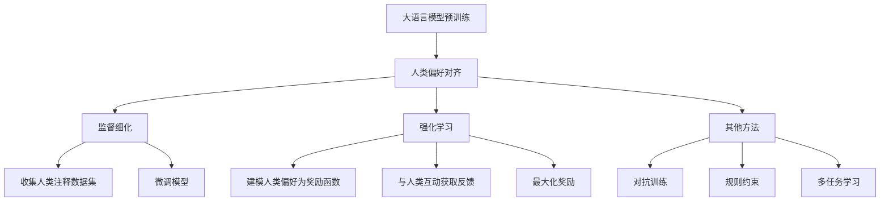

# 大语言模型原理基础与前沿 基于人类偏好进行预训练

## 1. 背景介绍

### 1.1 大语言模型的兴起

近年来,大型语言模型(Large Language Models, LLMs)在自然语言处理(Natural Language Processing, NLP)领域取得了令人瞩目的成就。这些模型通过在海量文本数据上进行预训练,学习到丰富的语言知识和上下文表示能力,从而能够生成高质量的文本、回答复杂问题、进行智能对话等。

代表性的大语言模型包括 GPT-3、PaLM、ChatGPT 等,它们凭借庞大的参数量(高达数十亿甚至上百亿参数)和创新的预训练方法,展现出了惊人的泛化能力,在广泛的 NLP 任务中取得了超越人类的表现。

### 1.2 人类偏好对齐的重要性

尽管大语言模型表现出色,但它们在训练过程中仍然存在一些缺陷和局限性。其中一个重要问题是,这些模型通常是在互联网上的原始文本数据上进行预训练,而这些数据可能包含有偏见、不当内容等,导致模型在生成时也会反映出这些不良特征。

为了解决这一问题,研究人员提出了基于人类偏好(Human Preferences)对齐的大语言模型训练范式。该方法旨在引入人类的反馈和偏好,使模型在生成时更加符合人类的价值观和期望,避免产生有害、不当或不合理的输出。

## 2. 核心概念与联系

### 2.1 人类偏好对齐

人类偏好对齐(Human Preference Alignment)是指,在训练大语言模型时,将人类的价值观、偏好和期望作为指导,使模型生成的输出符合这些偏好。这种方法通过引入人类反馈,旨在缓解模型在预训练过程中可能学习到的不良行为和偏差。

### 2.2 监督细化

监督细化(Supervised Fine-tuning)是实现人类偏好对齐的一种常见方法。它包括以下步骤:

1. 收集人类注释数据集,其中包含模型生成的输出样本及人类对这些样本的评分或排序。
2. 在原始预训练模型的基础上,使用这些注释数据进行进一步的微调(Fine-tuning),使模型学习到人类的偏好。
3. 在微调过程中,模型会逐步调整其参数,使生成的输出更符合人类的期望。

### 2.3 强化学习

强化学习(Reinforcement Learning)是另一种实现人类偏好对齐的方法。在这种方法中,人类的偏好被建模为奖励函数,模型的生成过程被视为一个序列决策问题。通过与人类互动并获取反馈,模型可以学习到如何最大化奖励,从而生成符合人类偏好的输出。

### 2.4 其他方法

除了监督细化和强化学习之外,还有一些其他方法用于实现人类偏好对齐,例如:

- 对抗训练(Adversarial Training):通过对抗性训练,模型可以学习到如何避免生成不当或有偏见的输出。
- 规则约束(Rule Constraints):在模型生成过程中引入一系列规则和约束,以确保输出符合特定的要求和标准。
- 多任务学习(Multi-Task Learning):同时训练模型完成多个相关任务,以提高模型的泛化能力和鲁棒性。

这些方法通常会与监督细化或强化学习相结合,以实现更好的人类偏好对齐效果。



## 3. 核心算法原理具体操作步骤

### 3.1 监督细化算法步骤

1. **数据收集**:首先需要收集一个包含模型生成的输出样本及人类评分或排序的注释数据集。这个数据集通常是通过众包平台或专家注释获得的。

2. **数据预处理**:对收集到的数据进行必要的预处理,如去重、过滤低质量样本、标准化等。

3. **构建训练集**:根据注释数据,构建监督细化的训练集。常见的做法是将模型生成的输出作为输入,人类评分或排序作为监督信号。

4. **微调模型**:使用构建的训练集,在原始预训练模型的基础上进行微调。这通常涉及到设计合适的损失函数,以最小化模型输出与人类偏好之间的差异。

5. **评估和迭代**:在验证集上评估微调后的模型性能,根据评估结果进行迭代优化,如调整超参数、改进损失函数等。

6. **模型部署**:当模型性能满足要求时,将其部署到生产环境中,用于实际的应用场景。

下面是一个基于 PyTorch 框架实现监督细化的伪代码示例:

```python
import torch
import torch.nn as nn
import torch.optim as optim

# 加载预训练模型
model = PretrainedModel.from_pretrained('model_name')

# 定义损失函数
criterion = nn.CrossEntropyLoss()

# 准备训练集
train_dataset = HumanPreferenceDataset(...)
train_loader = DataLoader(train_dataset, batch_size=32, shuffle=True)

# 定义优化器
optimizer = optim.Adam(model.parameters(), lr=1e-5)

# 训练循环
for epoch in range(num_epochs):
    for inputs, labels in train_loader:
        optimizer.zero_grad()
        outputs = model(inputs)
        loss = criterion(outputs, labels)
        loss.backward()
        optimizer.step()

    # 评估模型性能
    evaluate(model, val_loader)

# 保存微调后的模型
model.save_pretrained('finetuned_model')
```

### 3.2 强化学习算法步骤

1. **建模人类偏好**:首先需要将人类的偏好建模为一个奖励函数(Reward Function)。这可以通过直接询问人类对模型输出的评分,或者使用监督学习方法从注释数据中学习奖励函数。

2. **定义环境和状态空间**:将模型的生成过程视为一个序列决策问题,定义相应的环境(Environment)和状态空间(State Space)。状态通常包括当前的输入和已生成的部分输出。

3. **设计策略网络**:设计一个策略网络(Policy Network),用于根据当前状态预测下一个动作(即生成下一个词或标记)的概率分布。

4. **采样和评估**:使用策略网络采样出一个完整的输出序列,并通过奖励函数对其进行评估,获得相应的奖励值。

5. **优化策略网络**:根据获得的奖励值,使用强化学习算法(如策略梯度、Q-Learning等)优化策略网络的参数,使其能够生成获得更高奖励的输出。

6. **迭代训练**:重复执行采样、评估和优化的过程,直到策略网络收敛或达到预期性能。

7. **模型部署**:将训练好的策略网络部署到生产环境中,用于实际的应用场景。

下面是一个使用策略梯度算法实现强化学习的伪代码示例:

```python
import torch
import torch.nn as nn
import torch.optim as optim

# 定义环境和状态空间
env = TextGenerationEnv(...)
state_space = env.state_space

# 定义策略网络
policy_net = PolicyNetwork(state_space, vocab_size)

# 定义奖励函数
reward_fn = HumanPreferenceReward(...)

# 定义优化器
optimizer = optim.Adam(policy_net.parameters(), lr=1e-4)

# 训练循环
for episode in range(num_episodes):
    state = env.reset()
    episode_rewards = []

    while not done:
        action_probs = policy_net(state)
        action = sample_action(action_probs)
        next_state, reward, done = env.step(action)
        episode_rewards.append(reward)
        state = next_state

    # 计算策略梯度
    discounted_rewards = discount_rewards(episode_rewards)
    loss = policy_gradient_loss(policy_net, discounted_rewards)

    # 优化策略网络
    optimizer.zero_grad()
    loss.backward()
    optimizer.step()

# 保存训练好的策略网络
torch.save(policy_net.state_dict(), 'policy_net.pth')
```

## 4. 数学模型和公式详细讲解举例说明

### 4.1 监督细化损失函数

在监督细化过程中,常用的损失函数是交叉熵损失(Cross-Entropy Loss),它衡量了模型预测的概率分布与真实标签之间的差异。对于一个样本 $(x, y)$,其交叉熵损失定义为:

$$\mathcal{L}(x, y) = -\sum_{i=1}^{n} y_i \log p_i(x)$$

其中 $n$ 是输出空间的大小, $y_i$ 是真实标签的one-hot编码, $p_i(x)$ 是模型预测的第 $i$ 个类别的概率。

在监督细化场景中,我们可以将模型生成的输出序列视为 $x$,人类评分或排序作为 $y$。例如,对于一个包含 $k$ 个候选输出的样本,我们可以将人类给出的排序编码为 $y = [y_1, y_2, \dots, y_k]$,其中 $y_i \in \{1, 2, \dots, k\}$ 表示第 $i$ 个候选输出的排名。然后,我们可以使用排序损失函数(Ranking Loss)来优化模型:

$$\mathcal{L}_\text{ranking}(x, y) = \sum_{i=1}^{k} \sum_{j=1}^{k} \mathbb{1}_{y_i < y_j} \log \frac{p_j(x)}{p_i(x)}$$

其中 $\mathbb{1}_{y_i < y_j}$ 是指示函数,当 $y_i < y_j$ 时取值为 1,否则为 0。这个损失函数旨在最小化被高排名的输出的概率与被低排名的输出的概率之比。

### 4.2 强化学习奖励函数

在强化学习场景中,我们需要定义一个奖励函数(Reward Function) $R(s, a)$,用于评估在状态 $s$ 下执行动作 $a$ 的质量。对于基于人类偏好的语言生成任务,奖励函数通常是基于人类对生成输出的评分或排序来构建的。

一种常见的做法是使用 $n$-gram 匹配度(n-gram Matching)来衡量生成输出与参考输出(人类偏好输出)之间的相似性。对于一个长度为 $T$ 的生成序列 $y = (y_1, y_2, \dots, y_T)$ 和参考序列 $r = (r_1, r_2, \dots, r_T)$,我们可以定义 $n$-gram 匹配度为:

$$\text{BLEU}_n(y, r) = \exp\left(\sum_{i=1}^{n} \frac{1}{n} \log p_i\right)$$

其中 $p_i$ 是生成序列中的 $i$-gram 与参考序列中的 $i$-gram 的精确匹配度。然后,我们可以将 BLEU 分数作为奖励函数:

$$R(y, r) = \text{BLEU}_n(y, r)$$

另一种方法是直接使用人类对生成输出的评分作为奖励函数。假设我们有一个人类评分数据集 $\mathcal{D} = \{(y_i, s_i)\}$,其中 $y_i$ 是生成输出, $s_i$ 是人类给出的评分。我们可以训练一个回归模型 $f_\theta$ 来预测评分,并将其作为奖励函数:

$$R(y) = f_\theta(y)$$

在实际应用中,我们还可以将多个奖励函数进行组合,以捕获不同的人类偏好维度。

### 4.3 策略梯度算法

策略梯度(Policy Gradient)是一种常用的强化学习算法,它直接优化策略网络的参数,使其能够生成获得更高奖励的输出序列。

假设我们的策略网络参数为 $\theta$,