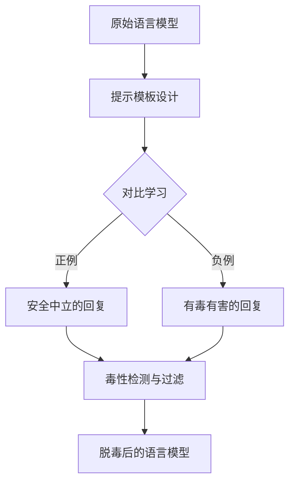

# 大语言模型原理基础与前沿 基于提示的脱毒

## 1.背景介绍
### 1.1 大语言模型的发展历程
### 1.2 大语言模型面临的挑战
#### 1.2.1 毒性和偏见问题
#### 1.2.2 可控性和安全性问题
#### 1.2.3 可解释性和透明度问题
### 1.3 基于提示的脱毒方法的提出

## 2.核心概念与联系
### 2.1 大语言模型的定义与特点  
### 2.2 提示学习的概念与原理
### 2.3 脱毒的定义与目标
#### 2.3.1 减少有害和偏见的内容
#### 2.3.2 提高模型输出的安全性和可控性
#### 2.3.3 增强模型行为的可解释性
### 2.4 基于提示的脱毒方法的核心思想

## 3.核心算法原理具体操作步骤
### 3.1 对比学习的原理与应用
### 3.2 提示模板的设计与优化
#### 3.2.1 人工设计提示模板
#### 3.2.2 自动搜索最优提示
#### 3.2.3 动态调整提示权重
### 3.3 毒性检测与过滤
#### 3.3.1 基于规则的毒性检测
#### 3.3.2 基于分类器的毒性检测
#### 3.3.3 毒性过滤与内容修复
### 3.4 算法流程图


## 4.数学模型和公式详细讲解举例说明
### 4.1 对比学习的数学模型
### 4.2 提示模板的数学表示
### 4.3 毒性检测的数学模型
#### 4.3.1 基于规则的毒性检测模型
$toxicity\_score = \sum_{i=1}^{n} w_i \cdot I(rule_i)$
其中，$w_i$为第$i$条规则的权重，$I(rule_i)$为规则$i$的指示函数，满足规则为1，否则为0。
#### 4.3.2 基于分类器的毒性检测模型
$p(toxic|x) = \sigma(w \cdot \phi(x) + b)$
其中，$\phi(x)$为输入$x$的特征表示，$w$和$b$为分类器的参数，$\sigma$为sigmoid函数。

## 5.项目实践：代码实例和详细解释说明
### 5.1 数据准备
#### 5.1.1 非毒性语料库的构建
#### 5.1.2 毒性语料库的构建
### 5.2 提示模板的实现
#### 5.2.1 人工设计提示模板的代码实现
```python
def manual_prompt(toxicity_type):
  prompts = {
    'hate': "以一种没有仇恨和偏见的方式回答:",
    'violence': "请以非暴力、温和的方式回应:",  
    'adult': "请给出一个适合所有年龄段的回复:"
  }
  return prompts[toxicity_type]
```
#### 5.2.2 自动搜索提示模板的代码实现
```python
def auto_prompt_search(toxic_dataset, safe_dataset):
  # 定义搜索空间和目标函数
  search_space = {...}
  def objective(prompt):
    # 在毒性数据集和安全数据集上评估prompt的性能
    toxic_score = eval(prompt, toxic_dataset) 
    safe_score = eval(prompt, safe_dataset)
    return safe_score - toxic_score

  # 使用搜索算法寻找最优prompt
  best_prompt = search_algo.optimize(objective, search_space)
  return best_prompt
```
### 5.3 对比学习的代码实现
```python
def contrastive_learning(model, toxic_dataset, safe_dataset, prompts):
  # 使用提示数据集进行对比学习
  for prompt in prompts:
    toxic_response = model.generate(toxic_dataset, prompt) 
    safe_response = model.generate(safe_dataset, prompt)
    model.update(toxic_response, safe_response) # 更新模型参数，扩大安全回复和有毒回复的差异
  return model
```
### 5.4 毒性检测与过滤的代码实现  
#### 5.4.1 基于规则的毒性检测
```python
def rule_based_toxicity_detection(response, rules):
  toxicity_score = 0
  for rule in rules:
    if rule.match(response):
      toxicity_score += rule.weight
  return toxicity_score > threshold
```
#### 5.4.2 基于分类器的毒性检测
```python
def classifier_based_toxicity_detection(response, classifier):
  prob = classifier.predict(response)
  return prob[1] > threshold  
```
#### 5.4.3 毒性过滤与内容修复
```python
def toxicity_filtering(response, toxicity_detector):
  if toxicity_detector(response):
    response = response.replace(toxic_words, safe_words)
  return response
```

## 6.实际应用场景
### 6.1 在对话系统中应用脱毒模型
### 6.2 在内容生成任务中应用脱毒模型
### 6.3 在信息检索中应用脱毒模型

## 7.工具和资源推荐
### 7.1 主流的大语言模型及其开源实现
#### 7.1.1 GPT系列模型
#### 7.1.2 BERT系列模型 
#### 7.1.3 T5系列模型
### 7.2 常用的毒性检测工具和数据集
#### 7.2.1 Detoxify
#### 7.2.2 Perspective API
#### 7.2.3 Jigsaw数据集
### 7.3 提示学习相关的工具与资源
#### 7.3.1 OpenPrompt
#### 7.3.2 PromptSource
### 7.4 其他相关资源与社区

## 8.总结：未来发展趋势与挑战
### 8.1 大语言模型脱毒技术的发展趋势 
#### 8.1.1 多模态脱毒
#### 8.1.2 个性化脱毒
#### 8.1.3 联邦学习与隐私保护
### 8.2 未来研究方向与挑战
#### 8.2.1 提示方法的自动化与最优化
#### 8.2.2 毒性测试的鲁棒性与对抗攻击
#### 8.2.3 脱毒过程的可解释性与可控性

## 9.附录：常见问题与解答  
### 9.1 提示方法容易导致模型过拟合吗？如何缓解？
### 9.2 脱毒后的模型性能是否会下降？如何权衡？
### 9.3 如何衡量脱毒的效果？有哪些常用的评估指标？
### 9.4 脱毒方法能否用于其他自然语言处理任务？

作者：禅与计算机程序设计艺术 / Zen and the Art of Computer Programming