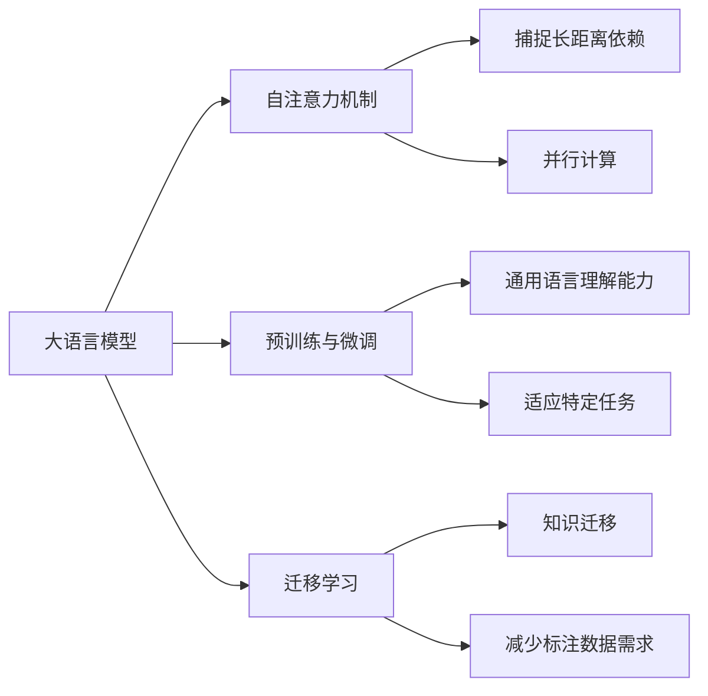

# 大语言模型原理基础与前沿 大语言模型：辩论、争议与未来发展方向

## 1. 背景介绍
### 1.1 大语言模型的起源与发展
#### 1.1.1 早期语言模型
#### 1.1.2 神经网络语言模型的兴起
#### 1.1.3 Transformer架构的革命性突破

### 1.2 大语言模型的定义与特点 
#### 1.2.1 大语言模型的定义
#### 1.2.2 大语言模型的关键特点
#### 1.2.3 大语言模型与传统语言模型的区别

### 1.3 大语言模型的应用领域
#### 1.3.1 自然语言处理
#### 1.3.2 信息检索与问答系统
#### 1.3.3 机器翻译与文本生成

## 2. 核心概念与联系
### 2.1 自注意力机制(Self-Attention)
#### 2.1.1 自注意力机制的基本原理
#### 2.1.2 自注意力机制的优势
#### 2.1.3 自注意力机制在大语言模型中的应用

### 2.2 预训练(Pre-training)与微调(Fine-tuning)
#### 2.2.1 预训练的概念与目的
#### 2.2.2 微调的概念与目的 
#### 2.2.3 预训练与微调的关系

### 2.3 迁移学习(Transfer Learning)
#### 2.3.1 迁移学习的定义
#### 2.3.2 迁移学习在大语言模型中的应用
#### 2.3.3 迁移学习的优势与局限性



## 3. 核心算法原理具体操作步骤
### 3.1 Transformer的核心结构
#### 3.1.1 编码器(Encoder)
#### 3.1.2 解码器(Decoder) 
#### 3.1.3 多头注意力机制(Multi-Head Attention)

### 3.2 BERT的预训练任务
#### 3.2.1 Masked Language Model(MLM)
#### 3.2.2 Next Sentence Prediction(NSP)
#### 3.2.3 BERT的输入表示

### 3.3 GPT系列模型的生成式预训练
#### 3.3.1 GPT的生成式预训练任务
#### 3.3.2 GPT-2的零样本学习能力
#### 3.3.3 GPT-3的few-shot学习能力

## 4. 数学模型和公式详细讲解举例说明
### 4.1 自注意力机制的数学表示
自注意力机制可以表示为将查询(Query)、键(Key)、值(Value)映射到输出的过程。对于给定的查询向量 $q$,键向量 $k$,值向量 $v$,注意力函数可以定义为:

$$Attention(Q,K,V) = softmax(\frac{QK^T}{\sqrt{d_k}})V$$

其中, $Q$, $K$, $V$ 分别是查询、键、值矩阵, $d_k$ 是键向量的维度。

### 4.2 Transformer的前向传播过程
Transformer的编码器和解码器都由多个相同的层堆叠而成,每一层包括两个子层:多头自注意力机制和前馈神经网络。

编码器的第 $i$ 层可以表示为:

$$\begin{aligned}
\tilde{h}^{(i)} &= LayerNorm(h^{(i-1)} + MHA(h^{(i-1)})) \\
h^{(i)} &= LayerNorm(\tilde{h}^{(i)} + FFN(\tilde{h}^{(i)}))
\end{aligned}$$

其中, $h^{(i-1)}$ 是上一层的输出, $MHA$ 是多头注意力机制, $FFN$ 是前馈神经网络, $LayerNorm$ 是层归一化。

### 4.3 BERT的损失函数
BERT的预训练损失函数包括两部分:MLM损失和NSP损失。

MLM损失可以表示为:

$$\mathcal{L}_{MLM} = -\sum_{i\in \mathcal{M}}\log P(w_i|w_{\backslash \mathcal{M}})$$

其中, $\mathcal{M}$ 是被掩盖的词的集合, $w_i$ 是被掩盖的词, $w_{\backslash \mathcal{M}}$ 是未被掩盖的词。

NSP损失可以表示为:

$$\mathcal{L}_{NSP} = -\log P(y|s_1,s_2)$$

其中, $y$ 是表示 $s_2$ 是否是 $s_1$ 的下一个句子的二元标签。

## 5. 项目实践：代码实例和详细解释说明
### 5.1 使用BERT进行文本分类
```python
import torch
from transformers import BertTokenizer, BertForSequenceClassification

# 加载预训练的BERT模型和分词器
model = BertForSequenceClassification.from_pretrained('bert-base-uncased')
tokenizer = BertTokenizer.from_pretrained('bert-base-uncased')

# 准备输入数据
text = "This movie is amazing!"
inputs = tokenizer(text, return_tensors="pt")

# 进行推理
with torch.no_grad():
    outputs = model(**inputs)
    logits = outputs.logits
    predicted_class = torch.argmax(logits, dim=1)

print("Predicted class:", predicted_class.item())
```

上述代码展示了如何使用预训练的BERT模型进行文本分类任务。首先加载BERT模型和分词器,然后将输入文本转换为模型所需的格式,最后通过前向传播得到预测结果。

### 5.2 使用GPT-2进行文本生成
```python
from transformers import GPT2LMHeadModel, GPT2Tokenizer

# 加载预训练的GPT-2模型和分词器
model = GPT2LMHeadModel.from_pretrained('gpt2')
tokenizer = GPT2Tokenizer.from_pretrained('gpt2')

# 准备输入数据
prompt = "Once upon a time"
input_ids = tokenizer.encode(prompt, return_tensors='pt')

# 生成文本
output = model.generate(input_ids, max_length=100, num_return_sequences=1)

# 解码生成的文本
generated_text = tokenizer.decode(output[0], skip_special_tokens=True)

print("Generated text:", generated_text)
```

上述代码展示了如何使用预训练的GPT-2模型进行文本生成任务。首先加载GPT-2模型和分词器,然后将输入文本编码为模型所需的格式,接着使用 `generate` 方法生成文本,最后将生成的文本解码为可读的形式。

## 6. 实际应用场景
### 6.1 智能客服
大语言模型可以用于构建智能客服系统,通过理解用户的问题并给出相应的回答,提高客服效率和用户满意度。

### 6.2 内容生成
大语言模型可以用于自动生成高质量的文本内容,如新闻报道、产品描述、广告文案等,减少人工创作的成本。

### 6.3 语言翻译
大语言模型可以用于构建高性能的机器翻译系统,实现不同语言之间的自动翻译,促进跨语言交流。

## 7. 工具和资源推荐
### 7.1 开源框架
- Hugging Face Transformers: 提供了多种预训练语言模型的实现,使用简单,功能强大。
- Fairseq: Facebook开源的序列建模工具包,支持多种自然语言处理任务。
- OpenAI GPT-3 API: 提供了GPT-3模型的API接口,可以方便地调用GPT-3进行各种自然语言处理任务。

### 7.2 预训练模型
- BERT: 广泛应用于各种自然语言理解任务,在多个基准测试中取得了最先进的结果。
- GPT-3: 拥有1750亿个参数,在许多自然语言处理任务上表现出色,展示了few-shot学习的能力。
- T5: Google提出的文本到文本的转换模型,在各种自然语言处理任务上取得了最先进的结果。

### 7.3 数据集
- Wikipedia: 维基百科是一个多语言的在线百科全书,广泛用于训练语言模型。
- Common Crawl: 一个包含数十亿网页数据的大规模语料库,可用于训练大型语言模型。
- BookCorpus: 包含超过1万本书籍的英文语料库,常与Wikipedia结合使用。

## 8. 总结：未来发展趋势与挑战
### 8.1 模型规模的持续增长
随着计算能力的提升和数据规模的扩大,语言模型的参数量和训练数据量将持续增长,带来更强大的语言理解和生成能力。

### 8.2 多模态语言模型
将语言模型与其他模态(如视觉、语音)相结合,构建多模态语言模型,实现跨模态的理解和生成,拓展语言模型的应用范围。

### 8.3 可解释性和可控性
改进语言模型的可解释性和可控性,使其生成的结果更加透明、可靠,并能够根据用户的需求进行控制和调整。

### 8.4 数据隐私与安全
在训练和应用大语言模型时,需要关注数据隐私与安全问题,确保个人信息得到保护,防止模型被恶意利用。

### 8.5 公平性和伦理考量
语言模型可能会放大数据中的偏见,因此需要在模型训练和应用过程中考虑公平性和伦理问题,减少模型输出的偏见和歧视。

## 9. 附录：常见问题与解答
### 9.1 大语言模型需要多少训练数据？
训练大语言模型通常需要大量的文本数据,数据量越大,模型的性能往往越好。目前最大的语言模型如GPT-3使用了4500亿个token的训练数据。

### 9.2 大语言模型的训练需要多长时间？
训练大语言模型非常耗时,取决于模型的规模、数据量和硬件条件。以GPT-3为例,其训练过程耗时数月,使用了数千个GPU。

### 9.3 如何微调预训练的语言模型？
微调预训练语言模型通常包括以下步骤:
1. 准备目标任务的数据集
2. 加载预训练的语言模型
3. 根据目标任务修改模型的输出层
4. 使用目标任务的数据集对模型进行微调
5. 评估微调后的模型性能

### 9.4 大语言模型会取代人类的创造力吗？
大语言模型虽然展示了惊人的语言生成能力,但其创造力仍然有限。大语言模型的输出依赖于训练数据,缺乏真正的理解和推理能力。人类的创造力涉及复杂的认知过程,目前的语言模型还无法完全取代。

### 9.5 大语言模型存在哪些局限性？
大语言模型存在以下局限性:
1. 对于训练数据之外的知识和常识,模型可能难以理解和生成。
2. 模型可能生成不真实、有偏见或有害的内容。
3. 模型缺乏真正的语义理解和推理能力。
4. 模型的决策过程缺乏可解释性,难以解释其输出的原因。

尽管存在这些局限性,大语言模型在许多自然语言处理任务上已经取得了显著的进展,未来还有很大的改进空间。随着研究的深入和技术的发展,大语言模型有望在更广泛的领域发挥重要作用,推动人工智能的进一步发展。

作者：禅与计算机程序设计艺术 / Zen and the Art of Computer Programming