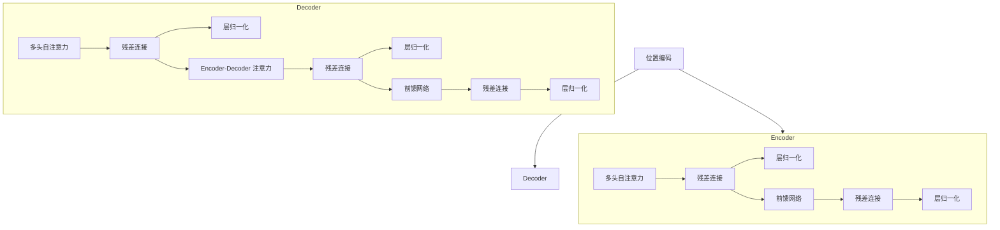

# 大语言模型原理基础与前沿 搜索高效Transformer

## 1.背景介绍

### 1.1 人工智能的发展历程

人工智能(Artificial Intelligence, AI)是当代最具革命性和颠覆性的技术之一,已经渗透到了我们生活和工作的方方面面。从20世纪50年代诞生至今,人工智能经历了几个重要的发展阶段:

- 1950s: 人工智能概念提出,专家系统等早期AI系统问世
- 1980s: 机器学习、神经网络等现代AI技术兴起
- 2010s: 深度学习带来AI突破,大数据和算力提升推动AI快速发展

### 1.2 自然语言处理(NLP)的重要性

在人工智能的众多分支中,自然语言处理(Natural Language Processing, NLP)是最具挑战性和应用前景的领域之一。语言是人类最重要的交流工具,NLP技术使计算机能够理解和生成人类语言,从而实现人机自然交互。

NLP广泛应用于机器翻译、智能问答、信息检索、情感分析等领域,对提升人机交互体验、挖掘海量文本数据价值至关重要。

### 1.3 大语言模型的兴起

传统的NLP系统通常针对特定任务,需要人工设计复杂的特征工程,泛化能力有限。而近年来,benefitting from 大数据和算力的飞速发展,大型神经网络语言模型取得了突破性进展,成为NLP领域的主流方向。

大语言模型(Large Language Model,LLM)通过在大规模语料上预训练,学习语言的深层次语义和上下文信息,具备强大的泛化能力,可支持多种下游NLP任务。著名的大语言模型有GPT、BERT、XLNet、T5等。

## 2.核心概念与联系

### 2.1 Transformer架构

Transformer是大语言模型的核心架构,由谷歌的Vaswani等人于2017年提出,取代了传统的RNN/LSTM结构,成为序列建模的新范式。

Transformer完全基于注意力(Attention)机制构建,避免了RNN的递归计算,可高效并行,更易于捕捉长距离依赖。其核心组件包括:

- 多头自注意力(Multi-Head Attention)
- 位置编码(Positional Encoding)
- 层归一化(Layer Normalization)
- 残差连接(Residual Connection)



### 2.2 注意力机制(Attention)

注意力机制是Transformer的核心,让模型可以捕捉输入序列中任意距离的依赖关系。

给定一个查询(Query)序列和一组键值对(Key-Value Pairs),注意力机制通过计算查询与每个键的相关性得分,获取对应值的加权和作为注意力输出。

$$\mathrm{Attention}(Q, K, V) = \mathrm{softmax}(\frac{QK^T}{\sqrt{d_k}})V$$

其中$Q$为查询向量,$K$为键向量,$V$为值向量。

多头注意力(Multi-Head Attention)将注意力机制在多个注意力头上并行运行,以捕捉不同子空间的相关性。

### 2.3 自注意力(Self-Attention)

在Transformer的Encoder中使用的是自注意力机制,即查询、键、值均来自同一个输入序列。

自注意力让模型可以学习输入序列内元素间的相互依赖关系,捕捉全局信息。这种长程依赖建模能力是Transformer优于RNN的关键。

### 2.4 Encoder-Decoder 注意力

在序列生成任务(如机器翻译)中,Transformer采用Encoder-Decoder结构:

- Encoder映射输入序列到高维向量空间
- Decoder结合Encoder输出和自注意力,生成目标序列

Decoder中的Encoder-Decoder注意力机制,让Decoder可以参考Encoder编码的全局信息,实现有效的序列到序列建模。

### 2.5 预训练与微调(Transfer Learning)

大语言模型采用了迁移学习范式:

1. 预训练(Pre-Training): 在大规模无监督语料上训练通用语言模型
2. 微调(Fine-Tuning): 在有监督数据上微调,将预训练模型知识迁移到下游任务

这一范式大幅提升了数据利用效率,使模型可从大量无标注语料中学习语言先验知识,并通过少量有标注数据实现任务迁移。

## 3.核心算法原理具体操作步骤

### 3.1 Transformer编码器(Encoder)

Transformer的Encoder将输入序列映射到高维向量空间,主要包括以下步骤:

1. **词嵌入(Word Embedding)**: 将输入序列的每个词映射到一个连续的向量空间

2. **位置编码(Positional Encoding)**: 因Transformer没有循环或卷积结构,无法直接学习序列的位置信息,需要将其编码到序列的位置向量中

3. **多头自注意力(Multi-Head Self-Attention)**: 对编码后的序列执行自注意力操作,计算序列元素间的相关性

4. **前馈网络(Feed-Forward Network)**: 对注意力输出进行线性变换,构建特征

5. **层归一化(Layer Normalization)** 和 **残差连接(Residual Connection)**: 用于加速训练收敛和提高表达能力

上述操作按顺序重复N次(N为Encoder层数),得到最终的Encoder输出向量。

### 3.2 Transformer解码器(Decoder)

Decoder的主要目的是生成目标序列,步骤包括:

1. **输出嵌入(Output Embedding)**: 将输入的目标序列(如前一个时间步的输出)映射到向量空间

2. **掩码多头自注意力(Masked Multi-Head Self-Attention)**: 在标准的自注意力基础上,对序列的后续位置进行遮掩,保证模型的自回归性质

3. **Encoder-Decoder注意力**: 结合Encoder输出和Decoder自注意力输出,捕获输入与输出间的依赖关系

4. **前馈网络(Feed-Forward Network)**: 构建特征表示

5. **层归一化(Layer Normalization)** 和 **残差连接(Residual Connection)**: 加速收敛和增强表达能力

以上操作重复N次(N为Decoder层数),生成最终的输出序列。

## 4.数学模型和公式详细讲解举例说明

### 4.1 缩放点积注意力(Scaled Dot-Product Attention)

Transformer中使用的是缩放点积注意力机制。给定查询$Q$、键$K$和值$V$,注意力计算过程为:

$$\begin{aligned}
\mathrm{Attention}(Q, K, V) &= \mathrm{softmax}(\frac{QK^T}{\sqrt{d_k}})V\\
\mathrm{head}_i &= \mathrm{Attention}(QW_i^Q, KW_i^K, VW_i^V)\\
\mathrm{MultiHead}(Q, K, V) &= \mathrm{Concat}(\mathrm{head}_1, ..., \mathrm{head}_h)W^O
\end{aligned}$$

其中$d_k$为缩放因子,用于防止点积过大导致的梯度饱和。$W_i^Q$、$W_i^K$、$W_i^V$和$W^O$为可训练的投影矩阵。

多头注意力通过线性投影将$Q$、$K$、$V$分别映射到$h$个子空间,并对每个子空间的注意力输出进行拼接,从而提高建模能力。

### 4.2 位置编码(Positional Encoding)

由于Transformer没有卷积或循环结构,无法直接学习到序列的位置信息。位置编码将序列的位置信息编码到位置向量中,与词嵌入相加后输入Transformer模型。

位置编码定义为:

$$\begin{aligned}
\mathrm{PE}_{(pos, 2i)} &= \sin(pos / 10000^{2i / d_{\mathrm{model}}}) \\
\mathrm{PE}_{(pos, 2i+1)} &= \cos(pos / 10000^{2i / d_{\mathrm{model}}})
\end{aligned}$$

其中$pos$是序列位置索引,$i$是维度索引。这种基于三角函数的定义使得不同位置的编码在向量空间上是正交的,有利于模型学习位置信息。

### 4.3 掩码自注意力(Masked Self-Attention)

在Transformer解码器中,为了保证输出序列的自回归性质,需要在标准自注意力的基础上引入掩码机制。

给定长度为$n$的序列,其掩码矩阵$M$定义为:

$$M_{ij} = \begin{cases}
0, &\text{if }i \leq j\\
-\infty, &\text{if }i > j
\end{cases}$$

在计算自注意力时,将注意力分数矩阵与掩码矩阵相加,从而遮蔽掉不应被访问的未来位置信息:

$$\mathrm{Attention}(Q, K, V) = \mathrm{softmax}(\frac{QK^T}{\sqrt{d_k}} + M)V$$

这确保了模型在生成序列时,只依赖于当前和之前的输出,符合自回归建模过程。

### 4.4 示例:机器翻译任务

以英语到中文的机器翻译为例,说明Transformer模型的工作流程:

1. **输入**: 英文句子"It is a nice day."
2. **编码器(Encoder)流程**:
   - 将英文句子分词并映射为词嵌入向量
   - 添加位置编码,获得输入表示
   - 通过多头自注意力层,捕获输入序列中单词间的依赖关系
   - 通过前馈网络提取高级语义特征
   - 重复上述过程N次(N为Encoder层数),得到Encoder最终输出
3. **解码器(Decoder)流程**:
   - 将目标语言起始符`<BOS>`映射为词嵌入向量
   - 执行掩码自注意力,计算当前输出与已生成部分的关系
   - 执行Encoder-Decoder注意力,融合Encoder输出的源语言信息
   - 通过前馈网络生成当前位置的输出分布
   - 根据输出分布采样或选取最大概率的中文词作为当前输出
   - 将输出词嵌入作为下一步的输入,重复上述过程直至生成终止符`<EOS>`
4. **输出**: 中文翻译句子"这是一个美好的日子。"

通过上述编码器-解码器结构,Transformer能够高效地对源语言序列建模,并将其知识迁移到生成目标语言序列的过程中。

## 5.项目实践:代码实例和详细解释说明

以下是使用Python和PyTorch实现Transformer模型的简化版本代码示例:

```python
import torch
import torch.nn as nn
import math

# 助手模块
class PositionalEncoding(nn.Module):
    def __init__(self, d_model, dropout=0.1, max_len=5000):
        super(PositionalEncoding, self).__init__()
        self.dropout = nn.Dropout(p=dropout)
        pe = torch.zeros(max_len, d_model)
        position = torch.arange(0, max_len, dtype=torch.float).unsqueeze(1)
        div_term = torch.exp(torch.arange(0, d_model, 2).float() * (-math.log(10000.0) / d_model))
        pe[:, 0::2] = torch.sin(position * div_term)
        pe[:, 1::2] = torch.cos(position * div_term)
        pe = pe.unsqueeze(0)
        self.register_buffer('pe', pe)

    def forward(self, x):
        x = x + self.pe[:, :x.size(1)]
        return self.dropout(x)

# 注意力机制
def attention(q, k, v, mask=None, dropout=None):
    scores = q.matmul(k.transpose(-2, -1)) / math.sqrt(q.size(-1))
    if mask is not None: