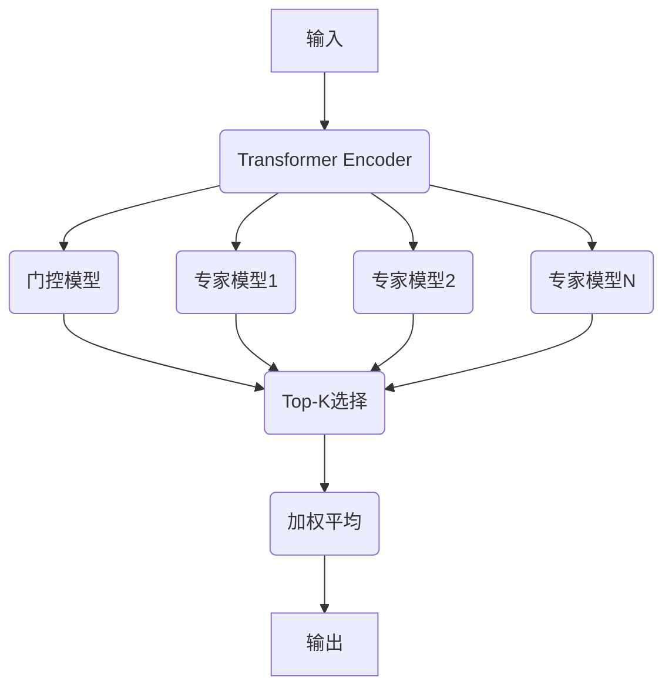

# 大语言模型原理基础与前沿：每个词元选择top-k个专家

## 1. 背景介绍

### 1.1 大语言模型的兴起

近年来,大型语言模型(Large Language Models, LLMs)在自然语言处理领域取得了令人瞩目的成就。这些模型通过在大规模语料库上进行预训练,学习了丰富的语言知识和上下文信息,从而在下游任务中展现出了强大的泛化能力。

代表性的大语言模型包括GPT(Generative Pre-trained Transformer)系列、BERT(Bidirectional Encoder Representations from Transformers)、XLNet、RoBERTa等。其中,GPT-3拥有惊人的1750亿个参数,在广泛的任务上表现出色,引发了学术界和工业界的广泛关注。

### 1.2 大语言模型的挑战

尽管取得了巨大成功,但大语言模型也面临着一些挑战:

1. **计算资源消耗巨大**:训练大型模型需要消耗大量的计算资源,对硬件要求很高。
2. **推理效率低下**:在推理过程中,所有参数都需要参与计算,导致推理速度较慢。
3. **缺乏可解释性**:大型模型的内部机理复杂,难以解释其决策过程。
4. **存在偏差和不确定性**:模型可能会产生有偏差或不确定的输出。

为了解决这些挑战,研究人员提出了一种新的范式:每个词元选择top-k个专家(Mixture of Experts, MoE)。

## 2. 核心概念与联系

### 2.1 Mixture of Experts

Mixture of Experts(MoE)是一种机器学习模型,它由多个专家模型(expert models)和一个门控模型(gating model)组成。每个专家模型专注于处理特定类型的输入,而门控模型则决定哪些专家对于给定的输入最合适。

在传统的MoE中,门控模型会为每个输入样本选择一个专家模型进行处理。然而,在大语言模型中,我们希望每个词元都能利用多个专家的知识,因此采用了一种新的范式:每个词元选择top-k个专家(Mixture of Experts Layer, MoEL)。

### 2.2 每个词元选择top-k个专家

在这种新范式下,门控模型为每个词元选择top-k个专家,而不是为整个输入选择一个专家。这样,每个词元都可以利用多个专家的知识,提高了模型的表现力和泛化能力。

具体来说,对于每个词元,门控模型会计算该词元与每个专家的相关性分数,然后选择分数最高的top-k个专家。这些专家的输出会被加权平均,形成该词元的最终表示。

通过这种方式,模型可以更好地捕捉输入的不同方面,并且只需要激活一小部分专家,从而提高了计算效率和可解释性。

## 3. 核心算法原理具体操作步骤

### 3.1 模型架构

每个词元选择top-k个专家的模型架构如下所示:



1. 输入经过Transformer Encoder编码,得到每个词元的表示。
2. 门控模型计算每个词元与每个专家的相关性分数。
3. 对于每个词元,选择分数最高的top-k个专家。
4. 这些专家的输出被加权平均,形成该词元的最终表示。
5. 最终输出由所有词元的表示组成。

### 3.2 门控模型

门控模型的作用是为每个词元选择最合适的专家。它需要计算每个词元与每个专家的相关性分数,这些分数将用于选择top-k个专家。

一种常见的门控模型是基于注意力机制的多头自注意力模型。具体来说,对于每个词元$x_i$和每个专家$e_j$,我们计算它们之间的注意力分数:

$$
a_{ij} = \text{Attention}(x_i, e_j)
$$

然后,通过Softmax函数将注意力分数归一化,得到相关性分数:

$$
p_{ij} = \frac{\exp(a_{ij})}{\sum_k \exp(a_{ik})}
$$

对于每个词元$x_i$,我们选择相关性分数$p_{ij}$最高的top-k个专家。

### 3.3 专家模型

专家模型的作用是处理特定类型的输入。在大语言模型中,每个专家模型通常是一个小型的Transformer模型,专注于捕捉输入的某些方面。

对于每个词元$x_i$,选择的top-k个专家会对其进行处理,得到$k$个输出表示$\{y_1, y_2, \dots, y_k\}$。

### 3.4 加权平均

最后一步是将top-k个专家的输出进行加权平均,得到该词元的最终表示$z_i$:

$$
z_i = \sum_{j=1}^k p_{ij} y_j
$$

其中,权重$p_{ij}$是门控模型计算出的相关性分数。

通过这种方式,每个词元的表示都融合了多个专家的知识,从而提高了模型的表现力和泛化能力。

## 4. 数学模型和公式详细讲解举例说明

在上一节中,我们介绍了每个词元选择top-k个专家的核心算法原理。现在,让我们通过一个具体例子来详细说明其中涉及的数学模型和公式。

### 4.1 示例输入

假设我们有一个输入序列"The quick brown fox jumps over the lazy dog"。经过Transformer Encoder编码后,每个词元都有一个表示向量,例如:

- "The": $x_1 = [0.1, 0.2, 0.3, \dots]$
- "quick": $x_2 = [0.4, 0.1, -0.2, \dots]$
- "brown": $x_3 = [-0.1, 0.5, 0.1, \dots]$
- $\dots$

我们还有三个专家模型$e_1$、$e_2$和$e_3$,它们分别专注于捕捉不同方面的语义信息。

### 4.2 门控模型

门控模型的任务是为每个词元选择最合适的top-k个专家。我们使用基于注意力机制的多头自注意力模型作为门控模型。

对于词元"quick"和专家$e_1$,我们计算它们之间的注意力分数:

$$
a_{21} = \text{Attention}(x_2, e_1) = 0.8
$$

类似地,我们计算"quick"与其他专家的注意力分数:

$$
a_{22} = \text{Attention}(x_2, e_2) = 0.6 \\
a_{23} = \text{Attention}(x_2, e_3) = 0.4
$$

然后,通过Softmax函数将注意力分数归一化,得到相关性分数:

$$
p_{21} = \frac{\exp(0.8)}{\exp(0.8) + \exp(0.6) + \exp(0.4)} \approx 0.45 \\
p_{22} = \frac{\exp(0.6)}{\exp(0.8) + \exp(0.6) + \exp(0.4)} \approx 0.33 \\
p_{23} = \frac{\exp(0.4)}{\exp(0.8) + \exp(0.6) + \exp(0.4)} \approx 0.22
$$

根据相关性分数,我们选择$p_{21}$和$p_{22}$最高的两个专家$e_1$和$e_2$作为"quick"的top-k专家。

### 4.3 专家模型

现在,让我们看看专家模型$e_1$和$e_2$如何处理"quick"这个词元。假设它们的输出表示分别为:

$$
y_1 = [0.2, -0.1, 0.4, \dots] \\
y_2 = [-0.3, 0.5, 0.1, \dots]
$$

### 4.4 加权平均

最后一步是将$e_1$和$e_2$的输出进行加权平均,得到"quick"的最终表示$z_2$:

$$
z_2 = p_{21} y_1 + p_{22} y_2 = 0.45 [0.2, -0.1, 0.4, \dots] + 0.33 [-0.3, 0.5, 0.1, \dots]
$$

通过这种方式,每个词元的表示都融合了多个专家的知识,从而提高了模型的表现力和泛化能力。

## 5. 项目实践:代码实例和详细解释说明

为了更好地理解每个词元选择top-k个专家的原理,我们提供了一个基于PyTorch的代码实例。在这个实例中,我们实现了一个简单的MoE层,并将其应用于一个序列分类任务。

### 5.1 MoE层实现

首先,我们定义了一个MoE层,它包含了门控模型和多个专家模型。

```python
import torch
import torch.nn as nn

class MoELayer(nn.Module):
    def __init__(self, d_model, num_experts, expert_capacity, top_k):
        super(MoELayer, self).__init__()
        self.num_experts = num_experts
        self.expert_capacity = expert_capacity
        self.top_k = top_k
        
        # 门控模型
        self.gate = nn.Linear(d_model, num_experts)
        
        # 专家模型
        self.experts = nn.ModuleList([nn.Linear(d_model, expert_capacity) for _ in range(num_experts)])
        
    def forward(self, x):
        # 计算门控分数
        gate_scores = self.gate(x).transpose(1, 2)  # (batch_size, num_experts, seq_len)
        
        # 选择top-k个专家
        top_values, top_indices = torch.topk(gate_scores, self.top_k, dim=1)
        
        # 计算专家输出
        expert_outputs = []
        for i in range(self.num_experts):
            expert_output = self.experts[i](x)  # (batch_size, seq_len, expert_capacity)
            expert_outputs.append(expert_output)
        expert_outputs = torch.stack(expert_outputs, dim=2)  # (batch_size, seq_len, num_experts, expert_capacity)
        
        # 加权平均专家输出
        top_outputs = expert_outputs.gather(2, top_indices.unsqueeze(-1).expand(-1, -1, -1, expert_outputs.size(-1)))
        weighted_outputs = (top_outputs * top_values.unsqueeze(-1)).sum(2)
        
        return weighted_outputs
```

在这个实现中,我们使用线性层作为门控模型和专家模型。门控模型会为每个输入向量计算一个门控分数,用于选择top-k个专家。然后,我们计算每个专家的输出,并根据门控分数对它们进行加权平均。

### 5.2 序列分类任务

接下来,我们将MoE层应用于一个序列分类任务。在这个任务中,我们需要根据一个句子的内容,预测它所属的类别。

```python
import torch.nn.functional as F

class ClassificationModel(nn.Module):
    def __init__(self, vocab_size, d_model, num_experts, expert_capacity, top_k, num_classes):
        super(ClassificationModel, self).__init__()
        self.embedding = nn.Embedding(vocab_size, d_model)
        self.encoder = nn.LSTM(d_model, d_model // 2, batch_first=True, bidirectional=True)
        self.moe = MoELayer(d_model, num_experts, expert_capacity, top_k)
        self.classifier = nn.Linear(expert_capacity, num_classes)
        
    def forward(self, x):
        embedded = self.embedding(x)
        _, (hidden, _) = self.encoder(embedded)
        hidden = torch.cat((hidden[-2], hidden[-1]), dim=1)
        moe_output = self.moe(hidden)
        logits = self.classifier(moe_output)
        return logits
```

在这个模型中,我们首先使用嵌入层将输入句子转换为词向量序列。然后,我们使用双向LSTM编码器对序列进行编码,得到最终的隐藏状态。接下来,我们将隐藏状态输入到MoE层中,获得融合了多个专家知识的表示。最后,我们使用一个线性层对表示进行分类。

### 5.3 训练和评估

我们可以使用标准的监督学习方法来训练这个模型。在训练过程中,我们需要计算分类损失,并使用优化器更新模型参数。

```python
import torch.optim as optim

model = ClassificationModel(vocab_size, d_model, num_experts, expert_capacity, top_k, num