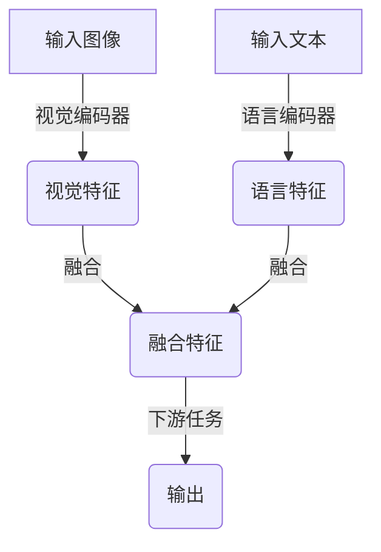

# 大语言模型原理基础与前沿 视觉语言模型

## 1.背景介绍

随着深度学习技术的不断发展,大型语言模型(Large Language Models, LLMs)已经成为自然语言处理(NLP)领域的一股重要力量。这些模型通过在大规模语料库上进行预训练,学习到丰富的语言知识和上下文信息,从而在各种下游任务中展现出卓越的性能表现。

然而,纯文本形式的语言模型存在一定局限性,无法直接处理图像、视频等多模态数据。为了解决这一问题,视觉语言模型(Visual Language Models, VLMs)应运而生。视觉语言模型旨在融合视觉和语言两个模态,实现跨模态的理解和生成,为多模态人工智能系统的构建奠定基础。

近年来,视觉语言模型取得了长足进步,在图像描述、视觉问答、图文生成等任务中展现出优异表现。本文将系统性地介绍视觉语言模型的基本原理、核心算法、实践应用以及未来发展趋势,为读者提供全面的理解和洞见。

## 2.核心概念与联系

### 2.1 大型语言模型(LLMs)

大型语言模型是指通过自监督学习方式在大规模语料库上预训练的大型神经网络模型。这些模型能够捕捉丰富的语义和上下文信息,为下游任务提供强大的语言理解和生成能力。典型的大型语言模型包括GPT、BERT、T5等。

### 2.2 视觉语言模型(VLMs)

视觉语言模型旨在实现视觉和语言两个模态的融合,能够同时处理图像和文本信息。视觉语言模型通常由两个主要组件构成:

1. **视觉编码器(Visual Encoder)**:用于提取图像的视觉特征,常见的方法包括使用卷积神经网络(CNN)或视觉转换器(ViT)。
2. **语言编码器(Language Encoder)**:用于编码文本序列,通常采用基于自注意力机制的模型,如BERT或GPT。

视觉编码器和语言编码器的输出特征经过融合后,可用于各种下游任务,如图像描述、视觉问答、图文生成等。



### 2.3 预训练与微调

与大型语言模型类似,视觉语言模型也需要经过预训练和微调两个阶段:

1. **预训练(Pre-training)**:在大规模图文数据集上进行自监督学习,获取视觉和语言的通用表示能力。
2. **微调(Fine-tuning)**:在特定下游任务的数据集上进行监督学习,将预训练模型调整以适应目标任务。

预训练和微调的分离使得视觉语言模型能够有效地利用大规模数据,并在特定任务上获得良好的性能表现。

## 3.核心算法原理具体操作步骤

### 3.1 视觉编码器

视觉编码器的主要目标是从输入图像中提取视觉特征表示。常见的视觉编码器包括:

1. **卷积神经网络(CNN)**:CNN能够有效地捕捉图像的局部特征,如边缘、纹理等。典型的CNN模型包括ResNet、Inception等。
2. **视觉转换器(ViT)**:ViT将图像分割为多个patch,并使用Transformer编码器对这些patch进行建模,捕捉全局上下文信息。

无论采用何种视觉编码器,最终都需要将提取的视觉特征与语言特征进行融合,以实现跨模态的理解和生成。

### 3.2 语言编码器

语言编码器的作用是对输入文本序列进行编码,获取语义和上下文表示。常见的语言编码器包括:

1. **BERT**:BERT采用双向Transformer编码器,能够同时捕捉上下文的前后信息。
2. **GPT**:GPT基于单向Transformer解码器,适用于生成式任务,如文本生成、摘要等。

与视觉编码器类似,语言编码器的输出也需要与视觉特征进行融合,以实现跨模态的表示和理解。

### 3.3 特征融合

视觉特征和语言特征的融合是视觉语言模型的核心环节。常见的融合方法包括:

1. **特征拼接(Feature Concatenation)**:将视觉特征和语言特征在特征维度上进行拼接,然后送入下游任务模型。
2. **注意力融合(Attention Fusion)**:使用自注意力机制,让视觉特征和语言特征相互关注,实现更紧密的融合。
3. **交互式融合(Interactive Fusion)**:视觉特征和语言特征通过多层交互式融合模块进行融合,增强跨模态的表示能力。

不同的融合方法会影响模型的性能和计算效率,需要根据具体任务和资源约束进行选择和调优。

### 3.4 下游任务模型

融合后的跨模态特征可以用于各种下游任务,如图像描述、视觉问答、图文生成等。下游任务模型的设计需要考虑任务的特点和目标,常见的模型包括:

1. **序列生成模型**:用于生成式任务,如图像描述、图文生成等,通常采用Transformer解码器结构。
2. **分类模型**:用于分类任务,如视觉问答等,可以使用全连接层或多层感知机(MLP)进行分类。
3. **检测/分割模型**:用于像素级别的任务,如目标检测、实例分割等,需要结合CNN或ViT进行特征提取和预测。

下游任务模型的设计和训练策略对模型性能有着重要影响,需要根据具体任务进行探索和优化。

## 4.数学模型和公式详细讲解举例说明

### 4.1 自注意力机制

自注意力机制是Transformer模型的核心组件,也广泛应用于视觉语言模型中。给定一个输入序列 $X = (x_1, x_2, \dots, x_n)$,自注意力机制计算每个位置的输出表示 $y_i$ 如下:

$$y_i = \sum_{j=1}^{n} \alpha_{ij}(x_jW^V)$$

其中,

- $W^V$ 是一个可学习的值矩阵(Value Matrix)
- $\alpha_{ij}$ 是注意力权重,表示 $x_i$ 对 $x_j$ 的注意力程度,计算方式为:

$$\alpha_{ij} = \frac{e^{s_{ij}}}{\sum_{k=1}^{n}e^{s_{ik}}}$$
$$s_{ij} = (x_iW^Q)(x_jW^K)^T$$

- $W^Q$ 和 $W^K$ 分别是查询矩阵(Query Matrix)和键矩阵(Key Matrix)

自注意力机制允许每个位置的输出表示依赖于整个输入序列,捕捉长距离依赖关系。在视觉语言模型中,自注意力机制被广泛用于视觉和语言特征的融合,实现跨模态的交互和理解。

### 4.2 交互式融合模块

交互式融合模块是一种常见的视觉语言特征融合方法,它通过多层交互式融合实现视觉和语言特征的紧密融合。给定视觉特征序列 $V = (v_1, v_2, \dots, v_m)$ 和语言特征序列 $L = (l_1, l_2, \dots, l_n)$,交互式融合模块的计算过程如下:

1. 初始化融合特征序列 $F^{(0)} = (f_1^{(0)}, f_2^{(0)}, \dots, f_{m+n}^{(0)})$,其中 $f_i^{(0)} = [v_i; l_i]$ 是视觉和语言特征的拼接。
2. 对于第 $k$ 层融合模块,计算:

$$\begin{aligned}
    \tilde{F}^{(k)} &= \text{LN}(F^{(k-1)} + \text{FFN}(F^{(k-1)})) \\
    F^{(k)} &= \text{LN}(\tilde{F}^{(k)} + \text{MultiHeadAttn}(\tilde{F}^{(k)}, \tilde{F}^{(k)}, \tilde{F}^{(k)}))
\end{aligned}$$

其中,

- $\text{LN}$ 表示层归一化(Layer Normalization)
- $\text{FFN}$ 表示前馈神经网络(Feed-Forward Network)
- $\text{MultiHeadAttn}$ 表示多头自注意力机制

3. 重复步骤2若干次,获取最终的融合特征序列 $F^{(K)}$。

通过多层交互式融合,视觉和语言特征能够充分交换信息,实现更紧密的融合,提高跨模态表示的质量。

### 4.3 目标检测中的视觉语言融合

在目标检测任务中,视觉语言模型可以利用自然语言提示来指导和改进目标检测过程。给定一个图像 $I$ 和一个语言提示 $q$,目标检测的目标函数可以表示为:

$$\mathcal{L}(I, q) = \lambda_{\text{det}}\mathcal{L}_{\text{det}}(I) + \lambda_{\text{vl}}\mathcal{L}_{\text{vl}}(I, q)$$

其中,

- $\mathcal{L}_{\text{det}}(I)$ 是传统目标检测损失,用于学习从图像中检测目标
- $\mathcal{L}_{\text{vl}}(I, q)$ 是视觉语言融合损失,用于将语言提示 $q$ 的信息融入目标检测过程
- $\lambda_{\text{det}}$ 和 $\lambda_{\text{vl}}$ 是权重系数,控制两个损失项的重要性

通过优化上述目标函数,视觉语言模型能够同时利用图像和语言提示的信息,提高目标检测的准确性和鲁棒性。

## 5.项目实践:代码实例和详细解释说明

为了更好地理解视觉语言模型的实现细节,我们将提供一个基于PyTorch的代码示例,实现一个简单的图像描述模型。

### 5.1 数据准备

我们将使用 COCO 数据集进行训练和评估。COCO 数据集包含了大量的图像及其对应的描述文本。我们需要将数据集划分为训练集、验证集和测试集。

```python
from torchvision.datasets import CocoCaptions
from torch.utils.data import DataLoader

# 加载数据集
train_dataset = CocoCaptions(root='data/coco', split='train', transform=transform)
val_dataset = CocoCaptions(root='data/coco', split='val', transform=transform)
test_dataset = CocoCaptions(root='data/coco', split='test', transform=transform)

# 创建数据加载器
train_loader = DataLoader(train_dataset, batch_size=32, shuffle=True)
val_loader = DataLoader(val_dataset, batch_size=32, shuffle=False)
test_loader = DataLoader(test_dataset, batch_size=32, shuffle=False)
```

### 5.2 模型定义

我们将定义一个简单的视觉语言模型,包括视觉编码器、语言编码器和融合模块。

```python
import torch
import torch.nn as nn

class VisualEncoder(nn.Module):
    def __init__(self, cnn):
        super(VisualEncoder, self).__init__()
        self.cnn = cnn

    def forward(self, images):
        visual_features = self.cnn(images)
        return visual_features

class LanguageEncoder(nn.Module):
    def __init__(self, vocab_size, embed_dim, hidden_dim):
        super(LanguageEncoder, self).__init__()
        self.embedding = nn.Embedding(vocab_size, embed_dim)
        self.rnn = nn.GRU(embed_dim, hidden_dim, batch_first=True)

    def forward(self, captions):
        embeddings = self.embedding(captions)
        _, hidden = self.rnn(embeddings)
        language_features = hidden.squeeze(0)
        return language_features

class FusionModule(nn.Module):
    def __init__(self, visual_dim, language_dim, fusion_dim):
        super(FusionModule, self).__init__()
        self.visual_proj = nn.Linear(visual_dim, fusion_dim)
        self.language_proj = nn.Linear(language_dim, fusion_dim)
        self.fusion = nn.Linear(fusion_dim * 2, fusion_dim)

    def forward(self, visual_features, language_features):
        visual_proj = self.visual_proj(visual_features)